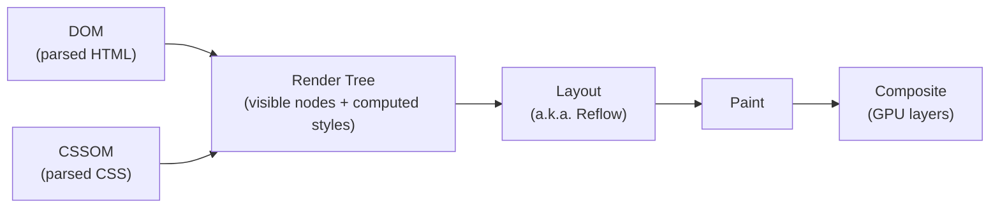
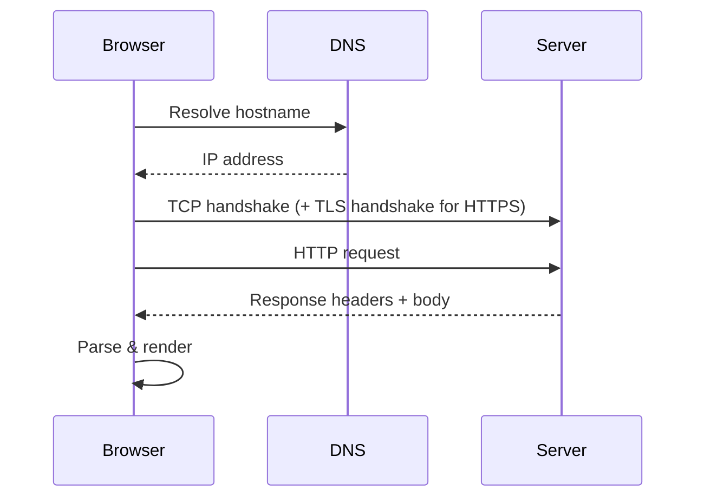
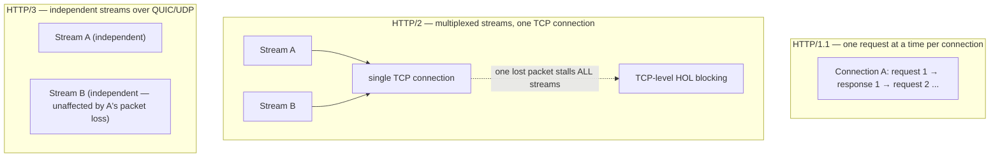
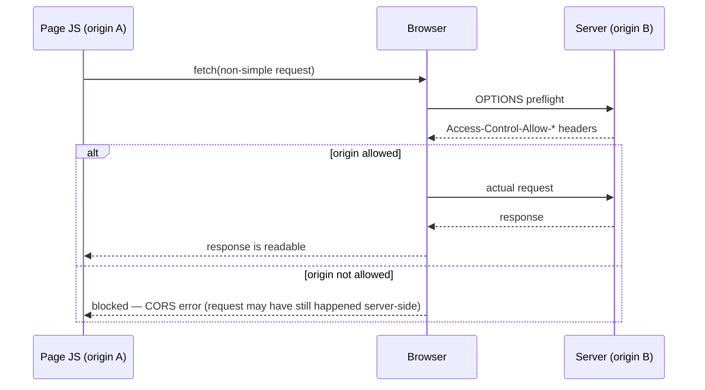
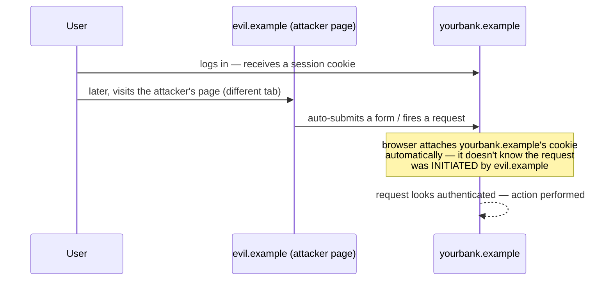

# 00. Browser & Web Fundamentals

**Status:** In Progress
**Part of:** [Chapter 00: JavaScript & Browser Fundamentals for React Interviews](../README.md)

Kept deliberately conceptual — the goal is "what problem does this solve and when would I
reach for it," not implementation depth (e.g. you don't need to hand-build an IndexedDB
wrapper or a Service Worker for this goal). This is browser/web knowledge in service of being
a strong *React* engineer, not a general web-platform curriculum.

---

## 1. The rendering pipeline

- **DOM** — the parsed HTML document tree. **CSSOM** — the parsed CSS rule tree. Both must be
  ready before the **render tree** can be built (the render tree is the DOM filtered to only
  visible nodes, each merged with its computed styles).
- **Layout (a.k.a. reflow)** — computing the exact size/position of every render-tree node.
  Expensive because it can cascade: changing one element's size can shift everyone after it.
- **Paint** — filling in pixels (text, colors, borders, shadows) into layers.
- **Composite** — combining painted layers onto the screen, potentially using the GPU
  (transforms/opacity can be composited without repainting, which is why animating those two
  properties is cheap and animating `width`/`top` is expensive).

**Reflow vs. repaint, precisely:** a *repaint* is needed when visual appearance changes without
affecting layout (e.g. `color`, `background`). A *reflow* is needed when geometry changes
(e.g. `width`, adding/removing a DOM node) — and a reflow always triggers a repaint after it,
but not vice versa. This is why reflow is the more expensive operation to trigger repeatedly.

**Layout thrashing** — the specific performance bug where you interleave DOM writes and DOM
*reads* in a loop (e.g. reading `offsetHeight` right after writing a style), forcing the
browser to synchronously recompute layout on every read instead of batching writes. The fix is
batching all reads, then all writes. This is directly relevant to React: it's why measuring a
DOM node (`ref.current.getBoundingClientRect()`) inside a render-adjacent code path needs care,
and it's part of why `useLayoutEffect` exists (ch.04) — it runs synchronously after DOM
mutations but before the browser paints, specifically so you can measure-and-adjust without a
visible flash, at the cost of blocking paint if the work is heavy.

---

## 2. Storage & browser APIs

| Mechanism | Persists? | Size | Sync/Async | Sent with every HTTP request? |
|---|---|---|---|---|
| `localStorage` | Yes (until cleared) | ~5-10MB | Sync | No |
| `sessionStorage` | Tab lifetime only | ~5-10MB | Sync | No |
| Cookies | Configurable expiry | ~4KB | Sync (via `document.cookie`) | **Yes**, automatically, to matching domain/path |
| IndexedDB | Yes | Large (browser-dependent, much bigger) | Async | No |
| Cache API | Yes (until evicted) | Large | Async | No — used to intercept/serve requests (Service Workers) |

The one fact that matters most for a React/frontend interview: **cookies are the only one of
these automatically attached to outgoing requests**, which is exactly why cookie-based auth and
`HttpOnly` matter (see ch.12) — a cookie the browser controls and attaches itself is a different
security shape than a token your JS code has to manually read and attach.

Know IndexedDB and the Cache API exist and *what problem they solve* (structured client-side
data at scale; intercepting and serving network requests, typically via a Service Worker for
offline support) without needing to have built one — that's the right depth for this goal.

---

## 3. Networking

**Request lifecycle (conceptual):**

**HTTP/1.1 → 2 → 3, precisely (a good senior-level distinction to have ready):**
- HTTP/1.1 serializes requests per connection (one at a time per connection, hence workarounds
  like opening many connections / domain sharding) — this is **HTTP-level** head-of-line
  blocking.
- HTTP/2 multiplexes many request/response streams over a *single* TCP connection, removing
  that HTTP-level head-of-line blocking. But because it still rides on TCP, if a single TCP
  packet is lost, **all** multiplexed streams on that connection stall until it's
  retransmitted — **TCP-level** head-of-line blocking remains.
- HTTP/3 moves the transport to QUIC (over UDP), which multiplexes streams independently at the
  transport layer itself — a lost packet only stalls the one stream it belonged to, finally
  removing head-of-line blocking at both levels.

**Caching headers you should be able to explain, not just name:**
- `Cache-Control: max-age=N` — cacheable for N seconds without even asking the server.
- `ETag` — a fingerprint of the response body; on the next request the browser sends
  `If-None-Match: <etag>` and the server replies `304 Not Modified` (no body) if unchanged —
  this validates freshness without re-downloading the payload.
- The practical distinction: `max-age` avoids the request entirely until it expires; `ETag`
  still makes a request but can avoid re-downloading the body.

**CDNs** cache static assets at edge locations geographically close to the user, cutting
latency and offloading the origin server — this is why build tooling fingerprints filenames
(`app.a1b2c3.js`) so a CDN/browser can cache them forever and safely bust the cache only when
content actually changes.

---

## 4. The security model

**Same-Origin Policy (SOP)** is the foundational browser security boundary: an "origin" is the
tuple `(scheme, host, port)`. By default, a script from one origin cannot read the response of
a request to a different origin, and cannot read another origin's cookies/localStorage/DOM.

**CORS** is the *opt-in relaxation* of SOP — a server explicitly allows specific other origins
to read its responses via `Access-Control-Allow-Origin` (and related headers). A "simple"
cross-origin request still happens; CORS only controls whether the browser lets your JS *read*
the response. A "non-simple" request (custom headers, non-GET/POST/HEAD, certain content types)
triggers a **preflight**: the browser sends an `OPTIONS` request first to ask permission before
sending the real one. Know this distinction — "why did an extra OPTIONS request show up in the
network tab" is a real debugging question this answers directly.

**XSS (Cross-Site Scripting)** — an attacker gets their JavaScript to execute in your page's
origin, typically by injecting it into content that later gets rendered as HTML/executed as a
script. React's JSX escapes values by default (text content is set via safe DOM APIs, not
`innerHTML`), which is why XSS in React apps overwhelmingly comes from `dangerouslySetInnerHTML`
or building raw HTML strings some other way — knowing *why* JSX is safe by default (and exactly
where that safety stops) is worth more in an interview than reciting "don't use
dangerouslySetInnerHTML."

**CSRF (Cross-Site Request Forgery)** — an attacker's page (a different origin) tricks the
user's browser into making a request to your origin *using the user's existing cookies*
(because cookies are attached automatically per the table above, regardless of which site
initiated the request). Defenses: CSRF tokens (a value the attacker's page can't read/guess),
`SameSite` cookies (see ch.12), and checking custom headers (which simple cross-origin form
submissions can't set).

**CSP (Content-Security-Policy)** — a response header that restricts what a page is *allowed*
to load/execute (scripts, styles, images, connections) as a defense-in-depth layer, so even if
an attacker manages to inject a `<script>` tag, a strict CSP can prevent it from running or
prevent it from exfiltrating data to an attacker-controlled origin.

**Clickjacking** — embedding your site in an invisible `<iframe>` layered under attacker UI so
a user's real clicks land on your page unknowingly; defended against via `X-Frame-Options` or
CSP's `frame-ancestors`.

---

## 5. SPA-relevant browser concepts

- **History API** (`pushState`/`replaceState`/`popstate`) — what client-side routers (React
  Router, ch.10) are built on: changing the URL and browser history without a full page
  navigation/reload.
- **iframes & `postMessage`** — the sanctioned way for two different-origin windows/iframes to
  communicate, since SOP otherwise blocks them from touching each other's DOM/JS directly;
  `postMessage` requires the receiver to explicitly opt in and should always verify
  `event.origin` before trusting a message.
- **Prefetching** (`<link rel="prefetch">`, router-level prefetch-on-hover) — fetching a
  resource/route's data before it's needed, trading bandwidth for perceived latency; this is
  what React Router's data-mode prefetching and Next.js `<Link>` prefetching are doing under
  the hood (ch.10/ch.17).
