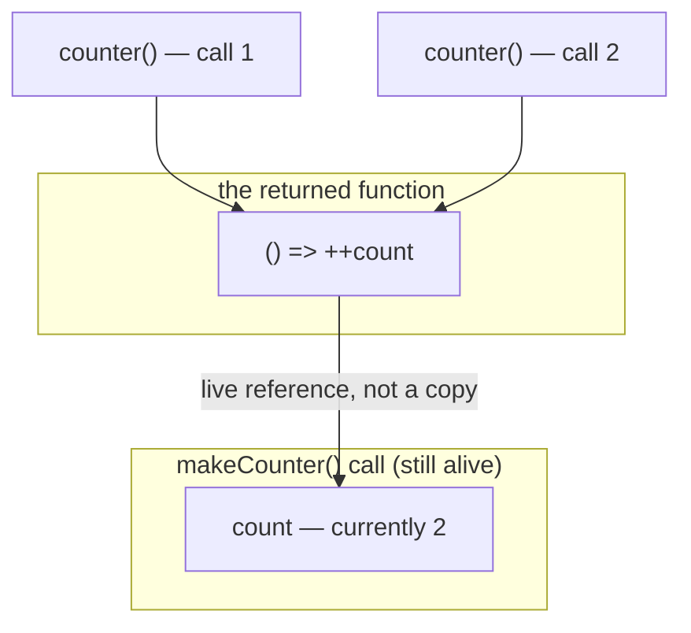
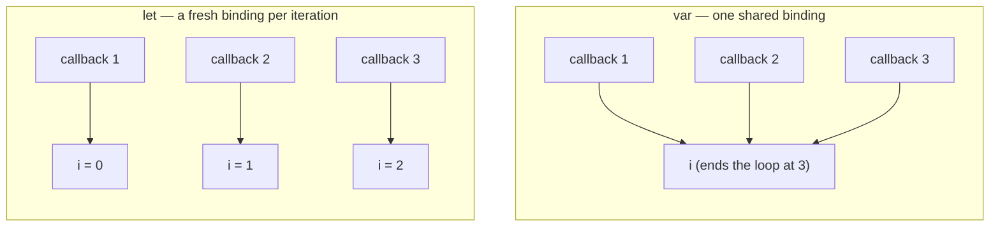
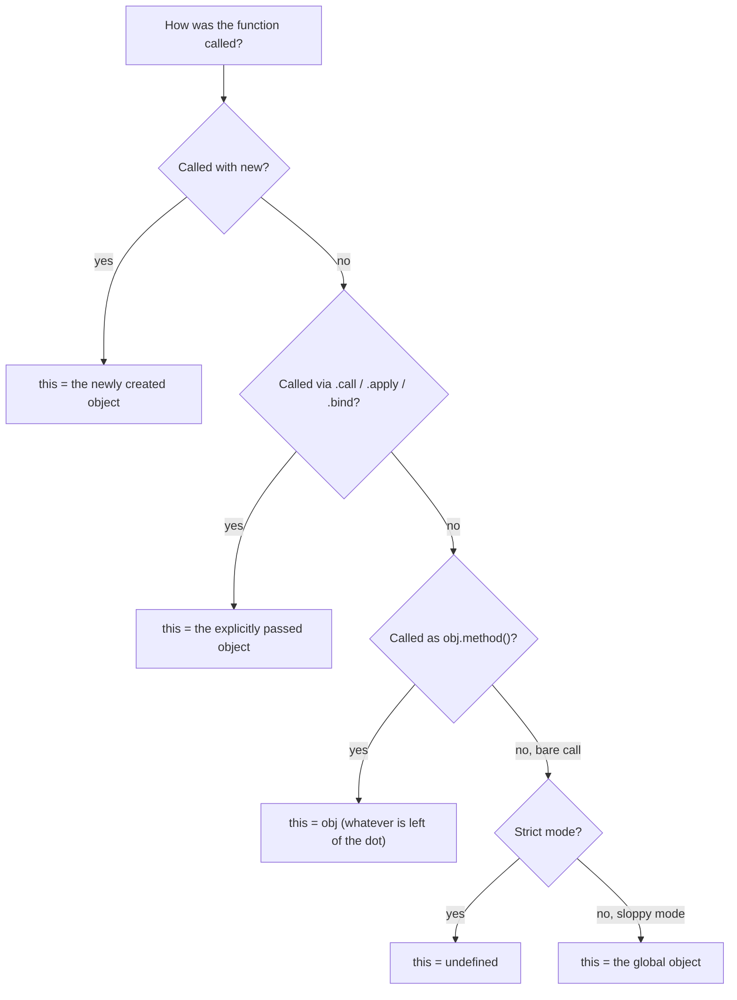
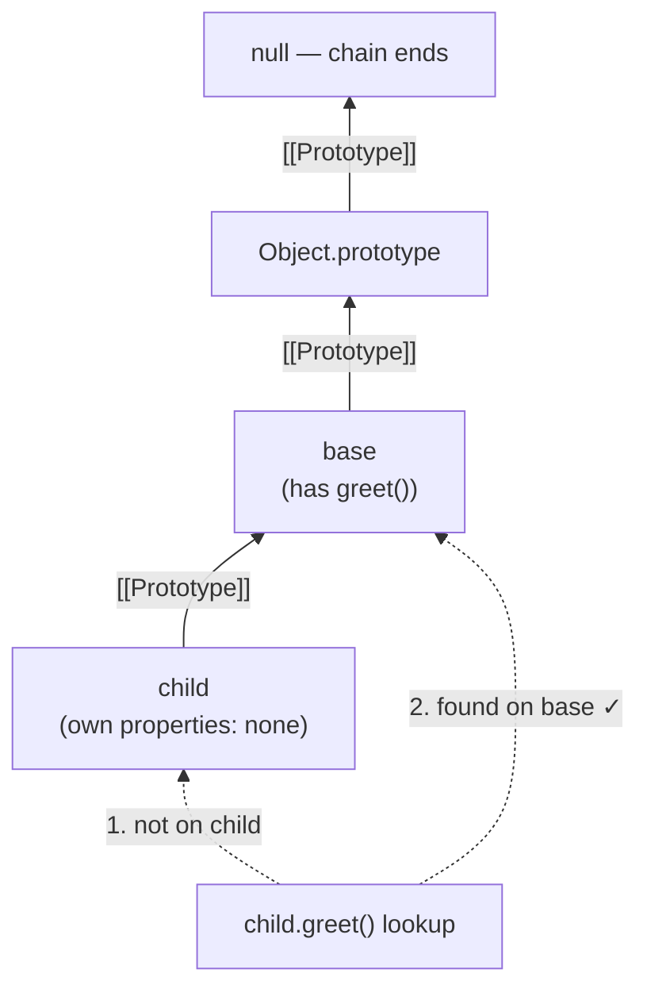
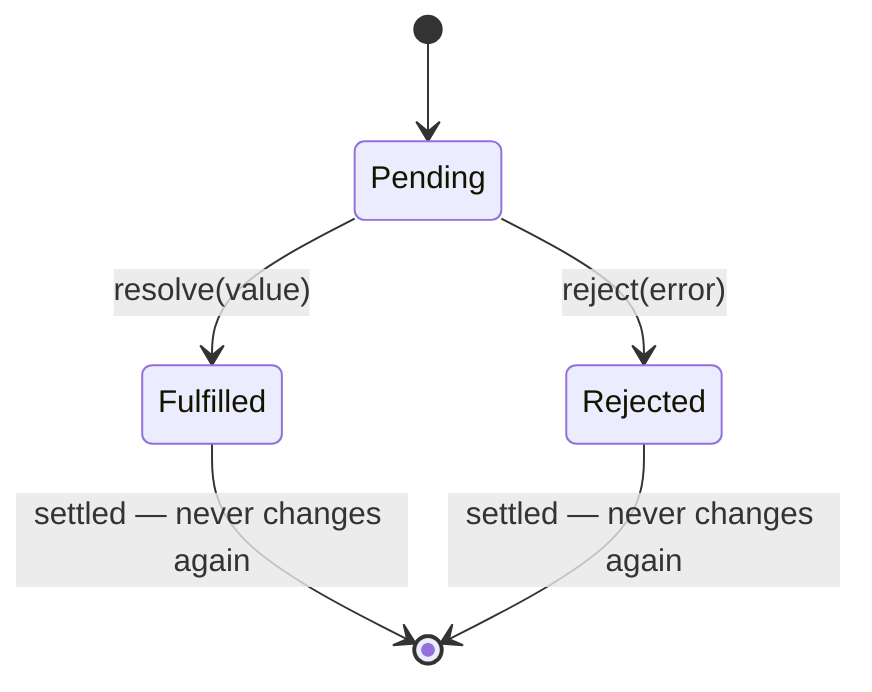
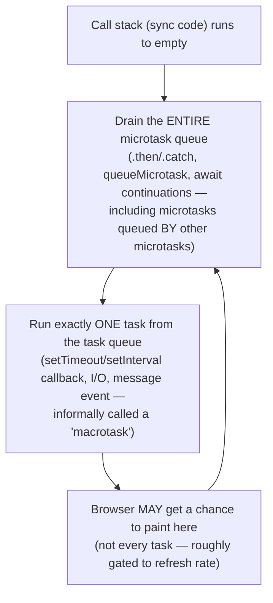
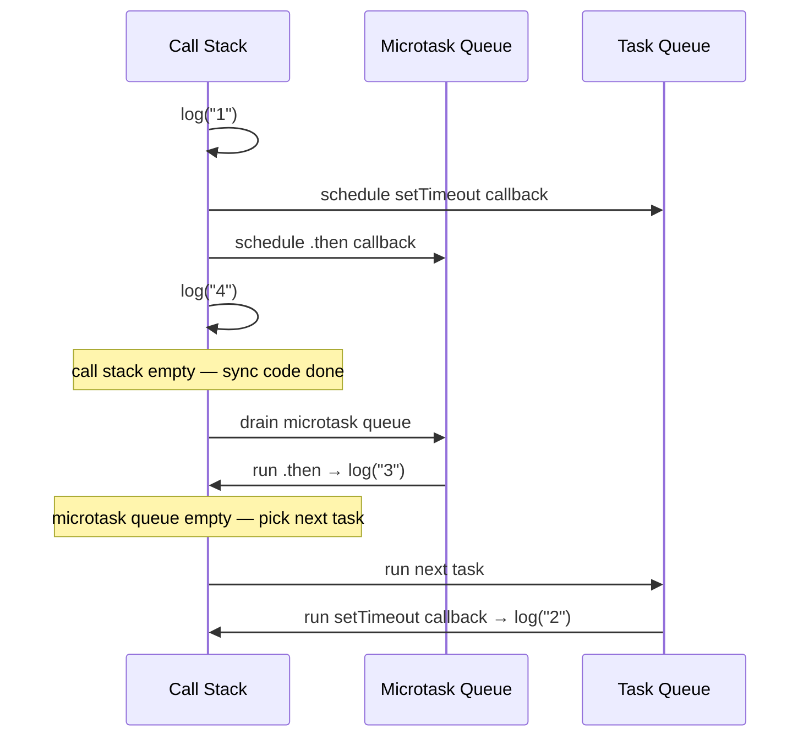
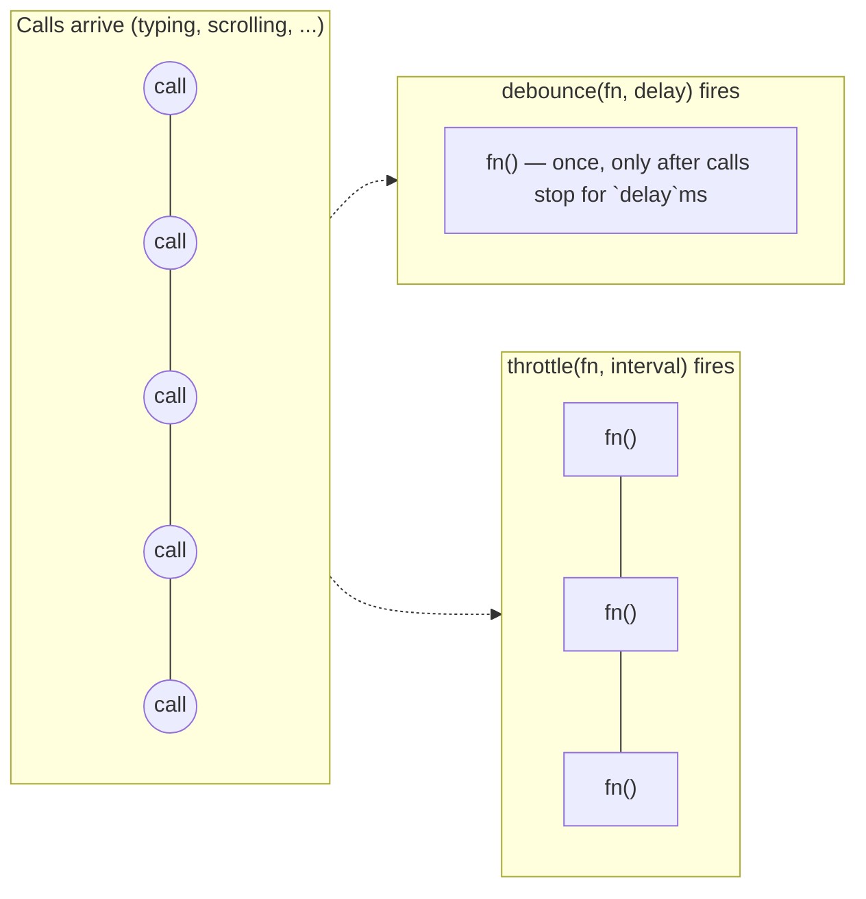
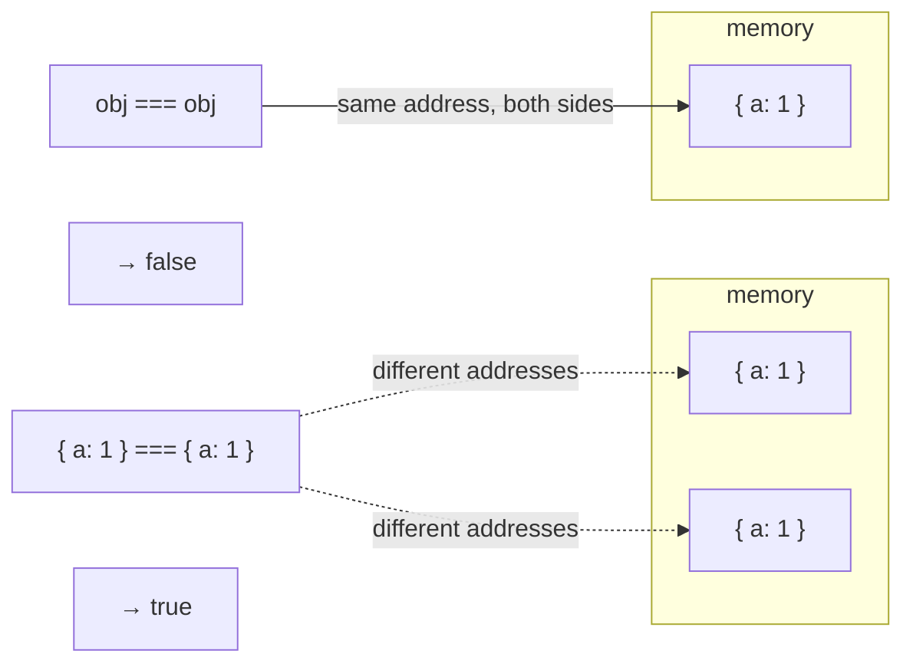
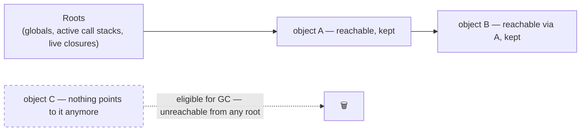

# 00. JavaScript Fundamentals

**Status:** In Progress
**Part of:** [Chapter 00: JavaScript & Browser Fundamentals for React Interviews](../README.md)

This assumes you're comfortable with everyday JS — variables, functions, arrays, objects,
loops — but haven't necessarily gone deep on *how the language actually works underneath*.
Each section builds up from a plain-language explanation of the concept, through a simple
example, and only then into the precise mental model and interview-level nuance. Don't skip
the "start here" parts even if a section feels basic at first — the deeper content builds
directly on them.

---

## 1. Closures

### Start here: what "scope" even means

Every variable you create lives inside some *container*. A function body is a container. So is
a `{ }` block. Code running inside a container can see variables declared in that container,
and in any container *surrounding* it — but not in unrelated containers next to it.

```js
function outer() {
  const message = "hello";

  function inner() {
    console.log(message); // inner can "see" message — it's in a surrounding container
  }

  inner();
}
outer(); // logs "hello"
```

Nothing surprising yet — `inner` can read `message` because it's physically written inside
`outer`. This ability to reach outward for variables is called the **scope chain**.

### The twist that makes it a "closure"

Now: what if `inner` is *returned out* of `outer`, and called much later, long after `outer`
has already finished running?

```js
function outer() {
  const message = "hello";
  return function inner() {
    console.log(message);
  };
}

const saved = outer(); // outer() has already finished and returned
saved();               // ...but this still logs "hello". How?
```

`outer()` finished executing before `saved()` is ever called. Normally you'd expect `message`
to be gone once `outer` returns — but it isn't. JavaScript functions keep a live connection to
the scope they were created in, for as long as the function itself still exists. That
connection — a function plus the variables it can still reach, even after the code that
created them has finished — **is** a closure. You don't opt into this; every function in JS is
automatically a closure over its surrounding scope, most of the time you just never notice
because the function is called and discarded immediately.

**The precise definition, now that the mechanism is clear:** a closure is the combination of a
function and the *lexical environment* it was defined in. It's a **live reference** to the
same variable binding, not a copy of the value at the time the function was created:

```js
function makeCounter() {
  let count = 0;
  return () => ++count; // closes over `count`, not a snapshot of it
}
const counter = makeCounter();
counter(); // 1
counter(); // 2 — same `count` binding, mutated in place
```



Both calls go through the *same* function, which holds the *same* live reference to `count` —
that's why the value persists and increments instead of resetting.

### Closures in loops — the classic trap

```js
for (var i = 0; i < 3; i++) {
  setTimeout(() => console.log(i), 0);
} // logs 3, 3, 3
```

Every one of those three callbacks closes over `i` — but with `var`, there is only **one** `i`
variable for the *whole loop*, shared by every iteration (that's what "function-scoped" means:
`var` doesn't create a new variable per loop turn, it reuses one). By the time any callback
actually runs (after a `setTimeout`, even a `0`ms one, always runs *later* — see the event loop
section below), the loop has already finished and `i` is `3`. All three callbacks are closing
over the same, now-finished-at-`3` variable.

`let` fixes this because `let` creates a **brand new binding on every iteration** — each
callback closes over its own private copy of `i`, not a shared one:

```js
for (let i = 0; i < 3; i++) {
  setTimeout(() => console.log(i), 0);
} // logs 0, 1, 2
```



### Stale closures — the same bug, but in React

This is the single most valuable thing to take from this section, because it explains a real
class of React bugs you will hit:

```jsx
function Counter() {
  const [count, setCount] = useState(0);
  useEffect(() => {
    const id = setInterval(() => {
      setCount(count + 1); // closes over `count` from the render that created this Effect
    }, 1000);
    return () => clearInterval(id);
  }, []); // empty deps — this Effect is never re-run, so the closure is never refreshed
}
```

Every time `Counter` renders, React runs the component function again, which means `count` is
a *brand new variable* each render (this is a core React idea: each render gets its own
snapshot of state, it isn't one mutable box that changes in place). The `setInterval` callback
above closes over the `count` variable from *whichever render created this Effect* — and
because the dependency array is empty, this Effect only runs once, on the first render, so the
interval callback is permanently stuck closing over `count` from that first render (`0`).

Walking through what actually happens: first tick calls `setCount(0 + 1)` → count becomes `1`,
component re-renders. But the *interval callback itself* was never recreated — it's still the
same closure from render 1, still reading `count = 0`. So the second tick also calls
`setCount(0 + 1)` → `1` again. React sees the new value equals the old value and skips
re-rendering. The visible result: the counter goes `0 → 1` once, then visibly sticks at `1`
forever, even though the interval is still firing every second.

Two fixes, each with a different tradeoff: the functional updater `setCount(c => c + 1)`
(doesn't need to read `count` from the closure at all — React hands it the latest value
directly), or adding `count` to the dependency array (correct, but tears down and recreates
the interval every render — usually the updater form is what you actually want). This exact
bug — "why does my interval only increment once" — is one of the most common real interview
debugging prompts.

**Interview framing:** if asked "why doesn't this effect see the latest state," the strong
answer names the mechanism (closure captured the render's snapshot of state) before naming the
fix. Naming the fix without the mechanism reads as pattern-matching, not understanding.

---

## 2. `this` binding

### Start here: `this` is decided at call time, not definition time

In most things you've written so far, a variable's value is whatever you last set it to. `this`
doesn't work that way. `this` is a special keyword whose value is decided **fresh, every single
time a function is called**, based on *how* it was called — not where the function was written.
This trips up almost everyone coming from other languages (or from mostly writing React
function components, where `this` barely comes up).

```js
const user = { name: "Ana", greet() { return this.name; } };
user.greet(); // "Ana" — called as user.greet(), so `this` = user
```

That much feels intuitive. The confusion starts when the *same function* gets called a
different way:

```js
const greetFn = user.greet;
greetFn(); // NOT "Ana" — this is a "bare" call, so `this` isn't `user` anymore
```

Same function, different call, different `this`. That's the whole concept — the rest of this
section is just precisely nailing down the rules for "how was it called."

### The four rules, in precedence order

1. **`new` binding** — `new Foo()` binds `this` to the newly created object.
2. **Explicit binding** — `fn.call(obj)`, `fn.apply(obj)`, `fn.bind(obj)`.
3. **Implicit binding** — `obj.method()` binds `this` to `obj` (whatever is left of the dot).
4. **Default binding** — a bare function call binds `this` to `undefined` in strict mode (or
   the global object in sloppy mode).



Precedence flows top to bottom — `new` wins over everything, explicit binding beats implicit,
and a bare call only falls back to the default rule when none of the others apply.

### One example per rule

```js
// Rule 4 — default binding: no object, no new, no .call/.apply/.bind
function whoAmI() { return this; }
whoAmI(); // strict mode: undefined | sloppy mode: the global object

// Rule 3 — implicit binding: whatever is left of the dot at the call site
const counter = { count: 0, increment() { return ++this.count; } };
counter.increment(); // 1 — this = counter

// Rule 2 — explicit binding: .call/.apply set this for one call, .bind locks it permanently
function increment() { return ++this.count; }
const counterA = { count: 0 };
increment.call(counterA); // 1 — this = counterA
const boundToA = increment.bind(counterA);
boundToA(); // 2 — locked to counterA even without .call

// explicit binding beats implicit — .call on a method overrides the object left of the dot
const other = { count: 50 };
counter.increment.call(other); // 51, not 2 — explicit binding wins even though it's written as counter.increment

// Rule 1 — new binding: always creates a fresh object and binds this to it
function Counter() { this.count = 0; }
Counter.prototype.increment = function () { return ++this.count; };
const c = new Counter();
c.increment(); // 1
```

### The classic break — method extraction

```js
const user = {
  name: "Ana",
  greet() { return `hi, ${this.name}`; },
};
const greet = user.greet;
greet(); // implicit binding is lost — called as a bare function
```

Pulling `greet` out into its own variable and calling it doesn't carry `user` along with it —
functions aren't "attached" to the object they came from, `this` is only set at the moment of
the call, and `greet()` here is a bare call (rule 4).

What that bare call actually produces depends on strict vs. sloppy mode (default-binding rule
above). In an ES module, inside a `class`, or in any TypeScript-compiled code — i.e. virtually
everything in a modern React/TS codebase, including this repo — the code is strict by default,
so `this` is `undefined` and `this.name` **throws** `TypeError: Cannot read properties of
undefined (reading 'name')`. In old-style sloppy-mode script code, `this` falls back to the
global object instead, so `this.name` doesn't throw — in Node that's `undefined` ("hi,
undefined"), but in a browser it can be genuinely surprising: `window.name` is a real, spec'd
property (defaults to `""`), so the same bug in sloppy-mode browser code silently returns
`"hi, "` instead of throwing or logging `undefined`. The **mechanism** (implicit binding lost
on extraction) is the same either way — that's the part to lead with in an interview; the exact
runtime behavior is a strict-mode detail worth knowing but secondary.

This is exactly what happens when you pass `onClick={user.greet}` in React instead of
`onClick={() => user.greet()}` or a properly bound/arrow class method — the function is
detached from the object it was "called on."

### The other classic gotcha — `new` beats even `.bind`

The precedence order isn't just a checklist, it has teeth: `new` overrides an *explicit*
binding that was set up earlier via `.bind`, even though `.bind` is usually described as
"permanently locking `this`."

```js
function Foo(val) { this.val = val; }
const boundFoo = Foo.bind({ val: "locked" });

boundFoo(999);        // this = { val: "locked" } — explicit binding, as expected
const instance = new boundFoo(999);
instance.val;          // 999 — `new` wins! The "locked" object is discarded entirely.
```

`.bind` only pre-fills what `this` will be *if no higher-precedence rule fires*. Calling the
bound function normally uses that locked object (rule 2, explicit binding). But calling it with
`new` invokes rule 1, which unconditionally creates a fresh object and binds `this` to that
instead — the earlier `.bind` call is simply ignored. This is the detail that trips people up
when they assume `.bind` is unbreakable; in an interview, leading with "`new` is rule 1, `.bind`
is only rule 2" is the fast way to show you actually know the precedence order isn't just
memorized trivia.

### Arrow functions sidestep all of this

**Arrow functions don't have their own `this`** — they capture `this` lexically from the
enclosing scope at definition time (the same way closures capture variables, above), and it can
never be reassigned: `.call`/`.apply`/`.bind` on an arrow function has no effect on `this`. This
is precisely why arrow functions became the default for React class-component handlers before
hooks existed, and why `this` mostly disappears as a concern once you're all-in on function
components — but interviewers will still test whether you understand *why* it disappeared, not
just that it did.

---

## 3. Prototypes, `class`, and inheritance

### Start here: every object has an invisible fallback object

You've probably called `.toString()` or used `.hasOwnProperty()` on a plain object without ever
defining those methods yourself:

```js
const obj = { a: 1 };
obj.toString(); // "[object Object]" — but you never wrote a toString method. Where's it from?
```

Every object in JS has a hidden, internal link to *another* object — its **prototype**. When
you access a property that isn't found directly on the object, JS automatically looks it up on
the prototype instead, and if it's not there either, on *that* object's prototype, and so on,
until it reaches the end of the chain (`null`). `toString` exists on `Object.prototype`, which
sits at the end of the chain for almost every plain object — that's where it's coming from.

```js
const base = { greet() { return "hi"; } };
const child = Object.create(base); // explicitly wire up child's prototype to be `base`
child.greet(); // "hi" — not found on child, found by walking up to base
```



This fallback chain is what people mean by "prototypal inheritance" — objects share behavior by
being linked to other objects, not by copying.

### `class` is the same mechanism, with nicer syntax

`class` syntax is sugar over this same prototype mechanism — methods defined in a class body
live on `ClassName.prototype`, **one shared copy**, not duplicated onto every instance:

```js
class Animal {
  speak() { return "..."; } // one shared function on Animal.prototype
}
const a1 = new Animal();
const a2 = new Animal();
a1.speak === a2.speak; // true — same function, shared via the prototype chain
```

`instanceof` walks that same chain checking for a match: `obj instanceof Animal` is really
asking "does `Animal.prototype` (from the current realm) appear anywhere in `obj`'s prototype
chain?" This is why it breaks across realms: an array created inside a different iframe/window
has *that* iframe's `Array.prototype` in its chain, not the current window's — so
`arrFromOtherIframe instanceof Array` can be `false` even though it's a perfectly normal array.

**Interview-relevant nuance:** know that `class` doesn't introduce a fundamentally different
object model — it's the same prototypal inheritance with cleaner syntax, `super`, and a
few real semantic differences from manual prototype-chaining (class bodies are strict-mode by
default, methods are non-enumerable, and a class can't be called without `new`).

---

## 4. Promises & async/await

### Start here: what problem does a Promise actually solve?

Some operations take time — fetching data over the network, reading a file, waiting on a timer.
JS can't just pause and wait (see the event loop below for why), so it needs some way to say
"start this now, and run this other code once it's done, whenever that is." Before Promises,
this was done with **callbacks** — you passed a function directly into the async operation, and
it called your function back when finished. That worked, but chaining several async steps in a
row turned into deeply nested, hard-to-read code (informally called "callback hell").

A **Promise** is an object that represents "a value that doesn't exist yet, but will (or
won't) at some point in the future." Instead of passing a callback *into* a function, the
function hands you back a Promise, and you attach what to do next *onto* it:

```js
const promise = new Promise((resolve, reject) => {
  setTimeout(() => resolve("done!"), 1000); // after 1s, this Promise "resolves"
});

promise.then((value) => console.log(value)); // logs "done!" after 1 second
```

### The state machine, precisely

A Promise is a state machine with exactly one transition: **pending → fulfilled** or
**pending → rejected**, and once settled, it never changes state again. `.then()` handlers
registered *after* settlement still fire (asynchronously, as a microtask) — this is what makes
Promises safe to consume regardless of timing.



**Chaining returns a new Promise each time** — if a `.then` callback returns a value, the next
`.then` receives that value; if it returns a Promise, the chain waits for it to settle first
(auto-flattening, no manual "promise of a promise" nesting).

**Error propagation** — a rejection skips every `.then` until it hits a `.catch` (or a second
argument to `.then`). `async`/`await` is syntax that lets you write Promise-based code that
*looks* synchronous, while the `try/catch` around it gives you the same error-skipping
behavior:

```js
async function load() {
  try {
    const res = await fetch("/api"); // "pause" here until the fetch Promise settles
    if (!res.ok) throw new Error("bad status");
    return await res.json();
  } catch (err) {
    // catches: network failure, the thrown Error, AND a rejection from res.json()
  }
}
```

`await` doesn't actually block the thread while "paused" — it unwraps a Promise's resolved
value (or re-throws its rejection as a catchable exception) while letting other code run in the
meantime; see the event loop section for exactly how that works. **`async` functions always
return a Promise**, even if you `return` a plain value — it gets wrapped automatically.

### Combinators — know the exact failure semantics of each, this gets asked directly

| Combinator | Resolves when | Rejects when |
|---|---|---|
| `Promise.all` | all fulfill | **first** rejection (short-circuits, other results discarded) |
| `Promise.allSettled` | all settle (fulfilled or rejected) | never — always resolves with per-item status |
| `Promise.race` | first settles (fulfilled or rejected) | — |
| `Promise.any` | **first** fulfillment | all reject (`AggregateError`) |

`Promise.all` is what most people reach for, but it's the wrong choice when partial failure is
acceptable — e.g. loading three independent dashboard widgets where one failing shouldn't blank
the whole page calls for `allSettled`.

**Cancellation:** a Promise itself has no built-in cancellation — once created, it will settle.
"Cancelling" an async operation means cancelling the *underlying work*, not the Promise object;
`fetch` supports this via `AbortController`/`AbortSignal` (covered in practice in ch.03), and
libraries that claim to offer "cancellable promises" are really just discarding the result or
using this same underlying-operation-cancellation pattern.

---

## 5. The event loop

### Start here: JS can only do one thing at a time — so how does "async" work?

JavaScript is **single-threaded**: there's exactly one call stack, and it can only run one
piece of code at a time — no true multitasking inside your JS. And yet a web page stays
interactive while a network request is in flight; a `setTimeout` doesn't freeze everything for
a second. How?

The trick: slow operations (timers, network requests, reading files) aren't actually done *by*
JavaScript itself — they're handed off to the browser (or Node), which does the waiting outside
of your JS thread entirely. When that outside work finishes, it doesn't interrupt whatever your
JS is currently doing; instead, it *schedules* your callback to run **later**, the next time
the JS thread is free. The **event loop** is the mechanism that decides when "later" is.

### The mechanism, precisely



The critical fact that produces the classic "guess the output" question: **microtasks always
fully drain before the next task runs**, even a `setTimeout(fn, 0)`.

```js
console.log("1");
setTimeout(() => console.log("2"), 0);
Promise.resolve().then(() => console.log("3"));
console.log("4");
// Output: 1, 4, 3, 2
```



Order: sync code first (1, 4) → microtask queue drains (3) → the next task runs (2).
`queueMicrotask` behaves exactly like `.then` for ordering purposes.

**Why this matters for React — and where the analogy stops:** the event loop explains *when*
your code gets to run; React's batching is a separate mechanism *layered on top* that decides,
given that a chunk of your code is now running, how many state updates inside it get collapsed
into one re-render. They're related but distinct: pre-React 18, that batching mechanism was
only wired up around React's own synthetic event handling, so state updates made from inside a
`setTimeout` callback or a raw Promise `.then` — code running as its own task/microtask,
outside that wiring — fell through to one re-render per update. React 18's automatic batching
extended the *same batching mechanism* to apply no matter which task/microtask the update
happens to run in. Knowing the event loop tells you *when* code runs; it's what makes React's
own batching rules legible, but batching itself is React's design decision, not a JavaScript
runtime feature.

**Concurrency vs. parallelism:** JS gives you concurrency (interleaving many logical tasks on
one thread) but not parallelism (true simultaneous execution) — that's what Web Workers exist
for (see ch.06), running on an actually separate thread with no shared memory by default.

---

## 6. Functional patterns

These are reusable techniques, not deep language concepts — they come up both as direct
coding-interview problems (see `coding-interviews/javascript/`) and as the theoretical basis
for hooks like `useMemo`/`useCallback`.

**Debounce** — collapse a burst of calls into one, fired only after the calls *stop* for a
given delay (cancel-and-reschedule on every call). Use case: search-as-you-type, only fire the
request after the user pauses.

**Throttle** — guarantee a call fires **at most once** per interval, regardless of how many
times it's invoked, without waiting for calls to stop. Use case: scroll/resize handlers, where
you want steady periodic updates while the event is continuously firing.

The distinction is the single most common thing people get backwards in interviews: debounce
delays until quiet; throttle rate-limits during continuous activity.



Debounce collapses the whole burst into a single trailing call; throttle lets several calls
through at a steady cadence *while the burst is still happening*.

**Currying** — transforming `f(a, b, c)` into `f(a)(b)(c)`, each call returning a new function
until all arguments are supplied. **Partial application** is the more general, less rigid
cousin — fixing *some* arguments now and supplying the rest later in one call, not necessarily
one-at-a-time.

**Memoization** — caching a pure function's return value keyed by its arguments, trading memory
for repeated-call speed. This is the manual, general-purpose version of what `useMemo` does for
a single value inside a component render, and what the React Compiler does automatically (see
ch.06) — understanding manual memoization first is what makes the compiler's behavior legible
later instead of magic.

---

## 7. Objects & equality

### Start here: two kinds of values, two kinds of equality

JS values fall into two categories. **Primitives** (numbers, strings, booleans, `null`,
`undefined`, symbols) are compared *by value* — `5 === 5` is `true` because they're literally
the same value. **Objects** (including arrays and functions) are compared *by reference* —
`===` asks "are these two variables pointing at the exact same object in memory," not "do they
look the same." This trips people up because two objects can be structurally identical and
still not be `===`:

```js
{ a: 1 } === { a: 1 } // false — different objects
const obj = { a: 1 };
obj === obj // true — same reference
```



This is *the* reason React dependency arrays and `React.memo` behave the way they do: passing a
new object/array/function literal as a prop or dependency on every render is a new reference
every time, even if "logically" unchanged — which is why `{ a: 1 }` inline in JSX defeats
memoization, and why `useMemo`/`useCallback` exist (to keep the *reference* stable across
renders when the meaningful content hasn't changed).

**Shallow vs. deep copy** — `{ ...obj }` and `[...arr]` (and `Object.assign`) copy only the
top level; nested objects/arrays are still shared references between the copy and the original.
`structuredClone(obj)` (built into modern JS, no library needed) performs a true recursive deep
clone. It has two *different* kinds of limitations, worth distinguishing: functions and DOM
nodes are hard-rejected — it **throws** `DataCloneError`. Custom class instances are the more
dangerous trap, because there's **no error at all**: it silently clones the plain data
properties and hands back an ordinary object that has lost the prototype chain entirely — the
class's methods are gone and `cloned instanceof MyClass` is `false`. "Cannot clone" undersells
it; for class instances specifically, it's "clones something that looks similar but silently
isn't the same type anymore," which is a worse trap precisely because it doesn't fail loudly.

```js
const original = { nested: { count: 1 } };
const shallow = { ...original };
shallow.nested.count = 99;
original.nested.count; // 99 — the nested object was shared, not copied
```

This directly explains a very common React bug: `setState({ ...state, nested: state.nested })`
looks like an update but doesn't actually create a new `nested` reference, so any code relying
on that reference changing (memoization, `useEffect` deps) won't fire.

---

## 8. Modules

### Start here: what problem modules solve

As an app grows past one file, you need a way to split code across multiple files while being
explicit about what each file makes available to others (`export`) and what it pulls in from
elsewhere (`import`) — instead of every file dumping variables into one shared global space
where anything could collide with anything else. That's what a "module" is: one file, with an
explicit, declared boundary of what it shares.

```js
// math.js
export function add(a, b) { return a + b; }

// app.js
import { add } from "./math.js";
add(2, 3); // 5
```

### ESM vs. CommonJS, and why it matters for bundling

**ESM (`import`/`export`) vs. CommonJS (`require`/`module.exports`):** ESM is statically
analyzable — imports/exports are resolved at parse time, before any code runs, which is exactly
what makes **tree shaking** possible (a bundler can prove which exports are unused and delete
them, because the import graph is static). CommonJS resolves `require()` calls at runtime,
which is dynamic and generally not tree-shakeable.

**Dynamic `import()`** returns a Promise and is evaluated at runtime, not parse time — this is
the primitive underneath `React.lazy()` and route-based code splitting (ch.06/ch.10): the
bundler still statically sees the `import()` call and can split that module into its own chunk,
but the *decision to load it* happens at runtime.

---

## 9. Memory & garbage collection

### Start here: you never manually free memory in JS

In some lower-level languages, you have to explicitly allocate and free memory yourself. JS
does this for you automatically, through a process called **garbage collection (GC)**. You
never call a "free" function — instead, the JS engine periodically walks through everything
still in memory and asks: *starting from the places code can actually reach right now (global
variables, currently-running function calls, closures still referenced somewhere) — can this
value still be reached?* If nothing can reach it anymore, it's deleted and the memory is
reclaimed. This is (mostly) **mark-and-sweep**: mark everything reachable from a root, sweep
away everything that wasn't marked.



The practical consequence: **you don't manually free memory, you avoid *unintentionally
keeping a reference alive*.** A "memory leak" in JS almost always means "something is still
reachable that shouldn't be," not "memory wasn't freed."

**Common leak sources, all closure-shaped:**
- **Event listeners never removed** — `addEventListener` without a matching `removeEventListener`
  keeps the handler (and everything it closes over) alive for the DOM node's lifetime, which
  can outlive the component that created it.
- **Timers never cleared** — an interval/timeout closure keeps its captured scope alive until
  cleared; this is precisely why `useEffect` cleanup functions matter (ch.03).
- **Closures capturing large objects unnecessarily** — a small callback that closes over an
  entire large object (because it references one property of it) keeps the *whole* object
  reachable, not just the property used.

This is the theoretical backing for why "every effect with a subscription/timer/listener needs
a cleanup function" isn't a style preference — it's the direct fix for a real memory-leak
mechanism.
