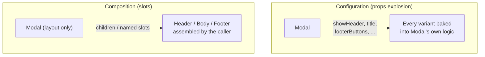
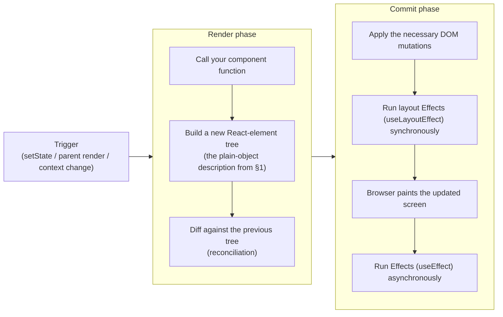
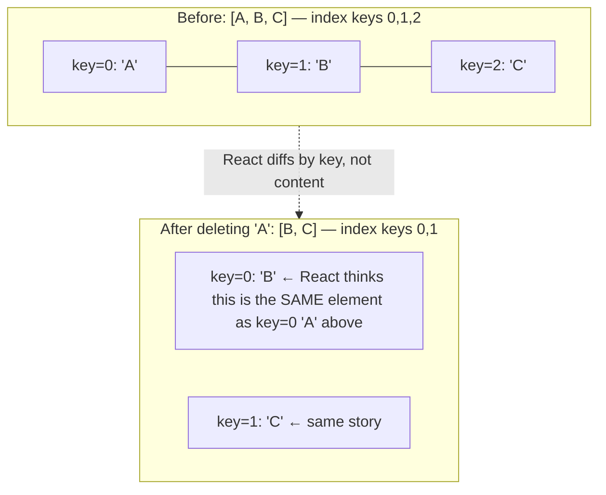
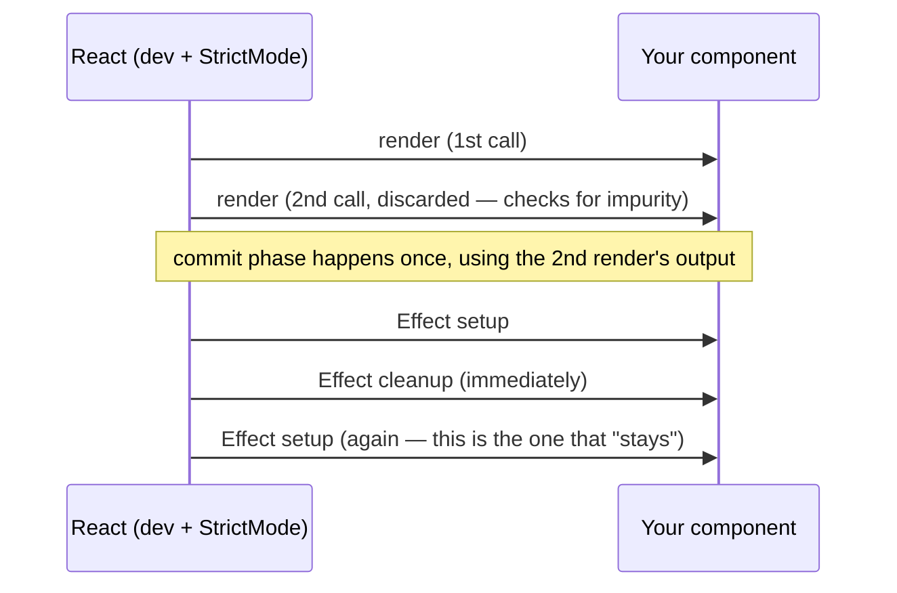

# Chapter 01: Foundations: JSX, Rendering & Components

**Status:** In Progress
**Folder:** `notes/01-foundations/`

## Why this chapter matters for a React interview
Everything else in this curriculum builds on the ideas in this chapter — you cannot reason
about hooks, performance, or React internals if the basic mental model of "what is a component
and what does React actually do with it" isn't solid first. This chapter starts from zero and
builds up to interview-level precision for each topic, in that order — plain-language
explanation first, precise mechanism second, interview framing third. Don't skip the "start
here" parts even if a section starts to feel obvious partway through; the precision layer
builds directly on them.

---

## 0. What React actually is, and the problem it solves

### Start here: how a web page normally gets built

A web page is HTML (structure), CSS (style), and JavaScript (behavior). The browser parses the
HTML into a live, in-memory tree of objects called the **DOM (Document Object Model)** — every
tag becomes a node in that tree, and the browser draws the page on screen by walking that tree
(full mechanics of this rendering pipeline are in
[`00-javascript-and-browser-fundamentals/browser-and-web/README.md`](../00-javascript-and-browser-fundamentals/browser-and-web/README.md),
worth a look if you haven't read it — this chapter assumes you at least know "DOM = the tree of
elements the browser is currently displaying").

Without a library like React, if you want the page to change after it first loads — say, a
counter that goes up when you click a button — you write JavaScript that **directly finds and
mutates DOM nodes**:

```js
const button = document.getElementById("increment-btn");
const display = document.getElementById("count-display");
let count = 0;

button.addEventListener("click", () => {
  count = count + 1;
  display.textContent = String(count); // you manually find the node and update it
});
```

This is called **imperative** programming: you write step-by-step instructions for *how* to
change the page (find this node, set this property, add this class). It works fine for one
counter. It gets genuinely hard to manage once a page has dozens of interdependent pieces of UI
that all need to stay in sync with each other and with your data — you end up manually tracking,
by hand, every place in the code that might need to touch every piece of the DOM whenever
anything changes.

### The idea React introduces

React lets you write **declarative** UI code instead: you describe *what* the UI should look
like for a given set of data, and React figures out *how* to make the actual DOM match that
description — including figuring out the minimal set of real DOM changes needed, which is the
hard, error-prone part you'd otherwise be doing by hand.

```jsx
function Counter() {
  const [count, setCount] = useState(0); // "count" is data this component remembers (ch.02 covers useState itself)
  return (
    <div>
      <span>{count}</span>
      <button onClick={() => setCount(count + 1)}>+1</button>
    </div>
  );
}
```

You never write `document.getElementById` or `.textContent = ...` here. You just say "given
`count`, the UI looks like *this*" — and whenever `count` changes, React re-runs this function
and updates the real DOM to match the new description, automatically. That's the entire premise
of React: **you describe UI as a function of data, and React keeps the real DOM in sync with
that description.**

### What a "component" is, in plain terms

A **component** is just a JavaScript function that returns a description of some UI (that
`<div>...</div>` block above). You build a whole application by writing many small components
and composing them together — a `Counter`, inside a `Toolbar`, inside a `Page`, and so on — the
same way you'd break a large program into smaller functions for any other reason: to keep each
piece small, nameable, and reusable.

> **Interview framing:** if asked "why React" or "what problem does React solve," the strong
> answer names the imperative-vs-declarative distinction specifically, plus the fact that
> React's diffing (ch.19) means you get near-optimal DOM updates without writing that logic
> yourself. "It's popular" or "it's component-based" alone are weak answers — they don't explain
> *why* the component model helps.

---

## 1. JSX: syntax, expressions, and how it compiles

### Start here: JSX is HTML-like syntax living inside JavaScript

Look again at the `Counter` component above — the part inside `return (...)`. That
HTML-looking block written directly inside a `.jsx`/`.tsx` file is called **JSX**. It is *not*
a string, and it's not real HTML — it's a syntax extension to JavaScript that lets you describe
UI in a shape that reads like the markup it will eventually produce, instead of building it up
through verbose function calls (you'll see exactly what those function calls look like in a
moment).

You can drop into plain JavaScript anywhere inside JSX using curly braces `{}` — this is called
an **expression slot**. Anything between `{` and `}` is evaluated as a normal JS expression and
the result is inserted into the UI:

```jsx
const name = "Ada";
const el = <h1>Hello, {name}!</h1>; // {name} is replaced with the string "Ada"
```

```jsx
const el = <p>{2 + 2}</p>;          // renders "4"
const el2 = <p>{isDone ? "Done" : "Pending"}</p>; // any expression works, including ternaries
```

The important restriction: `{}` accepts an **expression** (something that produces a value),
not a **statement**. `if`, `for`, and variable declarations (`const x = 1`) are statements —
they don't produce a value — so none of them are legal directly inside `{}`. This is exactly
why "conditional rendering" in React uses expression-shaped tools like the ternary operator
(`? :`) and `&&` instead of an `if` block written inline in JSX — more on this in §6.

### How JSX actually becomes DOM: the compile step

JSX doesn't run in the browser as-is — browsers don't understand it. Before your code ever
runs, a **compiler** (part of your build tool — Vite in this project, via `@vitejs/plugin-react`)
transforms every JSX expression into a plain JavaScript function call. This happens at build
time, invisibly, every time you save a file and the dev server reloads.

```jsx
const el = <h1 className="title">Hello, {name}</h1>;
```

compiles to (the **classic transform** — what you'd have seen in React before version 17):

```js
const el = React.createElement("h1", { className: "title" }, "Hello, ", name);
```

or, with the **modern automatic JSX transform** (the default since React 17, and what this
project's Vite setup uses):

```js
import { jsx as _jsx } from "react/jsx-runtime";
const el = _jsx("h1", { className: "title", children: ["Hello, ", name] });
```

Either way, the call **returns a plain JavaScript object** describing what you asked for —
something shaped roughly like `{ type: 'h1', props: { className: 'title', children: [...] } }`.
This is called a **React element**. It is inert data, nothing more — not a DOM node, and it
doesn't render anything by itself just by existing. It only becomes real DOM once React's
renderer (`react-dom`) walks that object tree and creates actual DOM nodes to match it.

```mermaid
flowchart LR
    jsx["JSX you write:\n&lt;h1&gt;Hello, {name}&lt;/h1&gt;"] -->|compiler: Vite / Babel / TS| call["Function call:\njsx('h1', { children: [...] })"]
    call -->|returns| element["React element\n(a plain JS object — just a description)"]
    element -->|React walks the tree and creates/updates nodes| dom["Real DOM node\n(what you actually see on screen)"]
```

**Why this matters beyond trivia:** understanding that JSX → element (plain object) → DOM is
a two-step process, not one, explains a lot of things that otherwise look magical:
- You can store a piece of JSX in a variable, put it in an array, pass it around as a function
  argument or prop, or even `console.log` it and see a plain object — because it *is* one.
- "Conditionally rendering JSX" is really just "conditionally producing a value," exactly like
  any other expression in JS — there's no special React syntax for it (§6).
- The **old-style transform requiring `import React from 'react'` in every file** exists because
  `React.createElement(...)` needs `React` to be in scope; the modern automatic transform
  imports `jsx`/`jsxs` from `react/jsx-runtime` for you instead, so that import is no longer
  needed. If you ever see an old codebase with an apparently-unused `import React from 'react'`
  at the top of every file, that's the classic transform's fingerprint, not dead code.

### JSX syntax rules, and *why* each one exists

- **A component must return a single root element.** You can't return two sibling objects from
  a function without wrapping them (e.g. in an array) — and a React component function is,
  underneath, just returning one JS value. So `return <h1>A</h1><p>B</p>;` is illegal; you must
  wrap it in a parent element (`<div>...</div>`) or, if you don't want an extra wrapper `<div>`
  showing up in the actual DOM, a **Fragment** (`<>...</>`), which exists specifically to group
  elements without adding a real DOM node.
- **Component names must be capitalized** (`<Counter />`, not `<counter />`). This isn't a style
  preference — it's how the compiler decides what a tag *means*. `<div>` compiles to the string
  `"div"` as the element's `type` (meaning "this is a built-in HTML tag"); `<Counter>` compiles
  to "look up the variable named `Counter` and use *that* as the type" (meaning "this is a
  component I wrote"). A lowercase custom component name would be treated as an unknown HTML
  tag string instead of your component, and silently fail to render what you intended.
- **Attributes use `camelCase`**, e.g. `className` instead of `class`, `onClick` instead of
  `onclick`, `htmlFor` instead of `for`. This is because JSX attributes become JavaScript object
  properties, not literal HTML attribute strings — and `class`/`for` are reserved words in
  JavaScript, so they can't be used as property names as-is.

> **Interview framing:** "how does JSX become the DOM" is a favorite basic-but-revealing
> question. A strong answer chains all three steps explicitly — compiles to `createElement`/
> `jsx()` calls → produces a plain-object element tree → React's renderer walks that tree during
> the commit phase (§4) and performs the actual DOM mutations. Answering "JSX gets turned into
> HTML" conflates two different things (a JS object vs. actual DOM) and is the tell of someone
> who hasn't looked underneath the syntax.

---

## 2. Components: functional components + hooks vs. class components

### Start here: a component is a function; calling it (indirectly) produces UI

You already saw the shape:

```jsx
function Greeting({ name }) {
  return <h1>Hello, {name}!</h1>;
}
```

`Greeting` is a plain JavaScript function. React calls it for you (you never call it yourself as
`Greeting()`; instead you write `<Greeting name="Ada" />` in JSX, and React handles invoking the
function with the right arguments — this is one of the things the JSX compile step sets up).
Whatever JSX the function returns is what gets shown on screen for that piece of the page. If
the function runs again later (because something it depends on changed), whatever it returns
*this* time replaces what was shown before — this "run the function again to get updated UI" is
the essence of what a **render** is, covered precisely in §4.

**Two rules that define "what makes something a valid React function component":**
1. Its name must start with a capital letter (see the JSX capitalization rule in §1 — this is
   why).
2. It must return something React can display: JSX, a string, a number, `null`, `undefined`, a
   boolean (renders nothing), or an array/Fragment of any of those.

### Hooks: how a function component gets "memory" and other capabilities

A plain JS function, on its own, doesn't remember anything between calls — every time it runs,
its local variables start fresh. But components clearly *do* need to remember things (like the
`count` in the counter example) across renders. **Hooks** are special functions — always named
starting with `use` (`useState`, `useEffect`, `useRef`, and so on) — that let a function
component tap into React-managed capabilities that a plain function couldn't have on its own:
persistent state that survives across renders, running code in response to the component being
displayed, reading values from a Context, and more. `useState` itself (what `const [count,
setCount] = useState(0)` means precisely) is the subject of ch.02 — for this chapter, the only
thing to internalize is *why* hooks exist at all: they're what turn an ordinary, stateless
function into something that can behave like a living, updating piece of UI.

### Class components: the older way of doing the same thing

Before hooks existed (pre-React 16.8, released 2019), the only way to give a component "memory"
and lifecycle behavior was to write it as a **JavaScript class** instead of a function:

```jsx
class Counter extends React.Component {
  constructor(props) {
    super(props);
    this.state = { count: 0 };
  }
  render() {
    return (
      <button onClick={() => this.setState({ count: this.state.count + 1 })}>
        {this.state.count}
      </button>
    );
  }
}
```

This is equivalent in behavior to the function + `useState` version shown earlier in §0. Modern
React code (and this entire curriculum) uses functions + hooks, not classes — but you're
expected to recognize class syntax at this level, both because a lot of production code you'll
encounter in the wild still uses it, and because one specific case (Error Boundaries, ch.16)
still **requires** a class to this day.

**Why hooks won, mechanically, not just "the team preferred it":**
- **Reusable stateful logic without wrapper hell.** Before hooks, sharing stateful *behavior*
  between components (say, "track window size" used by three different components) meant
  Higher-Order Components or render props — patterns that wrap your component tree in extra
  layers ("wrapper hell") and make it hard to trace which wrapper injected which prop. A custom
  Hook (`useWindowSize()`) lets you extract and reuse that logic directly, with no extra
  component and no wrapping.
- **`this` binding footguns disappear.** In the class example above, if you wrote
  `<button onClick={this.handleClick}>` instead of an inline arrow function, `this` inside
  `handleClick` would be `undefined` when the button is actually clicked — because passing a
  method reference around detaches it from the object it belongs to (this exact mechanism is
  covered in ch.00's `this`-binding section; it's a general JS quirk, not React-specific, but
  classes are where it bites hardest in React code). You'd need to manually
  `this.handleClick = this.handleClick.bind(this)` in the constructor to fix it. Functions +
  hooks have no `this` at all for component logic, so this entire category of bug doesn't exist.
- **Related logic can live together.** In a class, "subscribe to something on mount" lives in a
  method called `componentDidMount`, and "clean that subscription up" lives in a *separate*
  method, `componentWillUnmount` — related code for the same concern gets split across
  differently-named methods. `useEffect` (ch.03) lets the setup and cleanup for the *same*
  concern live in one place, and you can write several independent `useEffect` calls instead of
  cramming every "on mount" concern into one method.

**What classes had that's genuinely gone:** no Hook directly replaces `getSnapshotBeforeUpdate`
(rare enough not to matter for most apps), and — the one that actually comes up in practice —
**Error Boundaries still require a class**, because catching render errors from components below
you in the tree needs the `componentDidCatch` / `static getDerivedStateFromError` contract, and
React hasn't shipped a Hook-based equivalent for that specific capability.

> **Interview framing:** a common trap question is "can you replace all class components with
> hooks?" — the precise answer is "yes, for everything except Error Boundaries," not a flat yes.
> Answering with an unqualified "yes" is the tell that you haven't hit this in practice.

---

## 3. Props: passing data into components, defaults, `children`, and composition

### Start here: props are just function arguments

A component receives inputs the same way any function does — except in JSX, instead of writing
`Greeting("Ada")`, you write `<Greeting name="Ada" />`, and all the attributes you pass become a
single object argument (conventionally named `props`) that the function receives:

```jsx
function Greeting(props) {
  return <h1>Hello, {props.name}!</h1>;
}
// <Greeting name="Ada" /> → Greeting({ name: "Ada" }) under the hood
```

In practice you'll almost always see props **destructured** directly in the function signature,
which is just a JS shorthand for pulling named fields out of that object (destructuring itself
is plain JS, not a React feature):

```jsx
function Greeting({ name }) {
  return <h1>Hello, {name}!</h1>;
}
```

### Props are read-only from the child's side

This is the first real "gotcha" interviewers probe: **a component must never reassign or mutate
a prop it received.** Props flow one direction — parent to child. If a child needs to *change*
something conceptually "given" to it by a parent, the correct pattern is for the parent to pass
a **callback function** as a prop, which the child calls to ask the parent to make the change
(the parent owns the actual data and decides what happens). This "data down, callback functions
back up" shape is called **lifting state up**, and it's covered properly with real code in ch.02
— for now, just internalize the rule: **props in, never props mutated.**

### Default values for props

If a caller doesn't pass a prop, you can give it a fallback using a plain JavaScript **default
parameter** — again, ordinary JS syntax, not something React invented:

```jsx
function Button({ variant = "primary", children }) {
  return <button className={`btn btn-${variant}`}>{children}</button>;
}
// <Button>Save</Button>            → variant defaults to "primary"
// <Button variant="danger">Delete</Button> → variant is "danger"
```

There used to be a React-specific way to do this (`Button.defaultProps = { variant: 'primary' }`)
— you may still see it in older code. It's **deprecated** as of React 18.3 and its support was
**removed entirely for function components in React 19** — always use a JS default parameter
instead going forward. (This deprecation is function-component-specific; `defaultProps` on
*class* components still works.)

### `children`: the prop that isn't passed as an attribute

Whatever you nest *between* a component's opening and closing tags is automatically collected
into a special prop called `children` — you don't pass it like a normal attribute, but it's
just a prop like any other once inside the function:

```jsx
<Card>
  <p>This paragraph becomes Card's children prop.</p>
</Card>

// is exactly equivalent to:
<Card children={<p>This paragraph becomes Card's children prop.</p>} />
```

```jsx
function Card({ children }) {
  return <div className="card">{children}</div>;
}
```

Once that equivalence clicks — `children` is nothing but an implicitly-populated prop — a lot of
component composition patterns stop looking like special syntax and start looking like "just
passing a value," because that's all it is.

### Composition over configuration

This is the idiomatic React answer to "how do I avoid a component with a dozen boolean props
trying to control every possible variant of its content." Compare two ways of building a modal
dialog:

```jsx
// Configuration: the component must know about every possible internal variation up front
<Modal showHeader showCloseButton title="Confirm" footerButtons={['Cancel', 'OK']} />

// Composition: the parent assembles the pieces; Modal just provides the layout/slots
<Modal>
  <Modal.Header>Confirm</Modal.Header>
  <Modal.Body>Are you sure?</Modal.Body>
  <Modal.Footer><button>Cancel</button><button>OK</button></Modal.Footer>
</Modal>
```

The configuration version's prop list grows without bound as new use cases appear, and `Modal`
has to understand every consumer's specific needs in advance. The composition version pushes
that knowledge back out to the call site — `Modal` only needs to know about layout, not content.
`children` (plus, sometimes, multiple named "slot" props, e.g.
`<Layout sidebar={<Nav />} main={<Content />} />`) are the two building blocks that make this
possible.



> **Interview framing:** "how would you design a component API for X" questions are almost
> always testing whether you reach for composition before configuration. A strong answer names
> the trade-off explicitly: configuration is easier to constrain (fewer ways to misuse it) but
> doesn't scale as variants multiply; composition scales better but gives callers more freedom
> (and more ways to misuse it).

---

## 4. What triggers a render; render phase vs. commit phase

### Start here: what "render" actually means in React

Loosely, people say "React re-renders a component" to mean "React called that component's
function again to get an updated description of the UI." That's the core of it — but there's a
precise two-step process behind it worth knowing exactly, because a lot of "why did/didn't my UI
update" questions are really questions about which of these two steps did or didn't happen.

### What triggers a render (i.e., what makes React call your component function again)

1. **State changes** — calling a `useState` setter, or dispatching to a `useReducer` (ch.02/05),
   with a value that's actually different from the current one (see the bail-out note below).
2. **A parent re-renders** — by default, when a parent component renders, React renders all of
   its children too, regardless of whether their own props actually changed. (This is why
   `memo` exists as a performance escape hatch — ch.06.)
3. **A Context value changes** — components reading a Context via `useContext` re-render when
   the Provider supplying that context gets a new value (ch.05).

Notice what's **not** on this list: a prop changing, by itself, does nothing on its own — a prop
change only matters *because* it's the parent re-rendering (reason #2) and, as part of that,
choosing to pass a different value down.

### Render phase vs. commit phase

React splits the work of "update the screen" into two distinct phases:



- **Render phase**: your component function actually runs here, computing what the UI *should*
  look like as a fresh element tree, then React compares ("diffs") that against the previous
  tree to figure out what actually changed. This phase must be **pure** — no side effects
  (no mutating variables outside the function, no network calls, no touching the DOM directly)
  — because React is allowed to start, throw away, and restart a render without warning if it
  decides to (this is exactly what Strict Mode's double-invoke in development is designed to
  catch — see §8 — and it's also what makes advanced features like `useTransition`, ch.06, safe:
  an in-progress render can be abandoned mid-flight with no harm done).
- **Commit phase**: React actually touches the real DOM here, to match what the render phase
  just computed, and then runs your Effects. Unlike render, this phase is not interruptible.

### Two nuances that show up constantly as "gotcha" questions

**State updates don't apply synchronously.** Calling a setter *schedules* a re-render; it
doesn't change the variable in your currently-running function call:

```jsx
function handleClick() {
  setCount(count + 1);
  console.log(count); // still logs the OLD value — this line runs before the re-render happens
}
```

This is the same closure mechanics as ch.00's stale-closure section, just applied to state
specifically — the `count` variable in this particular call of the function is a snapshot from
when *this* render happened, and it doesn't retroactively update just because you called
`setCount`.

**Not every `setState` call causes a re-render.** If you call `setState(x)` with a value that's
`Object.is`-equal (essentially: reference-equal, for objects/arrays) to the current state, React
**bails out** and skips re-rendering that component entirely. This is exactly why replacing an
object or array with a **new reference** (rather than mutating the existing one in place)
matters: `setUser({ ...user, name })` creates a new object, so React sees a different reference
and re-renders; `user.name = name; setUser(user)` passes back the *same* reference, so React
sees "no change" and does nothing — even though the object's contents did change.

> **Interview framing:** "why does React batch state updates" and "why can't I mutate state
> directly" are really the same underlying question — React needs to compare *old vs. new* to
> decide whether (and how) to re-render, and grouping multiple `setState` calls within one event
> handler into a single render pass is both a performance optimization and a correctness
> requirement (so the UI never reflects only half of a set of related updates). Worth naming
> explicitly: React 18 made this automatic batching apply *everywhere* (inside promises,
> timeouts, native event handlers — not just React's own event handlers), which is a real
> behavior change from React 17 and earlier.

---

## 5. Keys and lists: why they matter, and the index-as-key trap

### Start here: rendering a list of data

To render a list of UI elements from an array of data, you use JavaScript's built-in
`Array.prototype.map` (ordinary JS, not React-specific) to transform each data item into a piece
of JSX:

```jsx
const users = [{ id: "u1", name: "Ada" }, { id: "u2", name: "Alan" }];

function UserList() {
  return (
    <ul>
      {users.map((user) => (
        <li key={user.id}>{user.name}</li>
      ))}
    </ul>
  );
}
```

That `key={user.id}` is the part specific to React, and it's not optional in practice — if you
omit it, React still renders the list, but logs a console warning, because of what `key` is
actually for.

### Why keys exist: how React tells "same item" from "different item"

When a list re-renders (an item added, removed, reordered, or edited), React needs to match each
element in the *new* array to the corresponding element in the *old* array, to decide: "this is
the same logical item, just update it in place" vs. "this is a brand-new item, mount it fresh"
vs. "this item is gone, remove it." **The `key` is how you tell React which item is which.**
Without a stable identity attached to each item, React has no way to distinguish "the user
reordered the list" from "the user deleted item 2 and a brand-new, differently-worded item 2
just happened to appear in its place."

React's own docs frame it well: a key is like a filename — it lets React identify an item across
renders even if its *position* in the array changes, because a well-chosen key carries more
information than array position alone does.

### If you don't specify a key, React uses the array index

This works fine as long as the list never reorders, filters, or has items inserted/removed
anywhere but the very end. The moment it does, index-as-key breaks the matching:



Because `key=0` "is" the same logical element before and after in React's eyes, React reuses the
existing DOM node and component state at that position — but that node now displays `B`'s
content instead of `A`'s. If that list item happens to be, say, a text input holding per-row
draft text, **the input's state (whatever the user typed) stays attached to the DOM node at that
position, not to the logical data item that moved** — so after deleting row A, row B visually
inherits whatever the user had typed into row A. This is the canonical "index-as-key bug": no
crash, no error — just *silently wrong state attached to the wrong row*. That's exactly why it's
a favorite "explain this bug" interview scenario: it looks like a state-management bug rather
than a keys bug unless you know what to look for.

### Rules for a good key

- **Stable across renders** — don't generate a new one during render (e.g. `Math.random()` or
  `crypto.randomUUID()` called inside the component function); that defeats the whole purpose,
  because every render would then look like a full delete-and-recreate of every item.
- **Unique among siblings** — uniqueness across *different*, unrelated arrays elsewhere in the
  app doesn't matter.
- **Prefer a real, stable identifier from your data** (a database ID) over a synthetic one.

**When is index-as-key actually fine?** When the list is static and will never reorder, filter,
or have items inserted/removed anywhere but the end — e.g. a fixed set of lines in a poem that
never changes. This is rare enough in real UIs that "prefer a stable ID" should be your default
answer, with the static-list case named as the explicit exception rather than left implicit.

> **Interview framing:** don't just recite "don't use index as key" — that's the memorized rule,
> not the understanding. Explain the *mechanism* (React matches old-vs-new children by key to
> decide reuse-vs-recreate) and you can derive the correct answer for any variant of the
> question, including "is index-as-key ever fine" (yes — static, append-only lists) and "what
> about using the item's content itself as a key" (fine only if the content is unique and
> shouldn't itself be treated as identifying a *different* logical item when it changes).

---

## 6. Conditional rendering patterns and their trade-offs

### Start here: there's no special "if" syntax in JSX

Recall from §1: `{}` in JSX is an **expression slot**, and `if` is a statement, not an
expression — so you can't write `{if (x) { ... }}` directly inside JSX. "Conditional rendering"
in React is really just "which value do I put in this expression slot," using ordinary JS
expression-shaped tools:

```jsx
// Ternary — good for "either A or B", especially inline
{isLoggedIn ? <Dashboard /> : <LoginPrompt />}

// && — good for "render this, or render nothing"
{errors.length > 0 && <ErrorBanner errors={errors} />}

// Early return — good when a whole component has a distinct "not ready yet" state
function Profile({ user }) {
  if (!user) return <Spinner />; // a plain JS `if`, but OUTSIDE the returned JSX, not inside it
  return <ProfileCard user={user} />;
}

// Variable assignment — good when the condition is complex or the branches are reused
let content;
if (status === 'loading') content = <Spinner />;
else if (status === 'error') content = <ErrorBanner />;
else content = <Results data={data} />;
return <div>{content}</div>;
```

Notice the early-return example: the `if` statement itself is totally ordinary JavaScript,
sitting in the function body *before* the JSX is returned — it's not inside `{}` at all. That's
the trick: you're not putting a statement inside an expression slot, you're choosing what to
return before you ever get to writing JSX.

### The `&&` operator's classic footgun

`&&` evaluates its left side; if that's falsy, JSX renders that falsy value's left-hand result
directly — and in JavaScript, `0` is falsy, but React **does render `0`** on screen (unlike
`false`, `null`, and `undefined`, which JSX simply renders as nothing):

```jsx
{count && <span>{count} items</span>}
// if count is 0, this renders the literal text "0" on screen, not nothing
```

The fix is to force an actual boolean on the left side: `{count > 0 && <span>...</span>}` or
`{Boolean(count) && ...}`. This is a real bug that ships to production regularly, and it's a
favorite "spot the bug" interview snippet for exactly that reason — see
`interview-questions/explain-this-output/` for drilling this pattern once that folder is in use.

### Trade-offs, stated plainly

- Ternaries nest badly — a ternary-of-ternaries is a real readability trap; switch to early
  returns or an assigned variable once you're past two branches.
- `&&` is concise but hides the `0`/`NaN`/`''` footgun above.
- Early returns are clearest for "this component has a few mutually-exclusive whole-output
  states" (loading/error/empty/success), but note: hooks must still be called unconditionally
  *before* any early return — you can't put a conditional early return above a `useState`/
  `useEffect` call. (The full "Rules of Hooks" reasoning is covered in ch.02, in the context of
  `useState`/`useReducer` mechanics — for now, just know the ordering constraint exists.)

---

## 7. `createRoot`: how a React app actually ends up on screen

### Start here: from `index.html` to pixels on screen

Every piece of JSX/component code you write has to connect to a real HTML page somewhere — React
doesn't run on its own; it needs a starting point. Look at this project's actual entry files:

```html
<!-- app/index.html -->
<body>
  <div id="root"></div>
  <script type="module" src="/src/main.tsx"></script>
</body>
```

```jsx
// app/src/main.tsx
import { StrictMode } from 'react'
import { createRoot } from 'react-dom/client'
import App from './App.tsx'

createRoot(document.getElementById('root')!).render(
  <StrictMode>
    <App />
  </StrictMode>,
)
```

`index.html` is a nearly-empty page — its only real content is one `<div id="root"></div>`,
plus a `<script>` tag that loads `main.tsx`. `main.tsx` is the one place in the whole app where
plain DOM APIs (`document.getElementById`) meet React: it finds that empty `<div>`, and hands it
to `createRoot`, which mounts your entire component tree (`<App />`, and everything `App`
renders, and everything *those* components render, and so on) inside it. Every other file in
`src/` is components rendering other components — `main.tsx` is the single bridge between "plain
HTML page" and "React-managed tree."

### `createRoot` itself

```jsx
import { createRoot } from "react-dom/client";
const root = createRoot(document.getElementById("root"));
root.render(<App />);
```

Precision point worth having ready for interviews: **`createRoot` is a React 18 API, not
React-19-specific.** It replaced the older, legacy `ReactDOM.render()` call specifically to opt
an app into React 18's concurrent-rendering capabilities. It remains the standard mounting API,
unchanged, in React 19/19.2 — nothing about *mounting itself* changed in 19; only what you can
do *inside* the mounted tree changed (Actions, the `use` API, etc. — ch.07).

**Nuances worth knowing beyond the basic call:**
- `root.render()` clears any existing DOM content inside the container on its **first** call,
  then reconciles against the previous tree on any subsequent calls — calling `render()` again
  on the same root preserves component state as long as the tree shape still matches (this is
  part of what makes hot-reloading during development not blow away all your component state).
- `createRoot` accepts an options object for error handling — `onCaughtError`,
  `onUncaughtError`, `onRecoverableError` — the React 19-era mechanism for hooking up custom
  error reporting (e.g. to a service like Sentry) at the root level.
- `root.render()` itself isn't fully synchronous end-to-end — code immediately after
  `root.render()` can run before Effects have fired; `flushSync` exists for the rare cases where
  you specifically need DOM updates flushed synchronously (mostly relevant for measuring layout
  or integrating with non-React DOM code — see ch.04).
- Once `root.unmount()` is called, that root can't be reused — a fresh `createRoot` call would
  be needed.

> **Interview framing:** "what's the difference between `ReactDOM.render` and `createRoot`" is
> as much a legacy-knowledge check as a current-API check — the real answer is that `render` was
> synchronous-only and blocked concurrent features entirely, while `createRoot` is what makes
> automatic batching-everywhere, transitions, and Suspense-driven rendering possible. Knowing
> `createRoot` is an **18-era** API (not 19-era) is a small but real precision signal.

---

## 8. Strict Mode: why effects/renders double-invoke in development

```jsx
<StrictMode>
  <App />
</StrictMode>
```

(You can see this already wrapping `<App />` in `main.tsx` above — it ships enabled by default
in this project's Vite template.)

### Start here: what Strict Mode is for

Strict Mode is a **development-only, opt-in wrapper component**. It doesn't render any visible
UI of its own, and it does **nothing at all in production builds** — its entire job is to help
you catch bugs *while you're developing*, by deliberately doing extra, redundant work that makes
certain classes of bugs impossible to miss.

The specific thing it checks for: React expects every component you write to behave like a
**pure function** — same inputs (props/state/context) always produce the same output, with no
side effects sneaking out during rendering. If that's true of your component, calling its
function twice in a row and throwing away the first result changes nothing observable — a pure
function can't tell, or care, how many times it ran. Strict Mode exploits exactly that: it calls
things twice on purpose, specifically so that *impure* code becomes obviously, visibly broken in
development instead of quietly working by luck until it breaks in production later.

### What actually gets double-invoked, and in what order



Concretely, double-invocation hits: your component function body (render logic); `useState`/
`useReducer` initializer and updater functions; `useMemo` computations; and Effect
setup+cleanup+setup (the same setup+cleanup+setup pattern applies to callback refs too). Class
components get the equivalent treatment on `constructor`, `render`, and `shouldComponentUpdate`.

**What this reveals in practice:** if a render function pushes to a module-level array as a side
effect (impure!), you'll see duplicate entries immediately in dev. If a `useEffect` opens a
WebSocket connection but forgets to close it in its cleanup function, Strict Mode's
setup→cleanup→setup dance means you'll see *two* open connections almost immediately, instead of
only noticing a slow leak much later in production.

### What this is *not*

- It's **not** a performance concern to worry about in production — double-invocation is
  strictly a development-mode behavior; production builds never do this.
- It's **not** React "being extra cautious for no reason." Every bug Strict Mode surfaces was
  always a real, latent bug in your code — Strict Mode just makes it visible on every single
  render, instead of only under rare, hard-to-reproduce production timing conditions.

> **Interview framing:** "why does my `useEffect` fire twice in development" is one of the most
> common confused-newcomer questions turned senior-interview question. The strong answer names
> the *mechanism* (setup→cleanup→setup, dev-only, designed to catch missing/incorrect cleanup)
> rather than just "oh that's normal, ignore it." If an Effect breaks under double-invocation,
> the Effect had a real bug (e.g. a missing `clearInterval`/`unsubscribe` in its cleanup
> function) that would eventually have caused a leak in production too — just harder to spot.

---

## What you'll build
A small component tree (profile card + list) to practice props, composition, and keys — see
[`exercises/README.md`](exercises/README.md) for the concrete problem set, with starter code in
[`app/src/chapters/01-foundations/`](../../app/src/chapters/01-foundations/).

---
When you've worked through the notes and exercises, say so and this chapter's `revision.md` will
get filled in and its status moved to `Done`.
