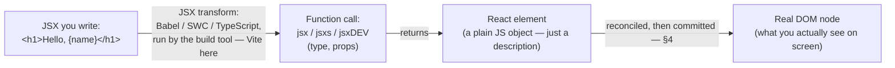
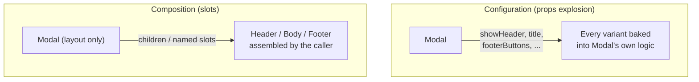
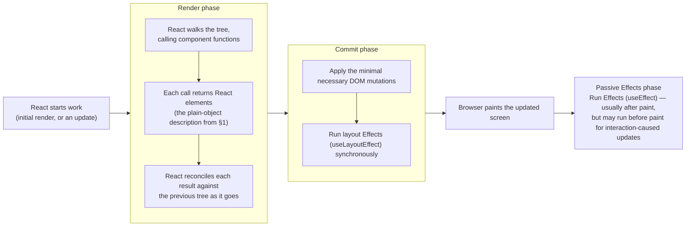
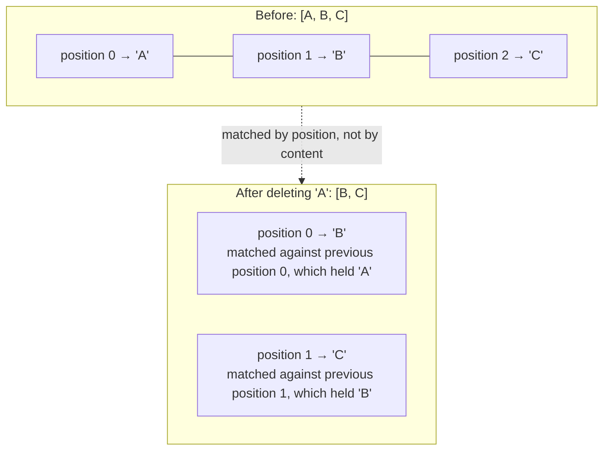
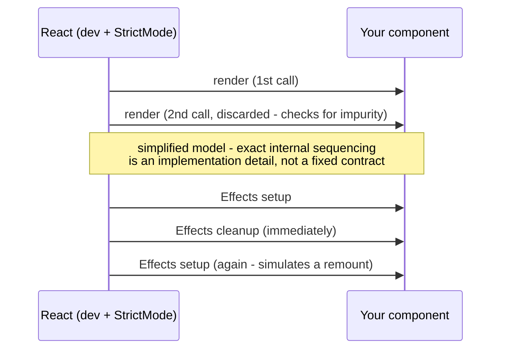

# Chapter 01: Foundations: JSX, Rendering & Components

**Status:** In Progress
**Folder:** `notes/01-foundations/`

## Why this chapter matters for a React interview
Everything else in this curriculum builds on the ideas in this chapter — you cannot reason
about hooks, performance, or React internals if the basic mental model of "what is a component
and what does React actually do with it" isn't solid first. This chapter starts from zero and
builds up to interview-level precision for each topic, in that order — plain-language
explanation first, precise mechanism second, interview framing third. Don't skip the "start
here" parts even if a section starts to feel obvious partway through; the precision layer
builds directly on them.

> **React version note:** these notes target modern React 19.x (currently 19.2, per
> `app/package.json`). Where current behavior differs from older React versions you're likely to
> encounter in existing codebases or interview questions (e.g. `defaultProps`, `ref` as a prop,
> `createRoot` vs. legacy `ReactDOM.render`), the historical difference is called out explicitly
> rather than assumed.

---

## 0. What React actually is, and the problem it solves

### Start here: how a web page normally gets built

A web page is HTML (structure), CSS (style), and JavaScript (behavior). The browser parses the
HTML into a live, in-memory tree of objects called the **DOM (Document Object Model)** — each
tag in your markup generally becomes an *element node* in that tree, and the text between tags
becomes its own *text node* (comments become nodes too; the tree is nodes generally, not tags
specifically, and the parser is allowed to insert or move things, so it isn't a strict
one-tag-one-node mapping). The browser draws the page on screen by walking that tree
(full mechanics of this rendering pipeline are in
[`00-javascript-and-browser-fundamentals/browser-and-web/README.md`](../00-javascript-and-browser-fundamentals/browser-and-web/README.md),
worth a look if you haven't read it — this chapter assumes you at least know "DOM = the tree of
elements the browser is currently displaying").

Without a library like React, if you want the page to change after it first loads — say, a
counter that goes up when you click a button — you write JavaScript that **directly finds and
mutates DOM nodes**:

```js
const button = document.getElementById("increment-btn");
const display = document.getElementById("count-display");
let count = 0;

button.addEventListener("click", () => {
  count = count + 1;
  display.textContent = String(count); // you manually find the node and update it
});
```

This is called **imperative** programming: you write step-by-step instructions for *how* to
change the page (find this node, set this property, add this class). It works fine for one
counter. It gets genuinely hard to manage once a page has dozens of interdependent pieces of UI
that all need to stay in sync with each other and with your data — you end up manually tracking,
by hand, every place in the code that might need to touch every piece of the DOM whenever
anything changes.

### The idea React introduces

React lets you write **declarative** UI code instead: you describe *what* the UI should look
like for a given set of data, and React figures out *how* to make the actual DOM match that
description — including figuring out the minimal set of real DOM changes needed (React's own
docs use this exact phrase — "minimal necessary operations" — for what happens during commit;
see [`learn/render-and-commit`](https://react.dev/learn/render-and-commit)), which is the
hard, error-prone part you'd otherwise be doing by hand.

```jsx
function Counter() {
  const [count, setCount] = useState(0); // "count" is data this component remembers (ch.02 covers useState itself)
  return (
    <div>
      <span>{count}</span>
      <button onClick={() => setCount(count + 1)}>+1</button>
    </div>
  );
}
```

You never write `document.getElementById` or `.textContent = ...` here. You just say "given
`count`, the UI looks like *this*" — and whenever `count` changes, React re-runs this function
and updates the real DOM to match the new description, automatically. That's the entire premise
of React: **you describe UI as a function of data, and React keeps the real DOM in sync with
that description.**

### What a "component" is, in plain terms

A **component** is just a JavaScript function that returns a description of some UI (that
`<div>...</div>` block above). You build a whole application by writing many small components
and composing them together — a `Counter`, inside a `Toolbar`, inside a `Page`, and so on — the
same way you'd break a large program into smaller functions for any other reason: to keep each
piece small, nameable, and reusable.

> **Interview framing:** if asked "why React" or "what problem does React solve," the strong
> answer names the imperative-vs-declarative distinction specifically, plus the fact that
> React's reconciliation (ch.19) works out the DOM updates for you, so you never hand-manage
> them. "It's popular" or "it's component-based" alone are weak answers — they don't explain
> *why* the component model helps.
>
> **Don't upgrade that to "React gives you optimal DOM updates"** — it's a claim you'd lose if
> an interviewer pushed on it. React's own reconciliation docs are explicit that a genuinely
> optimal tree diff is *not* what React does: "the state of the art algorithms have a complexity
> in the order of O(n³) where n is the number of elements in the tree... React implements a
> heuristic O(n) algorithm based on two assumptions" — namely that two elements of different
> types produce different trees, and that `key` lets the developer mark which children are
> stable across renders (§5)
> ([legacy `docs/reconciliation`](https://legacy.reactjs.org/docs/reconciliation.html), still the
> clearest published statement of the algorithm's shape). Knowing React deliberately trades
> theoretical optimality for linear time — and that the two assumptions it trades on are exactly
> what §5's keys rules are protecting — is a much stronger signal than the word "optimal."

---

## 1. JSX: syntax, expressions, and how it compiles

### Start here: JSX is HTML-like syntax living inside JavaScript

Look again at the `Counter` component above — the part inside `return (...)`. That
HTML-looking block written directly inside a `.jsx`/`.tsx` file is called **JSX**. It is *not*
a string, and it's not real HTML — it's a syntax extension to JavaScript that lets you describe
UI in a shape that reads like the markup it will eventually produce, instead of building it up
through verbose function calls (you'll see exactly what those function calls look like in a
moment).

You can drop into plain JavaScript anywhere inside JSX using curly braces `{}` — this is called
an **expression slot**. Anything between `{` and `}` is evaluated as a normal JS expression and
the result is inserted into the UI:

```jsx
const name = "Ada";
const el = <h1>Hello, {name}!</h1>; // {name} is replaced with the string "Ada"
```

```jsx
const el = <p>{2 + 2}</p>;          // renders "4"
const el2 = <p>{isDone ? "Done" : "Pending"}</p>; // any expression works, including ternaries
```

The important restriction: `{}` accepts an **expression** (something that produces a value),
not a **statement**. `if`, `for`, and variable declarations (`const x = 1`) are statements —
they don't produce a value — so none of them are legal directly inside `{}`. This is exactly
why "conditional rendering" in React uses expression-shaped tools like the ternary operator
(`? :`) and `&&` instead of an `if` block written inline in JSX — more on this in §6.

### How JSX actually becomes DOM: the compile step

JSX doesn't run in the browser as-is — browsers don't understand it. Before your code ever
runs, a **JSX transform** rewrites every JSX expression into a plain JavaScript function call.
This happens at build time, invisibly, every time you save a file and the dev server reloads.

Worth separating two things that get casually conflated here, because the distinction shows up
in interviews as "what actually compiles your JSX": the **build tool** (Vite, in this project)
is what orchestrates the dev server and the production build; the **transform itself** is done
by a compiler the build tool delegates to — Babel, SWC, or TypeScript, depending on the setup.
Vite isn't itself the JSX compiler. This project delegates to `@vitejs/plugin-react`, whose
[README](https://github.com/vitejs/vite-plugin-react/tree/main/packages/plugin-react#jsxruntime)
states it uses the automatic JSX runtime (described below) by default.

```jsx
const el = <h1 className="title">Hello, {name}</h1>;
```

compiles to (the **classic transform** — what you'd have seen in React before version 17):

```js
const el = React.createElement("h1", { className: "title" }, "Hello, ", name);
```

or, with the **modern automatic JSX transform**
([`learn/writing-markup-with-jsx`](https://react.dev/learn/writing-markup-with-jsx) confirms
this has been the default since React 17):

```js
import { jsxs as _jsxs } from "react/jsx-runtime";
const el = _jsxs("h1", { className: "title", children: ["Hello, ", name] });
```

Two details about that output, since "it compiles to `jsx(...)`" is a slightly-too-tidy version
of the truth that's easy to state wrong out loud:

- The runtime exports **both `jsx` and `jsxs`**. `jsx` is used when the element has a single
  child; `jsxs` (the `s` is for a *static* children array) is used when the children are a
  known-at-compile-time list — which is why the example above, with two children (`"Hello, "`
  and `name`), emits `jsxs` rather than `jsx`.
- **Development builds use a third entry point entirely:** `jsxDEV` from
  `react/jsx-dev-runtime`, which takes extra arguments recording the source file, line, and
  column so React can point at the right line in error messages and warnings.

Which of the three you get is an implementation detail of the transform, not something your
code chooses, and none of it changes the conceptual point: **JSX becomes a function call that
returns a plain object.**

> **Project-configuration footnote,** since it's easy to credit the wrong file: for this repo
> the transform is performed in the Vite pipeline by `@vitejs/plugin-react`, *not* by
> TypeScript. `app/tsconfig.app.json` does set `"jsx": "react-jsx"`, but it also sets
> `"noEmit": true`, and `npm run build`'s `tsc -b` step therefore only **type-checks**. So that
> tsconfig setting is what makes TypeScript type-check your JSX against the automatic runtime's
> types; it is not what emits the `jsxs(...)` call.

Either way, the call **returns a plain JavaScript object** describing what you asked for —
something shaped roughly like `{ type: 'h1', props: { className: 'title', children: [...] } }`.
This is called a **React element**. It is inert data, nothing more — not a DOM node, and it
doesn't render anything by itself just by existing. It only becomes real DOM once React's
renderer (`react-dom`) uses that element tree as the description of the UI, compares it against
what's already on screen (§4 covers this comparison — **reconciliation** — precisely), and
commits whatever DOM changes are actually needed.



**Why this matters beyond trivia:** understanding that JSX → element (plain object) → DOM is
a two-step process, not one, explains a lot of things that otherwise look magical:
- You can store a piece of JSX in a variable, put it in an array, pass it around as a function
  argument or prop, or even `console.log` it and see a plain object — because it *is* one.
- "Conditionally rendering JSX" is really just "conditionally producing a value," exactly like
  any other expression in JS — there's no special React syntax for it (§6).
- The **old-style transform requiring `import React from 'react'` in every file** exists because
  `React.createElement(...)` needs `React` to be in scope; the modern automatic transform
  imports `jsx`/`jsxs` from `react/jsx-runtime` for you instead, so that import is no longer
  needed. If you ever see an old codebase with an apparently-unused `import React from 'react'`
  at the top of every file, that's the classic transform's fingerprint, not dead code.

Three terms that get used loosely but mean genuinely different things — worth having crisp,
since conflating them is a common source of confused explanations under interview pressure.
[`reference/react/createElement`](https://react.dev/reference/react/createElement) states the
middle one directly: "an element is a lightweight description of a piece of the user
interface... creating this object does not render the component or create any DOM elements."

| Term | What it actually is |
|---|---|
| **Component** | A JS function (or class) you write, that *describes* UI — the blueprint. |
| **React element** | The plain-object output of calling that description (`{ type, props }`) for one specific render — inert data, not yet on screen. |
| **DOM node** | The actual browser object that ends up rendered on screen, which React creates/updates to match the element tree. |

`<Counter />` refers to the *component*, and (per §1's compile step) it immediately produces a
*React element* — an object whose `type` points at the `Counter` function — without calling
`Counter` itself. React only calls `Counter` later, during its own render process (§2 explains
this `<Counter />` vs. `Counter()` distinction precisely). Once React has done that and knows
what the tree should look like, it reconciles the result and commits the resulting *DOM nodes*.
All three — component, element, DOM node — are related but distinct, and each has already come
up separately above.

### JSX syntax rules, and *why* each one exists

- **A component must return a single value** — more precisely "single root element" than a hard
  rule, since a component can just as validly return a plain string, a number, `null`, a
  boolean (renders nothing), or an array of elements. What's actually illegal is writing two
  *adjacent* JSX elements with nothing wrapping them: `return <h1>A</h1><p>B</p>;` fails because
  that's not one JS value, it's two sibling expressions with no container. Wrap them in a parent
  element (`<div>...</div>`) or, if you don't want an extra wrapper `<div>` showing up in the
  actual DOM, a **Fragment** (`<>...</>`), which exists specifically to group elements without
  adding a real DOM node.
- **Component names must be capitalized** (`<Counter />`, not `<counter />`). This isn't a style
  preference — it's how the compiler decides what a tag *means*. `<div>` compiles to the string
  `"div"` as the element's `type` (meaning "this is a built-in HTML tag"); `<Counter>` compiles
  to "look up the variable named `Counter` and use *that* as the type" (meaning "this is a
  component I wrote"). A lowercase custom component name would be treated as an unknown HTML
  tag string instead of your component, and silently fail to render what you intended.
- **Attributes use `camelCase`** — `strokeWidth` instead of `stroke-width`, `onClick`
  instead of `onclick`, and — the one worth having precise — `className` instead of `class` and
  `htmlFor` instead of `for`. React's own docs give the exact reason directly: JSX attributes
  become the keys of a JavaScript object (the props object, from §1's compile step), and you
  will very often want to pull those attributes out into plain variables — most commonly via
  destructuring a component's props, exactly like `function Greeting({ name })` in §2/§3 below.
  JavaScript variable/binding names have real restrictions that object property *keys* don't:
  they can't contain dashes (`stroke-width` isn't a legal identifier, hence `strokeWidth`), and
  they can't be reserved words like `class`
  ([`learn/writing-markup-with-jsx`](https://react.dev/learn/writing-markup-with-jsx) states this
  directly) — so `function Img({ class }) { ... }` is an actual
  `SyntaxError`, not just bad style, because that destructuring shorthand tries to declare a
  variable literally named `class`. (This is genuinely narrower than "objects can't have `class`
  as a key at all" — `{ class: 'x' }` and `el.class` are both fine; it's specifically the
  variable/binding-name position, e.g. destructuring shorthand or `var`/`let`/`const` names,
  that rejects reserved words.) Since `class` can't safely be used, React picked `className` —
  not an arbitrary substitute, but the name already used by the DOM's own
  [`element.className`](https://developer.mozilla.org/en-US/docs/Web/API/Element/className)
  property — and `htmlFor` follows the same pattern.

  **Two genuine exceptions to the camelCase rule, worth knowing so you don't "fix" them by
  mistake:** `aria-*` and `data-*` attributes keep their HTML dashed spelling as-is in JSX —
  `aria-label`, `data-testid`, not `ariaLabel`/`dataTestid`.
  [`learn/writing-markup-with-jsx`](https://react.dev/learn/writing-markup-with-jsx) calls this
  out directly as a historical exception, not an oversight:

  ```jsx
  <div className="card" tabIndex={0} aria-label="Profile" data-testid="profile" />
  ```

  This distinction between HTML *attributes* (strings in markup) and DOM *properties*
  (JavaScript object fields on the live element) is a genuinely useful thing to have precise for
  interviews in its own right, beyond just explaining `className` — it's the same distinction
  behind why, say, `<input value="x">` (the HTML attribute, only used for the *initial* value)
  and `inputElement.value` (the DOM property, always current) can disagree once a user types.

> **Interview framing:** "how does JSX become the DOM" is a favorite basic-but-revealing
> question. A strong answer chains all four steps explicitly — compiles to `createElement`/
> `jsx()` calls → produces a plain-object element tree → React renders/reconciles that tree
> against the previous one (§4's **render phase**) → commits the resulting DOM mutations (§4's
> **commit phase**). Answering "JSX gets turned into HTML" conflates two different things (a JS
> object vs. actual DOM) and is the tell of someone who hasn't looked underneath the syntax;
> collapsing reconciliation and commit into a single unnamed step is the next most common
> imprecision, worth avoiding now that §4 gives you the vocabulary to be exact about it.

---

## 2. Components: functional components + hooks vs. class components

### Start here: a component is a function; calling it (indirectly) produces UI

You already saw the shape:

```jsx
function Greeting({ name }) {
  return <h1>Hello, {name}!</h1>;
}
```

`Greeting` is a plain JavaScript function. React calls it for you (you never call it yourself as
`Greeting()`; instead you write `<Greeting name="Ada" />` in JSX, and React handles invoking the
function with the right arguments — this is one of the things the JSX compile step sets up). The
difference between these two is worth having explicit, since it's a real interview distinction,
not just a stylistic one: `Greeting()` is an ordinary synchronous function call — it runs
immediately, right where it's written, and you get back whatever it returns. `<Greeting />`
compiles to `jsx(Greeting, {...})` (§1) — it does **not** call `Greeting` itself; it produces a
React element that *describes* "render `Greeting` here," and React decides if/when to actually
call the function, as part of its own render process. This is exactly why React can do things
like skip calling a component entirely (`memo`, ch.06) or call it twice on purpose (Strict Mode,
§8) — those are only possible because *React*, not your code, controls the call.

Whatever JSX the function returns is what gets shown on screen for that piece of the page. If
the function runs again later (because something it depends on changed), whatever it returns
*this* time replaces what was shown before — this "run the function again to get updated UI" is
the essence of what a **render** is, covered precisely in §4.

**Two rules that define "what makes something a valid React function component":**
1. **When used as a JSX tag, its name must be capitalized** — `<Counter />`, not `<counter />`.
   Worth being precise about *where* that constraint actually lives, because it's a satisfying
   detail to have right: nothing about the **function** requires a capital letter; the **JSX
   tag** does. §1's compile step is the entire reason — a lowercase tag compiles to a *string*
   type (meaning an intrinsic HTML element), a capitalized one compiles to a *reference* to the
   variable of that name:

   ```js
   <Greeting />  →  jsx(Greeting, {})    // a reference to your function
   <greeting />  →  jsx("greeting", {})  // the string "greeting" — an unknown HTML tag
   ```

   So `function greeting() { return <h1>Hi</h1>; }` is a perfectly valid component function that
   React would render happily if handed over directly (`createElement(greeting)`) — it simply
   can't be used as `<greeting />`, which is how you'd always actually use it in real code. That
   gap is why react.dev states it flatly as a naming rule rather than a JSX rule: "React
   components are regular JavaScript functions, but their names must start with a capital letter
   or they won't work!"
   ([`learn/your-first-component`](https://react.dev/learn/your-first-component)). Treat the
   capital letter as required in practice; just know the mechanism is JSX tag resolution, not
   something React inspects about your function.
2. It must return a value React can render or treat as empty: JSX/elements, strings, and numbers
   are actually displayed; `null`, `undefined`, and booleans render nothing (they're valid
   returns, just not visible ones); an array/Fragment of any of those is also valid.

**A third rule, easy to overlook because nothing enforces it at compile time: a component must
be pure while it's rendering.** React's own framing of this — the
[Rules of React: components and Hooks must be pure](https://react.dev/reference/rules/components-and-hooks-must-be-pure)
— is precise enough to quote directly — a component must be:
- **Idempotent** — given the same props/state/context, it always returns the same JSX.
- **Free of side effects during render** — the function body itself must not modify external
  variables, touch the DOM, start subscriptions, or make network calls. Side effects still have
  a place, just not *during* the render call itself — React's own guidance splits them by
  cause: a side effect triggered by a specific user interaction (a click, a form submit) belongs
  in an **event handler**, not an Effect (e.g. a "Buy" button's `fetch('/api/buy', ...)` call
  belongs in the `onClick` handler, since it should run exactly when — and only when — the user
  clicks); a side effect that needs to happen because the component is *displayed*, regardless
  of what interaction caused that, belongs in `useEffect` (ch.03) — e.g. opening a connection
  that should exist for as long as the component is on screen, no matter how it got there.
- **Non-mutating of anything it doesn't own** — it must never write to a variable, object, or
  array that exists *outside* the function call currently rendering.

That last point has a specific, useful nuance: **reading** an external value during render is
fine; **mutating** one is the problem.

```jsx
// fine — items is created fresh inside this render, mutating it locally is harmless
function FriendList({ friends }) {
  const items = [];
  for (const friend of friends) items.push(<li key={friend.id}>{friend.name}</li>);
  return <ul>{items}</ul>;
}

// NOT pure — items lives outside the component, so every render mutates shared state
const items = [];
function FriendList({ friends }) {
  for (const friend of friends) items.push(<li key={friend.id}>{friend.name}</li>);
  return <ul>{items}</ul>;
}
```

Why this matters mechanically, not just as a style rule: React is free to call your component
function more than once for a single logical render (exactly what Strict Mode does on purpose in
development — §8 — and what concurrent features may do for real in production), so any state
your render logic leaves behind in shared, external storage will double up, or worse, silently
diverge from what's on screen.

### Hooks: how a function component gets "memory" and other capabilities

A plain JS function, on its own, doesn't remember anything between calls — every time it runs,
its local variables start fresh. But components clearly *do* need to remember things (like the
`count` in the counter example) across renders. **Hooks** are special functions — always named
starting with `use` (`useState`, `useEffect`, `useRef`, and so on) — that let a function
component tap into React-managed capabilities that a plain function couldn't have on its own:
persistent state that survives across renders, running code in response to the component being
displayed, reading values from a Context, and more. `useState` itself (what `const [count,
setCount] = useState(0)` means precisely) is the subject of ch.02 — for this chapter, the only
thing to internalize is *why* hooks exist at all: they're what turn an ordinary, stateless
function into something that can behave like a living, updating piece of UI.

One constraint worth knowing exists even before ch.02 covers the mechanics and full reasoning —
React's **[Rules of Hooks](https://react.dev/reference/rules/rules-of-hooks)**, stated as two
rules: (1) only call Hooks at the top level of a
component (never inside a loop, condition, or nested function, and never after an early
`return`), and (2) only call Hooks from a React function component or another Hook (never from
a regular JS function). This is *why* §6's conditional-rendering section warns that an early
return must come *after* all Hook calls, not before.

### Class components: the older way of doing the same thing

Before hooks existed (pre-React 16.8, released 2019), the only way to give a component "memory"
and lifecycle behavior was to write it as a **JavaScript class** instead of a function:

```jsx
class Counter extends React.Component {
  constructor(props) {
    super(props);
    this.state = { count: 0 };
  }
  render() {
    return (
      <button onClick={() => this.setState({ count: this.state.count + 1 })}>
        {this.state.count}
      </button>
    );
  }
}
```

This is equivalent in behavior to the function + `useState` version shown earlier in §0. Modern
React code (and this entire curriculum) uses functions + hooks, not classes — but you're
expected to recognize class syntax at this level, both because a lot of production code you'll
encounter in the wild still uses it, and because one specific case (Error Boundaries, ch.16)
still **requires** a class to this day.

**Why hooks won, mechanically, not just "the team preferred it":**
- **Reusable stateful logic without wrapper hell.** Before hooks, sharing stateful *behavior*
  between components (say, "track window size" used by three different components) meant
  Higher-Order Components or render props — patterns that wrap your component tree in extra
  layers ("wrapper hell") and make it hard to trace which wrapper injected which prop. A custom
  Hook (`useWindowSize()`) lets you extract and reuse that logic directly, with no extra
  component and no wrapping.
- **`this` binding footguns disappear.** In the class example above, if you wrote
  `<button onClick={this.handleClick}>` instead of an inline arrow function, `this` inside
  `handleClick` would be `undefined` when the button is actually clicked — because passing a
  method reference around detaches it from the object it belongs to (this exact mechanism is
  covered in ch.00's `this`-binding section; it's a general JS quirk, not React-specific, but
  classes are where it bites hardest in React code). You'd need to manually
  `this.handleClick = this.handleClick.bind(this)` in the constructor to fix it. Functions +
  hooks have no `this` at all for component logic, so this entire category of bug doesn't exist.
- **Related logic can live together.** In a class, "subscribe to something on mount" lives in a
  method called `componentDidMount`, and "clean that subscription up" lives in a *separate*
  method, `componentWillUnmount` — related code for the same concern gets split across
  differently-named methods. `useEffect` (ch.03) lets the setup and cleanup for the *same*
  concern live in one place, and you can write several independent `useEffect` calls instead of
  cramming every "on mount" concern into one method.

**What classes had that's genuinely gone:** there's no Hook that's a direct, one-to-one
replacement for every class lifecycle method — `getSnapshotBeforeUpdate` in particular has no
Hook equivalent (rare enough in practice not to matter for most apps). Despite that, the large
majority of real-world class components *can* be migrated to functions + hooks, because their
actual behavior (state + effects) is expressible with `useState`/`useReducer`/`useEffect` even
without a line-for-line lifecycle-method mapping. The one capability that's a genuine, current
exception — not just "no exact Hook equivalent," but "cannot be done with hooks at all" — is
**Error Boundaries**: catching render errors from components below you in the tree requires the
`componentDidCatch` / `static getDerivedStateFromError` contract, and
[react.dev states directly](https://react.dev/reference/react/Component) that "there is
currently no way to write an Error Boundary as a function component" (the same page also
confirms `getSnapshotBeforeUpdate` currently has no Hook equivalent).

> **Interview framing:** a common trap question is "can you replace all class components with
> hooks?" — the precise answer distinguishes two different claims: no Hook maps one-to-one onto
> every legacy lifecycle method, but that's a *migration convenience* gap, not a *capability*
> gap — except for Error Boundaries, which is a genuine capability gap with no Hook-based
> solution today. Answering with an unqualified "yes" (glossing over Error Boundaries) or an
> unqualified "no" (overstating the lifecycle-method gap) are both tells that you haven't hit
> this distinction in practice.

---

## 3. Props: passing data into components, defaults, `children`, and composition

### Start here: props are just function arguments

A component receives inputs the same way any function does — except in JSX, instead of writing
`Greeting("Ada")`, you write `<Greeting name="Ada" />`, and all the attributes you pass become a
single object argument (conventionally named `props`) that the function receives:

```jsx
function Greeting(props) {
  return <h1>Hello, {props.name}!</h1>;
}
// <Greeting name="Ada" /> → Greeting({ name: "Ada" }) under the hood
```

In practice you'll almost always see props **destructured** directly in the function signature,
which is just a JS shorthand for pulling named fields out of that object (destructuring itself
is plain JS, not a React feature):

```jsx
function Greeting({ name }) {
  return <h1>Hello, {name}!</h1>;
}
```

### Props are read-only from the child's side

This is the first real "gotcha" interviewers probe, and it's worth phrasing precisely the way
React's own docs do: **props (like state) are an immutable snapshot for a given render** — not
"a value you're merely asked nicely not to change," but a value that reflects what was true at
the moment this particular render started, which the child is never meant to write to. Props
flow one direction — parent to child. If a child needs to *change* something conceptually
"given" to it by a parent, the correct pattern is for the parent to pass a **callback function**
as a prop, which the child calls to ask the parent to make the change (the parent owns the
actual data and decides what happens). This "data down, callback functions back up" shape is
called **lifting state up**, and it's covered properly with real code in ch.02 — for now, just
internalize the rule: **props in, never props mutated.**

### Default values for props

If a caller doesn't pass a prop, you can give it a fallback using a plain JavaScript **default
parameter** — again, ordinary JS syntax, not something React invented:

```jsx
function Button({ variant = "primary", children }) {
  return <button className={`btn btn-${variant}`}>{children}</button>;
}
// <Button>Save</Button>            → variant defaults to "primary"
// <Button variant="danger">Delete</Button> → variant is "danger"
```

There used to be a React-specific way to do this (`Button.defaultProps = { variant: 'primary' }`)
— you may still see it in older code. It's **deprecated** as of React 18.3 and its support was
**removed entirely for function components in React 19** — always use a JS default parameter
instead going forward. (This deprecation is function-component-specific; `defaultProps` on
*class* components still works — confirmed directly in the
[React 19 upgrade guide](https://react.dev/blog/2024/04/25/react-19-upgrade-guide): "we're also
removing `defaultProps` from function components in place of ES6 default parameters. Class
components will continue to support `defaultProps` since there is no ES6 alternative.")

### `children`: the prop that isn't passed as an attribute

Whatever you nest *between* a component's opening and closing tags is automatically collected
into a special prop called `children` — you don't pass it like a normal attribute, but it's
just a prop like any other once inside the function:

```jsx
<Card>
  <p>This paragraph becomes Card's children prop.</p>
</Card>

// is exactly equivalent to:
<Card children={<p>This paragraph becomes Card's children prop.</p>} />
```

```jsx
function Card({ children }) {
  return <div className="card">{children}</div>;
}
```

Once that equivalence clicks — `children` is nothing but an implicitly-populated prop — a lot of
component composition patterns stop looking like special syntax and start looking like "just
passing a value," because that's all it is.

One thing worth being explicit about, since it's an easy wrong assumption to carry forward:
**`children` is not necessarily a single element.** Anything nested between the tags — multiple
elements, plain text mixed with elements, even other components — all get collected into
`children` together:

```jsx
<Card>
  <h1>Hello</h1>
  <p>World</p>
</Card>
```

Here `Card`'s `children` prop is a *list* of nodes (an `h1` and a `p`), not one element. React
refers to this general category — anything renderable, including a single element, an array of
elements, a string, a number, or nothing at all — as a **React node**, and `children` is typed
as exactly that, not as "one element."

### Composition over configuration

This is the idiomatic React answer to "how do I avoid a component with a dozen boolean props
trying to control every possible variant of its content." Compare two ways of building a modal
dialog:

```jsx
// Configuration: the component must know about every possible internal variation up front
<Modal showHeader showCloseButton title="Confirm" footerButtons={['Cancel', 'OK']} />

// Composition: the parent assembles the pieces; Modal just provides the layout/slots
<Modal>
  <Modal.Header>Confirm</Modal.Header>
  <Modal.Body>Are you sure?</Modal.Body>
  <Modal.Footer><button>Cancel</button><button>OK</button></Modal.Footer>
</Modal>
```

The configuration version's prop list grows without bound as new use cases appear, and `Modal`
has to understand every consumer's specific needs in advance. The composition version pushes
that knowledge back out to the call site — `Modal` only needs to know about layout, not content.
`children` (plus, sometimes, multiple named "slot" props, e.g.
`<Layout sidebar={<Nav />} main={<Content />} />`) are the two building blocks that make this
possible.



> **Interview framing:** "how would you design a component API for X" questions are almost
> always testing whether you reach for composition before configuration. A strong answer names
> the trade-off explicitly: configuration is easier to constrain (fewer ways to misuse it) but
> doesn't scale as variants multiply; composition scales better but gives callers more freedom
> (and more ways to misuse it).

---

## 4. What triggers a render; render phase vs. commit phase

### Start here: what "render" actually means in React

Loosely, people say "React re-renders a component" to mean "React called that component's
function again to get an updated description of the UI." That's the core of it — but there's a
precise two-step process behind it worth knowing exactly, because a lot of "why did/didn't my UI
update" questions are really questions about which of these two steps did or didn't happen.

### What triggers a render

React's own docs ([`learn/render-and-commit`](https://react.dev/learn/render-and-commit)) teach
this with a deliberately simple model — "There are two reasons for a component to render" —
naming **initial render** and **a state update** (in that component, or in one of its
ancestors). Take that for what it is: React's *teaching model* of how rendering starts, which is
the right thing to lead with in an interview, but not an exhaustive specification of every
mechanism that can put React to work (the caveat at the end of this section covers the one
common case that doesn't fit the wording literally). Everything else is either one of those two
reasons, or something that shapes *which* components a state update actually reaches:

1. **Initial render** — the very first time a component tree is displayed, kicked off by the
   `createRoot(...).render(<App />)` call covered in §7. Every component in the tree participates
   in this initial render simply because the app is starting up, before any state has changed at
   all (in development, under Strict Mode, the render logic for that initial pass may itself be
   invoked twice per component — §8 — but that's a dev-only stress test of the same initial
   render, not a second independent trigger).
2. **State update** — calling a `useState` setter, or dispatching to a `useReducer` (ch.02/05),
   with a value that's actually different from the current one (see the bail-out note below) —
   in the component itself, or in an ancestor (an ancestor's state update is what "a parent
   re-renders" means in practice).

Once a state update happens somewhere, two more things shape what actually renders as a result,
neither of which is an independent trigger on its own:

- **By default, a re-rendering parent re-renders all of its children too** — regardless of
  whether their own props actually changed. This is exactly why `memo` exists as a performance
  escape hatch (ch.06): to let a child opt out when its own props haven't changed.
- **Context consumers re-render when their Provider's value changes** — components reading a
  Context via `useContext` are re-rendered whenever the Provider supplying that context receives
  a new value (ch.05), independent of whether their own local props/state changed. Direct
  confirmation: "React automatically re-renders all the children that use a particular context
  starting from the provider that receives a different `value`"
  ([`reference/react/useContext`](https://react.dev/reference/react/useContext)).

Notice what's **not** on this list as a cause of its own: **a prop change is not an independent
trigger.** Be careful how you phrase this, because the sloppy version ("props changing does
nothing") is wrong in the other direction — from inside the child, receiving different props is
absolutely the reason it renders *differently*. The precise claim is about causation, not
relevance: the thing that caused the child to render *at all* was its parent re-rendering (from
that parent's own state update, or from being re-rendered by *its* parent), which then passed a
different value down. Tracing "why did this component render?" backwards always terminates at an
initial render or a state update — never at "a prop changed."

**One honest caveat on that two-reason model,** worth having so the model doesn't
break the first time you meet an external store: components subscribed via `useSyncExternalStore`
(ch.13 — how Redux, Zustand, and similar libraries integrate with React) re-render when the
*store* notifies a change, which isn't a `useState` setter call in the literal sense. It's still
an **update** in React's model rather than some third phase — it just originates outside React's
own state. The most robust interview phrasing, which stays true in every case: *React starts
work either for an initial render or for an update; updates originate from component state, from
a Provider being given a new value, or from an external store React is subscribed to.*

### Render phase vs. commit phase

React splits the work of "update the screen" into two distinct phases:



- **Render phase**: your component function actually runs here, computing what the UI *should*
  look like as fresh element trees, which React compares against the previous tree — this
  comparison process is what React's docs call **reconciliation** — to figure out exactly what
  changed ([`learn/render-and-commit`](https://react.dev/learn/render-and-commit)).
  **Read the three boxes above as a conceptual breakdown, not as three separate sequential
  passes over the whole app:** React doesn't call every component, *then* build one complete
  tree, *then* diff the two finished trees. It traverses the tree, and calling a component and
  reconciling what that call returned are interleaved as it goes. The simplified "build, then
  compare" picture is fine for reasoning about *what* the phase accomplishes, and it's how most
  explanations (including React's own teaching docs) present it — just don't defend it as
  literal mechanics if an interviewer pushes on it; the real traversal is the subject of ch.19.
  This phase must be **pure** — no side effects
  (no mutating variables outside the function, no network calls, no touching the DOM directly)
  — because React is allowed to start, throw away, and restart a render without warning if it
  decides to (this is exactly what Strict Mode's double-invoke in development is designed to
  catch — see §8 — and it's also what makes advanced features like `useTransition`, ch.06, safe:
  an in-progress render can be abandoned mid-flight with no harm done).
- **Commit phase**: React actually touches the real DOM here, to match what the render phase
  just computed, and runs layout Effects (`useLayoutEffect`) synchronously as part of the same
  phase. Unlike the render phase — which React can pause, throw away, and restart — commit is
  not treated as discardable, speculative work; React runs it through to completion once it
  starts. Precisely where `useEffect` fits is worth getting right, since it's a common source of
  imprecision: it is **not** part of the commit phase. React's own performance-tracks
  documentation names a separate, later step — **"Remaining Effects"** — for exactly this:
  "React runs passive effects of a rendered subtree. This usually happens after the paint, and
  this is when React runs hooks like `useEffect`. One known exception is user interactions, like
  clicks... in this scenario, this phase could run before the paint."
  ([`reference/dev-tools/react-performance-tracks`](https://react.dev/reference/dev-tools/react-performance-tracks)).
  So the accurate ordering is commit (DOM + layout Effects) → browser paint (usually) →
  `useEffect` — not `useEffect` nested inside commit.

Four related terms are worth having precisely distinct, since they get used loosely and
conflated in casual explanations:
- **Render** — React calling a component function to compute what it should display.
- **Re-render** — the informal, everyday word for "render happening again," after the initial
  one — not a separate mechanism, just render happening more than once over a component's life.
- **Reconciliation** — React's comparison of the new element tree against the previous one, to
  figure out what actually changed (part of the render phase, above).
- **Commit** — actually applying the result of that comparison to the real DOM.

### Mount, update, and unmount: naming a component's lifecycle

Three more terms, used constantly once Effects (ch.03) and class lifecycle methods enter the
picture, worth defining precisely here since this chapter already leans on them implicitly:

- **Mount** — the first time a particular component appears in the tree and gets its first
  render + commit. A fresh `<Counter />` showing up on screen for the first time is "mounting."
- **Update** — an already-mounted component rendering again (a re-render) because its own state
  changed, or a parent re-rendered and passed new props, or a Context value it reads changed.
- **Unmount** — the component being removed from the tree entirely — its DOM node(s) removed,
  its state discarded. This is exactly when an Effect's cleanup function (ch.03) runs for the
  last time, and it's the class-component equivalent of `componentWillUnmount`.

### Two nuances that show up constantly as "gotcha" questions

**State updates don't apply synchronously.** Calling a setter *schedules* a re-render; it
doesn't change the variable in your currently-running function call:

```jsx
function handleClick() {
  setCount(count + 1);
  console.log(count); // still logs the OLD value — this line runs before the re-render happens
}
```

This is the same closure mechanics as ch.00's stale-closure section, just applied to state
specifically — the `count` variable in this particular call of the function is a snapshot from
when *this* render happened, and it doesn't retroactively update just because you called
`setCount`.

**Not every `setState` call causes a re-render.** If you call `setState(x)` with a value that's
`Object.is`-equal (essentially: reference-equal, for objects/arrays) to the current state, React
**can bail out** and skip re-rendering that component. This is exactly why replacing an object or
array with a **new reference** (rather than mutating the existing one in place) matters:
`setUser({ ...user, name })` creates a new object, so React sees a different reference and
re-renders; `user.name = name; setUser(user)` passes back the *same* reference, so React sees
"no change" and can skip work — even though the object's contents did change.

**A preview worth having, even though the full mechanics belong to ch.02:** because state
updates read the snapshot value from the render that scheduled them (the stale-closure point
above), calling a setter multiple times in a row using the *current* variable doesn't stack the
way you might expect:

```jsx
setCount(count + 1); // all three read the SAME `count` snapshot from this render —
setCount(count + 1); // this only ever moves count from, say, 0 to 1, not to 3
setCount(count + 1);
```

The fix is the **updater function** form, which receives the *latest* pending value instead of
the render's snapshot (worked example with the same reasoning:
[`learn/queueing-a-series-of-state-updates`](https://react.dev/learn/queueing-a-series-of-state-updates)):

```jsx
setCount((c) => c + 1); // each call receives the previous call's result — correctly reaches 3
setCount((c) => c + 1);
setCount((c) => c + 1);
```

> **Interview framing:** "why does React batch state updates" is asking about a **performance**
> optimization, not a correctness one — be precise about that distinction if asked. React groups
> multiple `setState` calls that happen within the same event/tick into a single render+commit
> pass instead of one per call, which avoids redundant re-renders. Worth naming explicitly: React
> 18 made this automatic batching apply *everywhere* (inside promises, timeouts, native event
> handlers — not just React's own synthetic event handlers), which is a real behavior change
> from React 17 and earlier, where only updates inside React event handlers were batched — see
> the [React 18 release post](https://react.dev/blog/2022/03/29/react-v18).

---

## 5. Keys and lists: why they matter, and the index-as-key trap

### Start here: rendering a list of data

To render a list of UI elements from an array of data, you use JavaScript's built-in
`Array.prototype.map` (ordinary JS, not React-specific) to transform each data item into a piece
of JSX:

```jsx
const users = [{ id: "u1", name: "Ada" }, { id: "u2", name: "Alan" }];

function UserList() {
  return (
    <ul>
      {users.map((user) => (
        <li key={user.id}>{user.name}</li>
      ))}
    </ul>
  );
}
```

That `key={user.id}` is the part specific to React, and it's not optional in practice — if you
omit it, React still renders the list, but logs a console warning, because of what `key` is
actually for.

### Why keys exist: how React tells "same item" from "different item"

When a list re-renders (an item added, removed, reordered, or edited), React needs to match each
element in the *new* array to the corresponding element in the *old* array, to decide: "this is
the same logical item, just update it in place" vs. "this is a brand-new item, mount it fresh"
vs. "this item is gone, remove it." **The `key` is how you tell React which item is which.**
Without a stable identity attached to each item, React has no way to distinguish "the user
reordered the list" from "the user deleted item 2 and a brand-new, differently-worded item 2
just happened to appear in its place."

React's own docs ([`learn/rendering-lists`](https://react.dev/learn/rendering-lists)) frame it
well: a key is like a filename — it lets React identify an item across renders even if its
*position* in the array changes, because a well-chosen key carries more information than array
position alone does.

### If you don't specify a key, React falls back to the item's position

Rendering an array without explicit keys doesn't mean nothing happens — React matches the new
children against the previous ones **by position/order** in the array, which behaves exactly as
if you had passed each item's index as its key. React's own docs put it that way directly:
"You might be tempted to use an item's index in the array as its key. In fact, that's what React
will use if you don't specify a `key` at all"
([`learn/rendering-lists`](https://react.dev/learn/rendering-lists)).

One small precision point, since the diagram below could otherwise be misread: React does not
literally attach `key={0}`, `key={1}` props to your elements when you omit keys — those elements
genuinely have no key, and positional matching is what the reconciler falls back to. "React uses
the index as the key" is a description of the resulting *behavior*, which is why it's a fair
thing to say in an interview, not a description of props React silently wrote for you.

Positional matching works fine as long as the list never reorders, filters, or has items
inserted/removed anywhere but the very end. The moment it does, it breaks:



Because position 0 before and position 0 after are treated as the same logical element, React
reuses the existing DOM node and component state at that position — but that node now displays
`B`'s
content instead of `A`'s. If that list item happens to be, say, a text input holding per-row
draft text, **the input's state (whatever the user typed) stays attached to the DOM node at that
position, not to the logical data item that moved** — so after deleting row A, row B visually
inherits whatever the user had typed into row A. This is the canonical "index-as-key bug": no
crash, no error — just *silently wrong state attached to the wrong row*. That's exactly why it's
a favorite "explain this bug" interview scenario: it looks like a state-management bug rather
than a keys bug unless you know what to look for.

### Rules for a good key

- **Stable across renders** — don't generate a new one during render (e.g. `Math.random()` or
  `crypto.randomUUID()` called inside the component function); that defeats the whole purpose,
  because every render would then look like a full delete-and-recreate of every item.
- **Unique among siblings** — uniqueness across *different*, unrelated arrays elsewhere in the
  app doesn't matter.
- **Prefer a real, stable identifier from your data** (a database ID) over a synthetic one.

### `key` is not a prop — a genuinely common trap

```jsx
<User key={user.id} />
```

does **not** mean the `User` component can read that value as `props.key`:

```jsx
function User({ key }) { /* key is always undefined here — React strips it out */ }
```

`key` is metadata *for React itself*, consumed during reconciliation, and it is deliberately
never forwarded to your component as a prop. If the component actually needs that ID value for
its own logic, you have to pass it again under a different name:

```jsx
<User key={user.id} userId={user.id} />
```

This trips people up because every other JSX attribute *does* flow through as a prop — `key` is
the exception, not the rule. `ref` used to be a second exception with its own special handling
(requiring `forwardRef` to receive a ref in a function component, because — like `key` — it
wasn't passed through as a normal prop either), but that's a React-before-19 detail now: **as of
React 19, function components can receive `ref` directly as a regular prop**, no `forwardRef`
needed (confirmed in the [React 19 release post](https://react.dev/blog/2024/12/05/react-19);
ch.04/ch.07 cover this properly). `key` remains the one attribute that's never passed through,
in every version of React up to and including 19.2.

**When is index-as-key actually fine?** When the list is static and will never reorder, filter,
or have items inserted/removed anywhere but the end — e.g. a fixed set of lines in a poem that
never changes. This is rare enough in real UIs that "prefer a stable ID" should be your default
answer, with the static-list case named as the explicit exception rather than left implicit.

> **Interview framing:** don't just recite "don't use index as key" — that's the memorized rule,
> not the understanding. Explain the *mechanism* (React matches old-vs-new children by key to
> decide reuse-vs-recreate) and you can derive the correct answer for any variant of the
> question, including "is index-as-key ever fine" (yes — static, append-only lists) and "what
> about using the item's content itself as a key" (fine only if the content is unique and
> shouldn't itself be treated as identifying a *different* logical item when it changes).

---

## 6. Conditional rendering patterns and their trade-offs

### Start here: there's no JSX-specific conditional syntax

To be precise about what this means: `if` works perfectly well in a component — it's completely
ordinary JavaScript, and React's own docs confirm this directly: "you can conditionally render
JSX using JavaScript syntax like `if` statements, `&&`, and `? :` operators"
([`learn/conditional-rendering`](https://react.dev/learn/conditional-rendering)). What doesn't
exist is a *JSX-specific* conditional tag or syntax
inside the markup itself — recall from §1: `{}` in JSX is an **expression slot**, and `if` is a
statement, not an expression, so you can't write `{if (x) { ... }}` directly inside a JSX tree.
"Conditional rendering" in React is really just "which value do I put in this expression slot
(or what do I choose to return before I get there)," using ordinary JS tools:

```jsx
// Ternary — good for "either A or B", especially inline
{isLoggedIn ? <Dashboard /> : <LoginPrompt />}

// && — good for "render this, or render nothing"
{errors.length > 0 && <ErrorBanner errors={errors} />}

// Early return — good when a whole component has a distinct "not ready yet" state
function Profile({ user }) {
  if (!user) return <Spinner />; // a plain JS `if`, but OUTSIDE the returned JSX, not inside it
  return <ProfileCard user={user} />;
}

// Variable assignment — good when the condition is complex or the branches are reused
let content;
if (status === 'loading') content = <Spinner />;
else if (status === 'error') content = <ErrorBanner />;
else content = <Results data={data} />;
return <div>{content}</div>;
```

Notice the early-return example: the `if` statement itself is totally ordinary JavaScript,
sitting in the function body *before* the JSX is returned — it's not inside `{}` at all. That's
the trick: you're not putting a statement inside an expression slot, you're choosing what to
return before you ever get to writing JSX.

### The `&&` operator's classic footgun

This footgun is the result of two separate mechanisms stacking, and it's much easier to reason
about (and to explain in an interview) once you keep them apart:

1. **What `&&` does, as plain JavaScript.** It is *not* a boolean operator that returns `true`
   or `false`. It evaluates its left operand and, if that operand is **falsy**, returns **that
   operand itself**, unchanged, without ever evaluating the right side. Only if the left operand
   is truthy does it evaluate and return the right one. So `0 && <span/>` doesn't evaluate to
   `false` — it evaluates to the number `0`.
2. **What React does with the resulting value.** React renders strings and numbers as visible
   text, and treats `false`, `null`, and `undefined` as holes that render nothing at all.

Put those together and the bug appears: a falsy *number* on the left survives step 1 as a
number, and step 2 then dutifully renders it as text. `false`/`null`/`undefined` are also falsy
and also survive step 1 — they just happen to be the values React renders as nothing, which is
why `&&` seems to work fine right up until the day the left side is `0`:

```jsx
{count && <span>{count} items</span>}
// if count is 0, this renders the literal text "0" on screen, not nothing
```

The fix is to force an actual boolean on the left side: `{count > 0 && <span>...</span>}` or
`{Boolean(count) && ...}`. This is a real bug that ships to production regularly, and it's a
favorite "spot the bug" interview snippet for exactly that reason — see
`interview-questions/explain-this-output/` for drilling this pattern once that folder is in use.

### Trade-offs, stated plainly

- Ternaries nest badly — a ternary-of-ternaries is a real readability trap; switch to early
  returns or an assigned variable once you're past two branches.
- `&&` is concise but hides the footgun above — specifically for **numeric** falsy values (`0`,
  `NaN`): React renders numbers as visible text, so a falsy number on the left of `&&` leaks
  into the UI. `false`, `null`, `undefined`, and `''` don't have this problem — React treats
  `false`/`null`/`undefined` as "holes" it renders nothing for, and an empty string renders as
  an empty (invisible) text node either way, so none of those three produce stray visible text.
- Early returns are clearest for "this component has a few mutually-exclusive whole-output
  states" (loading/error/empty/success), but note: hooks must still be called unconditionally
  *before* any early return — you can't put a conditional early return above a `useState`/
  `useEffect` call. (The full "Rules of Hooks" reasoning is covered in ch.02, in the context of
  `useState`/`useReducer` mechanics — for now, just know the ordering constraint exists.)

---

## 7. `createRoot`: how a React app actually ends up on screen

### Start here: from `index.html` to pixels on screen

Every piece of JSX/component code you write has to connect to a real HTML page somewhere — React
doesn't run on its own; it needs a starting point. Look at this project's actual entry files:

```html
<!-- app/index.html -->
<body>
  <div id="root"></div>
  <script type="module" src="/src/main.tsx"></script>
</body>
```

```jsx
// app/src/main.tsx
import { StrictMode } from 'react'
import { createRoot } from 'react-dom/client'
import App from './App.tsx'

createRoot(document.getElementById('root')!).render(
  <StrictMode>
    <App />
  </StrictMode>,
)
```

`index.html` is a nearly-empty page — its only real content is one `<div id="root"></div>`,
plus a `<script>` tag that loads `main.tsx`. `main.tsx` is the one place in the whole app where
plain DOM APIs (`document.getElementById`) meet React: it finds that empty `<div>`, and hands it
to `createRoot`, which mounts your entire component tree (`<App />`, and everything `App`
renders, and everything *those* components render, and so on) inside it. Every other file in
`src/` is components rendering other components — `main.tsx` is the single bridge between "plain
HTML page" and "React-managed tree."

### `createRoot` itself

```jsx
import { createRoot } from "react-dom/client";
const root = createRoot(document.getElementById("root"));
root.render(<App />);
```

Precision point worth having ready for interviews: **`createRoot` is a React 18 API, not
React-19-specific.** It replaced the older, legacy `ReactDOM.render()` call. React's own
[React 18 release post](https://react.dev/blog/2022/03/29/react-v18) states it plainly: "new
features in React 18 don't work without it" — but be
precise about what that means, rather than picturing `createRoot` as one big switch that turns
concurrency on everywhere. Automatic batching (§4) applies automatically to every update once
you're on `createRoot`, with nothing further to opt into. Concurrent-rendering features like
transitions, by contrast, remain **opt-in** — using `createRoot` makes those APIs *available*,
but a component tree mounted with `createRoot` doesn't start rendering concurrently on its own;
you still have to reach for `useTransition`/`startTransition` (ch.06) to actually use them. It
remains the standard mounting API, unchanged, in React 19/19.2 — nothing about *mounting itself*
changed in 19; only what you can
do *inside* the mounted tree changed (Actions, the `use` API, etc. — ch.07).

**Nuances worth knowing beyond the basic call:**
- `root.render()` clears any existing DOM content inside the container on its **first** call,
  then reconciles against the previous tree on any subsequent calls — calling `render()` again
  on the same root preserves component state as long as the tree shape still matches (this is
  part of what makes hot-reloading during development not blow away all your component state).
- `createRoot` accepts an options object for error handling — `onCaughtError`,
  `onUncaughtError`, `onRecoverableError` — the React 19-era mechanism for hooking up custom
  error reporting (e.g. to a service like Sentry) at the root level (see
  [`reference/react-dom/client/createRoot`](https://react.dev/reference/react-dom/client/createRoot)).
- `root.render()` itself isn't fully synchronous end-to-end — code immediately after
  `root.render()` can run before Effects have fired; `flushSync` exists for the rare cases where
  you specifically need DOM updates flushed synchronously (mostly relevant for measuring layout
  or integrating with non-React DOM code — see ch.04).
- Once `root.unmount()` is called, that root can't be reused — a fresh `createRoot` call would
  be needed.

> **Interview framing:** "what's the difference between `ReactDOM.render` and `createRoot`" is
> as much a legacy-knowledge check as a current-API check — the real answer, consistent with the
> nuance above: legacy `render` never enables the React 18 concurrent root at all, so neither
> automatic batching everywhere nor concurrent APIs like transitions are available under it;
> `createRoot` is what makes automatic batching apply everywhere unconditionally and makes
> concurrent-rendering APIs like transitions *available* to opt into (not automatically active
> just from mounting with it). Knowing `createRoot` is an **18-era** API (not 19-era) is a small
> but real precision signal.

---

## 8. Strict Mode: why effects/renders double-invoke in development

```jsx
<StrictMode>
  <App />
</StrictMode>
```

(You can see this already wrapping `<App />` in `main.tsx` above — it ships enabled by default
in this project's Vite template.)

### Start here: what Strict Mode is for

Strict Mode is a **development-only, opt-in wrapper component**. It doesn't render any visible
UI of its own, and it does **nothing at all in production builds** — its entire job is to help
you catch bugs *while you're developing*, by deliberately doing extra, redundant work that makes
certain classes of bugs impossible to miss.

The specific thing it checks for (per
[`reference/react/StrictMode`](https://react.dev/reference/react/StrictMode)): React expects
every component you write to behave like a
**pure function** — same inputs (props/state/context) always produce the same output, with no
side effects sneaking out during rendering. If that's true of your component, calling its
function twice in a row and throwing away the first result changes nothing observable — a pure
function can't tell, or care, how many times it ran. Strict Mode exploits exactly that: it calls
things twice on purpose, specifically so that *impure* code becomes obviously, visibly broken in
development instead of quietly working by luck until it breaks in production later.

### What actually gets double-invoked, and in what order



Two wording notes on that diagram, both of which matter for saying this correctly under
interview pressure:

- **"Effects" is the right word, not "`useEffect`".** React's docs use *Effect* as the general
  term, and Strict Mode's extra setup/cleanup/setup cycle applies to Effects as a category —
  `useEffect`, `useLayoutEffect`, and `useInsertionEffect` — not to `useEffect` alone
  ([`reference/react/StrictMode`](https://react.dev/reference/react/StrictMode)).
- **The second setup isn't a special "surviving" instance.** It's simply the state you're left
  in after the extra cycle finishes — the same state a single production setup would have
  produced. React isn't picking one of two Effect instances to keep; it ran setup, undid it with
  your cleanup, and ran setup again, and that final setup is just the last one standing.

Concretely, double-invocation hits: your component function body (render logic — but *only* the
top-level logic that runs on every call, not code inside event handlers, which are never
double-invoked just because Strict Mode is on: clicking a button wrapped in Strict Mode still
calls its `onClick` exactly once); `useState`/`useReducer` initializer and updater functions;
and Effect setup+cleanup+setup (the same setup+cleanup+setup pattern applies to callback refs
too). Class components get the equivalent treatment on `constructor`, `render`, and
`shouldComponentUpdate`.

**One specific exception worth having current for React 19, since it changed:** `useMemo` and
`useCallback` calculations are *not* independently re-run on Strict Mode's second render the way
they used to be. The
[React 19 upgrade guide](https://react.dev/blog/2024/04/25/react-19-upgrade-guide) states this
directly, under "StrictMode changes": "when double rendering in Strict Mode in development,
`useMemo` and `useCallback` will reuse the memoized results from the first render during the
second render." (Ch.06 covers `useMemo`/`useCallback` properly — the point for this chapter is
just that Strict Mode's double-invocation isn't perfectly uniform across every hook, and this is
exactly the kind of detail worth re-checking per React version rather than assuming.)

**What this reveals in practice:** if a render function pushes to a module-level array as a side
effect (impure!), you'll see duplicate entries immediately in dev. If a `useEffect` opens a
WebSocket connection with a *correct* cleanup function, the setup→cleanup→setup dance closes the
first connection before opening the second, so you're left with exactly one live connection —
indistinguishable from production. If that Effect's cleanup is missing or incomplete, though,
that same dance is precisely what exposes it: you'll end up with a stray, un-closed connection
from the first setup almost immediately in dev, instead of only noticing a slow leak much later
in production. Framed precisely: Strict Mode isn't making your Effect actually run twice in a
way that persists — it's stress-testing whether your setup and cleanup are *symmetrical* (does
cleanup fully undo what setup did?), which is exactly the
property real production remounts and concurrent rendering rely on.

### What this is *not*

- It's **not** a performance concern to worry about in production — double-invocation is
  strictly a development-mode behavior; production builds never do this.
- It's **not** React "being extra cautious for no reason." Strict Mode is intentionally stricter
  than what a single production run happens to exercise — it's surfacing unsafe *assumptions*
  (code that only works because it happened to run exactly once, in exactly one order) that a
  different timing, a different React version, or a future concurrent-rendering scenario could
  just as easily expose in production. Whether every single thing it flags counts as an
  already-shipped "real" bug depends on the code; the safer framing is that it's exposing
  assumptions React does not actually guarantee, not that it's crying wolf.

> **Interview framing:** "why does my `useEffect` fire twice in development" is one of the most
> common confused-newcomer questions turned senior-interview question. The strong answer names
> the *mechanism* (setup→cleanup→setup, dev-only, designed to catch missing/incorrect cleanup)
> rather than just "oh that's normal, ignore it." React's own docs frame the purpose precisely:
> it's a **stress test that verifies cleanup "mirrors" setup** — the rule of thumb is that a user
> shouldn't be able to tell the difference between setup running once (production) and
> setup→cleanup→setup (development). If an Effect breaks under that stress test — e.g. a missing
> `clearInterval`/`unsubscribe` in its cleanup function — its setup/cleanup logic isn't correctly
> symmetrical, which is exactly the property real-world remounts and concurrent rendering can
> also exercise; don't overstate it as "guaranteed to leak in production," but do treat it as a
> real defect in the Effect's cleanup logic worth fixing.

---

## Sources

Every specific, checkable claim above was verified against these official docs before being
written (see `CLAUDE.md`'s "Accuracy & currency practice" for the standing policy). Listed here
so any claim can be re-checked directly, grouped by the section that relies on it:

- §0, §4 — [`learn/render-and-commit`](https://react.dev/learn/render-and-commit) — render
  triggers, render/commit phases, "minimal necessary operations," reconciliation.
- §0, §5 — [legacy `docs/reconciliation`](https://legacy.reactjs.org/docs/reconciliation.html) —
  the diffing algorithm being a **heuristic O(n)** algorithm rather than an optimal O(n³) tree
  diff, and the two assumptions it rests on (different element types produce different trees;
  `key` marks stable children). This lives on the legacy docs site because current react.dev has
  no equivalent algorithm-level page — it's still the clearest published statement, and ch.19
  goes deeper.
- §4 — [`reference/dev-tools/react-performance-tracks`](https://react.dev/reference/dev-tools/react-performance-tracks)
  — the precise Commit vs. paint vs. "Remaining Effects" (`useEffect`) ordering.
- §1 — [`learn/writing-markup-with-jsx`](https://react.dev/learn/writing-markup-with-jsx) —
  JSX transform, single-root rule, camelCase attributes and the `class`/`for` reserved-word
  reasoning, the `aria-*`/`data-*` exception.
- §1 — [Introducing the New JSX Transform](https://legacy.reactjs.org/blog/2020/09/22/introducing-the-new-jsx-transform.html)
  — the automatic runtime, and the existence of `react/jsx-runtime` vs. `react/jsx-dev-runtime`.
  Note this post documents `jsx` but not `jsxs`/`jsxDEV` in detail; the specific claim that this
  chapter's two-child example emits `jsxs` (and that dev builds emit `jsxDEV` with source
  location arguments) was verified **empirically**, by running this project's own TypeScript
  compiler over that exact snippet with `jsx: "react-jsx"` and `"react-jsxdev"` — reproduce it
  with `ts.transpileModule` if you want to re-check it, rather than taking a doc's word for it.
- §1 — [`@vitejs/plugin-react` README](https://github.com/vitejs/vite-plugin-react/tree/main/packages/plugin-react#jsxruntime)
  — the plugin (not Vite itself, and not TypeScript) performs this project's JSX transform, and
  defaults to the automatic runtime. Build-tool configuration, not a React doc.
- §1 — [`reference/react-dom/components/common`](https://react.dev/reference/react-dom/components/common)
  — `className`/`htmlFor` as DOM property names.
- §1, §2 — [`reference/react/createElement`](https://react.dev/reference/react/createElement) —
  a React element as an immutable, lightweight description, distinct from rendering/DOM nodes.
- §2 — [`reference/rules/components-and-hooks-must-be-pure`](https://react.dev/reference/rules/components-and-hooks-must-be-pure)
  — component purity (idempotency, no side effects, no external mutation).
- §2 — [`reference/rules/rules-of-hooks`](https://react.dev/reference/rules/rules-of-hooks) —
  the two Rules of Hooks.
- §2 — [`learn/your-first-component`](https://react.dev/learn/your-first-component) — component
  names "must start with a capital letter or they won't work," and capitalization being how
  React tells an HTML tag from a component. The finer point that this constraint lives in JSX
  tag resolution rather than in the function itself was verified **empirically** — compiling
  `<Greeting />` and `<greeting />` shows the first emits `jsx(Greeting, {})` and the second
  `jsx("greeting", {})`.
- §2 — [`reference/react/Component`](https://react.dev/reference/react/Component) — Error
  Boundaries requiring a class, `getSnapshotBeforeUpdate` having no Hook equivalent.
- §3 — [React 19 upgrade guide](https://react.dev/blog/2024/04/25/react-19-upgrade-guide) —
  `defaultProps` removed for function components.
- §4 — [`reference/react/useEffect`](https://react.dev/reference/react/useEffect) — Effect
  timing relative to browser paint.
- §4 — [React 18 release post](https://react.dev/blog/2022/03/29/react-v18) — automatic
  batching everywhere, what `createRoot` unlocks.
- §4 — [`learn/queueing-a-series-of-state-updates`](https://react.dev/learn/queueing-a-series-of-state-updates)
  — the snapshot/updater-function batching example.
- §4 — [`reference/react/useContext`](https://react.dev/reference/react/useContext) — Context
  consumers re-rendering when their Provider's value changes.
- §5 — [`learn/rendering-lists`](https://react.dev/learn/rendering-lists) — keys, the
  index-as-key trap, `key` not being forwarded as a prop.
- §5 — [React 19 release post](https://react.dev/blog/2024/12/05/react-19) — `ref` as a regular
  prop for function components.
- §6 — [`learn/conditional-rendering`](https://react.dev/learn/conditional-rendering) — no
  JSX-specific conditional syntax.
- §7 — [`reference/react-dom/client/createRoot`](https://react.dev/reference/react-dom/client/createRoot)
  — `createRoot`/`root.render()` behavior, error-handling options.
- §8 — [`reference/react/StrictMode`](https://react.dev/reference/react/StrictMode) — what
  double-invokes, the setup→cleanup→setup stress-test framing.
- §8 — [React 19 upgrade guide](https://react.dev/blog/2024/04/25/react-19-upgrade-guide) —
  "StrictMode changes": `useMemo`/`useCallback` reusing the first render's memoized result on
  the second Strict Mode render.

---

## What you'll build
A small component tree (profile card + list) to practice props, composition, and keys — see
[`exercises/README.md`](exercises/README.md) for the concrete problem set, with starter code in
[`app/src/chapters/01-foundations/`](../../app/src/chapters/01-foundations/).

---
When you've worked through the notes and exercises, say so and this chapter's `revision.md` will
get filled in and its status moved to `Done`.
