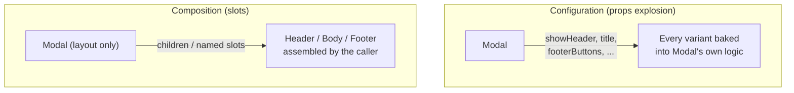
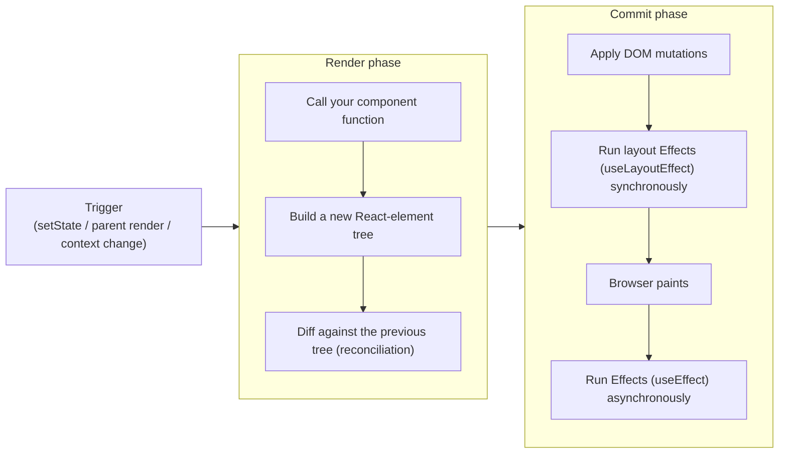
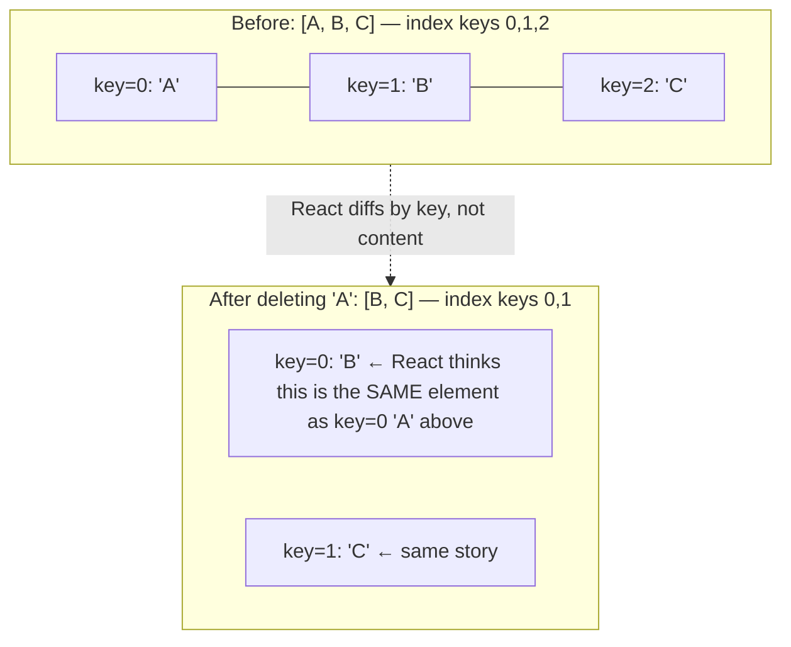
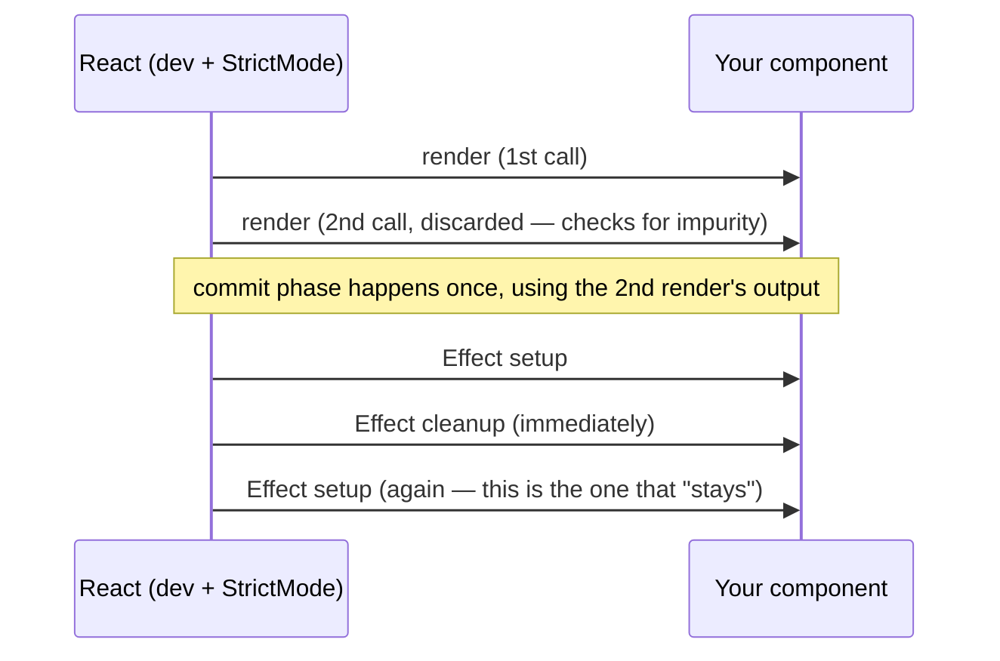

# Chapter 01: Foundations: JSX, Rendering & Components

**Status:** In Progress
**Folder:** `notes/01-foundations/`

## Why this chapter matters for a 5-10 YOE interview
Interviewers use this to check you can explain *why* React works the way it does, not just recite syntax you've used for years on autopilot. At this level nobody asks "what is JSX" directly — they ask things like "what actually happens when `setState` is called," "why did my list lose input focus on reorder," or "why does my Effect log twice in dev but not in prod" — and expect you to reason from the underlying model, not from memorized rules.

This chapter assumes you're already a fluent React user. The goal isn't to teach you JSX syntax you've typed thousands of times — it's to make the *mental model underneath* precise enough to survive "why" follow-ups.

---

## 1. JSX: syntax, expressions, and how it compiles

JSX is not part of the JavaScript language — it's syntax sugar that a compiler (Babel, TypeScript, or the Vite/esbuild/SWC toolchains) transforms into plain function calls before your code ever runs. This is a favorite "explain what's really happening" interview opener because it separates people who've memorized JSX rules from people who understand it's just function calls with nicer syntax.

```jsx
const el = <h1 className="title">Hello, {name}</h1>;
```

compiles to (the **classic transform**, what you'd have seen pre-React 17):

```js
const el = React.createElement("h1", { className: "title" }, "Hello, ", name);
```

or, with the **modern automatic JSX transform** (default since React 17, and what Vite's `@vitejs/plugin-react` uses today):

```js
import { jsx as _jsx } from "react/jsx-runtime";
const el = _jsx("h1", { className: "title", children: ["Hello, ", name] });
```

**Why the transform changed matters for interviews:** the classic transform required `React` to be in scope in *every* file using JSX — that's why old codebases have `import React from 'react'` at the top of files that never call `React.x` directly. The automatic transform imports `jsx`/`jsxs` from `react/jsx-runtime` for you, so that import is no longer required. If you see an ancient codebase with unused `React` imports, that's the classic transform's fingerprint, not dead code someone forgot to clean up.

```mermaid
flowchart LR
    jsx["JSX: &lt;h1&gt;Hello, {name}&lt;/h1&gt;"] -->|compiler: Babel / TS / SWC| call["Function call\njsx('h1', { children: [...] })"]
    call -->|returns| element["React element\n(plain JS object — a description, not a DOM node)"]
    element -->|React reconciles + commits| dom["Real DOM node"]
```

Either way, JSX **always evaluates to a plain JavaScript object** describing what you want (`{ type: 'h1', props: {...} }`, roughly) — it is not a DOM node and it does not render anything by itself. That object is inert data until React's reconciler processes it. This is the root fact that explains a lot of downstream behavior:

- Why you can store JSX in a variable, pass it as a prop, put it in an array, or `console.log` it and see a plain object.
- Why "conditionally rendering JSX" is really just "conditionally producing a value" — no different from any other JS expression.
- Why JSX expressions (`{...}`) can hold any valid JS expression, but **not statements** — `{if (x) {...}}` is illegal because `{}` in JSX is an *expression slot*, and `if` is a statement. This is why you reach for ternaries, `&&`, or early-return patterns instead (see §6).

**JSX syntax rules worth being precise about:**
- A component must return a **single root** — because you can't return two objects from a function without wrapping them (an array or a `<>...</>` Fragment). Fragments exist specifically to satisfy this without adding a wrapper DOM node.
- Component names **must** be capitalized. This isn't a style convention — it's how the compiler decides `<div>` means "create a `'div'` string type" (a host/DOM element) versus `<Profile>` meaning "look up the `Profile` variable and use it as the component". Lowercase custom names would compile to a string tag and silently fail to render your component.
- Attributes use `camelCase` (`className`, `onClick`, `htmlFor`) because they're JS object properties, not HTML attributes — `class` and `for` are reserved words in JS.

> **Interview framing:** if asked "how does JSX become the DOM," the strong answer chains all three steps — compiles to `createElement`/`jsx()` calls → produces a plain-object element tree → React's renderer (`react-dom`) walks that tree during commit and performs the actual DOM mutations. Conflating "JSX" with "the DOM" is the tell of someone who's used React without understanding it.

---

## 2. Functional components + hooks vs. class components

Modern React (and this whole curriculum) is functions + hooks. Classes are covered here only for the historical/interview context you're expected to have at senior level, and because **Error Boundaries still require a class** (`static getDerivedStateFromError` / `componentDidCatch` have no Hook equivalent — see ch.16).

**Why hooks won, mechanically, not just "the team preferred it":**
- **Reusable stateful logic without wrapper hell.** Before hooks, sharing stateful behavior between components meant Higher-Order Components or render props, both of which wrap your component tree in extra layers ("wrapper hell") and obscure prop origin (you often can't tell which HOC injected which prop just by reading the component). Custom Hooks let you extract `useSomething()` and call it directly — no extra component, no wrapping, props stay traceable to their source.
- **`this` binding footguns disappear.** Class methods needed manual binding (`this.handleClick = this.handleClick.bind(this)` in the constructor, or arrow-function class fields) or you'd get `this is undefined` at call time, because JS method references lose their receiver when passed around (detached from the object, e.g. `<button onClick={this.handleClick}>` — see ch.00's `this`-binding section for the underlying mechanism). Functions + hooks have no `this` at all for component logic.
- **Related logic can live together.** In a class, "subscribe on mount" lives in `componentDidMount` and "unsubscribe on unmount" lives in a *different* method, `componentWillUnmount` — related code is split by lifecycle name rather than by concern. `useEffect` lets setup and cleanup for the *same* concern sit in one place, and you can have multiple independent `useEffect` calls instead of cramming unrelated logic into one `componentDidMount`.
- **Smaller bundles, easier minification.** Functions generally minify better than classes with the constructor/method boilerplate, though this is a secondary benefit.

**What classes had that's genuinely gone:** no Hook replaces `getSnapshotBeforeUpdate` directly (rare enough not to matter for most apps), and — the one that actually comes up — **Error Boundaries are still class-only**, because catching render errors below you in the tree requires the `componentDidCatch`/`getDerivedStateFromError` contract, and React hasn't shipped a Hook-based equivalent.

> **Interview framing:** a common trap question is "can you replace all class components with hooks?" — the precise answer is "yes for everything except Error Boundaries," not a flat yes. Saying a flat "yes" is the tell that you haven't hit this in practice.

---

## 3. Props: passing, defaults, children, and composition over configuration

Props are read-only inputs from parent to child — this is the first "gotcha" interviewers probe: **props are immutable from the child's perspective.** A component must never reassign or mutate a prop; if a child needs to change something, the parent passes a callback prop down (state lives where it's owned, changes flow back up through functions the parent controls — this is "lifting state up," covered properly in ch.02).

**Default values** — the modern (React 16.3+) way is a JS default parameter, not `defaultProps`:

```jsx
function Button({ variant = "primary", children }) {
  return <button className={`btn btn-${variant}`}>{children}</button>;
}
```

`defaultProps` on function components is **deprecated** as of React 18.3 and its support was **removed entirely in React 19** — if you see it in a codebase, that's a signal it predates React 19 or hasn't been migrated. (`defaultProps` on *class* components is unaffected; this deprecation is function-component-specific.)

**`children` is just a prop** — nothing magic about it beyond being implicitly populated by whatever's nested between a component's JSX tags. `<Card><p>hi</p></Card>` is exactly equivalent to `<Card children={<p>hi</p>} />`. Once that clicks, a lot of composition patterns stop looking like special syntax and start looking like "just passing a value."

**Composition over configuration** is the idiomatic React answer to "how do I avoid a component with 15 boolean props controlling every possible variant." Compare:

```jsx
// Configuration: the component must know about every possible internal variation
<Modal showHeader showCloseButton title="Confirm" footerButtons={['Cancel', 'OK']} />

// Composition: the parent assembles the pieces; Modal just provides slots/layout
<Modal>
  <Modal.Header>Confirm</Modal.Header>
  <Modal.Body>Are you sure?</Modal.Body>
  <Modal.Footer><button>Cancel</button><button>OK</button></Modal.Footer>
</Modal>
```

The configuration version's prop surface grows without bound as new variants appear, and `Modal` has to understand every consumer's use case. The composition version pushes that knowledge back out to the call site — `Modal` only needs to know about layout, not content. `children` (and multiple named "slot" props, e.g. `<Layout sidebar={<Nav />} main={<Content />} />`) are the two building blocks that make this possible.



> **Interview framing:** "how would you design a component API for X" questions are almost always testing whether you reach for composition before configuration. A strong answer names the trade-off explicitly: configuration is easier to constrain (fewer ways to misuse it) but doesn't scale with variant count; composition scales better but gives callers more rope.

---

## 4. What triggers a render; render phase vs. commit phase

This is foundational vocabulary that ch.19 (React Internals: Fiber & Reconciliation) goes much deeper on — here, get the conceptual model and the terms right.

**What triggers a render** (i.e., what makes React call your component function again):
1. **State changes** — calling a `useState` setter or dispatching to a `useReducer` (with a value that's actually different — see the bail-out note below).
2. **Parent re-renders** — by default, when a parent component renders, React renders all of its children too, regardless of whether their own props changed (this is why `memo` exists — see ch.06).
3. **Context value changes** — components consuming a Context via `useContext` re-render when the Provider's value changes (ch.05).

Note what's **not** in that list: props changing on their own does nothing — a prop change only matters because it's the *parent* re-rendering and choosing to pass a new value down as part of #2.

**Render phase vs. commit phase** — React splits work into two conceptually distinct phases:



- **Render phase** is where your component function actually runs, computing what the UI *should* look like. This phase must be **pure** — no side effects, no DOM mutations — because React can start, throw away, and restart a render without warning (this is exactly what Strict Mode's double-invoke in dev is designed to catch, and it's also what makes concurrent features like `useTransition` safe — an in-progress render can be abandoned).
- **Commit phase** is where React actually touches the DOM to match what the render phase computed, then runs Effects. This phase is *not* interruptible the way render is.

**State updates don't apply synchronously and don't always cause a re-render** — two separate nuances that both come up as "gotcha" questions:
- Calling a setter schedules a re-render; the state variable in the *current* closure doesn't change immediately (`setCount(count + 1); console.log(count)` still logs the old value — same closure mechanics as ch.00's stale-closure section, applied to state).
- If you call `setState(x)` with a value `Object.is`-equal to the current state, React **bails out** and skips re-rendering that component entirely (this is why replacing an object/array with a new reference — not mutating in place — matters: `setUser({ ...user, name })` triggers a render because it's a new object identity; `user.name = name; setUser(user)` does **not**, because it's the same reference).

> **Interview framing:** "why does React batch state updates" and "why can't I mutate state directly" are really the same underlying question — React needs to compare *old vs. new* to decide whether to re-render at all, and batching multiple `setState` calls in one event handler into a single render pass is both a performance optimization and a correctness requirement (so you never see a UI reflecting only half of a set of related updates). React 18 made this automatic batching apply everywhere (promises, timeouts, native event handlers), not just inside React event handlers as in React 17 and earlier — worth naming explicitly since it's a real behavior change across versions.

---

## 5. Keys and lists: why they matter, and the index-as-key trap

When React reconciles a list, it needs to match each element in the *new* array to the corresponding element in the *old* array — to decide "this is the same logical item, just update it" versus "this is a new item, mount it" versus "this item is gone, unmount it." **Keys are how you tell React which is which.** Without a stable identity, React has no way to distinguish "the user reordered the list" from "the user deleted item 2 and created a brand-new item 2 with different content."

React's own docs frame it well: a key is like a filename — it lets React identify an item across renders even if its *position* in the array changes, because a well-chosen key carries more information than array position does.

**If you omit `key`, React uses the array index by default** — which works fine as long as the list never reorders, filters, or has items inserted/removed in the middle. The moment it does, index-as-key breaks matching:



Because `key=0` "is" the same element before and after in React's eyes, React reuses that DOM node and its component state — but the node now renders `B`'s content instead of `A`'s. If that list item is, say, a text input holding per-row draft text, **the input's state (what the user typed) stays attached to the DOM node at that position, not to the logical item** — so after deleting row A, row B visually inherits whatever the user had typed into row A. This is the canonical "index-as-key bug": not a crash, but *silently wrong state attached to the wrong row* — which is exactly why it's a favorite "explain this bug" interview scenario, because it produces no error and looks like a state-management bug rather than a keys bug.

**Rules for a good key:**
- Stable across renders (don't generate a new one — e.g. `Math.random()` or `crypto.randomUUID()` — during render; that defeats the purpose by making every render look like a full delete+recreate).
- Unique among siblings (uniqueness across *different* arrays doesn't matter).
- Prefer a real, stable identifier from your data (a database ID) over a synthetic one.

**When is index-as-key actually fine?** When the list is static and will never reorder, filter, or have items inserted/removed anywhere but the end — e.g. a fixed set of lines in a haiku. This is rare enough in real UIs that "prefer a stable ID" should be your default answer, with the static-list case named as the explicit exception rather than left implicit.

> **Interview framing:** don't just say "don't use index as key" — that's the memorized rule, not the understanding. Explain the *mechanism* (React matches old/new children by key to decide reuse-vs-recreate) and you can derive the correct answer for any variant of the question, including "is index-as-key ever fine" (yes, static lists) and "what about using the item's content itself as a key" (fine only if content is unique and doesn't change in a way that should be treated as a different item).

---

## 6. Conditional rendering patterns and their trade-offs

Because `{}` in JSX is an expression slot, "conditional rendering" is just "which expression do I put there" — there's no dedicated conditional-rendering syntax in React itself.

```jsx
// Ternary — good for "either A or B", especially inline
{isLoggedIn ? <Dashboard /> : <LoginPrompt />}

// && — good for "render this, or render nothing"
{errors.length > 0 && <ErrorBanner errors={errors} />}

// Early return — good when a whole component has a distinct "not ready" state
function Profile({ user }) {
  if (!user) return <Spinner />;
  return <ProfileCard user={user} />;
}

// Variable assignment — good when the condition is complex or reused
let content;
if (status === 'loading') content = <Spinner />;
else if (status === 'error') content = <ErrorBanner />;
else content = <Results data={data} />;
return <div>{content}</div>;
```

**The `&&` operator's classic footgun:** `&&` short-circuits and renders its *left* operand's falsy value if that's what's falsy — and `0` is falsy but **is a valid, renderable value** in JSX, unlike `false`, `null`, and `undefined`, which JSX simply doesn't render.

```jsx
{count && <span>{count} items</span>}
// if count is 0, this renders the literal "0" on screen, not nothing
```

The fix is to force a boolean: `{count > 0 && <span>...</span>}` or `{Boolean(count) && ...}`. This is a real bug that ships to production regularly and is a favorite "spot the bug" snippet for exactly that reason — see `interview-questions/explain-this-output/` for drilling this pattern once that folder is in use.

**Trade-offs, stated plainly:**
- Ternaries nest badly — a ternary-of-ternaries is a readability trap; prefer early returns or a variable once you're past two branches.
- `&&` is concise but hides the `0`/`NaN`/`''` footgun above.
- Early returns are the clearest for "this component has a few mutually-exclusive whole-output states" (loading/error/empty/success), but note that hooks must still be called unconditionally *before* any early return — you can't put a conditional early return above a `useState`/`useEffect` call (see the Rules of Hooks, which ch.02 covers in the context of `useState`/`useReducer` mechanics).

---

## 7. `createRoot`: the client rendering entry point

`createRoot` is the API that mounts a React tree into a real DOM node. It's worth being precise about its history for interviews: **`createRoot` is a React 18 API, not React 19-specific** — it replaced the legacy `ReactDOM.render()` to opt an app into React 18's concurrent-rendering capabilities. It remains the standard entry point unchanged in React 19/19.2; nothing about mounting itself changed in 19, only what you can do inside the tree (Actions, `use`, etc. — ch.07).

```jsx
import { createRoot } from "react-dom/client";
const root = createRoot(document.getElementById("root"));
root.render(<App />);
```

**Nuances worth knowing beyond the basic call:**
- `root.render()` clears any existing DOM content inside the container on the **first** call, then reconciles against the previous tree on subsequent calls — calling `render()` again on the same root preserves component state as long as the tree shape matches (this is what makes hot-reloading and manual re-renders at the root not blow away all state).
- `createRoot` accepts an options object for error handling — `onCaughtError`, `onUncaughtError`, `onRecoverableError` — which is the React 19-era mechanism for hooking custom error reporting (e.g. to Sentry) at the root level, replacing some of what used to require monkey-patching `console.error`.
- `root.render()` itself is not fully synchronous end-to-end — code immediately after `root.render()` can run before Effects have fired; reach for `flushSync` if you specifically need DOM updates to be flushed synchronously (rare, mostly relevant for measuring layout or third-party DOM integration — see ch.04).
- Once `root.unmount()` is called, that root cannot be reused — you'd need a new `createRoot` call.

> **Interview framing:** "what's the difference between `ReactDOM.render` and `createRoot`" is a legacy-knowledge check as much as a current-API check — the real answer is that `render` was synchronous-only and blocked concurrent features entirely, while `createRoot` is what makes automatic batching-everywhere, transitions, and Suspense-driven rendering possible. Knowing `createRoot` is an 18-era API (not 19-era) is a small but real precision signal.

---

## 8. Strict Mode: why effects/renders double-invoke in development

```jsx
<StrictMode>
  <App />
</StrictMode>
```

Strict Mode is a **development-only, opt-in wrapper** that adds extra checks and warnings; it does nothing in production builds and doesn't render any visible UI itself. Its entire purpose is to surface *impurity* — code that assumes "runs once" when React never actually promised that.

**What gets double-invoked in dev under Strict Mode, and in what order:**



Concretely, this double-invocation hits: your component function body (render logic), `useState`/`useReducer` initializer functions and updater functions, `useMemo` computations, and Effect setup+cleanup+setup (and the same setup+cleanup+setup pattern for callback refs). Class components get the equivalent treatment on `constructor`, `render`, and `shouldComponentUpdate`.

**Why:** React documents components as required to be pure functions of props/state — same inputs, same output, no side effects during render. If that's true, calling a function twice is a no-op from the outside (a pure function can't tell or care how many times it ran). If it's *not* true — say, a render function pushes to a module-level array, or an Effect opens a WebSocket connection without closing it in cleanup — running it twice makes the bug immediately visible in dev (duplicate array entries, two open connections) instead of only showing up later in production under conditions Strict Mode was specifically designed to preempt (e.g. React reusing/restoring component state after an Effect's cleanup ran, which concurrent rendering can legitimately do).

**What this is *not*:** it's not a performance regression to worry about in production (double-invocation is dev-only), and it's not React "being extra cautious for no reason" — every bug it surfaces is a bug that was always latent in your code; Strict Mode just makes it visible on every render instead of only under rare production timing.

> **Interview framing:** "why does my `useEffect` fire twice in development" is one of the most common confused-newcomer questions turned senior-interview question — the strong answer names the *mechanism* (setup→cleanup→setup, dev-only, designed to catch missing/incorrect cleanup) rather than just "oh that's normal, ignore it." If your Effect breaks under double-invocation, the Effect had a real bug (e.g. missing `clearInterval`/`unsubscribe` in the cleanup function) that would eventually have caused a leak in production too, just harder to spot.

---

## What you'll build
A small component tree (profile card + list) to practice props, composition, and keys — see [`exercises/README.md`](exercises/README.md) for the concrete problem set, with starter code in [`app/src/chapters/01-foundations/`](../../app/src/chapters/01-foundations/).

---
When you've worked through the notes and exercises, say so and this chapter's `revision.md` will get filled in and its status moved to `Done`.
