# Chapter 02: State & Events

**Status:** In Progress
**Folder:** `notes/02-state-and-events/`

## Why this chapter matters for a React interview
Chapter 01 explained what React *renders*. This chapter explains what makes it render again — and
its material comes up heavily in React interviews at the mid-to-senior level. "What does this log?"
questions about `setCount(count + 1)` called three times, "why is my state one step behind?",
"controlled or uncontrolled?", and "why didn't the UI update when I pushed into the array?" are all
*this* chapter. Each has a plausible-sounding wrong answer ("state updates are asynchronous") that a
candidate can carry for years without it ever visibly breaking anything, which is what makes them
useful questions to ask.

> Interview-frequency remarks like the one above are practical guidance based on how these topics
> tend to be probed — not verifiable facts about React. The technical claims in this chapter are
> cited; the interview advice is judgment, and is flagged as such wherever it appears in an
> **Interview framing** box.

The single mental model this chapter is built around, and the one worth being able to state
cleanly on demand:

1. **State lives outside your component**, in React — not in the function's local variables.
2. **A state variable is a snapshot**, fixed for the render that read it. It never changes
   mid-render, and it never changes inside an event handler that render created.
3. **A setter schedules an update**; React processes the queue and renders again.

Everything else here is a consequence of those three.

As in chapter 01, each section builds up from a plain-language "start here" explanation before
reaching interview-level precision. Concepts introduced in chapter 01 (component, render, props,
key, commit) are re-defined briefly where they're used, so this chapter stands on its own.

> **React version note:** these notes target modern React 19.x (currently 19.2, per
> `app/package.json`). Three historical deltas matter a lot in this chapter and are called out
> where they arise rather than assumed: **React 17** moved event delegation off `document` and
> removed event pooling; **React 18** made batching automatic everywhere (not just inside React
> event handlers); **React 19** added form Actions and `useActionState`, which change how you'd
> build a *form* specifically — those are covered in ch.07/ch.09, and this chapter deliberately
> teaches the underlying `useState` mechanics they're built on top of.

---

<a id="sec-0"></a>

## 0. What state is, and why a plain variable doesn't work

### Start here: the problem, in one broken example

Say you want a number on screen that goes up when you click. The obvious thing to try, using
what chapter 01 taught, is a normal JavaScript variable:

```jsx
function BrokenCounter() {
  let count = 0; // ❌ a plain local variable

  return (
    <button onClick={() => {
      count = count + 1;
      console.log(count); // logs 1, 2, 3... so the variable IS changing
    }}>
      Clicked {count} times
    </button>
  );
}
```

Click it. The console logs `1`, `2`, `3`. The screen keeps saying **"Clicked 0 times"** forever.
Two separate things are broken, and separating them is the whole point of this section:

1. **React never re-renders.** Chapter 01 established that the screen only changes when React
   calls your component function again and commits the result. Assigning to a local variable
   doesn't tell React anything, so React never re-runs `BrokenCounter`.
2. **Even if it did re-render, the value would reset.** `let count = 0` is a line *inside* the
   function. Every call to `BrokenCounter()` runs that line again and creates a brand-new
   `count` set back to `0`. Local variables die when a function returns — that's just how
   JavaScript functions work, not a React quirk.

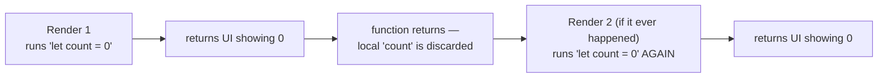

So a component needs something with **two properties a local variable doesn't have**: it must
*survive* between renders, and *changing it must tell React to re-render*. That pair of
properties is exactly what **state** is.

### `useState`, in plain terms

```jsx
import { useState } from 'react';

function Counter() {
  const [count, setCount] = useState(0);
  //     ^^^^^  ^^^^^^^^          ^
  //     |      |                 the value to use the very first time
  //     |      the function that tells React "make this the new value, and re-render"
  //     the current value, for this render

  return (
    <button onClick={() => setCount(count + 1)}>
      Clicked {count} times
    </button>
  );
}
```

`useState` is a **Hook** — a special function that lets a plain function component tap into
React features (chapter 01, [§2](../01-foundations/README.md#sec-2), covers what a Hook is and
the two Rules of Hooks: call them only at the top level, and only from a React function
component or a custom Hook). It returns an array of exactly two things, which you almost always
destructure: the current value, and a setter function.

The naming convention `[thing, setThing]` is universal in React code. It's array destructuring,
so the names are yours to pick, but don't get creative — every reader and every interviewer
expects `[count, setCount]`.

### Where state actually lives

This is the sentence that makes the rest of the chapter make sense. React's own docs put it
directly:

> "As a component's memory, state is not like a regular variable that disappears after your
> function returns. State actually 'lives' in React itself — as if on a shelf! — outside of your
> function."
> — [`learn/state-as-a-snapshot`](https://react.dev/learn/state-as-a-snapshot)

Your component function does **not** own `count`. React does. When React calls your component,
it hands you the current value; when you call the setter, you're asking React to update its own
copy and schedule another call.

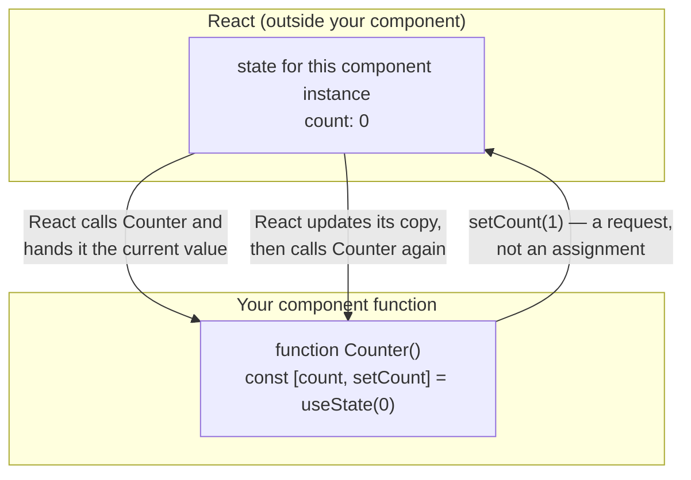

Two consequences fall straight out of this picture and are worth stating now, because they're
the source of most confusion later:

- **State is per component instance, not per component function.** Render `<Counter />` twice
  and you get two independent `count` values, because React keeps one shelf slot per position in
  the tree (this becomes very concrete in [§9](#sec-9)).
- **`setCount(1)` is not an assignment.** It's a message to React. The local `count` binding in
  the currently-running function is unaffected — it can't be, it's a `const` in a function that's
  already executing. That's [§2](#sec-2)'s entire subject.

> **Interview framing:** "Why can't you just use a regular variable instead of state?" is a
> warm-up question, and the weak answer is "because React needs state to re-render." That's half
> of it. The complete answer names **both** properties: a local variable neither *persists*
> across renders (it's re-initialized every call) nor *triggers* a render when changed. Saying
> both, and adding "state is stored by React outside the component, keyed to the component's
> position in the tree," is a noticeably stronger answer than the usual one.

---

<a id="sec-1"></a>

## 1. `useState` in depth: initial value, lazy initialization, and the bail-out

### The initial value is used *once*, then ignored forever

```jsx
function Greeting({ name }) {
  const [text, setText] = useState(`Hello, ${name}`);
  return <p>{text}</p>;
}
```

If the parent later re-renders `<Greeting name="Bob" />` after having rendered
`<Greeting name="Alice" />`, the text on screen **still says "Hello, Alice."** The argument to
`useState` is not "the value" — it's "the value to use when this component instance first
mounts." The docs are blunt about it:

> "This argument is ignored after the initial render."
> — [`reference/react/useState`](https://react.dev/reference/react/useState)

This is not a bug in `useState`; it's the intended behavior, and the pattern above (seeding state
from a prop) is a genuine anti-pattern with its own name — see [§8](#sec-8), "don't mirror props
in state."

### Lazy initial state: passing a function instead of a value

Look carefully at what actually executes here:

```jsx
function TodoList() {
  const [todos, setTodos] = useState(loadTodosFromLocalStorage()); // ⚠️
  // ...
}
```

`loadTodosFromLocalStorage()` runs on **every single render** — first render, and every re-render
after it. That's ordinary JavaScript: to pass its *result* as an argument, the call has to be
evaluated first. React then throws the result away on every render but the first, because of the
"ignored after the initial render" rule above. If that function is expensive (parsing a big
localStorage blob, generating a large array), you're paying for it on every keystroke.

The fix is to hand React the *function itself* rather than its result:

```jsx
const [todos, setTodos] = useState(loadTodosFromLocalStorage); // ✅ note: no ()
// or, when you need to pass arguments:
const [todos, setTodos] = useState(() => loadTodosFromLocalStorage('todos-v2'));
```

> "If you pass a function as `initialState`, it will be treated as an *initializer function*. It
> should be pure, should take no arguments, and should return a value of any type. React will
> call your initializer function when initializing the component, and store its return value as
> the initial state."
> — [`reference/react/useState`](https://react.dev/reference/react/useState)

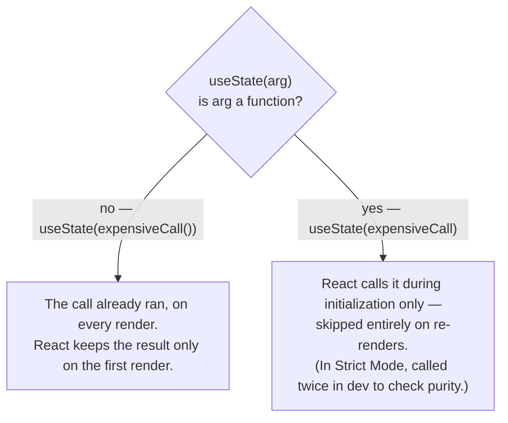

**The trap this creates:** what if the state you *want* to store is genuinely a function? Then
`useState(myFn)` would call it instead of storing it. Wrap it: `useState(() => myFn)`.

### The `Object.is` bail-out

Setting state to the value it already has does not necessarily cause a re-render:

> "If the new value you provide is identical to the current `state`, as determined by an
> `Object.is` comparison, React will **skip re-rendering the component and its children.** This
> is an optimization. Although in some cases React may still need to call your component before
> skipping the children, it shouldn't affect your code."
> — [`reference/react/useState`](https://react.dev/reference/react/useState)

Note carefully what that second sentence concedes: the bail-out is not a guarantee that your
component function won't run. React may call it once and then discard the result rather than
propagating work to children. So "setting the same value guarantees zero renders" is an
overclaim, and an interviewer who knows the docs may push on it.

`Object.is` compares values using JavaScript's **SameValue** semantics, which for objects and
functions means identity — the same reference, not an equivalent shape. (For primitives it matches
`===` except in two cases: `Object.is` treats `NaN` as equal to itself while `===` does not, and
`Object.is` treats `+0` and `-0` as distinct while `===` treats them as equal.) That identity
comparison produces the single most common "why didn't my UI update?" bug in React:

```jsx
const [user, setUser] = useState({ name: 'Ada', age: 36 });

function haveBirthday() {
  user.age = user.age + 1;   // ❌ same object — Object.is(user, user) is true
  setUser(user);             //    React bails out. Nothing on screen changes.
}

function haveBirthdayFixed() {
  setUser({ ...user, age: user.age + 1 }); // ✅ a NEW object — different reference
}
```

This is why immutability is not a style preference in React — it's load-bearing. Full treatment
in [§6](#sec-6).

### Three places a function can appear, meaning three different things

`useState` and its setter both accept functions, and they mean completely different things
depending on *where* the function sits. This trips people up often enough to be worth a table you
can recall directly:

| Written as | The function is | React calls it |
|---|---|---|
| `useState(() => initialValue)` | an **initializer** ([§1](#sec-1)) | once, during initialization (twice in Strict Mode dev) |
| `setState(prev => next)` | an **updater** ([§3](#sec-3)) | while processing the queue, at render time |
| `setState(() => someFunction)` | still an **updater** — one whose *return value* happens to be a function | it calls the outer arrow and stores what it returns, i.e. `someFunction` |

Note what the third row is and isn't. It's not a third category — it's the same updater mechanism,
used deliberately: React calls your arrow, the arrow returns `someFunction`, and *that* becomes the
state. Which is exactly why the wrapper is needed at all:

> "Because you're passing a function, React assumes that `someFunction` is an initializer function,
> and that `someOtherFunction` is an updater function, so it tries to call them and store the
> result. To actually *store* a function, you have to put `() =>` before them in both cases. Then
> React will store the functions you pass."
> — [`reference/react/useState`](https://react.dev/reference/react/useState)

So `setFn(someOtherFunction)` calls it and stores its return value; `setFn(() => someOtherFunction)`
stores the function itself. Same rule on the `useState` side, with "initializer" in place of
"updater."

### The setter has a stable identity

One small guarantee that pays off in later chapters:

> "The `set` function has a stable identity, so you will often see it omitted from Effect
> dependencies, but including it will not cause the Effect to fire."
> — [`reference/react/useState`](https://react.dev/reference/react/useState)

React returns the *same* setter function on every render of that component instance. So passing
`setCount` down as a prop won't defeat a child's `memo`, and omitting it from a `useEffect`
dependency array (ch.03) is safe. Contrast that with an inline arrow, which is a new function
identity every render — that distinction is the whole subject of `useCallback` in ch.06.

> **Interview framing:** two sub-questions hide in here and both come up. (1) "What's the
> difference between `useState(compute())` and `useState(compute)`?" — the first calls `compute`
> on every render and discards all but the first result; the second is a lazy initializer React
> only calls during initialization. (2) "Does calling a setter always re-render?" — no; React
> bails out on an `Object.is`-equal value, which is exactly why mutating an object in state and
> passing the same reference back does nothing. Adding "and the bail-out isn't an absolute
> guarantee — React may still call the component once before skipping its children" is a strong,
> docs-accurate detail.

---

<a id="sec-2"></a>

## 2. State as a snapshot — the most-tested idea in this chapter

### Start here: "state updates are asynchronous" is a misleading shorthand

You'll hear this constantly, and it produces wrong predictions. The problem isn't the word
*asynchronous* itself — React genuinely does schedule work, and state updates genuinely do interact
with async code, transitions, and concurrent rendering. The problem is using "it's asynchronous" as
the **explanation** for the behavior below, because that explanation predicts things that aren't
true: it suggests the value will arrive shortly if you wait for it, that `await` might help, or
that a `setTimeout` would see the fresh value. None of those hold.

Concretely, `setCount` isn't asynchronous in the sense that `fetch` is: it returns `undefined`, not
a Promise, so `await setCount(1)` doesn't wait for anything — `await` on a non-thenable just resumes
on the next microtask, long before React has necessarily rendered. There's no callback argument and
no "after it's applied" hook either. The accurate framing has two halves:

1. A setter **schedules an update** — it requests a future render; it does not assign to your
   local variable.
2. A state variable is a **snapshot**, fixed for the duration of the render that read it.

> "**A state variable's value never changes within a render,** even if its event handler's code
> is asynchronous."
> — [`learn/state-as-a-snapshot`](https://react.dev/learn/state-as-a-snapshot)

Worth connecting this to chapter 01 explicitly, because "schedules an update" is vague on its own.
Calling a setter never touches the DOM directly; it enters a pipeline whose far end is the commit
phase from ch.01 ([§4](../01-foundations/README.md#sec-4)):

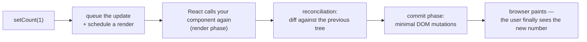

Everything in this chapter happens in the first two boxes. Everything in chapter 01 happens in the
last three.

### The puzzle every interviewer uses

```jsx
function Counter() {
  const [count, setCount] = useState(0);

  function handleClick() {
    setCount(count + 1);
    setCount(count + 1);
    setCount(count + 1);
  }

  return <button onClick={handleClick}>Count is {count}</button>;
}
```

**One click takes `count` from 0 to 1, not to 3.** If you can explain why in a way that never
uses the word "asynchronous," you're ahead of most candidates.

`count` is a `const` binding in the function call that produced the currently-displayed UI. On
the render where `count` is `0`, `handleClick` is a closure created during *that* render, and it
closed over `count = 0`. So the three lines are literally:

```jsx
setCount(0 + 1); // "make the next count 1"
setCount(0 + 1); // "make the next count 1"
setCount(0 + 1); // "make the next count 1"
```

Nothing reassigns `count` between the lines — nothing *can*, it's a `const` in a running
function. Three requests to set the next value to `1` produce a next value of `1`.

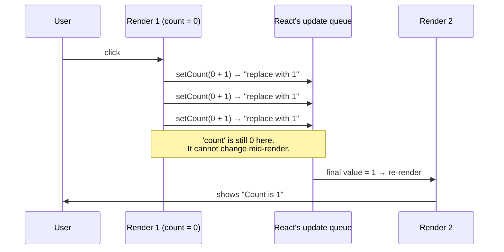

### Every render has its own everything

The deeper version of this idea: each render is a separate function call, so each render gets its
own `count`, its own `handleClick`, its own props, its own event handlers. They don't share
variables — they share only the state React holds on the shelf.

```jsx
function Counter() {
  const [count, setCount] = useState(0);

  function handleClick() {
    setCount(count + 1);
    setTimeout(() => {
      alert(count); // which value?
    }, 3000);
  }

  return <button onClick={handleClick}>{count}</button>;
}
```

Click once, then click three more times quickly. Three seconds later the alert says **`0`** —
not the current on-screen value. The `setTimeout` callback closed over the `count` from the
render that created it.

> "The state stored in React may have changed by the time the alert runs, but it was scheduled
> using a snapshot of the state at the time the user interacted with it!"
> — [`learn/state-as-a-snapshot`](https://react.dev/learn/state-as-a-snapshot)

This is not React being weird — it's ordinary JavaScript closure behavior (ch.00's
[`javascript/README.md`](../00-javascript-and-browser-fundamentals/javascript/README.md) covers
closures from scratch if that mechanism isn't rock-solid). React just makes the consequence very
visible, because React calls your function many times and each call makes new closures.

React frames the resulting guarantee as a *feature*:

> "**React keeps the state values 'fixed' within one render's event handlers.** You don't need to
> worry whether the state has changed while the code is running."
> — [`learn/state-as-a-snapshot`](https://react.dev/learn/state-as-a-snapshot)

That's genuinely valuable: an event handler that reads `count` in five places is guaranteed to
see the same `count` in all five, with no possibility of a half-updated read partway through.

> **Interview framing:** when asked "why doesn't the state update immediately?", don't lead with
> "it's asynchronous" — it's the answer that sounds right and explains nothing. Say this instead:
> *"A state variable is a snapshot for the render that read it. `setCount` doesn't assign to that
> variable — it can't, it's a `const` in a function that's already running — it schedules the next
> render. Reading `count` right after calling `setCount` reads the old snapshot by definition, and
> so does any closure that render created, including a `setTimeout` callback."* Then, if pushed on
> how to get the up-to-date value, go to [§3](#sec-3) — updater functions — rather than reaching
> for a ref or an Effect. A good bonus, if the interviewer used the word first: note that the
> setter returns `undefined`, not a Promise, so `await`ing it is a no-op — which is exactly why
> "asynchronous" is a misleading label for it.

---

<a id="sec-3"></a>

## 3. Queueing updates: updater functions

### Start here: telling React *how* to update instead of *what* to set

[§2](#sec-2)'s three `setCount(count + 1)` calls all said "replace the value with 1." Sometimes
what you actually mean is "add one to whatever's there when you get around to it." React lets you
say that by passing a **function** to the setter instead of a value:

```jsx
function handleClick() {
  setCount(c => c + 1);
  setCount(c => c + 1);
  setCount(c => c + 1);
}
```

**This does go 0 → 3.** The function you pass is an **updater function**: it receives the pending
state and returns the next state.

> "If you would like to update the same state variable multiple times before the next render,
> instead of passing the *next state value* like `setNumber(number + 1)`, you can pass a
> *function* that calculates the next state based on the previous one in the queue, like
> `setNumber(n => n + 1)`. It is a way to tell React to 'do something with the state value'
> instead of just replacing it."
> — [`learn/queueing-a-series-of-state-updates`](https://react.dev/learn/queueing-a-series-of-state-updates)

### How React processes the queue

Each setter call appends an entry to a queue for that state variable. At the next render, React
walks the queue from the current value:

- A **plain value** adds `"replace with X"` — it discards whatever the queue computed so far.
- An **updater function** adds `"apply this function to the running result."`

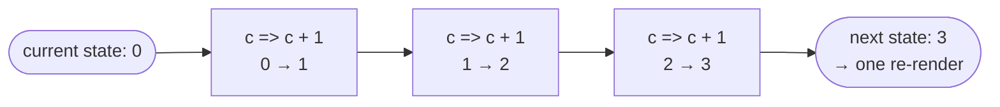

Versus the plain-value version from [§2](#sec-2):

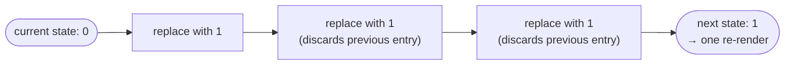

Note that in this example **both** versions are batched into a single re-render — the difference is
purely in the resulting value. Batching ([§4](#sec-4)) is about how
many renders happen; updater functions are about what value you end up with. Interviewers
sometimes conflate them, and separating the two cleanly is a good signal.

### Mixing plain values and updaters

This is a favorite "what does this output" question. Starting from `number = 0`:

```jsx
setNumber(number + 5);   // queue: "replace with 5"
setNumber(n => n + 1);   // queue: "replace with 5", then "n => n + 1"
// final: 6
```

```jsx
setNumber(number + 5);   // "replace with 5"
setNumber(n => n + 1);   // "n => n + 1"  → 6
setNumber(42);           // "replace with 42" — discards everything above
// final: 42
```

> "**Any other value** (e.g. number `5`) adds 'replace with `5`' to the queue, ignoring what's
> already queued."
> — [`learn/queueing-a-series-of-state-updates`](https://react.dev/learn/queueing-a-series-of-state-updates)

Reading `setNumber(number + 5)` as *"replace with 5"* rather than *"add 5"* is the trick to
getting these right every time: React evaluated `number + 5` immediately, using this render's
snapshot, and queued the resulting number.

### Naming convention

React's docs name three acceptable conventions, in order of how common they are:

1. First letters of the state variable: `setEnabled(e => !e)`, `setFriendCount(fc => fc * 2)`.
2. The full state variable name: `setEnabled(enabled => !enabled)`.
3. A `prev` prefix: `setEnabled(prevEnabled => !prevEnabled)`.

Any of the three is fine; be consistent within a codebase.

### Updater functions must be pure

An updater function is called by React during rendering, so it's bound by the same purity rules
as a component body (ch.01, [§2](../01-foundations/README.md#sec-2)): compute and return the next
state, don't perform side effects, don't mutate anything outside itself.

React enforces this the same way it enforces component purity — by double-invoking in
development:

> "In Strict Mode, React will **call your updater function twice** in order to help you find
> accidental impurities. This is development-only behavior and does not affect production. If
> your updater function is pure (as it should be), this should not affect the behavior. The
> result from one of the calls will be ignored."
> — [`reference/react/useState`](https://react.dev/reference/react/useState)

The same applies to lazy initializer functions from [§1](#sec-1). So this is a real bug that
Strict Mode will surface:

```jsx
setItems(prev => {
  prev.push(newItem);  // ❌ impure: mutates, and gets applied twice in Strict Mode
  return prev;         // ❌ and returns the same reference — Object.is bail-out too
});

setItems(prev => [...prev, newItem]); // ✅ pure: returns a new array
```

### When to use which

| Situation | Use |
|---|---|
| Multiple updates to the same state in one handler | **Updater** — `setCount(c => c + 1)` |
| The new value is computed from the current value | **Updater** — safest default |
| Updating from an async callback (`setTimeout`, `await`, a subscription) **when the next value depends on the previous one** | **Updater** — that render's snapshot is stale by the time the callback runs |
| Setting a value that doesn't depend on the old one (`setName(inputValue)`) | Plain value is fine and reads better |

A reasonable rule to state in an interview: *"If the next value depends on the previous value,
use an updater. If it doesn't, either is fine."*

> **Interview framing:** the classic pairing is "walk me through `setCount(count + 1)` three
> times versus `setCount(c => c + 1)` three times." The complete answer covers: the result (1 vs
> 3), the mechanism (snapshot/closure vs. a queue applied at render time), *and* the fact that
> both cause exactly one re-render, since the batching question is usually the follow-up. A
> frequent follow-up after that is "so should I always use the updater form?" — the honest answer
> is that it's the safe default whenever the next value derives from the previous one, but
> `setName(e.target.value)` doesn't need it and reads worse with it.

---

<a id="sec-4"></a>

## 4. Batching, automatic batching (React 18), and `flushSync`

### Start here: what batching is

**Batching** is React grouping multiple state updates into a single re-render.

> "React waits until *all* code in the event handlers has run before processing your state
> updates. This is why the re-render only happens *after* all these `setNumber()` calls... This
> behavior, also known as **batching**, makes your React app run much faster. It also avoids
> dealing with confusing 'half-finished' renders where only some of the variables have been
> updated."
> — [`learn/queueing-a-series-of-state-updates`](https://react.dev/learn/queueing-a-series-of-state-updates)

```jsx
function handleClick() {
  setCount(c => c + 1);
  setName('Ada');
  setIsOpen(true);
  // Three different state variables updated. ONE re-render, not three.
}
```

Think of it as a waiter taking the whole table's order before walking to the kitchen, rather than
making three trips.

Note both benefits named in that quote — performance is the headline, but avoiding
"half-finished" renders where `count` has updated and `name` hasn't is the correctness-flavored
one. (Chapter 01's notes deliberately frame batching as a *performance* optimization rather than
a correctness requirement, matching React's own emphasis; the consistency benefit is real but
secondary.)

### What React 18 changed

Before React 18, React only batched updates that originated inside React event handlers.
Anything else — a `setTimeout` callback, a `.then()`, a native `addEventListener` handler —
re-rendered once per setter call.

> "Batching is when React groups multiple state updates into a single re-render for better
> performance. Without automatic batching, we only batched updates inside React event handlers.
> Updates inside of promises, setTimeout, native event handlers, or any other event were not
> batched in React by default. With automatic batching, these updates will be batched
> automatically:
>
> ```js
> // Before: only React events were batched.
> setTimeout(() => {
>   setCount(c => c + 1);
>   setFlag(f => !f);
>   // React will render twice, once for each state update (no batching)
> }, 1000);
>
> // After: updates inside of timeouts, promises,
> // native event handlers or any other event are batched.
> setTimeout(() => {
>   setCount(c => c + 1);
>   setFlag(f => !f);
>   // React will only re-render once at the end (that's batching!)
> }, 1000);
> ```"
> — [React 18 release post](https://react.dev/blog/2022/03/29/react-v18)

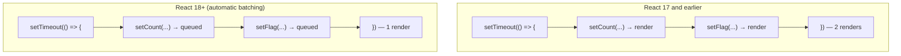

The one caveat worth knowing: automatic batching applies to apps mounted with
`createRoot` (chapter 01, [§7](../01-foundations/README.md#sec-7)). A React 18+ app still using
the legacy `ReactDOM.render` entry point kept the old behavior — which is moot in React 19, where
legacy `render` was removed outright, but is exactly the kind of thing an interviewer with a
half-migrated codebase will ask about.

### What batching does *not* do

**React does not batch across separate user interactions.**

> "**React does not batch across *multiple* intentional events like clicks** — each click is
> handled separately. Rest assured that React only does batching when it's generally safe to do.
> This ensures that, for example, if the first button click disables a form, the second click
> would not submit it again."
> — [`learn/queueing-a-series-of-state-updates`](https://react.dev/learn/queueing-a-series-of-state-updates)

And batching doesn't change the snapshot rule from [§2](#sec-2). Batching is about *how many
renders* happen; the snapshot is about *what value you read*. Two separate mechanisms that
people routinely fuse into one vague answer.

### Opting out: `flushSync`

Occasionally you need the DOM updated *now*, synchronously — most often to measure or scroll to
something that only exists after the update.

```jsx
import { flushSync } from 'react-dom';

function handleAdd() {
  flushSync(() => {
    setItems([...items, newItem]);   // committed to the DOM before flushSync returns
  });
  listRef.current.lastChild.scrollIntoView(); // the new node exists now
}
```

> "`flushSync` lets you force React to flush any updates inside the provided callback
> synchronously. This ensures that the DOM is updated immediately."
>
> "Using `flushSync` is uncommon and can hurt the performance of your app... Use `flushSync` as
> last resort." It "may force pending Suspense boundaries to show their `fallback` state."
> — [`reference/react-dom/flushSync`](https://react.dev/reference/react-dom/flushSync)

Knowing it exists is a plus; reaching for it casually is a minus. If an interviewer asks "how do
you opt out of batching," naming `flushSync` *and* immediately noting that it's a last resort
which can hurt performance and trip Suspense fallbacks is the complete answer.

> **Interview framing:** "What is batching, and what changed in React 18?" is a common question at
> this experience level. Hit four beats: (1) batching = multiple state
> updates → one re-render; (2) pre-18, only inside React event handlers; (3) React 18's automatic
> batching extended it to timeouts, promises, and native handlers, tied to `createRoot`; (4)
> React still doesn't batch across separate user interactions, and `flushSync` is the deliberate
> escape hatch. If you can also separate "batching (how many renders)" from "snapshots (what
> value you read)" without being prompted, that's the senior-level distinction.

---

<a id="sec-5"></a>

## 5. Events: handlers, the React event object, delegation, and propagation

### Start here: attaching a handler

You attach event handlers by passing a function to a JSX prop named `on` + the event name in
camelCase:

```jsx
<button onClick={handleClick}>Click me</button>
<input onChange={handleChange} onFocus={handleFocus} />
<form onSubmit={handleSubmit}>...</form>
```

By convention the function is named `handleSomething` when it's a handler, and a prop that
*accepts* a handler is named `onSomething` — so a custom component takes `onClick` and its parent
passes `handleClick`.

### Pass the function; don't call it

The most common beginner error, and still worth being precise about because it also shows up in a
subtler form:

| ✅ Passing a function | ❌ Calling a function |
|---|---|
| `<button onClick={handleClick}>` | `<button onClick={handleClick()}>` |
| `<button onClick={() => alert('hi')}>` | `<button onClick={alert('hi')}>` |

> "In the first example, the function is passed as an event handler. In the second, the `()` fires
> the function **immediately during rendering**, without any clicks. This is because JavaScript
> inside JSX curly braces executes right away."
> — [`learn/responding-to-events`](https://react.dev/learn/responding-to-events)

The failure mode is worse than "nothing happens": if that call sets state, you've created an
infinite render loop — render calls the setter, the setter schedules a render, that render calls
the setter again.

### Passing arguments to a handler

Because you must pass a function rather than call one, passing an argument means wrapping it in
an arrow function:

```jsx
{items.map(item => (
  <button key={item.id} onClick={() => handleDelete(item.id)}>
    Delete
  </button>
))}
```

The arrow function is the handler; calling `handleDelete(item.id)` is its *body*, which runs on
click. If you need the event object too, take it as the arrow's parameter and pass it along:

```jsx
<button onClick={(e) => handleDelete(e, item.id)}>Delete</button>
```

**On the "inline arrow functions hurt performance" objection:** creating a small closure per row
per render is cheap, and this is the idiomatic pattern React's own docs use. It matters only when
the child is `memo`-wrapped and a new function identity defeats the memoization — a real concern,
but a chapter-06 one, and premature to optimize for here. Being able to say "it's a non-issue
unless it's breaking a `memo` boundary" is a better answer than either "never do it" or "it never
matters."

### The React event object ("SyntheticEvent")

Your handler receives one argument: React's event object.

> "Your event handlers will receive a *React event object.* It is also sometimes known as a
> 'synthetic event'... It conforms to the same standard as the underlying DOM events, but fixes
> some browser inconsistencies."
> — [`reference/react-dom/components/common`](https://react.dev/reference/react-dom/components/common)

So it's a cross-browser-normalized wrapper with the standard DOM event API (`target`,
`currentTarget`, `preventDefault()`, `stopPropagation()`, and so on). If you need the raw browser
event, it's on `e.nativeEvent` — and the mapping isn't always one-to-one:

> "Some React events do not map directly to the browser's native events. For example in
> `onMouseLeave`, `e.nativeEvent` will point to a `mouseout` event. The specific mapping is not
> part of the public API and may change in the future."
> — [`reference/react-dom/components/common`](https://react.dev/reference/react-dom/components/common)

`e.target` vs. `e.currentTarget` is worth having straight, since it's asked as a quick check:

- **`e.target`** — the element the event was originally dispatched on. MDN defines it as "a
  reference to the object onto which the event was dispatched"
  ([`Event.target`](https://developer.mozilla.org/en-US/docs/Web/API/Event/target)) — note that's
  the *origin* of the event, not "the deepest element in the tree"; depth is a useful intuition
  while an event bubbles, but it isn't the definition.
- **`e.currentTarget`** — the element whose handler is currently executing.

The two diverge precisely when propagation is involved — MDN, on `target`: "It is different from
`Event.currentTarget` when the event handler is called during the bubbling or capturing phase of
the event." During the target phase itself they're the same element.

Concretely, clicking a `<span>` inside a `<button>` inside a `<div>` with handlers on all three:
`e.target` is the `<span>` in all three handlers, while `e.currentTarget` is a different element in
each. That gap is exactly what makes event delegation work — one listener on a parent, handling
events from many children.

**Version note — event pooling is gone.** In React 16 and earlier, event objects were pooled and
recycled: reading `e.target` inside a `setTimeout` gave you `null` unless you first called
`e.persist()`. React 17 removed this.

> "The old event pooling optimization has been fully removed, so you can read the event fields
> whenever you need them."
> — [React v17 release post](https://legacy.reactjs.org/blog/2020/08/10/react-v17-rc.html)

`e.persist()` still exists but does nothing. Interviewers who learned React pre-17 sometimes still
ask about pooling; knowing it's been dead since React 17 is the right answer, and it's a rare
chance to correct an interviewer politely.

### Delegation: where React actually attaches listeners

React does **not** attach a real DOM listener to every element with an `onClick`. It attaches a
small number of listeners at the root and dispatches from there — classic event delegation. The
docs confirm this in passing while explaining a caveat:

> "The values of `currentTarget`, `eventPhase`, `target`, and `type` reflect the values your React
> code expects. Under the hood, React attaches event handlers at the root, but this is not
> reflected in React event objects."
> — [`reference/react-dom/components/common`](https://react.dev/reference/react-dom/components/common)

**Version note — where "the root" is.** Through React 16, delegation happened at `document`.
React 17 moved it to the root container element:

> "React will no longer attach event handlers at the `document` level. Instead, it will attach
> them to the root DOM container [into which your React tree is rendered]."
> — [React v17 release post](https://legacy.reactjs.org/blog/2020/08/10/react-v17-rc.html)

The motivation was gradual upgrades — with `document`-level delegation, two React versions on one
page fought over events, and `e.stopPropagation()` in the inner tree couldn't stop the outer one.

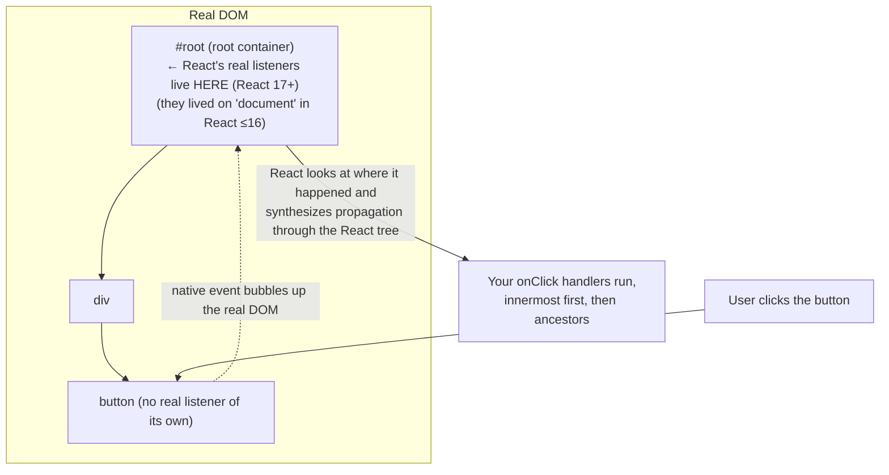

The practical consequence that trips people up: **React's synthetic propagation follows the React
component tree, and a `document`-level native listener you added yourself sees the event only
after React's root has already handled it.** Mixing `stopPropagation()` between React handlers and
hand-written `addEventListener` calls is where this bites.

### Propagation: bubbling, capture, `stopPropagation` vs. `preventDefault`

> "Event handlers will also catch events from any children your component might have. We say that
> an event 'bubbles' or 'propagates' up the tree: it starts with where the event happened, and
> then goes up the tree."
> — [`learn/responding-to-events`](https://react.dev/learn/responding-to-events)

```jsx
<div onClick={() => alert('div')}>
  <button onClick={() => alert('button')}>Click</button>
</div>
// Clicking the button alerts "button", then "div".
```

Three phases, exactly as in the DOM:

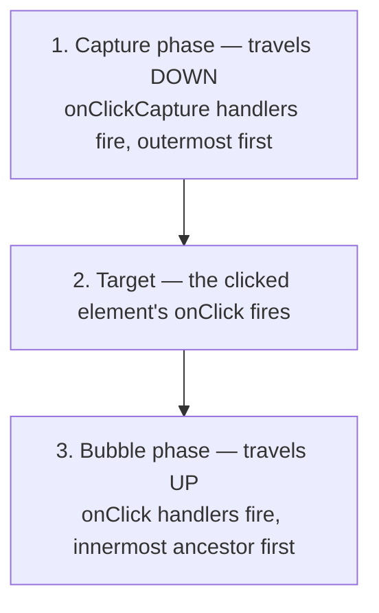

- **`e.stopPropagation()`** — "Stops the event handlers attached to parent tags from firing."
- **`e.preventDefault()`** — "Prevents the default browser behavior for events that have it."

They are unrelated, and mixing them up is a common interview stumble. `preventDefault` on a form's
`onSubmit` stops the full-page reload; it has nothing to do with propagation. `stopPropagation` on
a modal's backdrop-click handler stops the click reaching an ancestor; it has nothing to do with
default behavior.

```jsx
function SearchForm({ onSearch }) {
  function handleSubmit(e) {
    e.preventDefault();          // without this, the browser reloads the page
    onSearch(new FormData(e.currentTarget).get('q'));
  }
  return (
    <form onSubmit={handleSubmit}>
      <input name="q" />
      <button type="submit">Search</button>
    </form>
  );
}
```

Two exceptions worth memorizing:

- **`onScroll` does not propagate.** "All events propagate in React except `onScroll`, which only
  works on the JSX tag you attach it to."
  ([`learn/responding-to-events`](https://react.dev/learn/responding-to-events)). React 17
  deliberately aligned this with the browser, where `scroll` on an element doesn't bubble.
- **`onFocus`/`onBlur` *do* bubble in React**, even though the native `focus`/`blur` events don't.
  React implements them with the native `focusin`/`focusout` events, which do bubble. This is
  genuinely useful — it's how you detect focus entering or leaving a whole subtree without
  attaching handlers to every field.

**Capture-phase handlers** are the escape hatch when a child stops propagation:

```jsx
<div onClickCapture={() => logAnalytics()}>
  <button onClick={e => e.stopPropagation()}>Stop</button>
</div>
// logAnalytics() still runs — capture handlers fire on the way DOWN,
// before the button's handler gets a chance to stop anything.
```

> **Interview framing:** "What is a SyntheticEvent, and why does React use one?" has a two-part
> answer: it's a cross-browser-normalized wrapper conforming to the DOM event standard, and React
> uses delegation at the root rather than per-element listeners. Then land the two version deltas
> unprompted, because they're what separate a memorized answer from a current one: **event
> pooling was removed in React 17** (so `e.persist()` is obsolete), and **delegation moved from
> `document` to the root container in React 17** (to make multiple React versions on one page
> safe). A very common follow-up is `stopPropagation` vs. `preventDefault` — have a concrete
> example of each ready, not just definitions.

---

<a id="sec-6"></a>

## 6. Immutability: updating objects and arrays held in state

### Start here: why mutation "does nothing"

[§1](#sec-1) showed the mechanism — `Object.is` sees the same reference and React bails out. The
docs frame it as a rule about how you should treat state:

> "React has no idea that object has changed. So React does not do anything in response... While
> mutating state can work in some cases, we don't recommend it. **You should treat the state value
> you have access to in a render as read-only.**"
> — [`learn/updating-objects-in-state`](https://react.dev/learn/updating-objects-in-state)

Note "can work in some cases" — that's the dangerous part. A mutation often *appears* to work
because some *other* state update re-renders the component moments later and picks up the mutated
object. So the bug shows up as "the UI updates one click late" or "it works, but only when I also
type in the search box," which is far harder to diagnose than a clean failure.

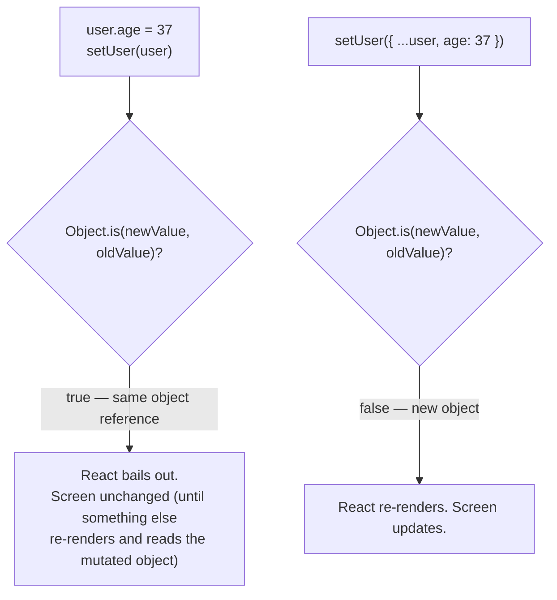

### First: a `useState` setter **replaces**, it doesn't merge

Before the spread patterns make sense, one thing has to be explicit, because it's the other half of
why you spread at all:

```jsx
const [person, setPerson] = useState({ name: 'Ada', age: 36 });

setPerson({ name: 'Grace' });
// person is now { name: 'Grace' } — `age` is GONE, not preserved.
```

The setter swaps in whatever value you hand it. It does not merge your object into the existing
one. So `{ ...person, name: 'Grace' }` isn't ceremony for React's benefit — the spread is how you
carry the other fields forward, and dropping it silently deletes them.

This is a genuine behavioral difference from class components, and it's a fair interview question
for anyone who might touch legacy code. Class `setState` **does** merge:

> "If you pass an object as `nextState`, it will be **shallowly merged into `this.state`.**"
> — [`reference/react/Component`](https://react.dev/reference/react/Component)

So `this.setState({ name: 'Grace' })` in a class leaves `age` intact, while the identical-looking
`setPerson({ name: 'Grace' })` in a function component throws it away. Same for arrays and any
other value: `useState` replaces, always.

### Objects: spread, and the shallow-copy trap

```jsx
const [person, setPerson] = useState({
  name: 'Ada',
  artwork: { title: 'Analytical Engine', city: 'London' },
});

// ✅ top-level field
setPerson({ ...person, name: 'Ada L.' });

// ❌ nested field — the shallow copy shares the SAME nested object
const next = { ...person };
next.artwork.city = 'Paris';   // next.artwork IS person.artwork — you just mutated state
setPerson(next);

// ✅ nested field, done properly — spread at every level you're changing
setPerson({
  ...person,
  artwork: { ...person.artwork, city: 'Paris' },
});
```

> "Note that the `...` spread syntax is 'shallow' — it only copies things one level deep. This
> makes it fast, but it also means that if you want to update a nested property, you'll have to
> use it more than once."
> — [`learn/updating-objects-in-state`](https://react.dev/learn/updating-objects-in-state)

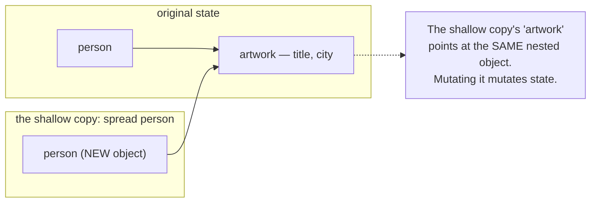

### Arrays: which methods are safe

The rule is identical — treat arrays in state as read-only — but arrays make it easy to slip,
because JavaScript's array methods are split roughly half-and-half between mutating and
non-mutating, with no naming pattern to tell them apart. React's own table:

| Operation | Avoid (mutates) | Prefer (returns a new array) |
|---|---|---|
| Adding | `push`, `unshift` | `concat`, `[...arr]` spread syntax |
| Removing | `pop`, `shift`, `splice` | `filter`, `slice` |
| Replacing | `splice`, `arr[i] = ...` assignment | `map` |
| Sorting | `reverse`, `sort` | copy the array first |

> — [`learn/updating-arrays-in-state`](https://react.dev/learn/updating-arrays-in-state)

```jsx
// add
setTodos([...todos, newTodo]);                 // append
setTodos([newTodo, ...todos]);                 // prepend

// remove
setTodos(todos.filter(t => t.id !== id));

// replace one item
setTodos(todos.map(t => (t.id === id ? { ...t, done: true } : t)));

// insert at an index
setTodos([...todos.slice(0, i), newTodo, ...todos.slice(i)]);

// sort
setTodos([...todos].sort((a, b) => a.text.localeCompare(b.text)));
```

Two specific traps in that table:

1. **`slice` vs. `splice`.** React's docs flag this explicitly: "`slice` lets you copy an array or
   a part of it. `splice` **mutates** the array." One letter apart, opposite safety. In React you
   want `slice` (no `p`) almost every time.
2. **`sort` and `reverse` mutate in place** and return the same array reference — so
   `setTodos(todos.sort(...))` mutates the array already in state *and* hands the setter that same
   reference back, so `Object.is` sees no change and React can bail out of the re-render. Copy
   first.
   (Modern JS also has non-mutating `toSorted`/`toReversed`/`with`/`toSpliced`, available in
   current browsers and in Node 20+; `[...arr].sort()` remains the maximally-compatible form.)

**Copying an array is also shallow:**

> "Even if you copy an array, you can't mutate existing items *inside* of it directly. This is
> because copying is shallow — the new array will contain the same items as the original one."
> — [`learn/updating-arrays-in-state`](https://react.dev/learn/updating-arrays-in-state)

```jsx
const nextList = [...list];
nextList[0].seen = true;  // ❌ still mutates list[0] — same object
setList(nextList);

setList(list.map((item, i) => (i === 0 ? { ...item, seen: true } : item))); // ✅
```

### Local mutation is fine

Immutability applies to values *already in state*, not to every object you touch:

> "Mutation is only a problem when you change *existing* objects that are already in state.
> Mutating an object you've just created is okay because *no other code references it yet*...
> This is called a 'local mutation'. You can even do local mutation while rendering."
> — [`learn/updating-objects-in-state`](https://react.dev/learn/updating-objects-in-state)

```jsx
const next = {};        // brand new, nothing else references it
next.x = e.clientX;     // ✅ local mutation
next.y = e.clientY;
setPosition(next);
```

### Immer, for deeply nested state

When nested spreads get unreadable, the docs' recommended shortcut is Immer:

> "Immer is a popular library that lets you write using the convenient but mutating syntax and
> takes care of producing the copies for you."
> — [`learn/updating-objects-in-state`](https://react.dev/learn/updating-objects-in-state)

```jsx
import { useImmer } from 'use-immer';

const [person, updatePerson] = useImmer({ /* deeply nested */ });
updatePerson(draft => { draft.artwork.city = 'Paris'; }); // looks like mutation, isn't
```

The `draft` is a Proxy that records what you did and produces a new object from it. Worth knowing
by name — but the stronger interview instinct is the docs' *first* suggestion: **if state is
deeply nested, consider flattening it** ([§8](#sec-8)) rather than reaching for a library to make
deep updates tolerable.

> **Interview framing:** "Why does React require immutable state updates?" — the mechanically
> precise answer is that React compares the new value to the old with `Object.is`, so a mutated
> object is reference-identical and React bails out of re-rendering. Two things elevate the
> answer: noting that mutation is *worse* than a clean failure because it often half-works (a
> later unrelated render picks up the mutated object, producing "my UI is one update behind"),
> and naming the downstream dependencies — `memo`, `useMemo`, `useCallback`, and `useEffect`
> dependency arrays (ch.03/06) are all reference comparisons too, so mutation silently defeats
> the whole memoization system, not just this one re-render.

---

<a id="sec-7"></a>

## 7. Controlled vs. uncontrolled inputs

### Start here: who owns the value?

A text input has a value. Two things could be the authority on what it is: the **DOM node
itself**, or **React state**. That choice is the entire controlled/uncontrolled distinction.

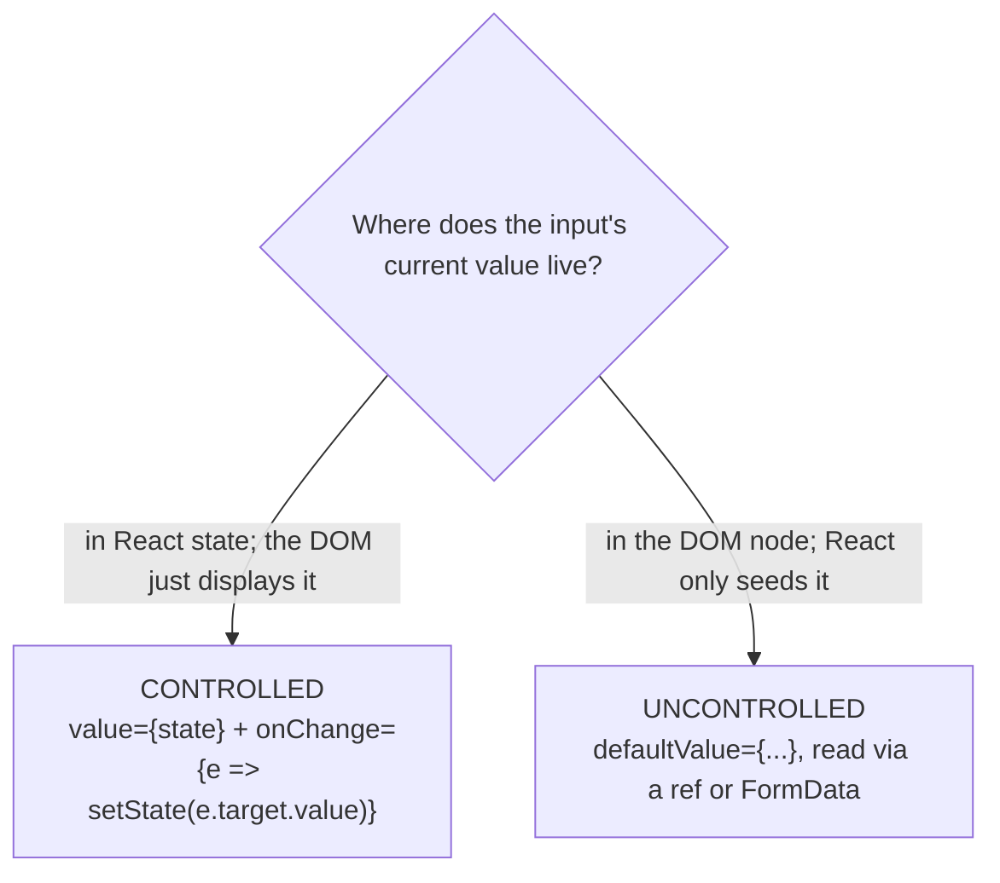

### Controlled inputs

```jsx
function NameField() {
  const [name, setName] = useState('');

  return (
    <input
      value={name}                              // React state is the source of truth
      onChange={e => setName(e.target.value)}   // every keystroke flows through state
    />
  );
}
```

Every keystroke: `onChange` fires → `setName` schedules a render → the render passes the new
`value` down → the DOM node displays it. The DOM node never decides anything on its own.

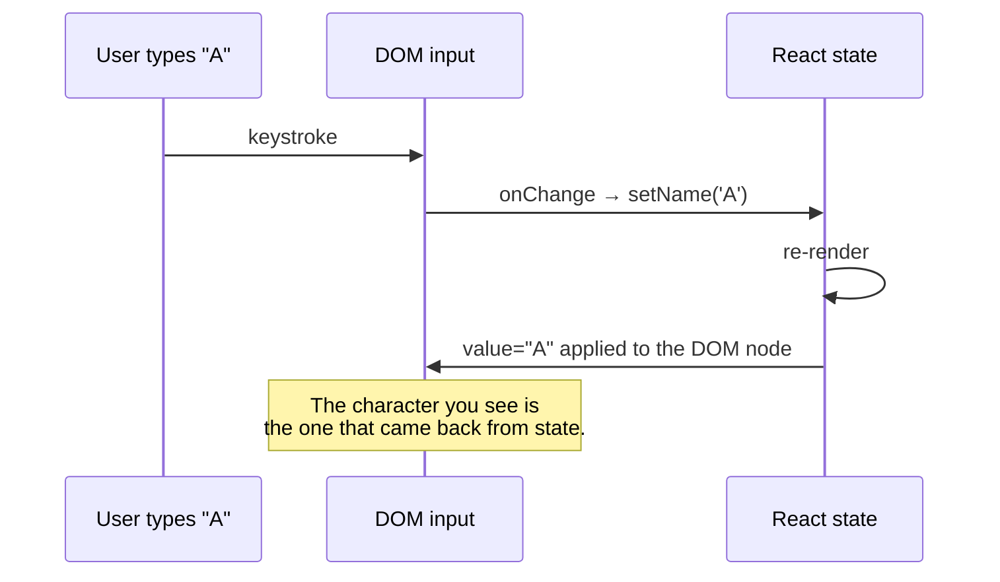

That round-trip is why the **cardinal rule** exists:

> "When you pass either of them, you must also pass an `onChange` handler that updates the passed
> value."
>
> "If you pass `value` without `onChange`, it will be impossible to type into the input. When you
> control an input by passing some `value` to it, you *force* it to always have the value you
> passed. So if you pass a state variable as a `value` but forget to update that state variable
> synchronously during the `onChange` event handler, React will revert the input after every
> keystroke back to the `value` that you specified."
> — [`reference/react-dom/components/input`](https://react.dev/reference/react-dom/components/input)

A frozen input where typing does nothing is almost always this: a `value` with no `onChange`, or
an `onChange` that doesn't actually update the state feeding `value`.

Element-type specifics worth memorizing, since they're a quick interview check:

| Element | Controlled prop | Uncontrolled prop |
|---|---|---|
| `<input type="text">`, `<textarea>` | `value` | `defaultValue` |
| `<input type="checkbox">`, `<input type="radio">` | `checked` | `defaultChecked` |
| `<select>` | `value` (on the `<select>`, not `selected` on `<option>`) | `defaultValue` |
| `<input type="file">` | — always uncontrolled | — |

> "Checkboxes need `checked` (or `defaultChecked`), not `value` (or `defaultValue`)."
> — [`reference/react-dom/components/input`](https://react.dev/reference/react-dom/components/input)

`<textarea>` is a notable divergence from HTML: in plain HTML the text goes between the tags; in
React you pass `value`/`defaultValue`. Same for `<select>` — HTML puts `selected` on an
`<option>`, React puts `value` on the `<select>`.

### Uncontrolled inputs

The DOM keeps the value; React just supplies a starting point and you read it when you need it.

```jsx
function NameFieldUncontrolled() {
  const inputRef = useRef(null);   // refs are ch.04

  function handleSubmit(e) {
    e.preventDefault();
    console.log(inputRef.current.value); // read on demand
  }

  return (
    <form onSubmit={handleSubmit}>
      <input defaultValue="Ada" ref={inputRef} />
      <button>Submit</button>
    </form>
  );
}
```

Or without a ref at all, reading the whole form at submit time:

```jsx
function handleSubmit(e) {
  e.preventDefault();
  const data = new FormData(e.currentTarget);
  console.log(data.get('name'));
}
// <form onSubmit={handleSubmit}><input name="name" defaultValue="Ada" /></form>
```

Note `defaultValue`, not `value`. Passing `value` here would control the input and freeze it.

### The controlled/uncontrolled switch warning

> "An input can't be both controlled and uncontrolled at the same time." / "An input cannot switch
> between being controlled or uncontrolled over its lifetime."
> — [`reference/react-dom/components/input`](https://react.dev/reference/react-dom/components/input)

The most common cause of React's "A component is changing an uncontrolled input to be controlled"
warning — common enough to check first — is state that started as `undefined` or `null`.

```jsx
const [name, setName] = useState();          // ❌ undefined → value={undefined} → uncontrolled
const [name, setName] = useState('');        // ✅ always a string → always controlled

// same trap with async data:
const [name, setName] = useState(user?.name);        // ❌ undefined until the fetch resolves
const [name, setName] = useState(user?.name ?? '');  // ✅
```

### `onChange` doesn't behave like the DOM's `change` event

A genuinely useful piece of trivia, and a real behavioral difference:

> "Fires immediately when the input's value is changed by the user (for example, it fires on every
> keystroke). Behaves like the browser `input` event."
> — [`reference/react-dom/components/input`](https://react.dev/reference/react-dom/components/input)

Note the docs' exact verb: React's `onChange` **behaves like** the browser's `input` event. Don't
upgrade that to "it *is* the native `input` event, renamed" — React also exposes a separate
`onInput` prop, and the docs describe the relationship between the two as historical rather than
identity: "For historical reasons, in React it is idiomatic to use `onChange` instead which works
similarly." So the accurate statement is that React's `onChange` fires during editing, unlike the
native `change` event — which is precisely why a controlled input can sync state keystroke by
keystroke at all.

Be equally careful about the other half of the comparison. "The native `change` event fires on
blur" is only true for the *typing* inputs; MDN lists four distinct timings:

| Native `change` fires… | …for |
|---|---|
| immediately on check/uncheck | `<input type="checkbox">` |
| immediately on check (not uncheck) | `<input type="radio">` |
| when the user commits explicitly | `<select>`, `<input type="date">`, `<input type="file">` |
| when the element loses focus after its value changed | `<textarea>` and the `text`, `search`, `url`, `tel`, `email`, `password` input types |

> "Unlike the `input` event, the `change` event is not necessarily fired for each alteration to an
> element's `value`."
> — [MDN, `change` event](https://developer.mozilla.org/en-US/docs/Web/API/HTMLElement/change_event)

So the safe interview sentence is: *"For text inputs, the native `change` event fires when the
value is committed — typically on blur — whereas React's `onChange` fires during editing, like the
native `input` event."* Stating it that precisely, rather than as a flat "change fires on blur," is
what separates a memorized fact from an understood one.

### Choosing between them

| | Controlled | Uncontrolled |
|---|---|---|
| Source of truth | React state | the DOM node |
| Validate/format as the user types | ✅ natural | ❌ awkward |
| Conditionally disable a submit button | ✅ natural | ❌ needs extra state anyway |
| Two inputs that must stay in sync | ✅ | ❌ |
| Re-renders per keystroke | one | none |
| Big form, values only needed on submit | overkill | ✅ often simpler, and avoids a re-render per keystroke |
| Integrating a non-React widget / file input | ❌ | ✅ (a file input's `value` can't be driven from state, so it's always uncontrolled) |

Default to controlled — it's what most React code does, and it keeps UI-as-a-function-of-state
intact. Reach for uncontrolled when you only need values at submit time, when per-keystroke
re-renders of a large form actually show up in a profile, or when the DOM must own the value (file
inputs, third-party widgets).

Note the "faster" column is about *avoided re-renders*, not an inherent property of uncontrolled
inputs — and if per-keystroke renders are the actual problem, the docs' first two answers aren't
"go uncontrolled" at all. They're structural: **move the input's state into its own small
component** so a keystroke only re-renders that component rather than the whole page, and if some
expensive sibling genuinely depends on the value, reach for `useDeferredValue` (ch.06) to keep the
input responsive during the large re-render
([`reference/react-dom/components/input`](https://react.dev/reference/react-dom/components/input)).
Naming those two before reaching for uncontrolled is the stronger answer, because it keeps the
controlled model intact instead of trading it away for performance.

**React 19 note:** React 19 added form Actions — passing a function to `<form action={...}>` —
which provides another way to handle forms built around `FormData`, with `useActionState` managing
pending and error state. React also automatically resets the form for uncontrolled components when
a form Action succeeds ([React 19 release post](https://react.dev/blog/2024/12/05/react-19)). The
full treatment is ch.07 and ch.09. What matters here is just that a modern, first-class path exists
that doesn't route every keystroke through state — so "always controlled," a reasonable default in
the React 16 era, is worth re-examining rather than assumed. (That last clause is judgment, not a
documented claim.)

> **Interview framing:** "Controlled vs. uncontrolled — which do you use and why?" wants a
> trade-off, not a preference. Strong answer: define both by *who owns the value*, say you default
> to controlled because it keeps UI-as-a-function-of-state and makes validation/formatting/
> cross-field logic trivial, then name the real cases for uncontrolled (submit-only forms, file
> inputs, third-party widgets, per-keystroke re-renders that actually profile badly). Add "React 19
> form Actions plus `FormData` made the uncontrolled path a lot more attractive" and you've shown
> currency. Expect the follow-up "you're getting *'a component is changing an uncontrolled input to
> be controlled'* — what's wrong?" — answer `undefined` initial state, fix with `useState('')` or
> `?? ''`.

---

<a id="sec-8"></a>

## 8. Structuring state: derived state and the duplication anti-pattern

### Start here: if you can compute it, don't store it

> "If you can calculate some information from the component's props or its existing state
> variables during rendering, you **should not** put that information into that component's
> state."
> — [`learn/choosing-the-state-structure`](https://react.dev/learn/choosing-the-state-structure)

```jsx
// ❌ three state variables, two of which are derivable
function Form() {
  const [firstName, setFirstName] = useState('');
  const [lastName, setLastName] = useState('');
  const [fullName, setFullName] = useState('');   // redundant

  function handleFirstNameChange(e) {
    setFirstName(e.target.value);
    setFullName(e.target.value + ' ' + lastName); // must remember to do this. every time.
  }
  // ...
}

// ✅ one derived value, computed during render
function Form() {
  const [firstName, setFirstName] = useState('');
  const [lastName, setLastName] = useState('');
  const fullName = firstName + ' ' + lastName;    // just a variable
  // ...
}
```

The second version cannot go out of sync — there's nothing to keep in sync. Every render
recomputes `fullName` from the current values.

The same reasoning applies to filtering, sorting, totals, counts, validity flags:

```jsx
// ❌
const [todos, setTodos] = useState([]);
const [completedCount, setCompletedCount] = useState(0);

// ✅
const [todos, setTodos] = useState([]);
const completedCount = todos.filter(t => t.done).length;
```

**"But isn't recomputing on every render slow?"** Usually no — and this is a good instinct to
show, followed by the right conclusion. Filtering a few hundred items per render is nothing.
Measure first; if a derivation really is expensive, `useMemo` (ch.06) caches it *without*
turning it into state. Storing it in state is the one option that's both slower to maintain and
correctness-hazardous.

### Don't mirror props in state

The most consequential special case, and one that appears in real codebases constantly:

> "Here, a `color` state variable is initialized to the `messageColor` prop. **The problem is that
> if the parent component passes a different value of `messageColor` later (for example, `'red'`
> instead of `'blue'`), the `color` *state variable* would not be updated!** The state is only
> initialized during the first render... Instead, use the `messageColor` prop directly in your
> code."
> — [`learn/choosing-the-state-structure`](https://react.dev/learn/choosing-the-state-structure)

```jsx
// ❌
function Message({ messageColor }) {
  const [color, setColor] = useState(messageColor); // frozen at the first render's value
  // ...
}

// ✅
function Message({ messageColor }) {
  // just use messageColor
}
```

This is [§1](#sec-1)'s "the initial value is ignored after the first render" rule biting in
practice.

There's one legitimate use, and the docs give it a naming convention:

```jsx
function Message({ initialColor }) {
  // The `color` state variable holds the *first* value of `initialColor`.
  // Further changes to the `initialColor` prop are ignored.
  const [color, setColor] = useState(initialColor);
}
```

Prefixing the prop `initial` or `default` signals *deliberately ignoring later updates* — which
is precisely what `defaultValue` on an `<input>` means ([§7](#sec-7)). Same idea, same naming.

And if you genuinely need a component to reset its state when a prop changes, the idiomatic tool
isn't mirroring — it's `key`, covered in [§9](#sec-9).

### The five principles, and the ones that need examples

React's docs list five ([`learn/choosing-the-state-structure`](https://react.dev/learn/choosing-the-state-structure)):

1. **Group related state.** "If you always update two or more state variables at the same time,
   consider merging them into a single state variable."
2. **Avoid contradictions in state.** "When the state is structured in a way that several pieces
   of state may contradict and 'disagree' with each other, you leave room for mistakes."
3. **Avoid redundant state.** (Above.)
4. **Avoid duplication in state.** "When the same data is duplicated between multiple state
   variables, or within nested objects, it is difficult to keep them in sync."
5. **Avoid deeply nested state.** "Deeply hierarchical state is not very convenient to update.
   When possible, prefer to structure state in a flat way."

**Contradictions (#2)** is the one worth a concrete example, because it's the shape most real
bugs take:

```jsx
// ❌ 2 booleans = 4 combinations, but only 3 are legal.
//    isSending && isSent is nonsense — and nothing stops it.
const [isSending, setIsSending] = useState(false);
const [isSent, setIsSent] = useState(false);

// ✅ one variable, three legal values, zero impossible states
const [status, setStatus] = useState('typing'); // 'typing' | 'sending' | 'sent'
const isSending = status === 'sending';         // derive the booleans you need
const isSent = status === 'sent';
```

This is the "make illegal states unrepresentable" idea — a general state-modeling principle from
type-driven design rather than a React-specific one, though React state benefits from it directly.
It pays off enormously in TypeScript (ch.14), where the union type makes the compiler enforce it. It's also the natural bridge to
`useReducer` (ch.05), which exists for exactly the case where state transitions get complex enough
that you want them written down in one place.

**Duplication (#4)** most often looks like storing a whole object when you could store an id:

```jsx
// ❌ selectedItem is a copy — edit an item in `items` and the copy goes stale
const [items, setItems] = useState(initialItems);
const [selectedItem, setSelectedItem] = useState(items[0]);

// ✅ store the id; derive the object during render
const [items, setItems] = useState(initialItems);
const [selectedId, setSelectedId] = useState(items[0].id);
const selectedItem = items.find(i => i.id === selectedId);
```

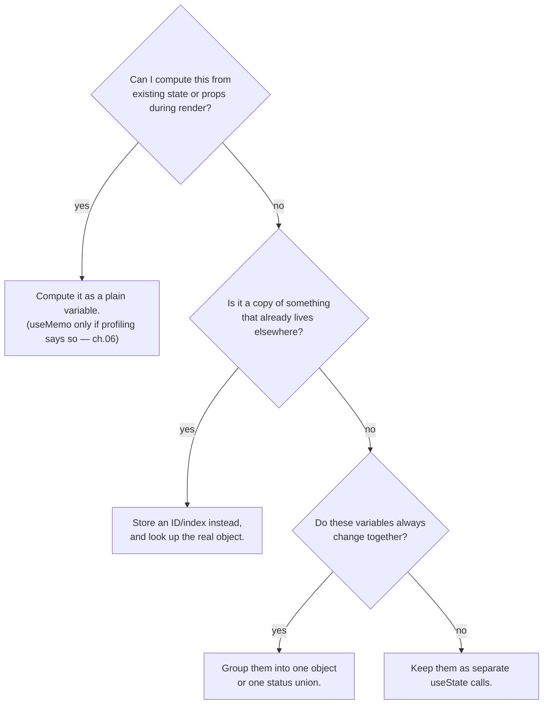

> **Interview framing:** "What's wrong with derived state?" is a favorite because a candidate who
> hasn't thought about it will defend it as an optimization. The complete answer: it's a second
> source of truth for something that already has one, so it can go out of sync, and keeping it in
> sync means remembering to update it in every handler that touches its inputs. Name the specific
> variants — the `fullName` case, the "store the id not the object" case, and the "don't mirror
> props in state" case — and mention that the recompute cost is nearly always negligible, with
> `useMemo` (not state) as the escape hatch if it isn't. If you can add "and prefer one status
> union over several booleans, so contradictory states are unrepresentable," you've moved from
> React trivia into design judgment, which is what the question is really testing.

---

<a id="sec-9"></a>

## 9. Lifting state up — and where state actually lives in the tree

### Start here: two components need the same data

Two sibling components can't see each other's state — state is local to the component instance
that declared it. When they need to coordinate, the answer is to move the state to a place both
can reach: their nearest common parent.

> "Sometimes, you want the state of two components to always change together. To do it, remove
> state from both of them, move it to their closest common parent, and then pass it down to them
> via props. This is known as *lifting state up*, and it's one of the most common things you will
> do writing React code."
> — [`learn/sharing-state-between-components`](https://react.dev/learn/sharing-state-between-components)

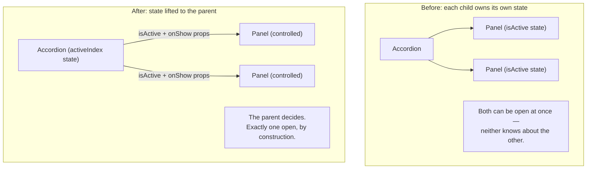

The three steps the docs name:

1. **Remove** state from the child components.
2. **Pass** hardcoded data down from the common parent (a deliberate intermediate step — it
   proves the wiring works before you add the moving parts).
3. **Add** state to the common parent and pass it down together with the event handlers.

```jsx
function Accordion() {
  const [activeIndex, setActiveIndex] = useState(0);   // 3. state lives here now

  return (
    <>
      <Panel isActive={activeIndex === 0} onShow={() => setActiveIndex(0)} title="About">
        ...
      </Panel>
      <Panel isActive={activeIndex === 1} onShow={() => setActiveIndex(1)} title="Etymology">
        ...
      </Panel>
    </>
  );
}

function Panel({ title, children, isActive, onShow }) { // 1. no local state
  return (
    <section>
      <h3>{title}</h3>
      {isActive ? children : <button onClick={onShow}>Show</button>}
    </section>
  );
}
```

Data flows down as props; events flow up as callbacks. That loop — sometimes called "one-way data
flow" or "data down, actions up" — is the core React composition pattern, and it's what you're
being asked to demonstrate whenever an interviewer says "now make these two components stay in
sync."

### Single source of truth

> "**For each unique piece of state, you will choose the component that 'owns' it.** This
> principle is also known as having a 'single source of truth'. It doesn't mean that all state
> lives in one place — but that for *each* piece of state, there is a *specific* component that
> holds that piece of information."
> — [`learn/sharing-state-between-components`](https://react.dev/learn/sharing-state-between-components)

That middle clause matters. "Single source of truth" does **not** mean "put everything in a global
store" — a mistake that produces Redux-everything architectures. It means each piece of state has
exactly one owner, wherever that owner sits.

### "Controlled" and "uncontrolled" apply to components, not just inputs

[§7](#sec-7) used those words for `<input>`. They generalize, and React's docs use them that way:

> "It is common to call a component with some local state 'uncontrolled'... In contrast, you might
> say a component is 'controlled' when the important information in it is driven by props rather
> than its own local state. This lets the parent component fully specify its behavior."
> — [`learn/sharing-state-between-components`](https://react.dev/learn/sharing-state-between-components)

The `Panel` above went from uncontrolled (owning `isActive`) to controlled (receiving `isActive`).
Uncontrolled components are easier to drop in; controlled components are more flexible to
coordinate. Real component libraries often support both — which is exactly why they take both
`value` and `defaultValue`. Recognizing that a library's `value`/`defaultValue` pair *is* this
distinction, deliberately offered as a choice, is a strong API-design signal in an interview
(ch.08 goes deeper on this as a design pattern).

### State is tied to a *position in the tree*, not to your JSX

This is the piece that explains a whole class of "why did my state survive / why did it vanish"
bugs.

> "React associates each piece of state it's holding with the correct component by where that
> component sits in the render tree."
>
> "React preserves a component's state for as long as it's being rendered at its position in the
> UI tree. If it gets removed, or a different component gets rendered at the same position, React
> discards its state."
> — [`learn/preserving-and-resetting-state`](https://react.dev/learn/preserving-and-resetting-state)

Stated as one rule: **React preserves state when the same component type is rendered at the same
position with the same identity — where identity means its `key`, if it has one.** Change the type
or change the key, and that state is discarded. Broken into the two halves that get tested
separately:

1. **Same component type at the same position (and same/absent `key`) → state is preserved.**
2. **Different component type at the same position, or a changed `key` → state is destroyed and
   re-created.**

```jsx
{isFancy ? <Counter isFancy={true} /> : <Counter isFancy={false} />}
// Same type, same position → the count SURVIVES the toggle. (Often surprising.)

{isPaused ? <p>See you later!</p> : <Counter />}
// Different type at that position → Counter's state is DESTROYED, and starts at 0 again.
```

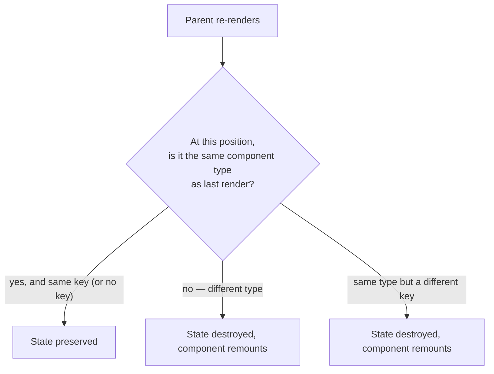

### Resetting state deliberately, with `key`

Chapter 01 ([§5](../01-foundations/README.md#sec-5)) introduced `key` as the thing that tells
React which list item is which. The same mechanism gives you an intentional reset button for state,
and this is a genuinely useful technique — not a hack:

> "By default, React uses order within the parent to discern between components. But keys let you
> tell React that this is not just a first counter, or a second counter, but a specific counter."
> — [`learn/preserving-and-resetting-state`](https://react.dev/learn/preserving-and-resetting-state)

```jsx
// Two chat drafts that must not leak into each other:
<Chat key={selectedContact.id} contact={selectedContact} />
// Switch contacts → the key changes → React unmounts the old Chat and mounts a fresh one,
// so the half-typed draft in its local state is discarded rather than shown to the next contact.
```

This is the correct answer to "how do I reset a child component's state when a prop changes?" —
much better than mirroring the prop into state ([§8](#sec-8)) plus an Effect to re-sync it, which
is the pattern people reach for and which React's docs specifically steer away from.

### How far to lift

Lifting has a cost: an update to state that lives high in the tree puts the whole subtree below it
to work by default (chapter 01, [§4](../01-foundations/README.md#sec-4)) — "by default" because
descendants can opt out via `memo` (ch.06), so it isn't an unconditional "everything below
re-renders." And passing the value down through many intermediate components that don't care about
it is "prop drilling."

The progression to know, and to name in a system-design conversation:

1. **Local state** (`useState`) — the default. Keep state as close to where it's used as possible.
2. **Lifted state** — move it to the nearest common ancestor of the components that need it. Only
   as high as necessary.
3. **Context** (ch.05) — for genuinely tree-wide values that would otherwise drill through many
   layers (theme, current user, locale).
4. **A state library / server-state library** (ch.11/13) — for cross-cutting state with real
   complexity, caching, or server synchronization.

The mistake in each direction is symmetrical: keeping state too low forces duplication and
awkward syncing, while hoisting everything to the top (or into Context/Redux by reflex) creates
needless re-renders and couples unrelated parts of the app together.

> **Interview framing:** "When would you lift state up, and when would you reach for Context or a
> state library?" is really asking whether you have a *default* and escalate deliberately, or
> reach for the biggest tool first. Give the ladder above, and name the specific cost of each
> step up: lifting adds re-renders below the owner and prop drilling; Context re-renders every
> consumer when the value changes; a store adds indirection and boilerplate. A strong closing
> line: *"State should live at the lowest common ancestor of the components that need it — no
> lower, because then it needs syncing, and no higher, because then it re-renders things that
> don't care."*

---

## Sources

The official documentation below was used to verify this chapter's **React-specific technical
claims** before they were written (see `CLAUDE.md`'s "Accuracy & currency practice" for the standing
policy), and is listed so any claim can be re-checked directly, grouped by the section that relies
on it.

Two things this list deliberately does *not* cover, so the methodology isn't overstated. The
**mental models** — "state lives on a shelf outside your component," "read `setNumber(n + 5)` as
'replace with 5'" — are explanatory framings built on top of the cited behavior, some borrowed from
the docs' own analogies, rather than claims the docs make literally about React's internals. And the
**interview guidance** in the framing boxes (what to lead with, what an interviewer is likely
probing for, how common a question is) is judgment, not documented fact. Where those appear, they're
marked as framing; everything stated as React *behavior* traces to a source below.

- [§0](#sec-0), [§2](#sec-2) — [`learn/state-as-a-snapshot`](https://react.dev/learn/state-as-a-snapshot)
  — state living outside the component ("as if on a shelf"), a state variable's value never
  changing within a render, the `setTimeout`/`alert` snapshot example, "React keeps the state
  values fixed within one render's event handlers."
- [§1](#sec-1), [§3](#sec-3) — [`reference/react/useState`](https://react.dev/reference/react/useState)
  — `initialState` ignored after the initial render, initializer functions (pure, no arguments),
  the `Object.is` bail-out and its "may still need to call your component" caveat, batching and
  `flushSync`, calling a setter during rendering, the setter's **stable identity**, and Strict Mode
  double-invoking initializer and updater functions.
- [§6](#sec-6) — [`reference/react/Component`](https://react.dev/reference/react/Component) — class
  `setState` shallowly merging an object into `this.state`, which is what a `useState` setter
  (which replaces the value outright) is being contrasted against.
- [§2](#sec-2), [§3](#sec-3), [§4](#sec-4) — [`learn/queueing-a-series-of-state-updates`](https://react.dev/learn/queueing-a-series-of-state-updates)
  — the definition of batching, updater functions and how the queue is processed, "any other
  value... adds 'replace with X' to the queue, ignoring what's already queued," the updater
  naming conventions, and React not batching across multiple intentional events.
- [§4](#sec-4) — [React 18 release post](https://react.dev/blog/2022/03/29/react-v18) — the
  automatic batching section, quoted with its before/after `setTimeout` examples.
- [§4](#sec-4) — [`reference/react-dom/flushSync`](https://react.dev/reference/react-dom/flushSync)
  — forcing a synchronous DOM update, the "last resort"/performance warnings, and the Suspense
  fallback caveat.
- [§5](#sec-5) — [`learn/responding-to-events`](https://react.dev/learn/responding-to-events) —
  passing vs. calling a handler, bubbling/propagation, `stopPropagation` vs. `preventDefault`,
  capture-phase handlers, and `onScroll` being the one event that doesn't propagate.
- [§5](#sec-5) — [`reference/react-dom/components/common`](https://react.dev/reference/react-dom/components/common)
  — the React event object also being called a "synthetic event," conforming to the DOM event
  standard while fixing browser inconsistencies, `e.nativeEvent` and its non-public mapping, and
  the confirmation that React attaches handlers at the root.
- [§5](#sec-5) — [React v17 release post](https://legacy.reactjs.org/blog/2020/08/10/react-v17-rc.html)
  — delegation moving from `document` to the root container (and why: gradual upgrades /
  `stopPropagation` across nested React versions), the full removal of event pooling
  (`e.persist()` now a no-op), `onScroll` no longer bubbling, and `onFocus`/`onBlur` using native
  `focusin`/`focusout`. On the legacy docs site because React 17's release notes were never
  migrated to react.dev.
- [§6](#sec-6) — [`learn/updating-objects-in-state`](https://react.dev/learn/updating-objects-in-state)
  — treating state as read-only, "mutating state can work in some cases" (why the failure is
  partial rather than clean), local mutation being fine, spread being shallow, and Immer.
- [§6](#sec-6) — [`learn/updating-arrays-in-state`](https://react.dev/learn/updating-arrays-in-state)
  — the avoid/prefer method table, the `slice`/`splice` warning, and array copies being shallow.
- [§7](#sec-7) — [`reference/react-dom/components/input`](https://react.dev/reference/react-dom/components/input)
  — `value` requiring `onChange`, the "impossible to type" pitfall, an input never being both
  controlled and uncontrolled or switching between them, `defaultValue`/`defaultChecked`,
  checkboxes needing `checked` not `value`, `onChange` firing on every keystroke and *behaving
  like* (not being) the native `input` event, the separate `onInput` prop and the "for historical
  reasons" note about preferring `onChange`, and the controlled-input performance guidance (move
  the input's state into its own component; `useDeferredValue` when a sibling genuinely depends on
  the value).
- [§5](#sec-5) — [MDN, `Event.target`](https://developer.mozilla.org/en-US/docs/Web/API/Event/target)
  — `target` defined as the object the event was *dispatched on* (not "the deepest element"), and
  how it diverges from `currentTarget` during the bubbling and capturing phases. Again a
  browser-platform definition rather than a React one.
- [§7](#sec-7) — [MDN, `change` event](https://developer.mozilla.org/en-US/docs/Web/API/HTMLElement/change_event)
  — the four distinct moments the native `change` event fires depending on element type, which is
  why "native `change` fires on blur" is only true for the typing inputs. A browser-platform fact
  rather than a React one, so MDN is the authority here per `CLAUDE.md`'s source list.
- [§7](#sec-7) — [React 19 release post](https://react.dev/blog/2024/12/05/react-19) — form
  Actions (`<form action={fn}>`), `useActionState`, and React resetting uncontrolled forms after
  a successful Action. Covered properly in ch.07/ch.09; referenced here only for the
  controlled-vs-uncontrolled trade-off.
- [§8](#sec-8) — [`learn/choosing-the-state-structure`](https://react.dev/learn/choosing-the-state-structure)
  — the five principles verbatim, "don't mirror props in state" and the `initial`/`default`
  naming convention for the legitimate case, and computing derived values during render instead
  of storing them.
- [§9](#sec-9) — [`learn/sharing-state-between-components`](https://react.dev/learn/sharing-state-between-components)
  — the definition of lifting state up and its three steps, controlled vs. uncontrolled as a
  general component property, and the single-source-of-truth framing (including that it does not
  mean one global store).
- [§9](#sec-9) — [`learn/preserving-and-resetting-state`](https://react.dev/learn/preserving-and-resetting-state)
  — state being tied to a position in the render tree, same-type-same-position preserving state,
  different-type-same-position resetting it, and `key` as the deliberate reset mechanism.

---

## What you'll build
A counter + form playground that demonstrates the batching/snapshot quirks, controlled vs.
uncontrolled inputs, immutable updates, and lifted state — see
[`exercises/README.md`](exercises/README.md) for the concrete problem set, with starter code in
[`app/src/chapters/02-state-and-events/`](../../app/src/chapters/02-state-and-events/).

---
When you've worked through the notes and exercises, say so and this chapter's `revision.md` will
get filled in and its status moved to `Done`.
