# Chapter 03: Side Effects & Lifecycle

**Status:** In Progress
**Folder:** `notes/03-side-effects-and-lifecycle/`

## Why this chapter matters for a React interview
Chapter 01 explained what React *renders*. Chapter 02 explained what makes it render *again*. This
chapter covers the code that has to reach **outside** React after a render: connecting to a
server, starting a timer, subscribing to a browser event, fetching data. That code lives in
**Effects**, and Effects are where a large share of real-world React bugs live. The usual ones are
a missing cleanup, a stale closure, a race between two network responses, and an Effect that never
needed to exist.

Senior interviews tend to probe this material through *debugging* rather than definitions: "this
interval only ticks once, why?", "why does my Effect fire twice?", "the search results sometimes
show the wrong query, find the bug", "do you even need an Effect here?". Each has a surface-level
fix (add the dependency, remove Strict Mode, add a `setTimeout`) that is wrong or incomplete. The
signal an interviewer is listening for is whether you can name the *mechanism*.

> Interview-frequency remarks like the one above are practical guidance based on how these topics
> tend to be probed — not verifiable facts about React. The technical claims in this chapter are
> cited or were verified by running React itself (see [Sources](#sources)); the interview advice is
> judgment, and is flagged as such wherever it appears in an **Interview framing** box.

The single mental model this chapter is built around:

1. **An Effect synchronizes your component with an external system** — something React doesn't
   control (a network connection, a timer, the browser window, a third-party widget).
2. **Setup starts the synchronization; cleanup stops it.** Cleanup must fully undo setup.
3. **React re-runs cleanup-then-setup whenever a reactive value the Effect reads has changed**, and
   the dependency array is how you tell React which values those are. You don't choose the
   dependencies. They're determined by the code.

Everything else here is a consequence of those three, or an explanation of when you *don't* need
an Effect at all.

As in chapters 01 and 02, each section starts with a plain-language "start here" explanation
before reaching interview-level precision. Concepts from earlier chapters (component, render,
commit, state, snapshot, closure) are re-defined briefly where they're used, so this chapter stands
on its own.

> **React version note:** these notes target React 19.x. Two versions matter, and they're not the
> same thing. The **current release** is React 19.3 (9 September 2026, per react.dev's
> [versions page](https://react.dev/versions)). The version **installed and tested in this repo** is
> 19.2.8 (per `app/package.json`), and every "verified by running" claim in this chapter was run
> against 19.2.8. Where 19.3 changed something Effect-related, it's flagged in place.
>
> The `useEffect(setup, deps)` API itself has not changed shape since Hooks were introduced. What
> changed is the timing and tooling around it, and each delta is called out where it comes up:
> - **React 17** changed `useEffect` cleanup timing and guaranteed that all Effect cleanups run
>   before any new setups. [§5](#sec-5) has the exact behavior, including which kind of Effect it
>   applies to.
> - **React 18** added Strict Mode's development-only unmount/remount check ([§6](#sec-6)), made
>   Effect timing consistent for discrete events like clicks ([§1](#sec-1)), removed the
>   "setState on an unmounted component" warning ([§5](#sec-5)), and introduced
>   `useSyncExternalStore` ([§11](#sec-11)).
> - **React 19.2** made `useEffectEvent` stable ([§12](#sec-12)) and added `<Activity>`, whose
>   hidden mode unmounts Effects while keeping state ([§6](#sec-6)).
> - **React 19.3** added no new Effect APIs. Its headline features (`<ViewTransition>`, Fragment
>   Refs, `browser()`, Trusted Types) belong to other chapters. Its changelog does include three
>   Effect-related fixes, noted in [§6](#sec-6), [§11](#sec-11) and [§12](#sec-12)
>   ([React 19.3 release post](https://react.dev/blog/2026/09/09/react-19-3)).

---

<a id="sec-0"></a>

## 0. What a side effect is, and the three places code can live

### Start here: rendering must be pure

Chapter 01 ([§4](../01-foundations/README.md#sec-4)) established that React calls your component
function to find out what the UI should look like, and that this **render** step must be *pure*:
given the same props and state, return the same JSX, and don't change anything outside the
function while doing it. React may call your component many times, call it and throw the result
away, or (in Strict Mode) call it twice on purpose. Anything the function does besides computing
JSX happens again every one of those times.

A **side effect** is anything a piece of code does besides computing its return value:

- sending a network request
- starting a timer (`setTimeout`, `setInterval`)
- subscribing to something (`window.addEventListener`, a WebSocket, a store)
- reading or writing `localStorage`, `document.title`, or the DOM directly
- logging an analytics event

None of those belong in the render body. So where do they go? React gives you exactly **two**
places, and choosing between them is the first skill this chapter teaches.

```jsx
function ChatRoom({ roomId }) {
  // 1. RENDERING CODE — must be pure. Compute and return JSX, nothing else.
  const title = `Welcome to #${roomId}`;

  // 2. EVENT HANDLER — side effects caused by a SPECIFIC user interaction.
  function handleSend() {
    sendMessage(roomId, draft); // runs only because the user clicked "Send"
  }

  // 3. EFFECT — side effects caused by the component BEING ON SCREEN.
  useEffect(() => {
    const connection = createConnection(roomId);
    connection.connect(); // runs because ChatRoom is displayed for this roomId
    return () => connection.disconnect();
  }, [roomId]);

  return <h1>{title}</h1>;
}
```

React's docs define the third category precisely:

> "**Effects let you specify side effects that are caused by rendering itself, rather than by a
> particular event.**"
> — [`learn/synchronizing-with-effects`](https://react.dev/learn/synchronizing-with-effects)

The chat connection is the canonical example. No click caused it. The user navigated to a screen
that shows a chat room, and *as long as that room is on screen*, the app should be connected to
it. There's no event handler to put that code in, and putting it in the render body would open a
new connection every time React rendered.

### The one question that decides it

> "When you're not sure whether some code should be in an Effect or in an event handler, ask
> yourself *why* this code needs to run. Use Effects only for code that should run *because* the
> component was displayed to the user."
> — [`learn/you-might-not-need-an-effect`](https://react.dev/learn/you-might-not-need-an-effect)

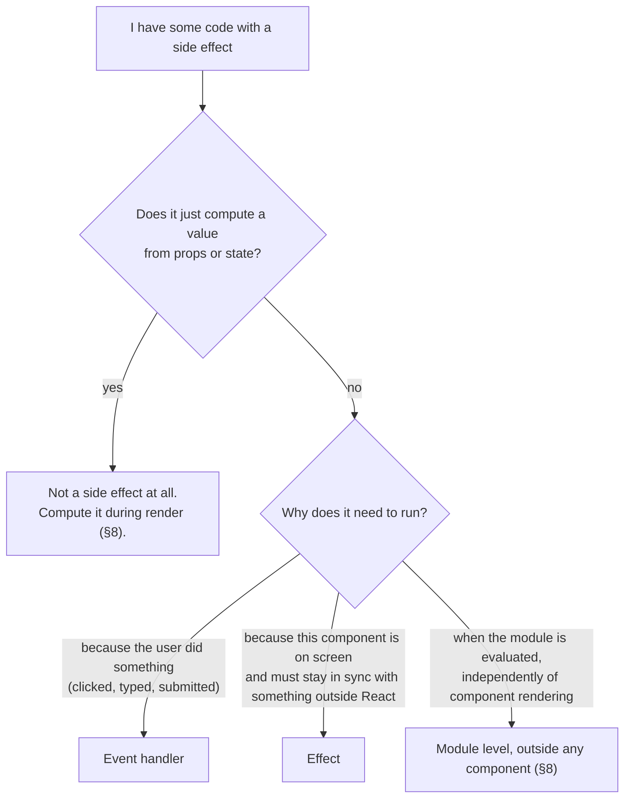

**A precision note on "displayed."** "Because the component was displayed" is the docs' own
teaching phrase, and it's the right first mental model. The precise version is that an Effect runs
to keep an external system in sync with the component's **committed** props and state, and it
stays set up only while the component is mounted with its Effects active. Those two usually line up
with "visible," but not always. [§6](#sec-6)'s `<Activity mode="hidden">` keeps a component's state
while *unmounting its Effects*, so a hidden-but-alive component has no active Effects. The
questions that decide it are still "what am I synchronizing with?" and "why must this run?"

### What "external system" means

The docs keep saying Effects are for synchronizing with an **external system**. That just means
anything whose state React doesn't manage:

| External system | Example of synchronizing with it |
|---|---|
| The network | keep a WebSocket connected to the current room |
| Browser APIs | listen to `window` resize or `online`/`offline` events |
| Timers | run a countdown while a component is visible |
| The DOM, outside React's control | focus an input, call `video.play()` |
| A non-React widget | keep a map library's zoom level matching a prop |
| `document.title`, `localStorage` | keep them in step with state |

**"The DOM" row needs one distinction.** Most of the DOM *is* controlled by React. If something
can be expressed as JSX, props or state (a class name, text, whether an element exists), express it
that way and let React update the DOM. The DOM only becomes an "external system" when you need an
**imperative browser API** that JSX can't express, such as `play()`/`pause()`, `focus()`,
`scrollIntoView()`, or `showModal()`. Then you reach the node through a ref (ch.04) and
synchronize it in an Effect. The docs' canonical example:

```jsx
function VideoPlayer({ src, isPlaying }) {
  const ref = useRef(null);

  useEffect(() => {
    if (isPlaying) {
      ref.current.play();  // there's no `playing` prop on <video>, so JSX can't say this
    } else {
      ref.current.pause();
    }
  }, [isPlaying]);

  return <video ref={ref} src={src} loop playsInline />;
}
```

`isPlaying` is React state. The video element's playback is an external system. The Effect keeps
the second in step with the first.

If there is no external system in the picture (you're only transforming props into other values,
or updating one piece of state because another changed), you almost certainly **don't** need an
Effect. [§8](#sec-8) is entirely about that.

> **Interview framing:** "What's the difference between an event handler and `useEffect`?" The
> weak answer is about timing ("Effects run after render"). The strong answer is about *cause*:
> event handlers run because of a specific interaction, and Effects run because the component is
> being displayed and must stay in sync with an external system. Follow it with React's own
> decision rule ("ask *why* this code needs to run") and an example of each: sending a chat
> message is an event, and staying connected to the chat room is an Effect.

---

<a id="sec-1"></a>

## 1. `useEffect` anatomy: setup, cleanup, dependencies, and when it runs

### The three parts

```jsx
import { useEffect } from 'react';

function Clock({ intervalMs }) {
  useEffect(
    () => {
      // ── SETUP ── runs after React commits this render to the screen
      const id = setInterval(() => console.log('tick'), intervalMs);

      // ── CLEANUP ── optional: a function returned from setup
      return () => {
        clearInterval(id);
      };
    },
    [intervalMs] // ── DEPENDENCIES ── re-run (cleanup, then setup) when these change
  );

  return <p>Ticking every {intervalMs}ms</p>;
}
```

The reference page describes the whole contract in one paragraph, and it's worth being able to
paraphrase it exactly:

> "When your component commits, React will run your setup function. After every commit with
> changed dependencies, React will first run the cleanup function (if you provided it) with the old
> values, and then run your setup function with the new values. After your component is removed
> from the DOM, React will run your cleanup function."
> — [`reference/react/useEffect`](https://react.dev/reference/react/useEffect)

Read that as three rules:

1. **After the first commit:** run setup.
2. **After a commit where a dependency changed:** run the *old* cleanup, then the *new* setup.
3. **When the component is removed:** run the last cleanup.

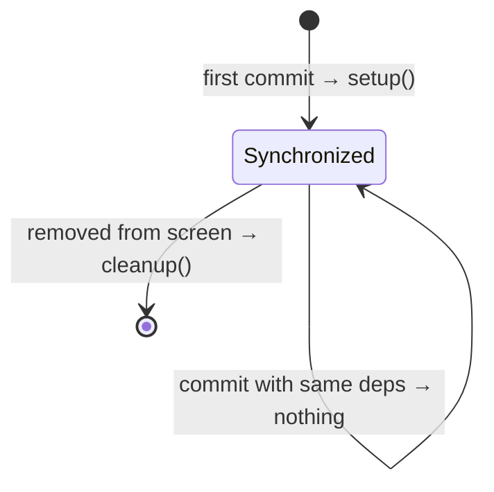

### When an Effect runs, relative to render and paint

The name `useEffect` doesn't say when it runs. The docs do:

> "Effects run at the end of a commit after the screen updates."
> — [`learn/synchronizing-with-effects`](https://react.dev/learn/synchronizing-with-effects)

So the pipeline from ch.01 and ch.02 gets one more box at the end:

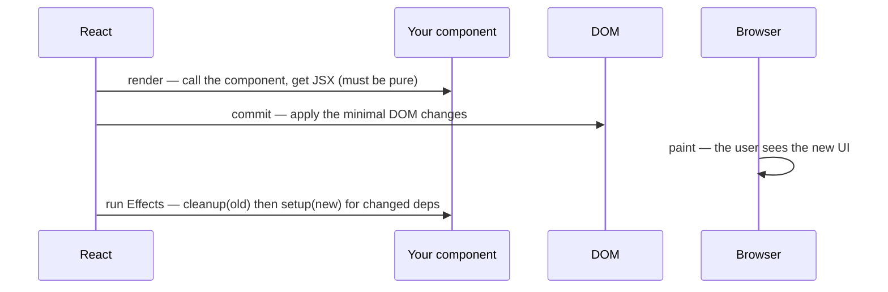

Why after paint? Most Effects (connecting to a server, logging, subscribing) have nothing to do
with what the user sees in *this* frame, so there's no reason to make the user wait for them.
Running them after the screen updates keeps the UI responsive. When an Effect *does* affect
what's on screen in a way the user would notice (measuring an element and repositioning it),
you need `useLayoutEffect` instead, which runs *before* paint. See [§7](#sec-7).

Two caveats on "after paint", both straight from the reference, and both worth knowing because
they come up as follow-ups:

> "If your Effect was caused by an interaction (like a click), **React may run your Effect before
> the browser paints the updated screen**. This ensures that the result of the Effect can be
> observed by the event system."
>
> "Even if your Effect was caused by an interaction (like a click), **React may allow the browser
> to repaint the screen before processing the state updates inside your Effect.**"
> — [`reference/react/useEffect`](https://react.dev/reference/react/useEffect)

That first behavior is a **React 18** change, listed in the upgrade guide as "Consistent useEffect
timing": "React now always synchronously flushes effect functions if the update was triggered
during a discrete user input event such as a click or a keydown event. Previously, the behavior
wasn't always predictable or consistent."
([React 18 upgrade guide](https://react.dev/blog/2022/03/08/react-18-upgrade-guide)). The
practical takeaway: **"useEffect runs after paint" is the usual case, not a guarantee**, and code
that depends on exact paint timing belongs in `useLayoutEffect`. The model worth memorizing:

1. `useEffect` runs **after commit**. That part is always true.
2. It **usually** runs after paint.
3. It **may** run before paint, depending on what triggered the update (a discrete interaction) or
   on a layout Effect setting state ([§7](#sec-7)).

### The three forms of the dependency array

This table is worth memorizing exactly. It's the most-asked `useEffect` question there is.

| You write | The Effect runs | The docs' words |
|---|---|---|
| `useEffect(fn)` — no array | after **every** commit | "If you omit this argument, your Effect will re-run after every commit of the component." |
| `useEffect(fn, [])` — empty array | after the **initial commit of each mount** (plus Strict Mode's dev-only extra cycle, [§6](#sec-6)) | "This runs only on mount (when the component appears)" |
| `useEffect(fn, [a, b])` | after the initial commit of each mount, **and** after any commit where `a` or `b` changed | "This runs on mount *and also* if either a or b have changed since the last render" |

Sources: [`reference/react/useEffect`](https://react.dev/reference/react/useEffect),
[`learn/synchronizing-with-effects`](https://react.dev/learn/synchronizing-with-effects).

**A note on the word "mount."** In this chapter, "mount" is shorthand for a component instance's
*first committed appearance* in the tree. It isn't a separate event that Effects hook into. Effects
are always scheduled around **commits**, and "mount" just names the first commit for that
instance. "Unmount" means that instance is removed and its Effects are torn down.

**`[]` means "no reactive dependencies," not "run once, ever."** "Once" is per *mount*, and a
component can mount many times: every time it's conditionally shown again, every time its `key`
changes (ch.02, [§9](../02-state-and-events/README.md#sec-9)), every time an `<Activity>` boundary
is shown again ([§6](#sec-6)), and on Strict Mode's simulated remount in development. Code that
truly must run once per page load belongs at module level ([§8](#sec-8)), not in a `[]` Effect.

**No array doesn't mean "do this after every render."** It's valid, and occasionally right. But an
Effect with no array still needs a *synchronization* reason: which external system has to be
re-synced after every single commit, and why? If the honest answer is "I want this code to run
after each render," that's lifecycle thinking ([§2](#sec-2)). The code is usually derived state or
event logic in disguise ([§8](#sec-8)).

"Changed" has a precise meaning:

> "React will compare each dependency with its previous value using the `Object.is` comparison."
> — [`reference/react/useEffect`](https://react.dev/reference/react/useEffect)

That's the same `Object.is` comparison `useState` uses for its bail-out (ch.02,
[§1](../02-state-and-events/README.md#sec-1)). For primitives (strings, numbers, booleans) it's
effectively `===`. For **objects, arrays, and functions** it's *identity*: a new object with
identical contents counts as "changed." That one fact causes a whole family of bugs, covered in
[§3](#sec-3).

```jsx
// Each of these Effects is run after the commits shown:
useEffect(() => console.log('A'));            // mount, update, update, update...
useEffect(() => console.log('B'), []);        // mount only
useEffect(() => console.log('C'), [userId]);  // mount, and whenever userId changes
```

### Rules and constraints

- **`useEffect` is a Hook**, so the Rules of Hooks apply (ch.01,
  [§2](../01-foundations/README.md#sec-2)): call it at the top level of a component or custom Hook,
  never inside a condition or loop. The *logic inside* the Effect can be conditional:

  ```jsx
  // ❌ conditional Hook call
  if (isOpen) {
    useEffect(() => { /* ... */ }, [isOpen]);
  }

  // ✅ unconditional Hook, conditional logic
  useEffect(() => {
    if (!isOpen) return;          // nothing to synchronize while closed
    const id = setInterval(poll, 1000);
    return () => clearInterval(id);
  }, [isOpen]);
  ```

- **Effects only run on the client.** "They don't run during server rendering."
  ([`reference/react/useEffect`](https://react.dev/reference/react/useEffect)). This matters for
  ch.17: a server-rendered page's initial HTML never includes anything an Effect would have
  produced.

- **The dependency array must have a constant length and be written inline**, like
  `[dep1, dep2]`. It's not a variable you compute.

### The infinite-loop trap

The most common way to crash a page with `useEffect`:

```jsx
function Broken() {
  const [count, setCount] = useState(0);

  useEffect(() => {
    setCount(count + 1); // ❌ set state after every commit...
  });                    //    ...with no dependency array → it runs after every commit

  return <p>{count}</p>;
}
```

The Effect runs after commit, sets state, which causes a render and commit, which runs the Effect,
which sets state... React eventually stops it with a "Maximum update depth exceeded" error. The
same loop happens with a dependency array if the Effect sets a value that is itself a dependency
and always differs (for example, setting a freshly created object each time).

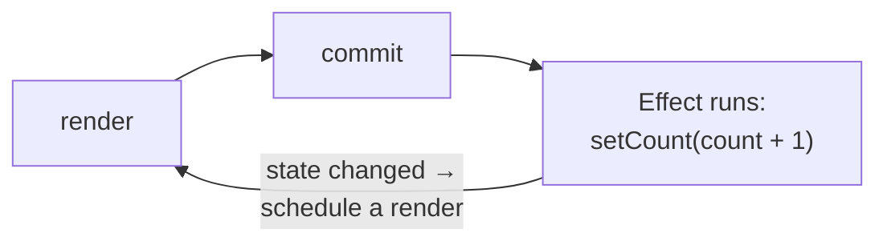

The real question behind this bug is usually "why is this state being set in an Effect at all?"
Most often it's derived data that should be computed during render ([§8](#sec-8)).

### TypeScript: what the setup function may return

In `@types/react` (19.2, installed in this repo), the setup function has type
`EffectCallback = () => void | Destructor`, where `Destructor` is the cleanup function. So setup
must return **either nothing or a cleanup function**. Returning anything else, including a Promise,
is a type error. That's why [§5](#sec-5)'s "you can't pass an `async` function to `useEffect`"
rule is caught by the compiler in this repo:

```
error TS2345: Argument of type '() => Promise<void>' is not assignable to parameter of type 'EffectCallback'.
```

(That exact error was produced by type-checking a probe file against this repo's own
`tsconfig.app.json`. See [Sources](#sources).)

> **Interview framing:** "What's the difference between no dependency array, an empty array, and
> `[a, b]`?" Give the three rows of the table, then add the two details that separate a strong
> answer: (1) dependencies are compared with `Object.is`, so an object or function created during
> render is a *new* dependency every time; and (2) "empty array = runs once" is wrong twice over:
> it's once *per mount* (and components remount), and Strict Mode adds an extra setup+cleanup
> cycle in development. A third,
> senior-level addition: "and you don't really *choose* the array. It has to list every reactive
> value the Effect reads, and the linter enforces that" ([§3](#sec-3)).

---

<a id="sec-2"></a>

## 2. Think in synchronization, not lifecycle, and the order Effects actually run

### Start here: why "lifecycle" is the wrong mental model

If you've seen class components, or older tutorials, you may have learned Effects as a replacement
for three class methods:

| Class lifecycle method | Common (misleading) `useEffect` translation |
|---|---|
| `componentDidMount` | `useEffect(fn, [])` |
| `componentDidUpdate` | `useEffect(fn, [deps])` |
| `componentWillUnmount` | the cleanup function returned from `useEffect(fn, [])` |

That mapping isn't *false* for simple cases, but it trains you to ask the wrong question ("what
should happen on mount?") and leads directly to the stale-closure and missing-dependency bugs in
[§3](#sec-3) and [§4](#sec-4). React's docs explicitly reject it:

> "Effects have a different lifecycle from components. Components may mount, update, or unmount.
> An Effect can only do two things: to start synchronizing something, and later to stop
> synchronizing it."
>
> "Instead, try to think about each Effect independently from your component's lifecycle. An
> Effect describes how to synchronize an external system to the current props and state."
> — [`learn/lifecycle-of-reactive-effects`](https://react.dev/learn/lifecycle-of-reactive-effects)

The switch in thinking looks like this:

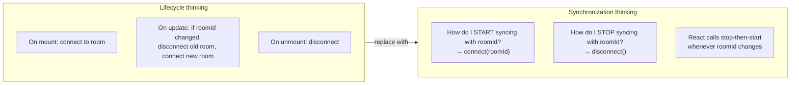

With synchronization thinking you write **one** start and **one** stop, and React works out
*when* to call them. The update case ("disconnect the old room, connect the new one") isn't
something you write separately. It's just stop followed by start.

### Each render has its own Effect

This follows directly from ch.02's snapshot rule
([§2](../02-state-and-events/README.md#sec-2)). Every render is a separate call to your component
function, with its own `roomId`, and the Effect function created in that call closes over *that*
render's `roomId`. React doesn't "update" an Effect. It keeps the Effect from each render and runs
the old one's cleanup before the new one's setup.

```jsx
function ChatRoom({ roomId }) {
  useEffect(() => {
    const connection = createConnection(roomId);
    connection.connect();
    console.log(`✅ connected to ${roomId}`);
    return () => {
      connection.disconnect();
      console.log(`❌ disconnected from ${roomId}`); // the OLD render's roomId
    };
  }, [roomId]);

  return <h1>Welcome to {roomId}!</h1>;
}
```

Walk the user from `general` to `travel` and then off the page:

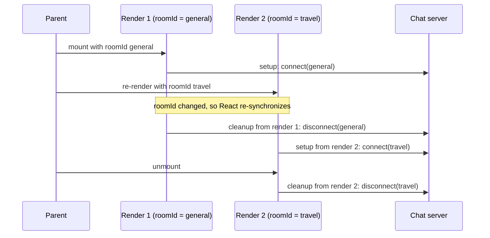

The console output:

```
✅ connected to general
❌ disconnected from general
✅ connected to travel
❌ disconnected from travel
```

Notice that the cleanup logs the **old** room. The cleanup function was created by render 1, so it
closes over render 1's `roomId`. That's exactly the behavior you want, because you need to
disconnect from the room you connected to, not the new one.

### Each Effect is its own synchronization process

> "Each Effect in your code should represent a separate and independent synchronization process."
> — [`learn/lifecycle-of-reactive-effects`](https://react.dev/learn/lifecycle-of-reactive-effects)

```jsx
// ❌ Two unrelated things glued together: changing roomId re-logs the visit,
//    and a future analytics dependency would reconnect the chat.
useEffect(() => {
  logVisit(roomId);
  const connection = createConnection(roomId);
  connection.connect();
  return () => connection.disconnect();
}, [roomId]);

// ✅ Two Effects, two independent processes, each with its own dependencies.
useEffect(() => {
  logVisit(roomId);
}, [roomId]);

useEffect(() => {
  const connection = createConnection(roomId);
  connection.connect();
  return () => connection.disconnect();
}, [roomId]);
```

The test is: if you deleted one piece, would the other still make sense on its own? If so, split
them.

### Packaging a synchronization process: a preview of custom Hooks

Once an Effect is one self-contained synchronization process, it can be moved into a function of
its own. A function whose name starts with `use` and that calls other Hooks is a **custom Hook**:

```jsx
function useChatRoom(roomId) {
  useEffect(() => {
    const connection = createConnection(roomId);
    connection.connect();
    return () => connection.disconnect();
  }, [roomId]);
}

function ChatRoom({ roomId }) {
  useChatRoom(roomId); // reads like a declaration: "this component stays connected to roomId"
  return <h1>Welcome to {roomId}!</h1>;
}
```

The key point for *this* chapter: **a custom Hook doesn't change Effect semantics.** The Effect
inside `useChatRoom` has exactly the same dependencies, cleanup, closure and Strict Mode behavior as
if it were written inline, and it still belongs to whichever component calls the Hook. Extracting
it just gives the synchronization a name. [§11](#sec-11)'s `useOnlineStatus` is the same idea built
on `useSyncExternalStore`. Designing custom Hooks (naming, what to return, when to extract) is
ch.08's subject.

### The actual execution order: verified by running React 19.2.8

The docs specify the per-Effect contract (cleanup with old values, then setup with new values).
They say less about the order *across* components and Effect types, and interviewers sometimes
ask anyway ("does the parent's Effect or the child's run first?"). Rather than guess, this was
settled by rendering a `Parent` → `Child` pair, each with one `useLayoutEffect` and one
`useEffect`, in React 19.2.8 and logging every call (see [Sources](#sources) for how to re-run it).
The output, without Strict Mode:

```
render Parent(a)
render Child(a)
  layout setup Child(a)
  layout setup Parent(a)
  effect setup Child(a)
  effect setup Parent(a)
--- update dep a->b
render Parent(b)
render Child(b)
  layout cleanup Child(a)
  layout cleanup Parent(a)
  layout setup Child(b)
  layout setup Parent(b)
  effect cleanup Child(a)
  effect cleanup Parent(a)
  effect setup Child(b)
  effect setup Parent(b)
--- unmount
  layout cleanup Parent(b)
  layout cleanup Child(b)
  effect cleanup Parent(b)
  effect cleanup Child(b)
```

What you can read off that log splits into two kinds of statement, and it's worth keeping them
apart. Some are **documented guarantees**. Others are **observed behavior of React 19.2.8**, true in
this run but not something the docs promise or ask you to depend on.

**Documented (safe to rely on and to state in an interview):**

1. **Effects run after commit.** Rendering finishes, and the DOM is updated, before any Effect runs
   ([§1](#sec-1)).
2. **Layout Effects run first.** They run before paint and regular Effects usually run after
   ([§7](#sec-7)). Even when regular Effects are flushed early, the `useLayoutEffect` reference
   describes them as "remaining Effects" that run after the layout Effect. The probe agrees: every
   layout Effect in the commit ran before any regular one.
3. **On an update, every regular/layout cleanup runs before any new setup of that kind.** That's
   the guarantee React 17 introduced: "React 17 will always execute all effect cleanup functions
   (for all components) before it runs any new effects"
   ([React 17 release notes](https://legacy.reactjs.org/blog/2020/08/10/react-v17-rc.html)). The one
   documented exception is `useInsertionEffect`, which interleaves cleanup and setup one component
   at a time ([§7](#sec-7)).
4. **DOM refs are attached before Effects run.** "React sets `ref.current` during the commit.
   Before updating the DOM, React sets the affected `ref.current` values to `null`. After updating
   the DOM, React immediately sets them to the corresponding DOM nodes"
   ([`learn/manipulating-the-dom-with-refs`](https://react.dev/learn/manipulating-the-dom-with-refs)).
   That's the actual reason a parent's layout Effect or Effect can read a child's DOM node through
   a ref. It has nothing to do with the order the *child's Effects* ran in.

**Observed in React 19.2.8 (don't design around it):**

5. **Setups ran child-first (bottom-up)**, for both layout and regular Effects.
6. **Unmount cleanups ran parent-first.**
7. **Declaration order inside a component didn't matter across the two kinds.** Declaring
   `useEffect` above `useLayoutEffect` still logged the layout Effect first (checked with a second
   probe), which is just rule 2.

Rules 5 and 6 are consistent and interviewers do ask about them, so know them. Present them as
"what React does in my testing," not as an API contract. If your application logic depends on
parent/child or sibling Effect ordering, that's a sign two Effects are secretly coupled and should
communicate through props, state or a ref instead.

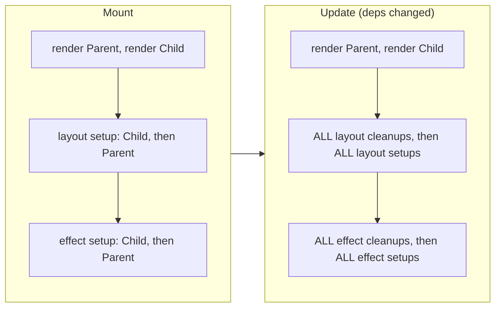

> **Interview framing:** "Is `useEffect(fn, [])` the same as `componentDidMount`?" The strong
> answer is "close in effect, different in model." It runs after the first commit, like
> `componentDidMount`. But React's docs explicitly ask you not to think in mount/update/unmount.
> An Effect is a start/stop synchronization pair, and React re-runs it whenever the values it reads
> change. Two concrete differences are worth naming. First, timing: `useEffect` usually runs after
> paint, and the `Component` reference says that "in the rare cases where it's important for the
> code to run before browser paint, `useLayoutEffect` is a closer match" to the class methods.
> Second, in development Strict Mode deliberately runs setup, cleanup, setup to prove the pair is
> symmetrical. If asked about order, separate the guarantee from the observation: on an update all
> cleanups run before any new setups (a React 17 guarantee), and refs are attached before Effects
> run (documented). Children's Effects setting up before their parents' is what React does in
> practice (observed in 19.2.8), but say you wouldn't build logic that depends on it.

---

<a id="sec-3"></a>

## 3. Dependencies: reactive values, the linter, and why objects cause re-runs

### Start here: what the array is actually for

The dependency array answers one question: **which values, if they changed, would mean the
synchronization has to be redone?** If the chat Effect reads `roomId`, then a new `roomId` means
you're connected to the wrong room, so `roomId` must be in the array. If it reads `serverUrl`, the
same logic applies.

That leads to the rule that surprises people most:

> "**Dependencies should match the code.**" … "To remove a dependency, prove that it's not a
> dependency."
> — [`learn/removing-effect-dependencies`](https://react.dev/learn/removing-effect-dependencies)

You don't *pick* dependencies based on when you'd like the Effect to run. The list is determined by
what the Effect reads. If you don't like the resulting list, you change the *code* so it reads
different things, and the list follows.

### Reactive values: what must go in the array

> "All variables declared inside the component (including props, state, and variables in your
> component's body) are reactive."
> — [`learn/lifecycle-of-reactive-effects`](https://react.dev/learn/lifecycle-of-reactive-effects)

A value is **reactive** if it can be different on the next render. Everything declared inside the
component body qualifies, because the body re-runs on every render and creates it fresh.

```jsx
const serverUrl = 'https://chat.example.com'; // module level: NOT reactive (never changes)

function ChatRoom({ roomId }) {              // roomId: reactive (a prop)
  const [message, setMessage] = useState(''); // message: reactive (state)
                                              // setMessage: stable identity (see below)
  const url = `${serverUrl}/${roomId}`;       // url: reactive (computed from a prop)
  const inputRef = useRef(null);              // inputRef: stable object (ch.04)

  useEffect(() => {
    const connection = createConnection(url);
    connection.connect();
    return () => connection.disconnect();
  }, [url]); // ✅ url is the only reactive value read here
}
```

| Value | Reactive? | Needs to be a dependency? |
|---|---|---|
| props, state | yes | yes, if read |
| variables/functions declared in the body | yes | yes, if read |
| module-level constants, imports | no | no |
| a state setter like `setMessage` | stable identity | no (harmless if listed) |
| a ref object from `useRef` | stable identity | no (the docs note it *can* be listed) |
| `ref.current`, `location.pathname` | mutable, **not reactive** | listing it doesn't make React react to it, so it's not a valid dependency |

Two rows need explaining:

- **Setters are stable.** ch.02 ([§1](../02-state-and-events/README.md#sec-1)) quoted the docs:
  "The `set` function has a stable identity, so you will often see it omitted from Effect
  dependencies, but including it will not cause the Effect to fire."
- **`ref.current` and globals aren't reactive.** You can *type* `[ref.current]` and it will run.
  What it won't do is what you meant. Assigning `ref.current = x` doesn't cause a render, and React
  only compares dependencies when a render happens, so the Effect won't re-run at the moment the
  value changes. At best it notices on some later, unrelated render. The docs put it in bold,
  "A mutable value like `ref.current` or things you read from it also can't be a dependency," and
  explain why: "since changing it doesn't trigger a re-render, it's not a reactive value, and React
  won't know to re-run your Effect when it changes." They add that reading mutable data during
  rendering, which is when dependencies are calculated, also breaks render purity
  ([`learn/lifecycle-of-reactive-effects`](https://react.dev/learn/lifecycle-of-reactive-effects)).
  To react to an external mutable value, subscribe to it ([§11](#sec-11)).

### The linter is not optional

The `exhaustive-deps` rule reads your Effect, finds every reactive value it uses, and warns about
any that are missing from the array. This repo's linter (`oxlint`) already runs it by default. A
probe file with `useEffect(() => { console.log(id, n); setN(1); }, [])` produced:

```
warning react-hooks(exhaustive-deps): React Hook useEffect has missing dependencies: 'n', and 'id'
help: Either include it or remove the dependency array.
```

(Verified by running `npx oxlint` in `app/`, re-runnable as [`probes/tooling.mjs`](probes/tooling.mjs).
Note it correctly did *not* complain about `setN`.)

The docs are direct about what happens when people silence it:

> "Suppressing the linter leads to very unintuitive bugs that are hard to find and fix."
> — [`learn/removing-effect-dependencies`](https://react.dev/learn/removing-effect-dependencies)

A missing dependency doesn't crash. The Effect keeps running with the value from an old render,
which is the stale closure bug in [§4](#sec-4). The linter is effectively a stale-closure
detector.

### Why objects and functions make Effects re-run every render

Put this together with `Object.is` from [§1](#sec-1):

```jsx
function ChatRoom({ roomId }) {
  const [message, setMessage] = useState('');

  // ❌ A brand-new object on EVERY render, including renders caused by typing a message
  const options = { serverUrl: 'https://chat.example.com', roomId };

  useEffect(() => {
    const connection = createConnection(options);
    connection.connect();
    return () => connection.disconnect();
  }, [options]); // Object.is(newOptions, oldOptions) is always false → reconnect on every keystroke

  return <input value={message} onChange={e => setMessage(e.target.value)} />;
}
```

Typing into the input changes `message`, which re-renders `ChatRoom`, which creates a new `options`
object with *the same contents* but a different identity, which the dependency check sees as a
change. The chat reconnects on every keystroke.

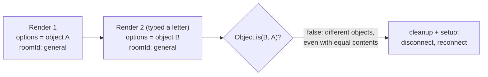

The same thing happens with a function declared in the component body, since each render creates
a new function.

**A render is not the same as a visible change.** Nothing on screen changed in that example,
because `message` isn't displayed by the chat Effect. It doesn't matter. Dependency comparison
happens **every time this component renders and commits**, whatever caused the render: its own unrelated state,
a parent re-rendering (ch.01, [§4](../01-foundations/README.md#sec-4)), or a context change. It
never asks "did the user see a difference?" So when an Effect restarts "for no reason," the question
is "which render created a new identity for one of my dependencies?", not "what changed on screen?"

The fixes, in the order to try them (all from
[`learn/removing-effect-dependencies`](https://react.dev/learn/removing-effect-dependencies)):

```jsx
// Fix 1 — the object doesn't depend on anything reactive: move it OUTSIDE the component.
const options = { serverUrl: 'https://chat.example.com', roomId: 'music' };
function ChatRoom() {
  useEffect(() => {
    const connection = createConnection(options);
    connection.connect();
    return () => connection.disconnect();
  }, []); // ✅ options isn't reactive
}

// Fix 2 — it does depend on props: create it INSIDE the Effect, depend on the primitives.
function ChatRoom({ roomId }) {
  useEffect(() => {
    const options = { serverUrl: 'https://chat.example.com', roomId };
    const connection = createConnection(options);
    connection.connect();
    return () => connection.disconnect();
  }, [roomId]); // ✅ a string, compared by value
}

// Fix 3 — the object arrives as a PROP: destructure primitives outside the Effect.
function ChatRoom({ options }) {
  const { roomId, serverUrl } = options;
  useEffect(() => {
    const connection = createConnection({ roomId, serverUrl });
    connection.connect();
    return () => connection.disconnect();
  }, [roomId, serverUrl]); // ✅ parent re-creating `options` no longer matters
}
```

A fourth option is memoizing the object with `useMemo` or the function with `useCallback`. That's
ch.06 material, and it's a last resort here because the three fixes above remove the problem rather
than paper over it. (The React Compiler, also ch.06, can do this memoization automatically, but it
doesn't change the rule that dependencies must match the code.)

### Reading state only to compute the next state → use an updater

```jsx
// ❌ `messages` is a dependency, so every new message reconnects the chat
useEffect(() => {
  connection.on('message', (received) => {
    setMessages([...messages, received]);
  });
}, [roomId, messages]);

// ✅ the updater receives the latest messages, so the Effect doesn't read them at all
useEffect(() => {
  connection.on('message', (received) => {
    setMessages(msgs => [...msgs, received]);
  });
}, [roomId]);
```

That's ch.02's updater function ([§3](../02-state-and-events/README.md#sec-3)) doing a second job.
It lets an Effect *write* state based on its previous value without *reading* it.

### The workflow for changing dependencies

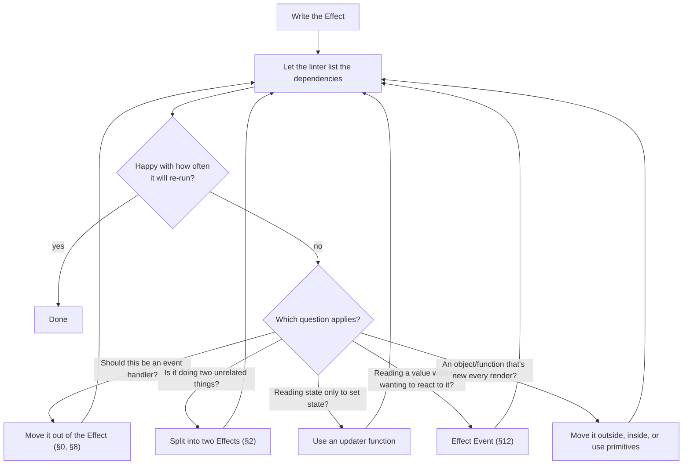

Note what's missing from that chart: "delete the dependency and disable the lint rule." The loop
always goes back through the linter.

> **Interview framing:** "The linter wants me to add a dependency that makes my Effect run too
> often. What do I do?" The weak answer is `// eslint-disable-next-line`. The strong answer quotes
> the principle ("dependencies should match the code, so to remove one, prove it isn't one") and
> then walks the checklist: move event-specific logic to a handler, split unrelated Effects, use an
> updater instead of reading state, move objects and functions outside or inside the Effect or
> depend on their primitive fields, and for genuinely non-reactive reads use `useEffectEvent`
> (React 19.2). Mentioning *why* objects cause re-runs (`Object.is` identity, a new object every
> render) is what shows you understand the mechanism.

---

<a id="sec-4"></a>

## 4. Stale closures: the bug behind "my Effect sees old state"

### Start here: a closure, from scratch

This bug is pure JavaScript, so it's worth rebuilding the JS idea first. (Chapter 00 covers it in
full, in [Closures](../00-javascript-and-browser-fundamentals/javascript/README.md#1-closures).)

A **closure** is a function plus the variables it could see where it was *created*. The function
keeps access to those variables even after the code that created them has finished running:

```js
function makeGreeter() {
  const name = 'Ada';
  return () => console.log(`Hi ${name}`); // this arrow "closes over" name
}

const greet = makeGreeter(); // makeGreeter has finished...
greet();                     // ...but this still logs "Hi Ada"
```

Now apply that to React. A component is a function that React calls on **every render**, and each
call creates **new** variables. `count` in render 1 and `count` in render 2 aren't the same
variable being updated. They're two separate `const`s in two separate function calls (ch.02's
snapshot rule, [§2](../02-state-and-events/README.md#sec-2)). Any function created during a render
(an event handler, an Effect, a `setInterval` callback inside an Effect) closes over **that
render's** variables.

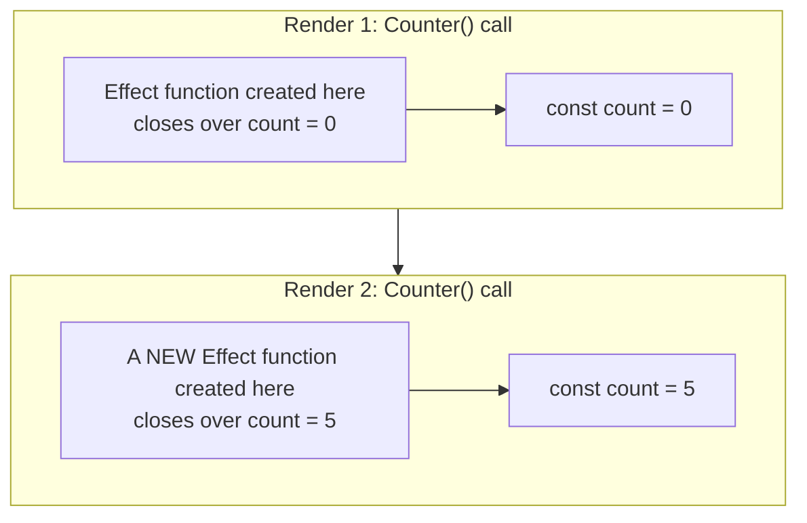

A **stale closure** is when code keeps running a function from an *old* render, so it keeps seeing
that render's values. With Effects, the usual cause is that React never ran the newer Effect,
because the dependency array said nothing had changed.

### The canonical bug, verified

```jsx
function Ticker() {
  const [count, setCount] = useState(0);

  useEffect(() => {
    const id = setInterval(() => {
      console.log(`interval sees count=${count}`);
    }, 1000);
    return () => clearInterval(id);
  }, []); // ❌ reads `count` but doesn't list it

  return <button onClick={() => setCount(5)}>Set to 5 (now {count})</button>;
}
```

Click the button. The screen shows 5. The console keeps printing `interval sees count=0` forever.
This was run against React 19.2.8 (state set to 5, then the interval allowed to fire several times),
and every tick logged `interval sees count=0` (see [Sources](#sources)).

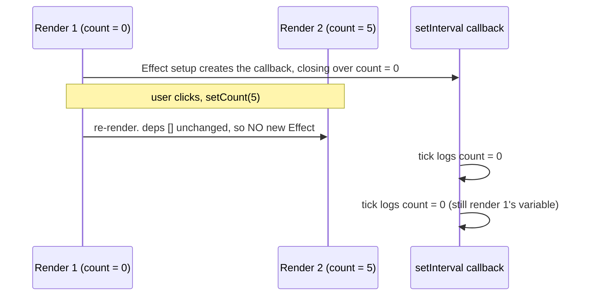

The worse variant, which you'll meet in interviews, *writes* state from the stale closure:

```jsx
useEffect(() => {
  const id = setInterval(() => {
    setCount(count + 1); // always setCount(0 + 1)
  }, 1000);
  return () => clearInterval(id);
}, []);
```

The counter goes 0 → 1 and then appears frozen. Every tick asks for `0 + 1`, and once state is
already `1`, React's `Object.is` bail-out (ch.02, [§1](../02-state-and-events/README.md#sec-1))
means nothing visibly happens. The interval is still running. It's just repeatedly asking for the
same value.

### The fixes, and when each is right

There's no single "stale closure fix." Start with the question that decides most of them: **should
this value changing restart the synchronization?** Then pick based on what the stale code is doing:

| Situation | Fix | Why it works |
|---|---|---|
| The Effect should re-synchronize when the value changes | **Add the dependency** (what the linter says) | React re-runs setup with the new render's closure |
| The Effect only *writes* state based on the previous state | **Updater function**: `setCount(c => c + 1)` | React passes the latest value, so the closure never reads `count` |
| The value is part of an *event* fired from the Effect, and changing it genuinely shouldn't restart the synchronization | **`useEffectEvent`** ([§12](#sec-12), React 19.2) | Effect Events are non-reactive and always see the latest props and state |
| Same as above, pre-19.2 or outside Effects | **A ref** holding the latest value (ch.04) | `ref.current` is one mutable box shared by every render |
| It shouldn't be in an Effect at all | **Move it to an event handler** ([§8](#sec-8)) | Handlers are recreated every render and run with fresh values |

Don't read the `useEffectEvent` row as "stale closure? use `useEffectEvent`." That's the misuse
the docs warn against ([§12](#sec-12)). It isn't a general way to get the latest value. It's for
separating the *non-reactive* part of an Effect from the reactive part. If the value changing
*should* restart the Effect, it's a dependency, and wrapping it in an Effect Event reintroduces a
bug.

For the interval, the updater is the right fix. Adding `count` to the dependencies *also* works,
but it tears down and recreates the interval every tick, which resets its timing:

```jsx
// ✅ Best for this case: no dependency on count at all
useEffect(() => {
  const id = setInterval(() => setCount(c => c + 1), 1000);
  return () => clearInterval(id);
}, []);

// ✅ Correct, but the interval is cleared and recreated after every tick
useEffect(() => {
  const id = setInterval(() => setCount(count + 1), 1000);
  return () => clearInterval(id);
}, [count]);
```

### Stale closures aren't only in Effects

The same bug shows up anywhere a function outlives the render that created it:

```jsx
// A listener registered once, reading state
useEffect(() => {
  function onKeyDown(e) {
    if (e.key === 'Enter') submit(draft); // ❌ draft from the first render, forever
  }
  window.addEventListener('keydown', onKeyDown);
  return () => window.removeEventListener('keydown', onKeyDown);
}, []); // linter would flag `draft` and `submit`
```

ch.02 ([§2](../02-state-and-events/README.md#sec-2)) showed the event-handler version:
`setTimeout(() => alert(count), 3000)` alerts the count from the click's render, not the current
one. Same mechanism: a function created in one render, run later.

> **Interview framing:** "Why does this interval only increment once?" is one of the most common
> React debugging prompts. Name the mechanism *before* the fix: the Effect ran once, so the
> interval callback is a closure over the first render's `count`. Each render has its own `count`
> constant, and the callback never sees the new ones. Then give the fix that fits: an updater
> function here, because the callback only needs to write. Mention that adding `count` as a
> dependency also works but recreates the interval every tick, and that suppressing the
> exhaustive-deps lint rule is how this bug usually gets written in the first place.

---

<a id="sec-5"></a>

## 5. Cleanup: what needs it, when it runs, and what it sees

### Start here: cleanup undoes setup

If setup starts something that keeps running or keeps holding a resource, cleanup has to stop it.
The simplest check is to look for pairs:

| Setup does… | Cleanup must… |
|---|---|
| `window.addEventListener('resize', fn)` | `window.removeEventListener('resize', fn)` (the **same** `fn`) |
| `setInterval(...)` / `setTimeout(...)` | `clearInterval(id)` / `clearTimeout(id)` |
| `connection.connect()` | `connection.disconnect()` |
| `store.subscribe(listener)` | call the returned unsubscribe function |
| `fetch(url)` | abort it, or ignore its result ([§9](#sec-9)) |
| `dialog.showModal()` | `dialog.close()` |
| `node.style.opacity = 1` (start an animation) | reset it to its initial value |
| `thirdPartyWidget.init(node)` | `widget.destroy()` |

Effects that don't hold anything open (setting `document.title`, logging an analytics event) usually
need no cleanup.

The docs frame the goal as symmetry. A user shouldn't be able to tell the difference between setup
running once and setup → cleanup → setup:

> "The effect needs to work after re-mounting, which means the connection needs to be cleaned up."
> — [`learn/synchronizing-with-effects`](https://react.dev/learn/synchronizing-with-effects)

Put differently, an Effect must be **resilient to being started, stopped, and started again**.
Setup → cleanup → setup has to leave the external system in the same state as a single setup. That
one property is what Strict Mode tests ([§6](#sec-6)), what `<Activity>` relies on, and what a
dependency change exercises on every re-sync. (Note that it's the setup/cleanup *pair* that has to
be symmetrical. Setup on its own usually isn't safe to repeat: running it twice without cleanup
opens two connections.)

> **The rule to remember: cleanup does not mean "the component is unmounting."** Cleanup means
> "stop the synchronization this particular Effect run started." Unmount is one occasion for that.
> A dependency change is another, and it happens while the component stays mounted. Strict Mode's
> rehearsal and `<Activity>` hiding are two more.

### Two jobs cleanup does

Cleanup isn't only about leaks. It does two different jobs, and a correct Effect often needs both:

| Job | What it prevents | Examples |
|---|---|---|
| **Resource cleanup** | Things that keep running or keep holding memory after they're no longer wanted | `removeEventListener`, `clearInterval`, `disconnect()`, unsubscribe, `widget.destroy()` |
| **Correctness cleanup** | Old async work still affecting the *current* UI | setting an `ignore` flag so a stale response is dropped, aborting a request, stopping an old subscription's callback from writing into new state |

The second job is what the race-condition fixes in [§9](#sec-9) are. It's also why React 18
dropping the "setState on an unmounted component" warning (below) didn't make cleanup less
important. In both cases the cleanup defines **which asynchronous work is still allowed to affect
what's on screen**, and the unmount case is only one of them.

### What goes wrong without it

```jsx
function WindowWidth() {
  const [width, setWidth] = useState(window.innerWidth);

  useEffect(() => {
    function onResize() { setWidth(window.innerWidth); }
    window.addEventListener('resize', onResize);
    // ❌ no cleanup
  }, []);

  return <p>{width}px</p>;
}
```

Each time this component mounts, one more listener is added and none are ever removed. Mount it
behind a toggle ten times and ten listeners fire on every resize, nine of them for components that
no longer exist. Every listener keeps its closure, and everything that closure references, in
memory. That's a real leak, and Strict Mode is designed to make it visible on day one ([§6](#sec-6)).

### A JavaScript detail: `removeEventListener` needs the same function

```jsx
// ❌ removes nothing: the two arrows are different function objects
useEffect(() => {
  window.addEventListener('resize', () => setWidth(window.innerWidth));
  return () => window.removeEventListener('resize', () => setWidth(window.innerWidth));
}, []);

// ✅ one named function, passed to both
useEffect(() => {
  function onResize() { setWidth(window.innerWidth); }
  window.addEventListener('resize', onResize);
  return () => window.removeEventListener('resize', onResize);
}, []);
```

`removeEventListener` finds the listener to remove by identity. Two arrow functions with identical
source code are still two different objects (ch.00,
[Objects & equality](../00-javascript-and-browser-fundamentals/javascript/README.md#7-objects--equality)).
Silent, too: removing a listener that was never added doesn't throw.

A tidier alternative for DOM listeners is an `AbortController` signal, which removes every listener
registered with it in one call. The mechanism is covered in [§9](#sec-9):

```jsx
useEffect(() => {
  const controller = new AbortController();
  window.addEventListener('resize', onResize, { signal: controller.signal });
  window.addEventListener('scroll', onScroll, { signal: controller.signal });
  return () => controller.abort(); // removes both
}, []);
```

### When cleanup runs, and which values it sees

From your code's point of view, cleanup runs in two situations:

1. **Before the next setup**, when a dependency changed. The component is still mounted.
2. **When the component's Effects are torn down.** Usually that's unmounting (removal from the
   screen). It also happens when an `<Activity>` boundary is hidden (React 19.2+, [§6](#sec-6)),
   and during Strict Mode's simulated unmount in development.

And it always sees the values from **the render that created it**, not the current ones. That's
the same closure rule from [§4](#sec-4), and this time it's what you want:

```jsx
useEffect(() => {
  console.log(`subscribe ${userId}`);
  return () => console.log(`unsubscribe ${userId}`); // the OLD userId
}, [userId]);

// userId: 1 → 2 → unmount logs:
// subscribe 1
// unsubscribe 1   ← cleanup from the render where userId was 1
// subscribe 2
// unsubscribe 2
```

### React 17: cleanup became asynchronous

This change is specifically about **`useEffect`** cleanup. Before React 17, "effect cleanup
functions used to run synchronously (similar to `componentWillUnmount` being synchronous in
classes)." React 17 changed that:

> "In React 17, the effect cleanup function always runs asynchronously — for example, if the
> component is unmounting, the cleanup runs *after* the screen has been updated."
>
> "Additionally, React 17 will always execute all effect cleanup functions (for all components)
> before it runs any new effects."
> — [React 17 release notes](https://legacy.reactjs.org/blog/2020/08/10/react-v17-rc.html)

Layout Effect cleanup was not made asynchronous. The same notes point to it as the escape hatch:
"In the rare cases where you might want to rely on the synchronous execution, you can switch to
`useLayoutEffect` instead."

The practical consequence the release notes called out is about refs. By the time cleanup runs,
React may already have detached a ref, so `ref.current` can be `null`:

```jsx
// ❌ ref.current is read at cleanup time. It may already be null.
useEffect(() => {
  someRef.current.someSetupMethod();
  return () => {
    someRef.current.someCleanupMethod();
  };
});

// ✅ capture the instance during setup. The cleanup closes over the captured value.
useEffect(() => {
  const instance = someRef.current;
  instance.someSetupMethod();
  return () => {
    instance.someCleanupMethod();
  };
});
```

The fix is the closure rule again, used on purpose: copy the mutable value into a local `const` so
the cleanup closes over a value that can't change underneath it.

### React 18: the "setState on an unmounted component" warning is gone

Older code is full of `isMounted` flags written only to silence this warning. React 18 removed it:

> "Previously, React warned about memory leaks when you call `setState` on an unmounted component.
> This warning was added for subscriptions, but people primarily run into it in scenarios where
> setting state is fine, and workarounds make the code worse. We've removed this warning."
> — [React 18 upgrade guide](https://react.dev/blog/2022/03/08/react-18-upgrade-guide)

That doesn't mean late state updates are always fine. For data fetching, a late response setting
state is still a **correctness** bug (the wrong result can land on screen), and [§9](#sec-9)'s
`ignore` flag or `AbortController` is the fix. The warning was just a poor way of detecting it.

### You can't pass an `async` function to `useEffect`

```jsx
// ❌ an async function always returns a Promise, and React expects "nothing or a cleanup function"
useEffect(async () => {
  const res = await fetch(`/api/users/${userId}`);
  setUser(await res.json());
}, [userId]);
```

This was run against React 19.2.8 to see exactly what happens (see [Sources](#sources)). In
development React logs:

```
useEffect must not return anything besides a function, which is used for clean-up.

It looks like you wrote useEffect(async () => ...) or returned a Promise. Instead, write the async
function inside your effect and call it immediately:
```

Then, when React later tries to run the "cleanup" (on unmount or a dependency change), it calls the
Promise as if it were a function, which throws `TypeError: destroy is not a function`. In this repo
the tooling stops you before it gets that far. The TypeScript types reject it ([§1](#sec-1)), and
`oxlint` flags it with "Effect callbacks are synchronous to prevent race conditions." The correct
shape is to define the async function *inside* the Effect and call it, which leaves the Effect
itself free to return a real cleanup:

```jsx
useEffect(() => {
  let ignore = false;
  async function load() {
    const res = await fetch(`/api/users/${userId}`);
    const data = await res.json();
    if (!ignore) setUser(data);
  }
  load();
  return () => { ignore = true; };
}, [userId]);
```

> **Interview framing:** "When does the cleanup function run?" Answer with both occasions, before
> the next setup when dependencies change and on unmount, then add the detail most candidates
> miss: cleanup closes over the *old* render's values, which is why it disconnects from the correct
> room. For senior depth, add the React 17 change (cleanup is asynchronous and all cleanups run
> before any new setups), the ref-capture pattern that change requires, and the fact that React 18
> dropped the unmounted-`setState` warning because `isMounted` workarounds made code worse.

---

<a id="sec-6"></a>

## 6. Strict Mode's double Effect: what it's protecting against

Chapter 01 ([§8](../01-foundations/README.md#sec-8)) introduced Strict Mode as a development-only
wrapper that double-invokes things to catch impure code. This section is about the Effect part of
that behavior specifically, since Effects are where it confuses people most.

### Start here: what actually happens

> "When Strict Mode is on, React will **run one extra development-only setup+cleanup cycle** before
> the first real setup. This is a stress-test that ensures that your cleanup logic 'mirrors' your
> setup logic and that it stops or undoes whatever the setup is doing."
> — [`reference/react/useEffect`](https://react.dev/reference/react/useEffect)

Here's the same `Parent`/`Child` probe from [§2](#sec-2), now wrapped in `<StrictMode>`, run on
React 19.2.8:

```
render Parent(a)
render Parent(a)        ← double render (ch.01 §8)
render Child(a)
render Child(a)
  layout setup Child(a)
  layout setup Parent(a)
  effect setup Child(a)
  effect setup Parent(a)
  layout cleanup Parent(a)    ← simulated unmount...
  layout cleanup Child(a)
  effect cleanup Parent(a)
  effect cleanup Child(a)
  layout setup Child(a)       ← ...and remount with the same state
  layout setup Parent(a)
  effect setup Child(a)
  effect setup Parent(a)
--- update dep a->b          ← updates and unmount: identical to non-Strict Mode
```

It matches the sequence the React 18 upgrade guide describes: mount (layout effects, then
effects), simulate unmounting (destroy both), then "simulate mounting the component with the
previous state." Note that the extra cycle happens **only when a component first mounts**. The
update after it looks exactly like production.

> **React 19.3 change:** the 19.3 changelog lists "Double invoke Effects in Strict Mode during
> hydration, matching client-rendered roots"
> ([React 19.3 release post](https://react.dev/blog/2026/09/09/react-19-3)). Hydration means
> attaching React to server-rendered HTML (ch.17). So from 19.3, the extra dev cycle also happens
> for server-rendered apps, not just client-rendered ones like this repo's Vite app. It isn't
> visible in this repo, which runs 19.2.8 with no SSR, but it removes one more place where a missing
> cleanup could go unnoticed in development.

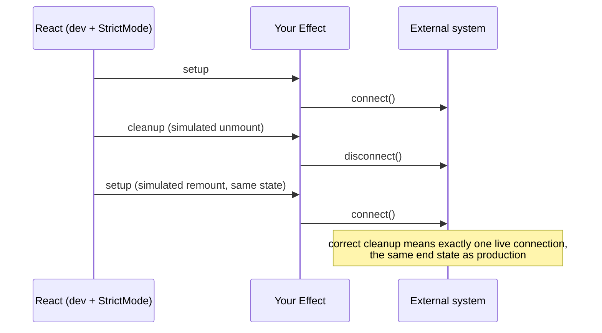

### Why React does this: remounting is real

The React 18 upgrade guide gives the reason: React wants to be able to remove and restore parts of
the UI while keeping their state, e.g. switching tabs and back. "To do this, React would unmount and
remount trees using the same component state as before," and the Strict Mode check exists so
components are ready for that
([React 18 upgrade guide](https://react.dev/blog/2022/03/08/react-18-upgrade-guide)).

In **React 19.2** that stopped being hypothetical. The new `<Activity>` component has a hidden mode
that, per the release notes, "hides the children, **unmounts effects**, and defers all updates"
([React 19.2 release post](https://react.dev/blog/2025/10/01/react-19-2)). A tab hidden with
`<Activity mode="hidden">` keeps its state, runs its Effect cleanups, and runs setup again when
shown. That's the exact cycle Strict Mode rehearses. An Effect that fails the Strict Mode check
will fail there too, in production. (Activity is covered properly in ch.07.)

### The right question, and the wrong fix

> "The key question is not 'how to run an Effect once,' but 'how to fix the Effect so that it works
> after remounting'." … "Don't use refs to prevent Effects from firing."
> — [`learn/synchronizing-with-effects`](https://react.dev/learn/synchronizing-with-effects)

```jsx
// ❌ The anti-pattern: a ref guard that "fixes" the double call in dev
const didConnect = useRef(false);
useEffect(() => {
  if (didConnect.current) return;
  didConnect.current = true;
  const connection = createConnection(roomId);
  connection.connect();
  // no cleanup — so leaving the page, or an <Activity> hide, leaks the connection
}, [roomId]);

// ✅ The fix: a cleanup that mirrors setup
useEffect(() => {
  const connection = createConnection(roomId);
  connection.connect();
  return () => connection.disconnect();
}, [roomId]);
```

The ref guard hides the symptom in development and leaves the real bug for production. It's
broken in two separate ways:

1. **No cleanup**, so the connection leaks when the component unmounts or an `<Activity>` hides it.
2. **It blocks legitimate re-synchronization too.** `roomId` is a dependency, so when it changes
   React re-runs the Effect, as it should. But the ref is still `true` from the first run, so the
   Effect returns early and the component stays connected to the *old* room. The guard can't tell
   Strict Mode's rehearsal apart from a real change it needs to respond to.

(Exercise 3's `ChatConnection` reproduces both. After "switch room," the stats panel still shows
only the first room's connection.)

### Common "it runs twice!" cases and what to do

| Symptom in development | What's going on | Fix |
|---|---|---|
| Two connections / two listeners / duplicate events | Missing or incomplete cleanup | Write the cleanup ([§5](#sec-5)) |
| Fetch fires twice | Expected. The first request's result is discarded if you ignore or abort it | `ignore` flag or `AbortController` ([§9](#sec-9)). Or a caching library (ch.11), which dedupes |
| Analytics event logged twice | Expected, and dev-only. The docs: "**We recommend keeping this code as is.** … In production, there will be no duplicate visit logs." | Nothing. Dev-machine analytics shouldn't reach production metrics anyway |
| A POST / purchase / "send email" fires twice | It was never an Effect. It's caused by an interaction | Move it to the event handler ([§8](#sec-8)) |
| App-wide init (check auth token, load config) runs twice | It isn't tied to a component at all | Run it at module level, outside any component ([§8](#sec-8)) |
| An animation plays twice | Setup didn't have a reset in cleanup | Reset the animated property in cleanup |

> **Interview framing:** "Why does my `useEffect` run twice, and how do I stop it?" Explain the
> mechanism first (a dev-only setup → cleanup → setup cycle on mount that checks that cleanup
> mirrors setup), then reject the premise: the goal isn't to stop it, it's to make the Effect
> correct under it. Name the ref-guard anti-pattern and why it's wrong. Two things lift this to a
> senior answer: the reason (React needs components to survive being unmounted and remounted with
> preserved state, which React 19.2's `<Activity>` now does in production), and the table above,
> i.e. knowing that a double POST means the code belonged in an event handler.

---

<a id="sec-7"></a>

## 7. `useLayoutEffect` vs `useEffect` (and `useInsertionEffect`)

### Start here: the flicker problem

Picture a tooltip that should appear *above* a button, unless there isn't room, in which case it
goes below. You can't know whether there's room until the tooltip is actually in the DOM and you
can measure its height. So the steps are:

1. Render the tooltip somewhere (possibly the wrong place).
2. Measure it.
3. Re-render it in the right place.

If step 2 happens in `useEffect`, which usually runs **after the browser paints**, the user sees
step 1 for a frame, and the tooltip visibly jumps. The docs list exactly these steps and add the
requirement:

> "**All of this needs to happen before the browser repaints the screen.** You don't want the user
> to see the tooltip moving."
> — [`reference/react/useLayoutEffect`](https://react.dev/reference/react/useLayoutEffect)

`useLayoutEffect` has the same API as `useEffect`, but:

> "`useLayoutEffect` is a version of `useEffect` that fires before the browser repaints the
> screen."
> — [`reference/react/useLayoutEffect`](https://react.dev/reference/react/useLayoutEffect)

```jsx
function Tooltip({ children }) {
  const ref = useRef(null);
  const [tooltipHeight, setTooltipHeight] = useState(0); // real height unknown yet

  useLayoutEffect(() => {
    const { height } = ref.current.getBoundingClientRect();
    setTooltipHeight(height); // re-render with the real height, BEFORE the paint
  }, []);

  // ...use tooltipHeight to decide above/below...
  return <div ref={ref}>{children}</div>;
}
```

The re-render triggered inside `useLayoutEffect` is also processed before the paint, so the user
only ever sees the final position. That has a knock-on cost the reference spells out:

> "If you trigger a state update inside `useLayoutEffect`, React will execute all remaining Effects
> immediately including `useEffect`."
> — [`reference/react/useLayoutEffect`](https://react.dev/reference/react/useLayoutEffect)

So a `setState` in a layout Effect doesn't only re-render before paint. It also pulls every pending
regular Effect forward so it runs before paint as well. That's one more way `useEffect` can end up
running before paint ([§1](#sec-1)), and one more reason to keep layout Effects small and rare.

### The timing, side by side

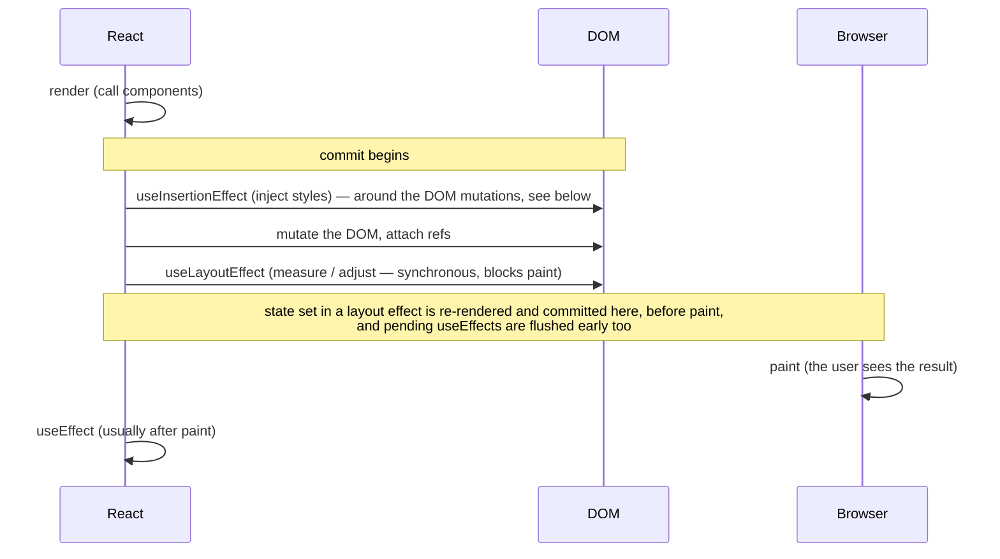

The probe in [§2](#sec-2) confirms the layout-then-regular part of that picture: within a commit,
**every** layout Effect ran before **any** regular Effect.

### The cost

> "`useLayoutEffect` can hurt performance. Prefer `useEffect` when possible."
>
> "The code inside `useLayoutEffect` and all state updates scheduled from it **block the browser
> from repainting the screen.** When used excessively, this makes your app slow."
> — [`reference/react/useLayoutEffect`](https://react.dev/reference/react/useLayoutEffect)

The browser can't show *anything* new until your layout Effect finishes. Slow work there is a
frozen frame, which is exactly the "interaction to next paint" delay ch.20 measures.

It also does nothing during server rendering, since there's no layout on the server:

> "`useLayoutEffect` does nothing on the server. The purpose is to let your component use layout
> information for rendering, which is impossible during server-side rendering since there is no
> layout information on the server."

### `useInsertionEffect`, for completeness

> "`useInsertionEffect` is for CSS-in-JS library authors. Unless you are working on a CSS-in-JS
> library and need a place to inject the styles, you probably want `useEffect` or
> `useLayoutEffect` instead."
> — [`reference/react/useInsertionEffect`](https://react.dev/reference/react/useInsertionEffect)

**When it runs is deliberately loose.** The hooks overview says it "fires before React makes
changes to the DOM" ([`reference/react/hooks`](https://react.dev/reference/react/hooks)). The
reference page's setup description says it runs "when your component is added to the DOM, but
before any layout Effects fire." And its caveats say it "may run either before or after the DOM has
been updated. You shouldn't rely on the DOM being updated at any particular time"
([`reference/react/useInsertionEffect`](https://react.dev/reference/react/useInsertionEffect)). The
only firm promise relevant here is that it runs **before any layout Effects**, so CSS injected by
a CSS-in-JS library is in place before layout Effects take their measurements.

A probe on React 19.2.8 shows why the docs hedge (see [Sources](#sources)). Two sibling components
logged `container.textContent` from inside their insertion Effects:

```
  insertion setup A1  (DOM text now: "")        ← mount: DOM not yet attached
  insertion setup B1  (DOM text now: "")
  layout setup A1  (DOM text now: "A1B1")
  layout setup B1  (DOM text now: "A1B1")
--- update v1 -> v2
  insertion cleanup A1
  insertion setup A2  (DOM text now: "A2B1")    ← update: A's own DOM text ALREADY changed
  layout cleanup A1
  insertion cleanup B1
  insertion setup B2  (DOM text now: "A2B2")
  layout cleanup B1
  layout setup A2  (DOM text now: "A2B2")
  layout setup B2  (DOM text now: "A2B2")
```

On mount it ran before the DOM had anything in it. On an update it ran after its own component's
DOM text had changed. That's the documented "before *or* after." The same log shows the second
documented quirk: "Unlike other types of Effects, which fire cleanup for every Effect and then
setup for every Effect, `useInsertionEffect` will fire both cleanup and setup one component at a
time." That's the one exception to [§2](#sec-2)'s "all cleanups before any setups."

Other rules: you can't update state inside it, and refs aren't attached yet. For application code,
know it exists and what it's for, and you're done.

### Choosing

| | `useEffect` | `useLayoutEffect` | `useInsertionEffect` |
|---|---|---|---|
| Runs | after commit, usually after paint | after DOM mutations, **before** paint | during the commit, **before any layout Effects**. Before or after DOM mutations is unspecified |
| Blocks paint? | no (normally) | **yes** | yes |
| Can set state? | yes | yes (re-render happens before paint, and pending `useEffect`s are flushed early) | **no** |
| Refs attached? | yes | yes | **no** |
| Cleanup/setup order across components | all cleanups, then all setups | all cleanups, then all setups | **interleaved**, one component at a time |
| Runs on the server? | no | no | no |
| Use it for | almost everything: subscriptions, fetching, timers, logging | measuring layout and repositioning before the user sees it | injecting CSS in a CSS-in-JS library |

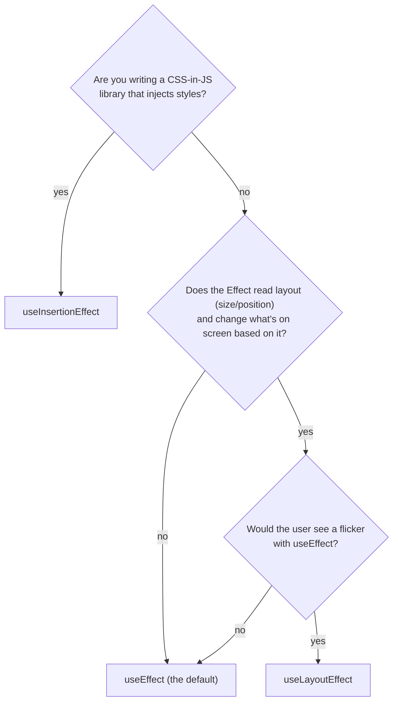

> **Interview framing:** "When would you use `useLayoutEffect`?" The answer is timing: it runs
> after the DOM is mutated but *before* the browser paints, so you can measure layout and correct
> it without a visible flicker (tooltips, popovers, scroll restoration). Always pair that with the
> cost: it blocks paint, so it's the exception, and `useEffect` is the default. Senior additions:
> state updates inside it are also processed before paint, and they force pending `useEffect`s to
> run immediately too; it does nothing during SSR; and `useInsertionEffect` is the even-earlier hook
> reserved for CSS-in-JS libraries. Its only firm timing promise is "before layout Effects," and the
> docs explicitly say not to rely on whether the DOM has been updated yet.

---

<a id="sec-8"></a>

## 8. Effect anti-patterns: you might not need an Effect

### Start here: an Effect is an escape hatch

Effects let a component step *outside* React to talk to an external system. When there's no
external system involved, stepping outside React and back in just adds a render, adds a way to be
wrong, and makes the data flow harder to follow. React's docs have a whole page on this, and it
opens with two rules:

> "You don't need Effects to transform data for rendering." … "You don't need Effects to handle
> user events."
> — [`learn/you-might-not-need-an-effect`](https://react.dev/learn/you-might-not-need-an-effect)

Every anti-pattern below breaks one of those two rules. Each is shown ❌ then ✅, using the docs'
own examples where possible.

### 1. Derived state: computing a value from props or state

```jsx
// ❌ redundant state + an Effect to keep it in sync
function Form() {
  const [firstName, setFirstName] = useState('Taylor');
  const [lastName, setLastName] = useState('Swift');
  const [fullName, setFullName] = useState('');
  useEffect(() => {
    setFullName(firstName + ' ' + lastName);
  }, [firstName, lastName]);
  // ...
}

// ✅ calculate it during rendering
function Form() {
  const [firstName, setFirstName] = useState('Taylor');
  const [lastName, setLastName] = useState('Swift');
  const fullName = firstName + ' ' + lastName;
  // ...
}
```

> "If something can be calculated from the existing props or state, don't put it in state.
> Instead, calculate it during rendering."
> — [`learn/you-might-not-need-an-effect`](https://react.dev/learn/you-might-not-need-an-effect)

The ❌ version isn't only wordier. It renders the screen **twice** for every keystroke, and the
first of those renders shows a stale `fullName`:

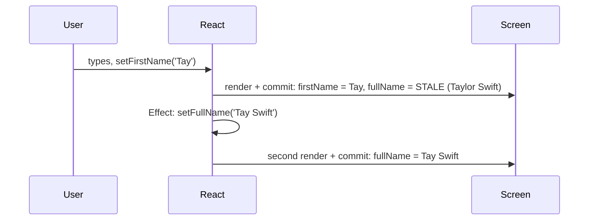

This is ch.02's "avoid redundant state" principle
([§8](../02-state-and-events/README.md#sec-8)) seen from the Effect side.

### 2. Expensive derived values → `useMemo`, not an Effect

If the derived value is expensive to compute (filtering thousands of items), the answer is still
to compute it during render, with caching:

```jsx
// ❌ state + Effect
const [visibleTodos, setVisibleTodos] = useState([]);
useEffect(() => {
  setVisibleTodos(getFilteredTodos(todos, filter));
}, [todos, filter]);

// ✅ computed during render, and only re-computed when todos or filter change
const visibleTodos = useMemo(() => getFilteredTodos(todos, filter), [todos, filter]);
```

`useMemo` is ch.06. The point here is only that "expensive" is never a reason to move a
calculation into an Effect. Keep the two roles separate. `useMemo` is an **optimization** of a
calculation you'd otherwise do during render, and removing it should never change behavior. An
Effect is a **synchronization** with something outside React. They aren't alternatives to each
other. Start with the plain calculation during render, and add `useMemo` only if it's measurably
slow (that's judgment, and ch.06 covers how to measure).

### 3. Resetting all state when a prop changes → `key`

```jsx
// ❌ wipe the draft comment in an Effect when the user changes
function ProfilePage({ userId }) {
  const [comment, setComment] = useState('');
  useEffect(() => {
    setComment('');
  }, [userId]); // renders once with the OLD comment for the NEW user, then clears it
}

// ✅ give the stateful part a key; a new key means a fresh component with fresh state
function ProfilePage({ userId }) {
  return <Profile userId={userId} key={userId} />;
}
function Profile({ userId }) {
  const [comment, setComment] = useState(''); // resets automatically when userId changes
}
```

That's ch.02's `key`-as-reset technique ([§9](../02-state-and-events/README.md#sec-9)), and it's
the docs' recommended answer to "how do I reset state when a prop changes?"

### 4. Adjusting *some* state when a prop changes → during render, or better, not at all

Sometimes only part of the state should reset. For example, clear the *selection* when the `items`
list changes, but keep the sort order. The docs' least-bad option is to adjust state **during
rendering**, comparing with the previous prop:

```jsx
function List({ items }) {
  const [isReverse, setIsReverse] = useState(false);
  const [selection, setSelection] = useState(null);

  // Adjust the state while rendering
  const [prevItems, setPrevItems] = useState(items);
  if (items !== prevItems) {
    setPrevItems(items);
    setSelection(null);
  }
  // ...
}
```

Setting state during render sounds forbidden, so it's worth quoting why this is allowed:

> "When you update a component during rendering, React throws away the returned JSX and
> immediately retries rendering. To avoid very slow cascading retries, React only lets you update
> the *same* component's state during a render."
> — [`learn/you-might-not-need-an-effect`](https://react.dev/learn/you-might-not-need-an-effect)

It must be guarded by a condition (here, `items !== prevItems`), otherwise it loops. The docs call
the pattern "hard to understand, but … better than updating the same state in an Effect." The
*better* option is to restructure so there's nothing to adjust. Store the selected **id** and derive
the selected item:

```jsx
const [selectedId, setSelectedId] = useState(null);
const selection = items.find(item => item.id === selectedId) ?? null; // null if it's gone
```

### 5. Event-specific logic inside an Effect → event handler

```jsx
// ❌ the notification is really about the click, not about the product being on screen
function ProductPage({ product, addToCart }) {
  useEffect(() => {
    if (product.isInCart) {
      showNotification(`Added ${product.name} to the shopping cart!`);
    }
  }, [product]); // bug: also fires on page load if the product is already in the cart
  // ...
}

// ✅ shared logic in a plain function, called from the handlers that cause it
function ProductPage({ product, addToCart }) {
  function buyProduct() {
    addToCart(product);
    showNotification(`Added ${product.name} to the shopping cart!`);
  }
  function handleBuyClick() { buyProduct(); }
  function handleCheckoutClick() { buyProduct(); navigateTo('/checkout'); }
}
```

The same applies to a form submit. Setting a "please submit this" state and letting an Effect
notice it and send the POST is a longer way of writing an event handler, and it breaks under
Strict Mode, remounts, and back-navigation:

```jsx
// ❌ submit routed through state + Effect
const [jsonToSubmit, setJsonToSubmit] = useState(null);
useEffect(() => {
  if (jsonToSubmit !== null) post('/api/register', jsonToSubmit);
}, [jsonToSubmit]);
function handleSubmit(e) { e.preventDefault(); setJsonToSubmit({ firstName, lastName }); }

// ✅ the POST lives in the handler
function handleSubmit(e) {
  e.preventDefault();
  post('/api/register', { firstName, lastName });
}

// ✅ …while an analytics "visit" Effect in the same component is fine:
// it runs *because the form was displayed*
useEffect(() => { post('/analytics/event', { eventName: 'visit_form' }); }, []);
```

### 6. Chains of Effects

```jsx
// ❌ each Effect exists only to trigger the next one
useEffect(() => { if (card !== null && card.gold) setGoldCardCount(c => c + 1); }, [card]);
useEffect(() => { if (goldCardCount > 3) { setRound(r => r + 1); setGoldCardCount(0); } }, [goldCardCount]);
useEffect(() => { if (round > 5) setIsGameOver(true); }, [round]);
useEffect(() => { alert('Good game!'); }, [isGameOver]);
```

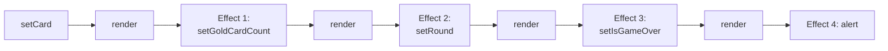

> "There are two problems with this code. The first problem is that it is very inefficient: the
> component (and its children) have to re-render between each `set` call in the chain. … The
> second problem is that even if it weren't slow, as your code evolves, you will run into cases
> where the 'chain' you wrote doesn't fit the new requirements."
> — [`learn/you-might-not-need-an-effect`](https://react.dev/learn/you-might-not-need-an-effect)

The fix: compute what you can during render (`const isGameOver = round > 5;`) and compute all the
next state **in the event handler** that started the chain (`handlePlaceCard`), so one click is one
batched render.

### 7. Notifying the parent in an Effect → call it in the handler

```jsx
// ❌ the parent finds out one render late, and renders twice
function Toggle({ onChange }) {
  const [isOn, setIsOn] = useState(false);
  useEffect(() => {
    onChange(isOn);
  }, [isOn, onChange]);
  // ...
}

// ✅ both updates happen in the same event → React batches them into one render
function Toggle({ onChange }) {
  const [isOn, setIsOn] = useState(false);
  function updateToggle(nextIsOn) {
    setIsOn(nextIsOn);
    onChange(nextIsOn);
  }
  // handleClick and handleDragEnd both call updateToggle(...)
}
```

> "React batches updates from different components together, so there will only be one render
> pass."
> — [`learn/you-might-not-need-an-effect`](https://react.dev/learn/you-might-not-need-an-effect)

Often the cleaner fix is to remove the child's state entirely and make it controlled by the parent
(ch.02, [§9](../02-state-and-events/README.md#sec-9)).

### 8. App initialization in an Effect → module level

Logic that should run once per page load, not once per component mount, doesn't belong to a
component at all:

```jsx
// ✅ runs once when the module is first imported
if (typeof window !== 'undefined') { // browser only
  checkAuthToken();
  loadDataFromLocalStorage();
}

function App() { /* ... */ }
```

(The docs also show a module-level `let didInit = false` guard inside an Effect, for when the code
must run after the first render. Note the guard is a *module* variable, not a ref, so it's one per
app load rather than one per component instance.)

**What "once" means here.** Top-level module code runs once **per module evaluation**. The docs'
wording is "Code at the top level runs once when your component is imported — even if it doesn't
end up being rendered." In a normal browser page load that's effectively once per page load, which
is what this pattern is for. It's not "once for the lifetime of the app" in every environment:

- **Server rendering:** a server module is evaluated once per server process and then shared by
  every request. That's why the example guards with `typeof window !== 'undefined'`. Per-user work
  must never live at module level on the server (ch.17).
- **HMR in development:** editing the file re-evaluates the module, so it runs again.
- **Tests:** test runners often isolate or reset modules between test files, so it can run once
  per file.

So the precise rule is: code that should run when the module is evaluated, and that doesn't depend
on any component's lifecycle, goes at module level.

### 9. Mirroring an external store into state → `useSyncExternalStore`

Subscribing in an Effect and copying a value into `useState` works, but React has a purpose-built
Hook for it. See [§11](#sec-11).

### The whole section as one decision chart

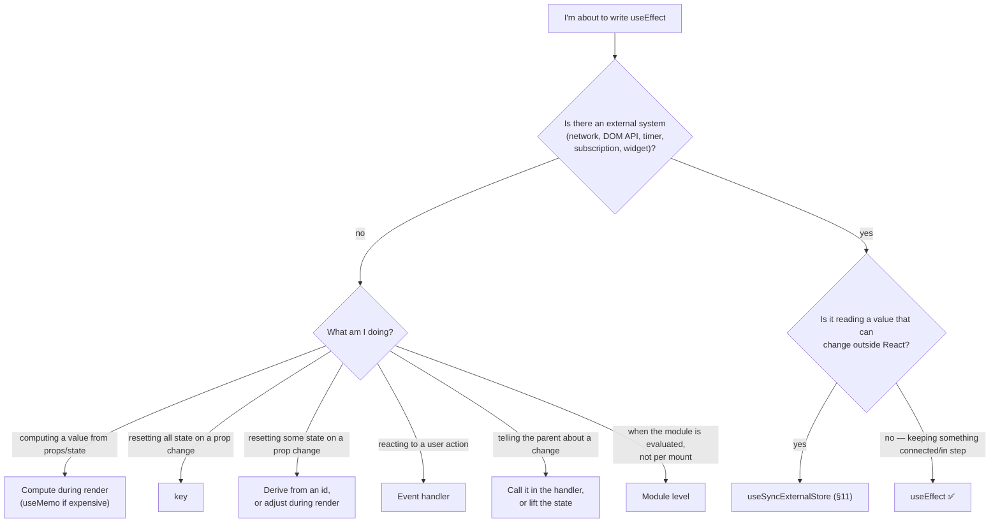

> **Interview framing:** "When should you *not* use `useEffect`?" is a favorite senior question,
> because over-using Effects is the most common way experienced React developers write fragile
> code. Lead with the principle: Effects are an escape hatch for synchronizing with *external*
> systems, so if nothing external is involved you probably don't need one. Then list concrete
> cases with their replacements: derived data → compute during render, reset on prop change →
> `key`, user-action logic → event handler, notifying a parent → call it in the same handler,
> app init → module level, external store → `useSyncExternalStore`. If asked what's actually
> *wrong* with the Effect version, name the extra render with a stale intermediate value, and the
> fragility of Effect chains.

---

<a id="sec-9"></a>

## 9. Data fetching in an Effect, done correctly: race conditions and `AbortController`

This section is about fetching *correctly* when you do it in an Effect. [§10](#sec-10) is about
whether an Effect is the right place at all. Both matter, and an interviewer can ask either.

### Start here: the naive version, and the bug it has

```jsx
function SearchResults({ query }) {
  const [results, setResults] = useState([]);

  useEffect(() => {
    fetch(`/api/search?q=${encodeURIComponent(query)}`)
      .then(res => res.json())
      .then(data => setResults(data)); // ❌ whichever response arrives LAST wins
  }, [query]);

  return <ul>{results.map(r => <li key={r.id}>{r.title}</li>)}</ul>;
}
```

It looks fine and mostly works. The problem is that network responses don't have to come back in
the order the requests went out:

> "This ensures [your code doesn't suffer from] 'race conditions': network responses may arrive in
> a different order than you sent them."
> — [`reference/react/useEffect`](https://react.dev/reference/react/useEffect)

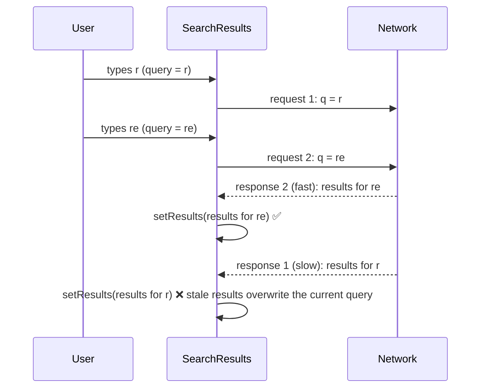

The input says "re" and the list shows results for "r." Nothing errors, it isn't reproducible on a
fast connection, and it gets worse with every keystroke. This is one of the most commonly shipped
React bugs.

### Fix 1: the `ignore` flag (the docs' pattern)

```jsx
useEffect(() => {
  let ignore = false;

  fetchResults(query).then(json => {
    if (!ignore) {
      setResults(json);
    }
  });

  return () => {
    ignore = true;
  };
}, [query]);
```

Why it works is the closure rule from [§4](#sec-4) and [§5](#sec-5). Each run of the Effect has its
own `ignore` variable. When `query` changes, React runs the **old** run's cleanup, which flips the
**old** run's `ignore` to `true`. When the old, slow response finally arrives, it checks its own
`ignore`, finds `true`, and drops the result.

> "This ensures that when your Effect fetches data, all responses except the last requested one
> will be ignored."
> — [`learn/you-might-not-need-an-effect`](https://react.dev/learn/you-might-not-need-an-effect)

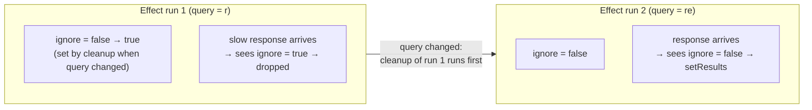

This is also why Strict Mode's double fetch is harmless: "the first Effect will immediately get
cleaned up so its copy of the `ignore` variable will be set to `true`"
([`learn/synchronizing-with-effects`](https://react.dev/learn/synchronizing-with-effects)).

### Fix 2: `AbortController`, which actually cancels the request

The `ignore` flag throws away the stale result, but the stale request still runs to completion,
using bandwidth and a connection slot. The browser's `AbortController` can cancel it.

An `AbortController` is a small object with two parts
([MDN: `AbortController`](https://developer.mozilla.org/en-US/docs/Web/API/AbortController)):

- `controller.signal`, an `AbortSignal` you hand to whatever you want to be cancellable (`fetch`,
  `addEventListener`, many libraries).
- `controller.abort()`, which aborts every operation holding that signal.

When a `fetch` is aborted, its promise **rejects** with a `DOMException` named `AbortError`
([MDN: `AbortSignal`](https://developer.mozilla.org/en-US/docs/Web/API/AbortSignal)). That rejection
is expected and must not be treated as a real error:

```tsx
type Status = 'idle' | 'loading' | 'success' | 'error';

function SearchResults({ query }: { query: string }) {
  const [results, setResults] = useState<Result[]>([]);
  const [status, setStatus] = useState<Status>('idle');
  const [error, setError] = useState<Error | null>(null);

  useEffect(() => {
    const controller = new AbortController();
    setStatus('loading');
    setError(null);

    fetch(`/api/search?q=${encodeURIComponent(query)}`, { signal: controller.signal })
      .then(res => {
        if (!res.ok) throw new Error(`HTTP ${res.status}`); // fetch doesn't reject on 404/500
        return res.json();
      })
      .then((data: Result[]) => {
        setResults(data);
        setStatus('success');
      })
      .catch((err: unknown) => {
        if (err instanceof DOMException && err.name === 'AbortError') return; // expected: we cancelled it
        setError(err instanceof Error ? err : new Error(String(err)));
        setStatus('error');
      });

    return () => controller.abort(); // cancel the in-flight request when query changes or on unmount
  }, [query]);

  // render based on status...
}
```

Three details in that code that interviewers like:

1. **`fetch` only rejects on network failure**, not on HTTP error statuses. A 404 or 500 resolves
   normally, so you check `res.ok` yourself.
2. **Filter out `AbortError`.** Otherwise every keystroke flashes an error state.
3. **`controller.abort()` after the response has already been fully handled does nothing**, so it's
   safe to call unconditionally in cleanup.

Abort and `ignore` aren't competitors. Abort saves the network work, and the ignore check guarantees
correctness even for async steps after the fetch that don't take a signal. In practice
`if (controller.signal.aborted) return;` before setting state gives you both with one object.

### Two more `AbortSignal` tools worth knowing

From [MDN: `AbortSignal`](https://developer.mozilla.org/en-US/docs/Web/API/AbortSignal):

- **`AbortSignal.timeout(ms)`** returns a signal that aborts itself after a delay. A fetch aborted
  this way rejects with a `TimeoutError` rather than `AbortError`, so you can tell them apart.
- **`AbortSignal.any([a, b])`** returns a signal that aborts when *any* of the given signals does.
  That's how you combine "the user moved on" with "give up after 5 seconds":

```js
const controller = new AbortController();
const signal = AbortSignal.any([controller.signal, AbortSignal.timeout(5000)]);
fetch(url, { signal }); // cancelled by cleanup OR by the timeout, whichever comes first
```

### Debouncing: the live search this chapter builds

Firing a request on every keystroke is wasteful even when it's correct. **Debouncing** means
waiting until the user pauses typing before doing the work (ch.00 implements `debounce` from
scratch). In an Effect, the debounce timer is just one more thing the cleanup cancels:

```tsx
useEffect(() => {
  if (query.trim() === '') return; // nothing to search. Render an empty state from `query` itself

  const controller = new AbortController();
  const timeoutId = setTimeout(() => {
    setStatus('loading');
    search(query, controller.signal)
      .then(data => { setResults(data); setStatus('success'); })
      .catch(err => {
        if (err instanceof DOMException && err.name === 'AbortError') return;
        setStatus('error');
      });
  }, 300);

  return () => {
    clearTimeout(timeoutId); // typed again within 300ms: the request never starts
    controller.abort();      // typed again after it started: cancel it
  };
}, [query]);
```

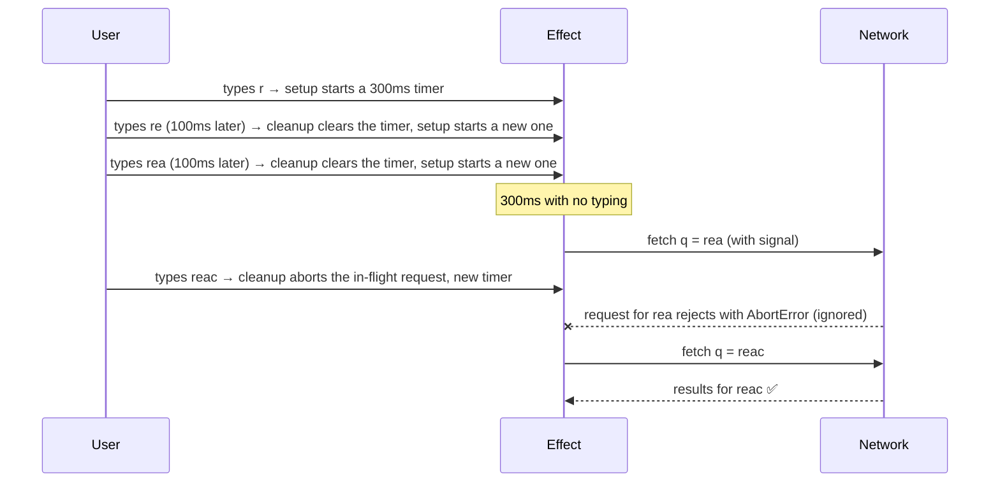

One cleanup function handles both stages: a timer that hasn't fired yet, and a request that's in
flight.

### What aborting does *not* do

Aborting stops the *browser* from waiting on the response. It doesn't reach into the server and
undo work. If the request was a POST that the server already processed, it was processed. So
cancel-on-cleanup is for **reads**. Mutations belong in event handlers ([§8](#sec-8)) and need
their own idempotency story (ch.12).

> **Interview framing:** "Find the bug in this search component" (with the naive fetch-in-Effect)
> is a very common live prompt. Name it precisely: a **race condition**, because responses can
> arrive out of order and the last one to *arrive* wins rather than the last one *requested*. Give
> both fixes and what each buys: an `ignore` flag flipped in cleanup (correctness, per the docs),
> and `AbortController` (correctness *and* cancelling the wasted request, with `AbortError`
> filtered out). Bonus points for debouncing with `clearTimeout` in the same cleanup, checking
> `res.ok` because `fetch` doesn't reject on HTTP errors, and noting that aborting doesn't undo
> server-side work. Then, unprompted, say that in a real app you'd likely use a data library or
> your framework's loader instead, and why ([§10](#sec-10)).

---

<a id="sec-10"></a>

## 10. Where should data fetching live? A decision framework

### Start here: "Effects are old, Suspense is new" is the wrong story

It's tempting to learn this as a timeline where each newer tool replaces the older one. It's more
accurate to see five tools that solve **different problems**, several of which are used together
in the same app. React's docs are explicit that fetching in an Effect has real costs, and they
list them:

> 1. "Effects don't run on the server." The initial HTML contains only a loading state.
> 2. "Fetching directly in Effects makes it easy to create 'network waterfalls'." A parent fetches,
>    renders a child, and only then does the child start *its* fetch.
> 3. "Fetching directly in Effects usually means you don't preload or cache data." Unmount and
>    remount, and it fetches again.
> 4. "It's not very ergonomic." There's boilerplate, and race conditions to get right.
>
> — paraphrased and quoted from the "What are good alternatives to data fetching in Effects?" deep
> dive, [`learn/synchronizing-with-effects`](https://react.dev/learn/synchronizing-with-effects)

The same deep dive recommends using your framework's data fetching if you use one, and otherwise a
client-side cache such as TanStack Query, useSWR, or React Router 6.4+.

### What each option actually is

| Option | What problem it solves | When the fetch starts | Who caches / dedupes | Covered in |
|---|---|---|---|---|
| **Fetch in an Effect** | Synchronizing a component with an external system. Fetching is just one example | After the component renders and commits (client only) | Nobody. You write it | this chapter |
| **Router loader** (React Router data/framework mode) | Load the data a *route* needs, as part of navigation | "Loaders are called before the route component is rendered," on navigation ([React Router docs](https://reactrouter.com/start/data/data-loading)) | The router, per navigation | ch.10 |
| **Server Component** | Fetch on the server, next to the data, and send rendered output. No client-side fetch code at all | On the server, during rendering | The framework (e.g. Next.js) | ch.17 |
| **Suspense-enabled source** (`use(promise)` with a cached promise, or a Suspense-enabled framework) | Let a component *read* async data as if it were ready, with Suspense showing a fallback meanwhile | Whenever the promise was created, ideally *before* rendering | Whoever created and cached the promise | ch.07 |
| **TanStack Query** (or SWR) | Manage *server state* on the client: caching, deduping, background refetch, retries, invalidation after mutations | When a component using the query mounts, or earlier via prefetch | The query cache | ch.11 |

Two clarifications prevent common confusions:

- **Suspense isn't a fetching library.** It coordinates *what to show while something isn't ready*.
  It only works with sources that tell React they're waiting, and a plain fetch in an Effect isn't
  one of them: "Suspense does not detect when data is fetched inside an Effect or event handler"
  ([`reference/react/Suspense`](https://react.dev/reference/react/Suspense)).
- **These combine.** A router loader can prefetch into TanStack Query's cache. A Server Component
  can pass a promise to a client component that reads it with `use` inside a Suspense boundary.
  TanStack Query hands your query function an `AbortSignal` that it aborts "when a query becomes
  out-of-date or inactive," which is [§9](#sec-9)'s pattern done for you
  ([TanStack Query: query cancellation](https://tanstack.com/query/latest/docs/framework/react/guides/query-cancellation)).

### Choosing

```mermaid
flowchart TD
    q1{"Do you have a server-rendering framework<br/>with Server Components (e.g. Next.js App Router)?"}
    q1 -->|"yes, and the data isn't user-interactive"| rsc["Fetch in a Server Component (ch.17)"]
    q1 -->|"no, or it's client-interactive"| q2{"Is the data determined by the route/URL<br/>and needed before the page can show?"}
    q2 -->|"yes, and you use a data router"| loader["Router loader (ch.10)"]
    q2 -->|"no"| q3{"Is it server state that's shared, cached,<br/>refetched, or mutated?"}
    q3 -->|"yes (most real apps)"| tq["TanStack Query / SWR (ch.11)"]
    q3 -->|"no, a one-off read in a tiny app or a learning exercise"| eff["Effect with abort + ignore (§9)"]
    q1 -.->|"any of these can feed"| susp["Suspense + use() for loading UI (ch.07)"]
```

### Where Effects are still exactly right

Not every network interaction is a request/response fetch. Effects remain the correct tool for
**ongoing synchronization**: holding a WebSocket or `EventSource` open for the room on screen,
subscribing to a browser API, driving a non-React widget. Those are "keep something connected
while this component is displayed," which is the thing Effects were designed for. And libraries
like TanStack Query are themselves built on Effects and external-store subscriptions under the
hood. The docs even list "build your own cache using Effects" as an option.

> **Interview framing:** "How would you fetch data in a React app today?" A senior answer doesn't
> pick one tool. It says "it depends on the problem" and then actually lays out the problems. An
> Effect synchronizes with an external system and leaves caching, deduping and races to you. A
> router loader ties data to navigation and avoids waterfalls. A Server Component fetches on the
> server with no client code. TanStack Query manages client-side server state with caching and
> invalidation. Suspense coordinates loading UI but doesn't fetch anything. Name the Effect
> approach's four documented downsides (no SSR, waterfalls, no caching, race-condition
> boilerplate) and say what you'd reach for in *this* interviewer's hypothetical stack.

---

<a id="sec-11"></a>

## 11. `useSyncExternalStore`: subscribing to things outside React

### Start here: what an "external store" is

An **external store** is data that lives outside React and can change on its own, without React
knowing:

- `navigator.onLine` (the browser flips it when the network drops)
- `window.innerWidth`, `matchMedia('(prefers-color-scheme: dark)')`
- a value in `localStorage` changed by another tab
- a state-management library's store (Redux, Zustand, your own module-level object)

A component that displays one of these needs to (1) read its current value and (2) re-render when
it changes. The obvious way uses an Effect:

```jsx
// Works, but it's the pattern this section replaces
function useOnlineStatus() {
  const [isOnline, setIsOnline] = useState(true);   // a guess for the first render
  useEffect(() => {
    function update() { setIsOnline(navigator.onLine); }
    update();                                        // correct the guess after mount
    window.addEventListener('online', update);
    window.addEventListener('offline', update);
    return () => {
      window.removeEventListener('online', update);
      window.removeEventListener('offline', update);
    };
  }, []);
  return isOnline;
}
```

That has three problems:

1. **The first render uses a guess** (`true`) and only corrects it after mount, costing an extra
   render and possibly a flash of wrong UI.
2. **Concurrent rendering can "tear."** React 18+ can pause a render partway and resume later
   (ch.07/ch.19). If the store changes during that pause, components rendered before and after the
   change can show *different* versions of the same store in one screen. That inconsistency is
   called *tearing*. `useSyncExternalStore` guards against it. Per its docs, React re-checks the
   snapshot before committing a transition and, if it changed, re-renders synchronously "to ensure
   that every component on screen is reflecting the same version of the store."
3. **Server rendering** has no `navigator`, and the Effect version can't provide a server value.

The React 18 release notes describe the Hook as a way to let "external stores … support concurrent
reads by forcing updates to the store to be synchronous. It removes the need for useEffect when
implementing subscriptions to external data sources"
([React 18 release post](https://react.dev/blog/2022/03/29/react-v18)).

### The API

```js
const snapshot = useSyncExternalStore(subscribe, getSnapshot, getServerSnapshot?)
```

Per [`reference/react/useSyncExternalStore`](https://react.dev/reference/react/useSyncExternalStore):

- **`subscribe(callback)`** registers `callback` with the store and returns an unsubscribe
  function. The store calls `callback` whenever it changes, which makes React call `getSnapshot`
  again.
- **`getSnapshot()`** returns the current value the component needs. "While the store has not
  changed, repeated calls to `getSnapshot` must return the same value." If the value differs by
  `Object.is`, React re-renders.
- **`getServerSnapshot()`** (optional) is the value used during server rendering and hydration.

```jsx
import { useSyncExternalStore } from 'react';

// Defined OUTSIDE the component: stable identities, so React never re-subscribes needlessly
function subscribe(callback) {
  window.addEventListener('online', callback);
  window.addEventListener('offline', callback);
  return () => {
    window.removeEventListener('online', callback);
    window.removeEventListener('offline', callback);
  };
}

export function useOnlineStatus() {
  return useSyncExternalStore(
    subscribe,
    () => navigator.onLine, // client value
    () => true              // server value (there's no navigator on the server)
  );
}

function ChatIndicator() {
  const isOnline = useOnlineStatus();
  return <h1>{isOnline ? '✅ Online' : '❌ Disconnected'}</h1>;
}
```

No guess, no extra render, no tearing, and a server value. The docs note you'll usually wrap it in
a custom Hook like `useOnlineStatus`, as above, rather than calling it directly in components.

```mermaid
sequenceDiagram
    participant C as Component
    participant R as React
    participant S as External store
    R->>C: render
    C->>R: useSyncExternalStore(subscribe, getSnapshot)
    R->>S: getSnapshot() → value used for this render
    R->>S: subscribe(callback) after commit
    S->>R: store changes → callback()
    R->>S: getSnapshot() again
    alt value changed by Object.is
      R->>C: re-render with the new snapshot
    else same value
      R->>R: nothing to do
    end
```

### A store of your own

The same Hook works with any object that can be subscribed to. This is the shape state libraries
like Redux and Zustand use internally (ch.13):

```ts
type Todo = { id: number; text: string };

let todos: Todo[] = [];
const listeners = new Set<() => void>();

export const todosStore = {
  addTodo(text: string) {
    todos = [...todos, { id: Date.now(), text }]; // a NEW array, so the snapshot changes
    listeners.forEach(l => l());
  },
  subscribe(listener: () => void) {
    listeners.add(listener);
    return () => { listeners.delete(listener); };
  },
  getSnapshot() {
    return todos; // the SAME array until something changes
  },
};

function TodoCount() {
  const list = useSyncExternalStore(todosStore.subscribe, todosStore.getSnapshot);
  return <p>{list.length} todos</p>;
}
```

### The two traps

**Trap 1: `getSnapshot` returns a new object every call.**

```jsx
// ❌ a fresh object every time → React thinks the store changed on every check
const user = useSyncExternalStore(subscribe, () => ({ name: store.name, age: store.age }));
```

This was run against React 19.2.8 (see [Sources](#sources)). React logs
`The result of getSnapshot should be cached to avoid an infinite loop`, and then the render fails
with `Maximum update depth exceeded`. The docs' rule is: "The store snapshot returned by
`getSnapshot` must be immutable. If the underlying store has mutable data, return a new immutable
snapshot if the data has changed. Otherwise, return a cached last snapshot." Fixes: return a
primitive (`() => store.name`), return an object the store only replaces on change (like `todos`
above), or call the Hook once per primitive field.

**Trap 2: `subscribe` defined inside the component.**

> "If a different `subscribe` function is passed during a re-render, React will re-subscribe to the
> store using the newly passed `subscribe` function. You can prevent this by declaring `subscribe`
> outside the component."
> — [`reference/react/useSyncExternalStore`](https://react.dev/reference/react/useSyncExternalStore)

It's the same identity problem as object dependencies in [§3](#sec-3). If `subscribe` genuinely
depends on a prop, it has to be created inside the component, and ch.06's `useCallback` keeps its
identity stable.

> **React 19.3 fix worth knowing about:** the 19.3 changelog lists "Fix `useSyncExternalStore`
> missing store mutations that happened while an `<Activity>` tree was hidden"
> ([React 19.3 release post](https://react.dev/blog/2026/09/09/react-19-3)). That changelog line is
> the full extent of what's documented. Treat it as a narrow edge case (store mutations during a
> hidden `<Activity>`) that behaves differently on 19.2.x and 19.3, not as a general caveat on the
> Hook. This repo runs 19.2.8 and doesn't use `<Activity>` yet.

### When to use it, and when not

> "When possible, we recommend using built-in React state with `useState` and `useReducer` instead.
> The `useSyncExternalStore` API is mostly useful if you need to integrate with existing non-React
> code."
> — [`reference/react/useSyncExternalStore`](https://react.dev/reference/react/useSyncExternalStore)

So: state your app owns → `useState`/`useReducer`. A value owned by the browser or a non-React
library → `useSyncExternalStore`, usually inside a custom Hook. Something you need to *keep
connected* rather than *read* (a chat connection) → `useEffect`.

> **Interview framing:** "How would you subscribe a component to `window` size, or to a non-React
> store?" A custom Hook with `useEffect` + `useState` is a workable answer, especially for a simple
> client-only app. The React primitive designed for this is `useSyncExternalStore`, so name it and
> say what it adds: no guessed first render, a server snapshot for SSR and hydration, and
> consistent snapshots under concurrent rendering (no tearing), none of which the Effect version
> gives you.
> Then name both traps (an uncached `getSnapshot` causes an infinite loop, and an inline
> `subscribe` resubscribes every render) and mention that this is the primitive libraries like
> Redux and Zustand build on.

---

<a id="sec-12"></a>

## 12. Preview: `useEffectEvent` (stable in React 19.2)

This gets full treatment in ch.07. It's previewed here because it's the missing piece in two
earlier sections: the stale-closure fix table in [§4](#sec-4) and the dependency checklist in
[§3](#sec-3).

### The problem it solves

```jsx
function ChatRoom({ roomId, theme }) {
  useEffect(() => {
    const connection = createConnection(serverUrl, roomId);
    connection.on('connected', () => {
      showNotification('Connected!', theme); // reads theme...
    });
    connection.connect();
    return () => connection.disconnect();
  }, [roomId, theme]); // ...so theme must be a dependency → switching dark mode RECONNECTS the chat
}
```

`theme` is reactive, and the Effect reads it, so the linter correctly demands it as a dependency.
But reconnecting because the notification color changed is wrong. Part of this Effect is reactive
(which room to connect to) and part isn't (how to style a notification when something happens).

> "Event handlers only re-run when you perform the same interaction again. Unlike event handlers,
> Effects re-synchronize if some value they read, like a prop or a state variable, is different
> from what it was during the last render."
> — [`learn/separating-events-from-effects`](https://react.dev/learn/separating-events-from-effects)

### The solution

```jsx
import { useEffect, useEffectEvent } from 'react';

function ChatRoom({ roomId, theme }) {
  const onConnected = useEffectEvent(() => {
    showNotification('Connected!', theme); // always sees the LATEST theme
  });

  useEffect(() => {
    const connection = createConnection(serverUrl, roomId);
    connection.on('connected', () => {
      onConnected();
    });
    connection.connect();
    return () => connection.disconnect();
  }, [roomId]); // ✅ all dependencies declared (Effect Events aren't dependencies)
}
```

> "Similar to DOM events, Effect Events always 'see' the latest props and state."
> — [React 19.2 release post](https://react.dev/blog/2025/10/01/react-19-2)

An **Effect Event** is a function whose logic behaves like an event handler: not reactive, always
reading fresh values. It's fired from inside an Effect instead of by a user. `useEffectEvent` was
released as stable in **React 19.2** (1 October 2025).

### The rules

From [`reference/react/useEffectEvent`](https://react.dev/reference/react/useEffectEvent):

1. **Only call it from inside Effects** (or other Effect Events). "Effects" covers all three
   kinds: the returned function can be called "inside `useEffect`, `useLayoutEffect`,
   `useInsertionEffect`, or from within other Effect Events in the same component." And: "Do not
   call them during rendering or pass them to other components or Hooks."
2. **Never list it as a dependency, because it's non-reactive.** "Effect Events are not reactive
   and must always be omitted from dependencies of your Effect"
   ([`reference/react/useEffect`](https://react.dev/reference/react/useEffect)). Calling it is
   deliberately *not* part of the Effect's reactive synchronization. That's the reason. A secondary,
   implementation-level detail: its identity "intentionally changes on every render," so listing it
   would also make the Effect re-run every render. Don't learn the rule as "omit it because its
   identity changes." Learn it as "omit it because it represents non-reactive logic."
3. **It's not a way to silence the linter.** "Do not use `useEffectEvent` to avoid specifying
   dependencies in your Effect's dependency array. This hides bugs and makes your code harder to
   understand."

Rule 3 is the one that gets tested. The question to ask is: *if this value changes, should the
synchronization restart?* `roomId` changing means you're connected to the wrong room, so it's
reactive. `theme` changing doesn't make the connection wrong, so it's the event part.

### A second pattern: pass the reactive part as an argument

```jsx
function Page({ url }) {
  const { items } = useContext(ShoppingCartContext);
  const numberOfItems = items.length;

  const onVisit = useEffectEvent(visitedUrl => {
    logVisit(visitedUrl, numberOfItems); // latest cart size, without re-logging when it changes
  });

  useEffect(() => {
    onVisit(url);
  }, [url]); // a new url IS a new visit → reactive
}
```

Passing `url` as an argument, rather than reading it inside, makes it explicit that each new `url`
is a separate "event," while `numberOfItems` is read at its latest value
([`learn/separating-events-from-effects`](https://react.dev/learn/separating-events-from-effects)).

> **React 19.3 fix:** the changelog lists "Fix `useEffectEvent` to read the latest values in
> `forwardRef` and `memo` components"
> ([React 19.3 release post](https://react.dev/blog/2026/09/09/react-19-3)). That's a narrow,
> version-specific edge case, not a general caveat on the API. The changelog line is the whole
> extent of what's documented, so don't read more into it. It's worth remembering only as "if an
> Effect Event inside a `forwardRef` or `memo` component seems to read a stale value on 19.2.x,
> check this fix." This repo is on 19.2.8.

### Tooling note for this repo

The 19.2 release notes say to upgrade to `eslint-plugin-react-hooks@latest` "so that the linter
doesn't try to insert them as dependencies." This repo uses `oxlint` instead. A probe with an
Effect that calls an Effect Event and omits it from the array produced **no** warning, and
`@types/react` 19.2 exports `useEffectEvent`, so it can be used here as-is (both verified by
running, see [Sources](#sources)).

> **Interview framing:** "How do you read the latest value of a prop inside an Effect without
> re-running the Effect when it changes?" In React 19.2+: `useEffectEvent`. Explain the
> reactive/non-reactive split with the chat-and-theme example, state the rules (call only from
> Effects, never a dependency, not a lint escape hatch), and mention the older workaround, a ref
> updated on every render (ch.04), to show you know why the API exists. If you're asked about it in
> a codebase on React < 19.2, say so. Version awareness is itself part of a senior answer.

---

## Sources

The official documentation below was used to verify this chapter's **React-specific technical
claims** before they were written (see `CLAUDE.md`'s "Accuracy & currency practice"), grouped by
the section that relies on each. Several claims were settled by **running** React or the toolchain
rather than reading a doc. Those are listed separately at the end with instructions for
re-checking them.

What this list deliberately does *not* cover: the **mental models** ("an Effect is a start/stop
pair," "the linter is a stale-closure detector," the definition of tearing given in plain terms)
are explanatory framings built on the cited behavior, not claims the docs make about React's
internals. The **interview guidance** in the framing boxes is judgment, not documented fact.

### Official documentation

- [§0](#sec-0), [§2](#sec-2), [§5](#sec-5), [§6](#sec-6), [§9](#sec-9), [§10](#sec-10) —
  [`learn/synchronizing-with-effects`](https://react.dev/learn/synchronizing-with-effects) — the
  definition of Effects ("caused by rendering itself"), "Effects run at the end of a commit after
  the screen updates," the three steps and three dependency-array forms, "how to fix the Effect so
  that it works after remounting," "Don't use refs to prevent Effects from firing," the analytics
  guidance ("We recommend keeping this code as is"), two fetches in development being expected,
  initializing the application at module level, and the four downsides of fetching in Effects.
- [§1](#sec-1), [§5](#sec-5), [§6](#sec-6), [§9](#sec-9), [§12](#sec-12) —
  [`reference/react/useEffect`](https://react.dev/reference/react/useEffect) — the setup/cleanup
  contract paragraph, dependencies compared with `Object.is`, re-running after every commit when
  the array is omitted, the Strict Mode extra setup+cleanup cycle, Effects running only on the
  client, the two interaction-timing caveats, the object/function dependency caveat, the race
  condition / `ignore` example, and Effect Events being omitted from dependencies.
- [§2](#sec-2), [§3](#sec-3) — [`learn/lifecycle-of-reactive-effects`](https://react.dev/learn/lifecycle-of-reactive-effects)
  — "Effects have a different lifecycle from components," "start synchronizing / stop
  synchronizing," thinking from the Effect's perspective, the reactive-values definition, the
  "Can global or mutable values be dependencies?" section (`location.pathname` and `ref.current`
  "can't be a dependency" because changing them doesn't trigger a re-render, the ref *object* itself
  being allowed, and reading mutable data during render breaking purity), and "each Effect …
  should represent a separate and independent synchronization process."
- [§3](#sec-3) — [`learn/removing-effect-dependencies`](https://react.dev/learn/removing-effect-dependencies)
  — "Dependencies should match the code," "prove that it's not a dependency," "Suppressing the
  linter leads to very unintuitive bugs," the `options`-object reconnect example and the three
  fixes, and the updater-function fix for `messages`.
- [§2](#sec-2) — [`reference/react/Component`](https://react.dev/reference/react/Component) —
  the note that `componentDidMount`/`componentDidUpdate`/`componentWillUnmount` together are
  equivalent to `useEffect` for many use cases, with `useLayoutEffect` "a closer match" when code
  must run before paint.
- [§0](#sec-0), [§8](#sec-8), [§9](#sec-9) — [`learn/you-might-not-need-an-effect`](https://react.dev/learn/you-might-not-need-an-effect)
  — the two opening rules, "if something can be calculated … calculate it during rendering," the
  "ask *why* this code needs to run" rule, and every ❌/✅ example in [§8](#sec-8): `fullName`,
  `useMemo` filtering, `key` reset, the `prevItems` adjust-during-render pattern and its caveat
  quote, the product notification, the register POST vs. analytics, the card game chain and its
  "two problems" quote, the `Toggle`/`onChange` fix and the batching quote, app initialization
  (`didInit` and module level), and the race-condition `ignore` fix.
- [§6](#sec-6) — [`reference/react/StrictMode`](https://react.dev/reference/react/StrictMode) —
  the list of development-only behaviors, including re-running Effects an extra time and all
  checks being development-only.
- [§7](#sec-7), [§2](#sec-2) — [`reference/react/useLayoutEffect`](https://react.dev/reference/react/useLayoutEffect)
  — "fires before the browser repaints the screen," the tooltip steps and example, "can hurt
  performance," blocking repaint (including state updates scheduled from it), "If you trigger a
  state update inside `useLayoutEffect`, React will execute all remaining Effects immediately
  including `useEffect`," and doing nothing on the server.
- [§7](#sec-7) — [`reference/react/useInsertionEffect`](https://react.dev/reference/react/useInsertionEffect)
  — CSS-in-JS library authors only, setup running "when your component is added to the DOM, but
  before any layout Effects fire," the caveat that it "may run either before or after the DOM has
  been updated," cleanup/setup interleaving one component at a time, no state updates, and refs not
  yet attached.
- [§7](#sec-7) — [`reference/react/hooks`](https://react.dev/reference/react/hooks) — the overview's
  one-line timing summaries: `useLayoutEffect` "fires before the browser repaints the screen" and
  `useInsertionEffect` "fires before React makes changes to the DOM" (a simplification that the
  `useInsertionEffect` page's own caveat qualifies).
- [§2](#sec-2) — [`learn/manipulating-the-dom-with-refs`](https://react.dev/learn/manipulating-the-dom-with-refs)
  — "React sets `ref.current` during the commit," nulled before the DOM update and set immediately
  after. That's the real reason Effects can read DOM refs.
- [§11](#sec-11) — [`reference/react/useSyncExternalStore`](https://react.dev/reference/react/useSyncExternalStore)
  — the signature and parameter definitions, the immutable/cached snapshot caveat, re-subscribing
  when `subscribe` changes identity, the transition re-check "to ensure that every component on
  screen is reflecting the same version of the store," the `navigator.onLine` example, wrapping it
  in a custom Hook, and the recommendation to prefer `useState`/`useReducer`.
- [§12](#sec-12) — [`reference/react/useEffectEvent`](https://react.dev/reference/react/useEffectEvent)
  — signature, where Effect Events can be called, "do not use `useEffectEvent` to avoid specifying
  dependencies," and identity intentionally changing every render.
- [§12](#sec-12) — [`learn/separating-events-from-effects`](https://react.dev/learn/separating-events-from-effects)
  — reactive vs. non-reactive logic, the chat/theme example, and the `onVisit(url)` pattern.
- [§5](#sec-5), [§2](#sec-2) — [React 17 release notes](https://legacy.reactjs.org/blog/2020/08/10/react-v17-rc.html)
  — "Effect Cleanup Timing": cleanup running asynchronously, all cleanups before any new Effects,
  and the `someRef.current` capture example. On the legacy docs site because React 17's release
  notes were never migrated to react.dev.
- [§1](#sec-1), [§5](#sec-5), [§6](#sec-6) — [React 18 upgrade guide](https://react.dev/blog/2022/03/08/react-18-upgrade-guide)
  — Strict Mode's new mount/unmount/remount check and its stated motivation, "Consistent useEffect
  timing" for discrete input events, and the removal of the unmounted-`setState` warning.
- [§11](#sec-11) — [React 18 release post](https://react.dev/blog/2022/03/29/react-v18) —
  `useSyncExternalStore` introduced to let external stores "support concurrent reads."
- Version note, [§6](#sec-6), [§11](#sec-11), [§12](#sec-12) — [React 19.3 release post](https://react.dev/blog/2026/09/09/react-19-3)
  (9 September 2026) and react.dev's [versions page](https://react.dev/versions) — 19.3 being the
  current release, its headline features, and three Effect-related changelog entries: Strict Mode
  double-invoking Effects during hydration, `useEffectEvent` reading latest values in
  `forwardRef`/`memo` components, and `useSyncExternalStore` no longer missing mutations while an
  `<Activity>` tree was hidden. `npm view react version` also returned `19.3.0` on 2026-09-20.
- [§6](#sec-6), [§12](#sec-12) — [React 19.2 release post](https://react.dev/blog/2025/10/01/react-19-2)
  (1 October 2025) — `useEffectEvent`, "Effect Events always 'see' the latest props and state," the
  `eslint-plugin-react-hooks@latest` requirement, and `<Activity>`'s hidden mode "unmounts
  effects."
- [§10](#sec-10) — [`reference/react/Suspense`](https://react.dev/reference/react/Suspense) —
  "Suspense does not detect when data is fetched inside an Effect or event handler," and the list
  of what does activate a boundary.
- [§5](#sec-5) — [MDN, `addEventListener`](https://developer.mozilla.org/en-US/docs/Web/API/EventTarget/addEventListener)
  — the `signal` option removing the listener when the controller aborts.
- [§9](#sec-9) — [MDN, `AbortController`](https://developer.mozilla.org/en-US/docs/Web/API/AbortController)
  and [MDN, `AbortSignal`](https://developer.mozilla.org/en-US/docs/Web/API/AbortSignal) — the
  controller/signal split, `fetch` rejecting with an `AbortError` `DOMException`,
  `AbortSignal.timeout()` rejecting with `TimeoutError`, and `AbortSignal.any()`.
- [§10](#sec-10) — [React Router, data loading](https://reactrouter.com/start/data/data-loading) —
  loaders defined on routes, `useLoaderData`, and "loaders are called before the route component is
  rendered."
- [§10](#sec-10) — [TanStack Query, query cancellation](https://tanstack.com/query/latest/docs/framework/react/guides/query-cancellation)
  — the `AbortSignal` passed to each query function and aborted "when a query becomes out-of-date
  or inactive."

### Verified by running, not from a doc

Each claim below is backed by a script in [`probes/`](probes/README.md), so it can be re-run rather
than taken on trust:

```bash
cd notes/03-side-effects-and-lifecycle/probes && npm install && npm run all
```

The probes pin React/React DOM **19.2.8** (this repo's version) and run React's development build
on a headless `happy-dom` document inside `act()`. `act()` flushes Effects synchronously, so they
confirm **order and messages, not paint timing**. Last run: Node 24.19, 2026-09-20. If a result
changes after a React upgrade, the section it backs needs re-checking.

- [§2](#sec-2), [§6](#sec-6), [§7](#sec-7) — **Effect execution order, with and without Strict
  Mode** — [`probes/effect-order.mjs`](probes/effect-order.mjs). A `Parent` → `Child` pair, each
  with one `useLayoutEffect` and one `useEffect`, mounted, updated and unmounted. The logs in
  [§2](#sec-2) and [§6](#sec-6) are its verbatim output. The same script checks that declaring
  `useEffect` *above* `useLayoutEffect` doesn't change the layout-first result. The child-first and
  parent-first-unmount orders are reported in [§2](#sec-2) as **observed behavior of 19.2.8**, not
  as documented guarantees. For the same order in a real browser, run exercise 1
  ([`ex1-effect-order-lab.tsx`](../../app/src/chapters/03-side-effects-and-lifecycle/ex1-effect-order-lab.tsx)).
- [§7](#sec-7) — **`useInsertionEffect` DOM timing and interleaving** —
  [`probes/insertion-timing.mjs`](probes/insertion-timing.mjs). On mount, insertion setup saw an
  empty DOM. On update, it saw its own component's new text, and cleanup/setup interleaved one
  component at a time. The log in [§7](#sec-7) is its verbatim output.
- [§4](#sec-4) — **The stale interval** — [`probes/stale-interval.mjs`](probes/stale-interval.mjs).
  The screen shows `count=5` while the `[]` Effect's interval logs only `interval sees count=0`.
- [§5](#sec-5) — **`useEffect(async () => …)` at runtime** —
  [`probes/async-effect.mjs`](probes/async-effect.mjs). The dev warning quoted in [§5](#sec-5),
  then `TypeError: destroy is not a function` on unmount. The call site is `callDestroy` in
  `app/node_modules/react-dom/cjs/react-dom-client.development.js`, which calls `destroy()` inside a
  `try`/`catch` that reports the error.
- [§11](#sec-11) — **Uncached `getSnapshot`** —
  [`probes/uncached-snapshot.mjs`](probes/uncached-snapshot.mjs).
  `The result of getSnapshot should be cached to avoid an infinite loop`, then
  `Maximum update depth exceeded`.
- [§1](#sec-1), [§3](#sec-3), [§5](#sec-5), [§12](#sec-12) — **This repo's TypeScript and linter** —
  [`probes/tooling.mjs`](probes/tooling.mjs), which uses the app's own `tsc` and `oxlint` (1.75,
  this repo's config). `tsc` rejects an async Effect with `TS2345 … not assignable to parameter of
  type 'EffectCallback'` (`@types/react` 19.2 defines `EffectCallback = () => void | Destructor`).
  `oxlint` flags an async Effect ("Effect callbacks are synchronous to prevent race conditions"),
  reports missing dependencies but not a state setter, and does not flag an Effect Event omitted
  from the dependency array.

---

## What you'll build
A **live-search component** with a debounced query, request cancellation via `AbortController`,
explicit loading/error/empty states, and no stale-closure or race-condition bugs. It runs against a
fake API with random latency so the race is reproducible on demand. That's exercise 4 in
[`exercises/README.md`](exercises/README.md), alongside labs for Effect order, stale closures,
cleanup, removing unnecessary Effects, and `useSyncExternalStore`. Starter code is in
[`app/src/chapters/03-side-effects-and-lifecycle/`](../../app/src/chapters/03-side-effects-and-lifecycle/).

---
When you've worked through the notes and exercises, say so and this chapter's `revision.md` will
get filled in and its status moved to `Done`.
