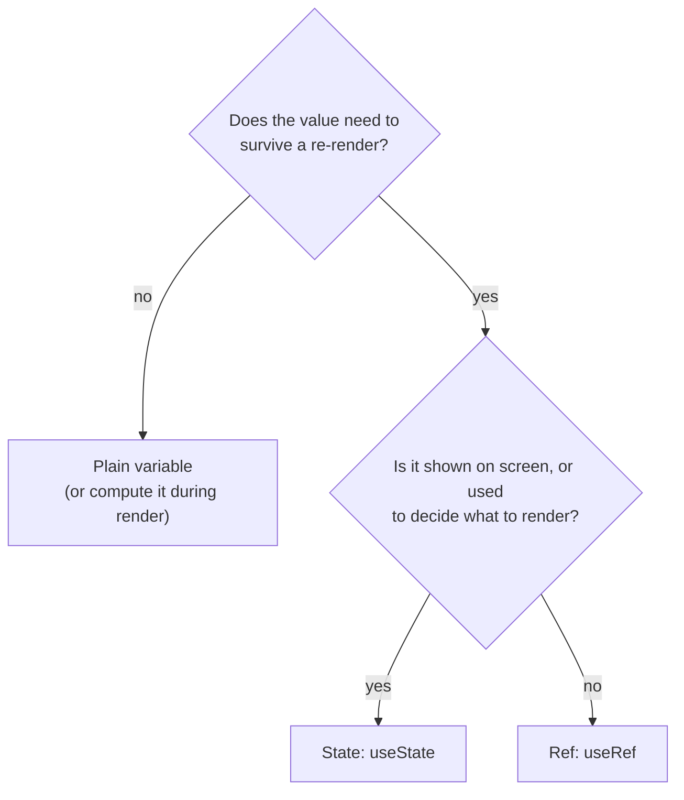
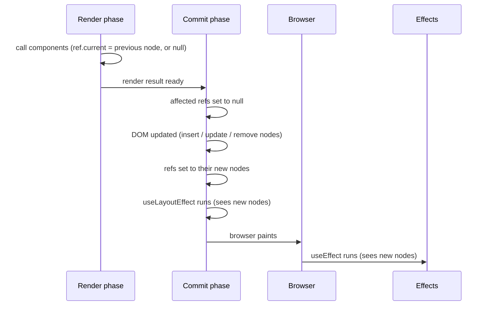
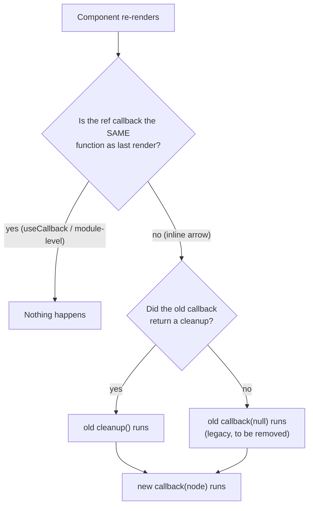
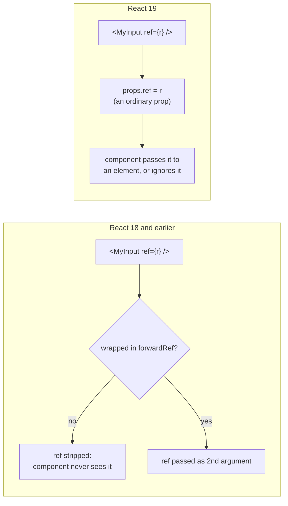
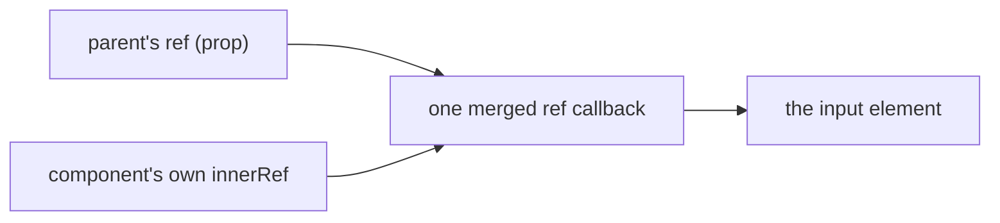
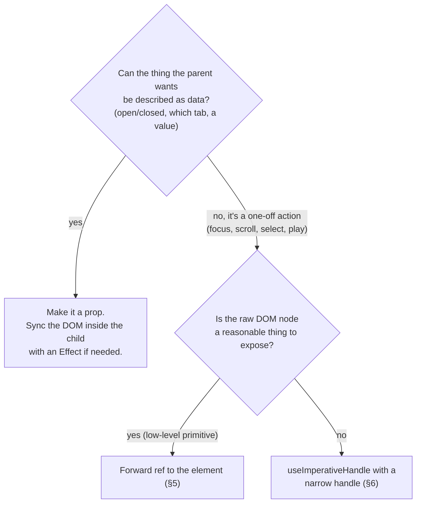
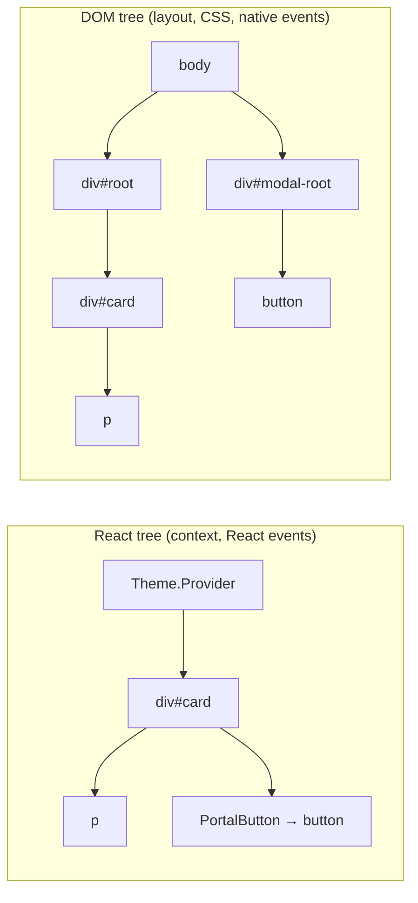
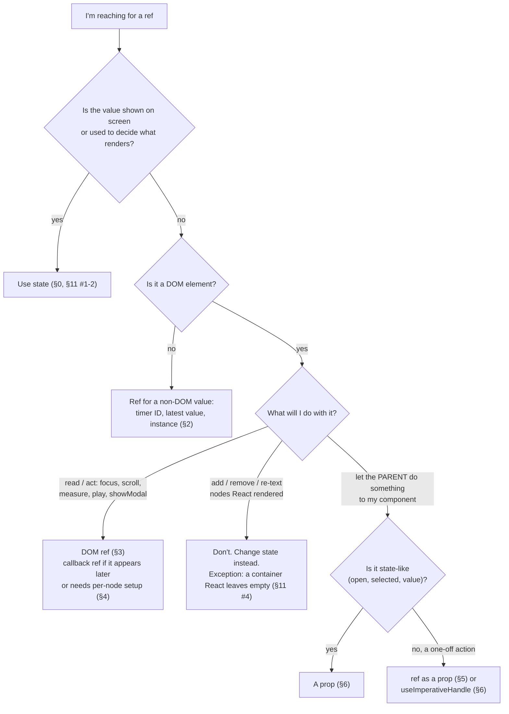

# Chapter 04: Refs & the DOM (Document Object Model)

**Status:** In Progress
**Folder:** `notes/04-refs-and-dom/`

## Why this chapter matters for a React interview

Chapters 01-03 were about React's main way of working. You describe the UI as a function of props
and state, React works out what changed, and React updates the page. You never touch the page
yourself. This chapter is about the **escape hatch** for the few jobs that model can't express:

- remembering a value across renders *without* re-rendering (a timer ID, the latest value of
  something, an instance of a non-React library)
- reaching the real browser element React created, so you can call a browser method on it
  (`focus()`, `scrollIntoView()`, `showModal()`, `getBoundingClientRect()`)
- rendering part of your UI somewhere else in the page (a modal or tooltip that must escape a
  parent's `overflow: hidden`)

Interviewers use this material two ways. The direct questions are API questions: "what's the
difference between a ref and state?", "how do you pass a ref to your own component in React 19?",
"what's `useImperativeHandle` for?", "how do events behave inside a portal?". The senior-level
questions are judgment questions: "would you expose `open()`/`close()` on this modal?", "this
component reads `ref.current` in its JSX, what's wrong?", "build an accessible modal". The original
outline for this chapter put it in one line: knowing when *not* to reach for a ref is as important
as knowing the API.

> Interview-frequency remarks like the ones above are practical guidance based on how these topics
> tend to be probed, not verifiable facts about React. The technical claims in this chapter are
> cited or were verified by running React itself (see [Sources](#sources)). The interview advice is
> judgment, and is flagged as such wherever it appears in an **Interview framing** box.

The mental model this chapter is built around:

1. **A ref is a box React keeps for you between renders.** It's an object with one mutable
   property, `current`. The `useRef` docs call it "a plain JavaScript object." You can put anything
   in it, change it whenever you like, and React will never re-render because of it.
2. **Because React doesn't watch the box, nothing on screen may depend on it.** Read and write refs
   in event handlers and Effects, not while rendering. The one documented exception is creating
   the ref's initial value once, on the first render ([§1](#sec-1)).
3. **A DOM ref is the same box, filled in by React.** Put it on a JSX element and React stores the
   real browser element in it after the element is on the page, and clears it when the element goes
   away.
4. **Everything else is a variation**: a function instead of a box (ref callbacks, [§4](#sec-4)),
   passing the box to your own component ([§5](#sec-5)), putting a custom object in it instead of a
   DOM element ([§6](#sec-6)), and, separately, rendering into a different part of the page
   (portals, [§7](#sec-7)).

As in earlier chapters, each section starts with a plain-language "start here" explanation before
reaching interview-level precision. Concepts from earlier chapters (component, render, commit,
state, Effect, closure) are re-defined briefly where they're used, so this chapter stands on its
own.

**About the code examples.** Every full example in this chapter is a complete TypeScript component
(`.tsx`). You can paste it into a file under `app/src/` and render it from `App.tsx`. Each one is
followed by what you see on screen or in the console, and what changes when you interact with it.
The app renders inside `<StrictMode>` (see `app/src/main.tsx`), so in development each render
runs twice and some logs appear twice. If React DevTools is installed, logs from the second render
"will appear slightly dimmed" ([`reference/react/StrictMode`](https://react.dev/reference/react/StrictMode)).
Where Strict Mode changes what you'd see, the example says so.

> **React version note:** these notes target React 19.x. The **current release** is React 19.3
> (9 September 2026, per react.dev's [versions page](https://react.dev/versions)). The version
> **installed in this repo** is 19.2.8 (per `app/package.json`). Every "verified by running" claim
> was run against 19.2.8, except Fragment refs, which only exist in 19.3 and were run against
> 19.3.0 separately ([§10](#sec-10)).
>
> Refs changed more in React 19 than any other part of this chapter. The changes, and where each
> is covered:
> - **React 19.0** (December 2024):
>   - `ref` is now an ordinary prop for function components, so `forwardRef` is no longer needed
>     ([§5](#sec-5)).
>   - Ref callbacks can return a cleanup function ([§4](#sec-4)).
>   - TypeScript: `useRef` requires an argument, every ref object is mutable, and an implicit return
>     from a ref callback is now a type error ([§1](#sec-1), [§4](#sec-4)).
>   - `element.ref` is deprecated in favor of `element.props.ref`, and the legacy `findDOMNode`
>     escape hatch was removed ([§5](#sec-5)).
>   - `inert` is treated as a boolean attribute ([§9](#sec-9), verified by running).
> - **React 19.2** added nothing ref-specific. (Its `useEffectEvent` replaces one old ref pattern,
>   [§2](#sec-2).)
> - **React 19.3** added **Fragment refs**: a ref on `<Fragment>` that gives you a handle on a group
>   of sibling elements without a wrapper `<div>` ([§10](#sec-10)). It also hides portal content
>   inside a hidden `<Activity>` ([§7](#sec-7)).
>   ([React 19.3 release post](https://react.dev/blog/2026/09/09/react-19-3).)

---

<a id="sec-0"></a>

## 0. What a ref is: the third kind of memory

### Start here: three ways a component can "remember" something

A **component** is a JavaScript function that returns JSX describing a piece of UI. **Rendering**
means React calling that function. React calls it again (a **re-render**) when the component's
state is set to a different value, when its parent re-renders, or when a context it reads changes.
Ch.01 ([§4](../01-foundations/README.md#sec-4)) has the full list. A re-render doesn't necessarily
change the page: React only updates the DOM where the new JSX differs from the old. Every call is a
fresh run of the function, so every local variable starts over.

That gives you three places to keep a value, and they behave differently:

| | Plain local variable | State (`useState`) | Ref (`useRef`) |
|---|---|---|---|
| Survives a re-render? | **No.** Re-created on every render. | Yes | Yes |
| Changing it re-renders the component? | No | **Yes** | **No** |
| How you change it | `x = 5` | `setX(5)` (queues a re-render) | `ref.current = 5` (takes effect immediately) |
| Safe to read while rendering (in JSX)? | Yes | Yes | **No** ([§1](#sec-1)) |
| Typical use | values computed fresh each render | anything shown on screen | timer IDs, DOM elements, objects that don't affect the UI |

React's docs introduce refs with exactly this gap in mind:

> "When you want a component to 'remember' some information, but you don't want that information
> to trigger new renders, you can use a *ref*."
> — [`learn/referencing-values-with-refs`](https://react.dev/learn/referencing-values-with-refs)

### Seeing all three side by side

This component has one of each. The "ref +1" button increments both the ref and a plain variable.
The "state +1" button increments state.

```tsx
// ThreeKindsOfMemory.tsx
import { useRef, useState } from 'react';

export default function ThreeKindsOfMemory() {
  const [count, setCount] = useState(0); // state: survives renders AND changing it re-renders
  const clicksRef = useRef(0);           // ref: survives renders, changing it does NOT re-render
  let plain = 0;                         // plain variable: back to 0 on every render

  console.log(`render (count=${count})`);

  function handleRefClick() {
    clicksRef.current += 1; // mutate the box directly. No setter, no re-render.
    plain += 1;
    console.log(`ref click: clicksRef.current=${clicksRef.current}, plain=${plain}`);
  }

  return (
    <div>
      <button onClick={handleRefClick}>ref +1</button>
      <button onClick={() => setCount((c) => c + 1)}>state +1</button>
      {/* 🚩 Reading a ref during render. Done here ONLY to show why you shouldn't (§1). */}
      <p>count={count} clicksRef={clicksRef.current}</p>
    </div>
  );
}
```

Click **ref +1** three times, then **state +1** once, then **ref +1** once more. The console and
screen (this is the verbatim output of [`probes/ref-vs-state.mjs`](probes/ref-vs-state.mjs), with
the screen text logged after each step; in the app, Strict Mode also logs each `render` twice):

```
render (count=0)
  screen: "count=0 clicksRef=0"
  ref click: clicksRef.current=1, plain=1
  ref click: clicksRef.current=2, plain=2
  ref click: clicksRef.current=3, plain=3
  screen: "count=0 clicksRef=0"
render (count=1)
  screen: "count=1 clicksRef=3"
  ref click: clicksRef.current=4, plain=1
  screen: "count=1 clicksRef=3"
```

Read it line by line, because each line teaches something:

1. **Three ref clicks, no `render` line.** The ref went 1 → 2 → 3, but React never re-rendered,
   so the screen still says `clicksRef=0`. The ref changed. The screen didn't, because nothing told
   React to redraw it.
2. **One state click, one render.** Now the screen shows `clicksRef=3`, because the render that
   state triggered happened to read the ref. The ref's value "leaked" onto the screen only as a
   side effect of an unrelated re-render. That's why showing a ref in JSX is a bug ([§1](#sec-1)).
3. **The plain variable went 1, 2, 3 and then back to 1.** This one needs a JavaScript detail.
   `handleRefClick` is a **closure**: a function that remembers the variables of the scope it was
   created in. All three clicks ran the *same* `handleRefClick` from render 1, so they shared render
   1's `plain` and it kept counting. The state click caused render 2, which created a *new* `plain`
   (starting at 0) and a *new* `handleRefClick` that sees it. The old count was gone. A plain
   variable only "remembers" for as long as no re-render happens, which is why you can't rely on it.
4. **The ref kept counting across the re-render** (`clicksRef.current=4`). `useRef` returned the
   same box in render 2 as in render 1.



### What "escape hatch" means

The React docs file refs under **Escape Hatches**, and give this as their first best practice:

> "**Treat refs as an escape hatch.** Refs are useful when you work with external systems or browser
> APIs. If much of your application logic and data flow relies on refs, you might want to rethink
> your approach."
> — [`learn/referencing-values-with-refs`](https://react.dev/learn/referencing-values-with-refs)

"Escape hatch" means a way out of React's normal model, used deliberately and rarely. Normally the
UI is a pure function of props and state, and React keeps the page in sync. A ref is a value React
deliberately *doesn't* track. That's what makes it useful for things outside React (a timer, a
DOM element, a map widget) and dangerous for things inside React (anything on screen).

> **Interview framing:** "What's the difference between `useRef` and `useState`?" The weak answer is
> "a ref is for DOM elements." The strong answer covers three things. First, both persist across
> renders, but setting state queues a re-render and mutating `ref.current` doesn't. Second, state
> is a per-render snapshot that you change through a setter, while a ref is one mutable object whose
> `.current` changes immediately. Third, the consequence: anything that affects what's rendered
> belongs in state, and refs are for values the UI doesn't depend on, such as timer IDs, DOM nodes,
> and instances of non-React objects. Add that DOM elements are the most common use, not the
> definition.

---

<a id="sec-1"></a>

## 1. `useRef` in detail: the box, the rules, and the types

### Start here: what `useRef` returns

```tsx
const ref = useRef(initialValue);
```

`useRef` returns an object with a single property, `current`, set to `initialValue` on the first
render. On every later render it returns **the same object**, not a copy and not a new one. The
reference docs state both halves:

> "`initialValue`: The value you want the ref object's `current` property to be initially. It can be
> a value of any type. This argument is ignored after the initial render."
>
> "On the next renders, `useRef` will return the same object."
> — [`reference/react/useRef`](https://react.dev/reference/react/useRef)

A quick JavaScript reminder of why "the same object" matters. Objects in JavaScript are passed
around **by reference**: two variables can point at one object, and a change made through either
is visible through both. A `useRef` box behaves like that across renders. Render 1's `ref` and
render 5's `ref` are literally the same object, so a value written during render 1's click handler
is there when render 5's Effect reads it.

The docs even show how you *could* build `useRef` out of `useState`. It's a useful way to think
about it:

```js
// Inside of React (conceptually)
function useRef(initialValue) {
  const [ref, unused] = useState({ current: initialValue });
  return ref;
}
```

> — [`learn/referencing-values-with-refs`](https://react.dev/learn/referencing-values-with-refs)

It's state whose setter you never call. React keeps the object alive between renders like any
state, but since you only ever *mutate* the object (`ref.current = x`) and never call a setter,
React never hears about the change. The reference page says the same thing directly: "React is not
aware of when you change it because a ref is a plain JavaScript object"
([`reference/react/useRef`](https://react.dev/reference/react/useRef)).

### `useRef`, not `createRef`

You may meet `createRef()` in older code or in autocomplete. It's an older API, "mostly used for
class components," and it behaves differently in exactly the way that matters: "`createRef` always
returns a *different* object. It's equivalent to writing `{ current: null }` yourself"
([`reference/react/createRef`](https://react.dev/reference/react/createRef)). Called inside a
function component, it would hand you a brand-new, empty box on every render, so nothing would
survive a re-render. In a function component, always use `useRef`, which "always returns the same
object."

### The rule: don't read or write `ref.current` during rendering

This is the rule the whole chapter turns on:

> "Do not write *or read* `ref.current` during rendering, except for initialization. This makes your
> component's behavior unpredictable."
> — [`reference/react/useRef`](https://react.dev/reference/react/useRef) (Caveats)

"During rendering" means in the component function body or the JSX it returns, as opposed to inside
an event handler or an Effect, which run later. Why the rule exists:

1. **Rendering must be pure.** Given the same props, state and context, a component must return the
   same JSX. A ref is neither props, state nor context, so JSX that depends on it can differ between
   two renders with identical inputs. [§0](#sec-0)'s demo showed the result: the screen showed a
   ref's value only when something *else* happened to re-render.
2. **React can render without committing.** React may call your component and throw the result
   away. Strict Mode does this on purpose in development, and concurrent features like transitions
   can abandon a render. A ref written during a render that's then discarded has still changed, so
   the write "happened" for a UI that never appeared.
3. **Tools assume it.** The React Compiler (ch.06) and the `refs` lint rule both rely on components
   following this rule.

```tsx
// RefRules.tsx
import { useEffect, useRef } from 'react';

export default function RefRules({ value }: { value: number }) {
  const lastValueRef = useRef(0);
  const otherRef = useRef(0);

  // 🚩 Don't write a ref during rendering
  // lastValueRef.current = value;

  // 🚩 Don't read a ref during rendering
  // return <h1>{otherRef.current}</h1>;

  useEffect(() => {
    lastValueRef.current = value; // ✅ writing in an Effect is fine: it runs after the commit
  });

  function handleClick() {
    console.log(otherRef.current); // ✅ reading in an event handler is fine
  }

  return <button onClick={handleClick}>value is {value}</button>; // ✅ JSX uses props/state only
}
```

**The one exception: lazy initialization.** If the initial value is expensive to create,
`useRef(new Thing())` would construct a `Thing` on *every* render (the argument expression is
evaluated each time, and then ignored after the first). The fix is to create it on the first render
only, guarded by a `null` check:

```tsx
// LazyRef.tsx
import { useRef } from 'react';

// Stands in for something expensive to construct: a parser, a player, a WebSocket client...
class ExpensiveEngine {
  constructor() {
    console.log('ExpensiveEngine constructed');
  }
  run() {
    console.log('engine running');
  }
}

export default function LazyRef() {
  // ❌ useRef(new ExpensiveEngine()) would construct (and throw away) an engine on EVERY render.
  const engineRef = useRef<ExpensiveEngine | null>(null);
  if (engineRef.current === null) {
    // ✅ The documented exception: a write during render that happens exactly once.
    engineRef.current = new ExpensiveEngine();
  }

  return <button onClick={() => engineRef.current?.run()}>Run engine</button>;
}
```

What you see: `ExpensiveEngine constructed` when the component mounts (twice in development, see
below), and `engine running` on each click. Re-renders construct nothing. The docs call this out as
the only allowed render-time write: "The only exception to this is code like
`if (!ref.current) ref.current = new Thing()` which only sets the ref once during the first render"
([`learn/referencing-values-with-refs`](https://react.dev/learn/referencing-values-with-refs)).

**Strict Mode and refs.** In development, Strict Mode calls your component function twice. "Each
ref object will be created twice, but one of the versions will be discarded"
([`reference/react/useRef`](https://react.dev/reference/react/useRef)). So the example above logs
`ExpensiveEngine constructed` twice in development and once in production. That's harmless as long
as constructing has no side effects outside the object. If it does (opening a connection, say),
that work belongs in an Effect with a cleanup (ch.03, [§5](../03-side-effects-and-lifecycle/README.md#sec-5)).

### Mutating `ref.current` is fine, mutating what it points at may not be

The `current` property is meant to be mutated. But if a ref holds an object that is *also* used for
rendering, such as a piece of state, mutating that object breaks state's immutability rules (ch.02,
[§6](../02-state-and-events/README.md#sec-6)). The docs: "if it holds an object that is used for
rendering (for example, a piece of your state), then you shouldn't mutate that object"
([`reference/react/useRef`](https://react.dev/reference/react/useRef)).

### Does any tool catch a render-time read?

React's ESLint plugin has a dedicated rule for it, `refs`, which "validates correct usage of refs,
not reading/writing during render" and allows the lazy-initialization pattern above
([`eslint-plugin-react-hooks/lints/refs`](https://react.dev/reference/eslint-plugin-react-hooks/lints/refs)).
It recognizes values from `useRef()`, identifiers named `ref` or ending in `Ref`, and values passed
to a JSX `ref` prop.

**This repo's linter does not catch it.** The app uses `oxlint` with only `rules-of-hooks` enabled
from its React plugin. This component (`ref-in-render.tsx` in
[`probes/tooling.mjs`](probes/tooling.mjs)) produced no warning:

```tsx
import { useRef } from 'react';

export function P({ value }: { value: number }) {
  const ref = useRef(0);
  ref.current = value;     // write during render
  return <p>{ref.current}</p>; // read during render
}
```

So in this repo the rule is yours to enforce, in code review.

### TypeScript: how refs are typed in React 19

`@types/react` 19 simplified ref types. The
[React 19 upgrade guide](https://react.dev/blog/2024/04/25/react-19-upgrade-guide) lists the
changes:

1. **`useRef` requires an argument.** `useRef()` with nothing is now an error. Pass `null`,
   `undefined`, or a real initial value.
2. **One `RefObject<T>` type, always mutable.** React 18's types had a read-only `RefObject` and a
   writable `MutableRefObject`, chosen by which overload you hit. Now there's one `RefObject<T>` with
   a writable `current`, and `MutableRefObject` is deprecated.
3. **`useRef<T>(null)` gives `RefObject<T | null>`.** That's the type for DOM refs: `null` before
   React attaches the element and after it's removed ([§3](#sec-3)), so TypeScript makes you check.

```tsx
// RefTypes.tsx
import { useRef } from 'react';

export default function RefTypes() {
  const inputRef = useRef<HTMLInputElement>(null); // RefObject<HTMLInputElement | null>
  const countRef = useRef<number>(null);           // RefObject<number | null>
  const idRef = useRef(0);                         // RefObject<number>, inferred from 0

  function handleClick() {
    inputRef.current?.focus(); // ✅ optional chaining handles the null case
    countRef.current = 1;      // ✅ allowed in React 19 types (an error in React 18's types)
    idRef.current += 1;
  }

  return <input ref={inputRef} onClick={handleClick} />;
}
```

Run against this repo's own `tsc` ([`probes/tooling.mjs`](probes/tooling.mjs)), two variations of
that code fail. First, `useRef()` with no argument:

```tsx
const r = useRef();
```

```
src/__probe__/use-ref-no-arg.tsx(3,13): error TS2554: Expected 1 arguments, but got 0.
```

Second, calling a method on a DOM ref without a null check:

```tsx
const inputRef = useRef<HTMLInputElement>(null);
function handleClick() {
  inputRef.current.focus();
}
```

```
src/__probe__/nullable.tsx(6,5): error TS18047: 'inputRef.current' is possibly 'null'.
```

`countRef.current = 1` in the same file compiled cleanly, confirming point 2.

> **Interview framing:** "Why can't you read a ref in JSX?" The strong answer names the mechanism.
> React doesn't know when `ref.current` changes, so the screen only shows the new value if some
> unrelated update happens to re-render, and rendering stops being a pure function of props and
> state. Mention that renders can be discarded (Strict Mode, transitions), so render-time writes can
> "happen" for UIs that never commit. Then give the one exception, the
> `if (ref.current === null) ref.current = new Thing()` lazy-init pattern, and the rule of thumb: if
> the value needs to appear on screen, it's state.

---

<a id="sec-2"></a>

## 2. Refs for values that aren't DOM elements

### Start here: what goes in a non-DOM ref

The docs list the typical cases: "Storing timeout IDs", "Storing and manipulating DOM elements",
and "Storing other objects that aren't necessary to calculate the JSX"
([`learn/referencing-values-with-refs`](https://react.dev/learn/referencing-values-with-refs)). The
common thread is information that *code* needs later (an event handler, an Effect, a callback),
but the *screen* never shows. This section is four patterns you'll see in real codebases.

### Pattern 1: a timer ID you need to cancel later

`setInterval` returns an ID, and `clearInterval(id)` needs that same ID later, from a different
event handler. The ID doesn't affect what's rendered, so it shouldn't be state. A plain variable
won't work either: the next re-render would reset it, and the Stop handler would see a fresh
`undefined`.

```tsx
// Stopwatch.tsx
import { useRef, useState } from 'react';

export default function Stopwatch() {
  const [startTime, setStartTime] = useState<number | null>(null); // shown → state
  const [now, setNow] = useState<number | null>(null);             // shown → state
  const intervalRef = useRef<number | null>(null);                 // never shown → ref

  function handleStart() {
    setStartTime(Date.now());
    setNow(Date.now());

    // Clear any interval that's already running, so double-clicking Start doesn't leak one.
    if (intervalRef.current !== null) clearInterval(intervalRef.current);
    intervalRef.current = window.setInterval(() => {
      setNow(Date.now()); // each tick updates state → re-render → new time on screen
    }, 10);
  }

  function handleStop() {
    // A different event handler, a different render's closure, but the SAME ref object.
    if (intervalRef.current !== null) clearInterval(intervalRef.current);
    intervalRef.current = null;
  }

  const secondsPassed = startTime !== null && now !== null ? (now - startTime) / 1000 : 0;

  return (
    <>
      <h1>Time passed: {secondsPassed.toFixed(3)}</h1>
      <button onClick={handleStart}>Start</button>
      <button onClick={handleStop}>Stop</button>
    </>
  );
}
```

What you see: `Time passed: 0.000`. Click **Start** and the number counts up every 10 ms. Click
**Stop** and it freezes. Click **Start** again and it restarts from 0. Without the ref, Stop would
have no way to reach the ID created by Start. (Adapted from the docs' stopwatch example in
[`learn/referencing-values-with-refs`](https://react.dev/learn/referencing-values-with-refs).
`window.setInterval` is used so TypeScript picks the browser's `number` return type rather than
Node's `Timeout`.)

**One gap in this example:** if the component unmounts while the stopwatch runs, the interval keeps
calling `setNow` forever. An Effect whose cleanup clears `intervalRef.current` closes that gap
(ch.03, [§5](../03-side-effects-and-lifecycle/README.md#sec-5)):

```tsx
useEffect(() => {
  return () => {
    if (intervalRef.current !== null) clearInterval(intervalRef.current); // stop on unmount
  };
}, []);
```

### Pattern 2: per-instance values (a debounced button)

A ref belongs to one *instance* of a component, meaning one place it appears on screen. Two
`<DebouncedButton>`s on the page have two separate refs. That's the difference from a variable
declared outside the component, at module level, which every instance would share.

```tsx
// DebouncedButtons.tsx
import { useRef } from 'react';

function DebouncedButton({ onClick, children }: { onClick: () => void; children: string }) {
  const timeoutRef = useRef<number | null>(null); // one per button on screen

  function handleClick() {
    // Each click cancels this button's pending call and schedules a new one.
    if (timeoutRef.current !== null) clearTimeout(timeoutRef.current);
    timeoutRef.current = window.setTimeout(onClick, 1000);
  }

  return <button onClick={handleClick}>{children}</button>;
}

export default function DebouncedButtons() {
  return (
    <>
      <DebouncedButton onClick={() => console.log('Spaceship launched!')}>Launch</DebouncedButton>
      <DebouncedButton onClick={() => console.log('Soup boiled!')}>Boil</DebouncedButton>
    </>
  );
}
```

What you see: click **Launch** five times quickly and you get one `Spaceship launched!`, one second
after the last click. Click **Launch** then **Boil** quickly and you get *both* messages, because
each button's timer is its own. If `timeoutRef` were a module-level `let timeoutId`, clicking
**Boil** would cancel **Launch**'s pending call. This is one of the docs' challenge solutions in
[`learn/referencing-values-with-refs`](https://react.dev/learn/referencing-values-with-refs).

### Pattern 3: reading the *latest* value from a delayed callback

Ch.02 ([§2](../02-state-and-events/README.md#sec-2)) established that state is a **snapshot**: each
render's event handlers see the state values from that render, forever. Usually that's what you
want. Sometimes it isn't:

```tsx
// DelayedSend.tsx
import { useRef, useState } from 'react';

export default function DelayedSend() {
  const [text, setText] = useState('');
  const textRef = useRef(''); // mirrors `text`, but readable "now" from any closure

  function handleChange(e: React.ChangeEvent<HTMLInputElement>) {
    setText(e.target.value);         // for rendering the input
    textRef.current = e.target.value; // for code that runs later. Updated in the HANDLER, not in render.
  }

  function handleSend() {
    setTimeout(() => {
      console.log(`snapshot: "${text}"`);          // this render's `text`, at click time
      console.log(`latest:   "${textRef.current}"`); // whatever was typed by now
    }, 3000);
  }

  return (
    <>
      <input value={text} onChange={handleChange} />
      <button onClick={handleSend}>Send in 3s</button>
    </>
  );
}
```

What you see: type `hi`, click **Send in 3s**, and immediately type ` there`. Three seconds later:

```
snapshot: "hi"
latest:   "hi there"
```

The timeout's closure was created during the render where `text` was `"hi"`, so `text` is `"hi"`
inside it forever. `textRef` is the same object in every render, so `textRef.current` is whatever
was last written to it. The docs' version of this challenge reaches the same solution: "keep both a
state variable (for rendering) and a ref (to read the latest value asynchronously)"
([`learn/referencing-values-with-refs`](https://react.dev/learn/referencing-values-with-refs)).

Note *where* the ref is updated: in the event handler, alongside the setter, not by writing
`textRef.current = text` in the component body. That would be a render-time write ([§1](#sec-1)).

**The React 19.2 alternative for Effects.** A very common use of this pattern used to be inside
Effects: reading the latest value of a prop or state *without* making the Effect re-run when it
changes. React 19.2's `useEffectEvent` is the purpose-built replacement for that case (ch.03,
[§12](../03-side-effects-and-lifecycle/README.md#sec-12)). Reach for it instead of a "latest ref"
when the reader is an Effect. The ref pattern above is still right for plain timeouts and callbacks
started from event handlers.

### Pattern 4: an object that belongs to a non-React world

Anything with its own lifecycle that React doesn't render: an `AbortController`, a third-party
chart or map instance, a WebSocket client. A typical use is cancelling the previous request when
the user clicks again:

```tsx
// ReloadUser.tsx
import { useRef, useState } from 'react';

// A fake API with random latency that honors an AbortSignal, so this file runs on its own.
function fakeFetchUser(id: number, signal: AbortSignal): Promise<string> {
  return new Promise((resolve, reject) => {
    const timer = setTimeout(() => resolve(`User #${id}`), 500 + Math.random() * 1500);
    signal.addEventListener('abort', () => {
      clearTimeout(timer);
      reject(new DOMException('Aborted', 'AbortError'));
    });
  });
}

export default function ReloadUser() {
  const [user, setUser] = useState('(none)');
  const controllerRef = useRef<AbortController | null>(null); // the request in flight, if any

  async function handleLoad(id: number) {
    controllerRef.current?.abort();            // cancel the previous request, if one is running
    const controller = new AbortController();
    controllerRef.current = controller;        // remember this one so the NEXT click can cancel it

    try {
      setUser(await fakeFetchUser(id, controller.signal));
    } catch (err) {
      if (err instanceof DOMException && err.name === 'AbortError') {
        console.log(`request for #${id} cancelled`);
      } else {
        throw err;
      }
    }
  }

  return (
    <>
      <p>Loaded: {user}</p>
      <button onClick={() => handleLoad(1)}>Load #1</button>
      <button onClick={() => handleLoad(2)}>Load #2</button>
    </>
  );
}
```

What you see: click **Load #1** then quickly **Load #2**. The console logs
`request for #1 cancelled`, and the screen ends on `Loaded: User #2`, never briefly flashing
`User #1` even when #1's fake response would have been faster. Ch.03
([§9](../03-side-effects-and-lifecycle/README.md#sec-9)) did the same job for requests started by an
Effect, where the Effect's cleanup does the aborting. Here, requests are started by clicks, so a
ref carries the controller from one click to the next.

> **Interview framing:** "When would you use a ref for something other than a DOM node?" Give
> concrete cases rather than "for mutable values": a timer ID that a different handler must clear, a
> per-instance debounce timer, the latest value for a callback that fires later, an
> `AbortController` for the request in flight, or an instance of a non-React library. Then state the
> test that unites them: the code needs the value later, and the screen never shows it. If you're
> asked about "latest value" refs inside Effects, mention that React 19.2's `useEffectEvent` is now
> the intended tool there.

---

<a id="sec-3"></a>

## 3. DOM refs: getting hold of a real element

### Start here: why you'd need the element at all

In React you don't create page elements yourself. You return JSX like `<input />`, and React
creates the real browser element (a **DOM node**, an object in the browser's live tree of the page)
and keeps it up to date. For almost everything that's all you need. Text, attributes, classes and
whether an element exists at all are expressed as JSX, props and state.

A few things can't be expressed that way, because they're *actions*, not *descriptions*. There's
no JSX attribute meaning "move the keyboard focus here now" or "scroll this into view now". Those
are methods on the DOM node: `node.focus()`, `node.scrollIntoView()`, `video.play()`,
`dialog.showModal()`, `node.getBoundingClientRect()`. To call them you need the node itself, and a
ref is how you get it.

```tsx
// FocusForm.tsx
import { useRef } from 'react';

export default function FocusForm() {
  // 1. Create an empty box. It holds null until React fills it in.
  const inputRef = useRef<HTMLInputElement>(null);

  function handleClick() {
    // 3. By the time a click can happen, React has filled the box with the real <input> node.
    inputRef.current?.focus();
  }

  return (
    <>
      {/* 2. Ask React to put this element's DOM node into inputRef.current. */}
      <input ref={inputRef} placeholder="Click the button to focus me" />
      <button onClick={handleClick}>Focus the input</button>
    </>
  );
}
```

What you see: an input and a button. Clicking the button puts the text cursor in the input, as if
you'd clicked it. This is the docs' first example in
[`learn/manipulating-the-dom-with-refs`](https://react.dev/learn/manipulating-the-dom-with-refs):
"When you pass a ref to a `ref` attribute in JSX, like `<div ref={myRef}>`, React will put the
corresponding DOM element into `myRef.current`. Once the element is removed from the DOM, React will
update `myRef.current` to be `null`"
([`learn/referencing-values-with-refs`](https://react.dev/learn/referencing-values-with-refs)).

A second example, scrolling a list to a chosen item:

```tsx
// ScrollToCat.tsx
import { useRef } from 'react';

export default function ScrollToCat() {
  const neoRef = useRef<HTMLLIElement>(null);
  const millieRef = useRef<HTMLLIElement>(null);
  const bellaRef = useRef<HTMLLIElement>(null);

  function scrollTo(ref: React.RefObject<HTMLLIElement | null>) {
    ref.current?.scrollIntoView({ behavior: 'smooth', block: 'nearest', inline: 'center' });
  }

  return (
    <>
      <nav>
        <button onClick={() => scrollTo(neoRef)}>Neo</button>
        <button onClick={() => scrollTo(millieRef)}>Millie</button>
        <button onClick={() => scrollTo(bellaRef)}>Bella</button>
      </nav>
      {/* A horizontally scrolling strip, narrower than its contents */}
      <ul style={{ display: 'flex', gap: 16, width: 320, overflowX: 'auto', listStyle: 'none' }}>
        <li ref={neoRef} style={{ minWidth: 300, height: 120, background: '#fca5a5' }}>Neo</li>
        <li ref={millieRef} style={{ minWidth: 300, height: 120, background: '#93c5fd' }}>Millie</li>
        <li ref={bellaRef} style={{ minWidth: 300, height: 120, background: '#86efac' }}>Bella</li>
      </ul>
    </>
  );
}
```

What you see: a strip showing only the first card. Clicking **Bella** smoothly scrolls the strip
sideways until the green card is centered. (Adapted from the docs' `CatFriends` example, with
colored boxes in place of images.) Three items need three refs here. [§4](#sec-4) shows how to
handle a list of any length.

### When React fills in the ref

React splits every update into two phases (ch.01, [§4](../01-foundations/README.md#sec-4)):

1. **Render:** React calls your components to find out what the UI should be. Nothing on the page
   changes yet.
2. **Commit:** React applies the changes to the real DOM.

A DOM ref can only point at a node once the node exists and is up to date, which means after the
commit. The docs spell out the exact sequence:

> "React sets `ref.current` during the commit. Before updating the DOM, React sets the affected
> `ref.current` values to `null`. After updating the DOM, React immediately sets them to the
> corresponding DOM nodes."
> — [`learn/manipulating-the-dom-with-refs`](https://react.dev/learn/manipulating-the-dom-with-refs)

This was checked by logging `inputRef.current` from the render body, a `useLayoutEffect` and a
`useEffect`, while toggling whether the input exists. (Reading the ref during render here is
purely to observe it. Don't do it in real code.) The code, a JSX version of
[`probes/attach-timing.mjs`](probes/attach-timing.mjs):

```tsx
// AttachTiming.tsx
import { useEffect, useLayoutEffect, useRef } from 'react';

function describe(v: unknown) {
  return v === null ? 'null' : v instanceof HTMLElement ? `<${v.tagName.toLowerCase()}>` : String(v);
}

export default function AttachTiming({ show, label }: { show: boolean; label: string }) {
  const inputRef = useRef<HTMLInputElement>(null);
  console.log(`render(${label}): inputRef.current = ${describe(inputRef.current)}`); // 🚩 observation only

  useLayoutEffect(() => {
    console.log(`  layout Effect: inputRef.current = ${describe(inputRef.current)}`);
  });
  useEffect(() => {
    console.log(`  Effect:        inputRef.current = ${describe(inputRef.current)}`);
  });

  return show ? <input ref={inputRef} /> : <p>no input</p>;
}

// Driven like this (each line is a separate render of the same component):
//   <AttachTiming show={true}  label="1" />   mount
//   <AttachTiming show={true}  label="2" />   re-render, input still there
//   <AttachTiming show={false} label="3" />   input removed
//   <AttachTiming show={true}  label="4" />   a NEW input created
//   ...then the whole root is unmounted, and the ref is read from outside.
```

Output (React 19.2.8, no Strict Mode):

```
--- mount with show=true
render(1): inputRef.current = null
  layout Effect: inputRef.current = <input>
  Effect:        inputRef.current = <input>
--- re-render, show still true
render(2): inputRef.current = <input>
  layout Effect: inputRef.current = <input>
  Effect:        inputRef.current = <input>
--- show=false (input removed)
render(3): inputRef.current = <input>
  layout Effect: inputRef.current = null
  Effect:        inputRef.current = null
--- show=true again (new input created)
render(4): inputRef.current = null
  layout Effect: inputRef.current = <input>
  Effect:        inputRef.current = <input>
--- unmount
  after unmount: inputRef.current = null
```

What it shows:

1. **On the first render, the ref is `null`.** The `<input>` doesn't exist yet. Code in the
   component body can never use a DOM ref on mount.
2. **During render 3, the ref still points at the input that's about to be removed.** Render-time
   reads see the *previous* commit's DOM. The docs: "during the rendering of updates, the DOM nodes
   haven't been updated yet. So it's too early to read them."
3. **Effects and layout Effects always see the committed DOM.** Both are `null` after the input is
   removed and point at the new input after it's re-created. That's why event handlers, Effects and
   layout Effects are the safe places to use a DOM ref.
4. **After unmount the ref is `null`.** Any code that runs later (a timeout, a promise callback)
   must handle that.



(The paint-then-`useEffect` order is the usual case covered in ch.03,
[§1](../03-side-effects-and-lifecycle/README.md#sec-1) and
[§7](../03-side-effects-and-lifecycle/README.md#sec-7). Effects can also be flushed before paint in
some situations.)

### A conditional element means a nullable ref

Because the ref is `null` whenever its element isn't rendered, every DOM ref is effectively "maybe
null". TypeScript's `RefObject<HTMLInputElement | null>` encodes that, and the `?.` in
`inputRef.current?.focus()` handles it. Don't silence it with `inputRef.current!.focus()` unless the
element is unconditionally rendered and the code only runs after mount.

### The "lags behind by one" bug, and `flushSync`

A real trap combines refs with state batching (ch.02, [§4](../02-state-and-events/README.md#sec-4)).
You add an item to a list and want to scroll to it in the same click handler:

```tsx
// TodoScroll.tsx
import { useRef, useState } from 'react';
import { flushSync } from 'react-dom';

type Todo = { id: number; text: string };
let nextId = 3;

export default function TodoScroll() {
  const listRef = useRef<HTMLUListElement>(null);
  const [text, setText] = useState('');
  const [todos, setTodos] = useState<Todo[]>([
    { id: 1, text: 'Todo #1' },
    { id: 2, text: 'Todo #2' },
  ]);

  function handleAddBuggy() {
    setTodos([...todos, { id: nextId++, text }]);
    setText('');
    // ❌ setTodos only QUEUED a re-render. The new <li> isn't in the DOM yet, so lastChild
    //    is the PREVIOUS last item. The scroll always lags one item behind.
    (listRef.current?.lastChild as HTMLElement | null)?.scrollIntoView({ behavior: 'smooth', block: 'nearest' });
  }

  function handleAddFixed() {
    // ✅ flushSync makes React render AND commit the updates inside it before returning.
    flushSync(() => {
      setTodos([...todos, { id: nextId++, text }]);
      setText('');
    });
    // The new <li> is in the DOM now.
    (listRef.current?.lastChild as HTMLElement | null)?.scrollIntoView({ behavior: 'smooth', block: 'nearest' });
  }

  return (
    <>
      <input value={text} onChange={(e) => setText(e.target.value)} />
      <button onClick={handleAddBuggy}>Add (buggy)</button>
      <button onClick={handleAddFixed}>Add (fixed)</button>
      <ul ref={listRef} style={{ height: 80, overflowY: 'auto' }}>
        {todos.map((todo) => (
          <li key={todo.id}>{todo.text}</li>
        ))}
      </ul>
    </>
  );
}
```

What you see: once the short list overflows, **Add (buggy)** adds an item but scrolls to the item
*before* it, so the new one stays hidden below the fold. **Add (fixed)** scrolls the new item into
view every time. The docs explain the bug as "`setTodos` does not immediately update the DOM. So the
time you scroll the list to its last element, the todo has not yet been added," and the fix as:
"This will instruct React to update the DOM synchronously right after the code wrapped in
`flushSync` executes"
([`learn/manipulating-the-dom-with-refs`](https://react.dev/learn/manipulating-the-dom-with-refs)).

`flushSync` gives up batching for that update, so use it only where you need the DOM *now*, like
this. Ch.02 ([§4](../02-state-and-events/README.md#sec-4)) covered its cost. It is **not** a general
fix for "state updates aren't immediate". If the next line only needs the new *value*, use the value
you just computed (here, the new array) instead of reading state or the DOM back. Reach for
`flushSync` only when the next line needs the *DOM* to have changed.

> **Interview framing:** "When is `ref.current` set for a DOM element?" The strong answer: during the
> commit, not during render. On mount it's `null` while rendering. React nulls affected refs before
> mutating the DOM and sets them right after, so layout Effects, Effects and event handlers all see
> the committed node, and render-time code sees the old node or `null`. After unmount it's `null`
> again, so delayed callbacks must check. If asked "I set state and then read the DOM through a ref
> and it's stale, why?", the answer is batching: the DOM hasn't been updated yet, and `flushSync` is
> the targeted fix when you truly need the DOM updated before the next line.

---

<a id="sec-4"></a>

## 4. Ref callbacks, and React 19's ref cleanup

### Start here: a function instead of a box

The `ref` attribute accepts two kinds of value:

1. **A ref object** from `useRef`. React writes the node into `.current`. That's everything so far.
2. **A function**, called a **ref callback**. React *calls* it with the node when the element is
   attached. In React 19 the function can also return a **cleanup function**, which React calls
   when the element is detached.

```tsx
<div
  ref={(node) => {
    console.log('Attached', node);   // runs when the <div> is added to the page
    return () => {
      console.log('Clean up', node); // React 19+: runs when the <div> is removed
    };
  }}
/>
```

> "When the `<div>` DOM node is added to the screen, React will call your `ref` callback with the
> DOM `node` as the argument. When that `<div>` DOM node is removed, React will call your the
> cleanup function returned from the callback."
> — [`reference/react-dom/components/common`](https://react.dev/reference/react-dom/components/common#ref-callback)

A ref object is a *place*: React puts the node there and you go and look. A ref callback is a
*notification*: React tells you, at the exact moment, that a node arrived or left. Use a callback
when you need to *do something* at that moment:

- **A list of refs**, one per item, where you can't call `useRef` in a loop.
- **Setting something up on a node that might appear later** (after a toggle, after data loads),
  where a `useEffect(..., [])` would already have run with `null`.
- **Setup that needs a matching teardown tied to the node's life**: attaching an observer, a
  third-party widget, or a native event listener.

### What React 19 changed

Before React 19, ref callbacks couldn't return anything useful. React signalled "detached" by
calling the *same* callback again with `null`, and you had to branch on it:

```tsx
// React 18 style: one function handles both attach and detach
<div ref={(node) => {
  if (node) { /* attach */ } else { /* detach, but which node? You'd have to remember it */ }
}} />
```

React 19 added the cleanup return, which pairs every attach with its own detach, the same
setup/cleanup shape as an Effect (ch.03, [§1](../03-side-effects-and-lifecycle/README.md#sec-1)).
For backwards compatibility, the old behavior remains if you don't return a function:

> "To support backwards compatibility, if a cleanup function is not returned from the `ref`
> callback, `node` will be called with `null` when the `ref` is detached. This behavior will be
> removed in a future version."
> — [`reference/react-dom/components/common`](https://react.dev/reference/react-dom/components/common#ref-callback)

The [React 19 release post](https://react.dev/blog/2024/12/05/react-19) adds that cleanup works for
DOM refs and for refs filled by `useImperativeHandle` ([§6](#sec-6)), and that if your callback
returns a cleanup, React skips the `null` call.

### Exactly when a ref callback runs: verified

Three versions of the same component were rendered, re-rendered for an unrelated reason (a state
change that doesn't affect the input), and unmounted. A JSX version of
[`probes/ref-callback.mjs`](probes/ref-callback.mjs):

```tsx
// RefCallbackTiming.tsx
import { useCallback, useState } from 'react';

function describe(node: HTMLElement | null) {
  return node ? `<${node.tagName.toLowerCase()}>` : 'null';
}

// A. Inline callback, no cleanup returned (pre-React-19 style)
export function InlineNoCleanup() {
  const [, setN] = useState(0); // call setN((n) => n + 1) to force an unrelated re-render
  console.log('render');
  return <input ref={(node) => { console.log(`  ref(${describe(node)})`); }} onClick={() => setN((n) => n + 1)} />;
}

// B. Inline callback that returns a cleanup (React 19 style)
export function InlineWithCleanup() {
  const [, setN] = useState(0);
  console.log('render');
  return (
    <input
      ref={(node) => {
        console.log(`  setup(${describe(node)})`);
        return () => console.log(`  cleanup(${describe(node)})`);
      }}
      onClick={() => setN((n) => n + 1)}
    />
  );
}

// C. The same callback, but stable: useCallback returns the SAME function every render
export function StableWithCleanup() {
  const [, setN] = useState(0);
  console.log('render');
  const refCallback = useCallback((node: HTMLInputElement) => {
    console.log(`  setup(${describe(node)})`);
    return () => console.log(`  cleanup(${describe(node)})`);
  }, []);
  return <input ref={refCallback} onClick={() => setN((n) => n + 1)} />;
}
```

Output for each (mount, then one unrelated re-render, then unmount; no Strict Mode):

```
===== A: inline callback, no cleanup =====
--- mount
render
  ref(<input>)
--- unrelated re-render
render
  ref(null)
  ref(<input>)
--- unmount
  ref(null)

===== B: inline callback with cleanup =====
--- mount
render
  setup(<input>)
--- unrelated re-render
render
  cleanup(<input>)
  setup(<input>)
--- unmount
  cleanup(<input>)

===== C: stable (useCallback) callback with cleanup =====
--- mount
render
  setup(<input>)
--- unrelated re-render
render
--- unmount
  cleanup(<input>)
```

What it shows:

1. **An inline callback runs on every re-render, even though the node didn't change.** In A and B,
   the `<input>` is the same DOM node throughout. But `(node) => {...}` written inline in JSX is a
   *new function* on every render, and React treats a different function as a different ref: it
   detaches the old one and attaches the new one. The docs: "When your component re-renders, the
   *previous* function will be called with `null` as the argument, and the *next* function will be
   called with the DOM node"
   ([`reference/react-dom/components/common`](https://react.dev/reference/react-dom/components/common#ref-callback)).
2. **Returning a cleanup replaces the `null` call** (B vs A), exactly as documented.
3. **A stable function runs once on attach and once on detach** (C). `useCallback` (covered fully
   in ch.06) returns the same function across renders as long as its dependency array doesn't
   change, so React sees "same ref" and does nothing on re-render.

For cheap work, like storing the node in a `Map`, the inline re-run is harmless. For expensive or
stateful work, such as creating an observer, attaching a library, or calling `setState`, make the
callback stable with `useCallback`, or move the function outside the component if it uses nothing
from inside.



**Strict Mode adds a test cycle.** Same `StableWithCleanup` component, rendered inside
`<StrictMode>`, mounted then unmounted:

```
--- mount
render
render
  setup(<input>)
  cleanup(<input>)
  setup(<input>)
--- unmount
  cleanup(<input>)
```

The docs describe this as "one extra development-only setup+cleanup cycle before the first real
setup. This is a stress-test that ensures that your cleanup logic 'mirrors' your setup logic"
([`reference/react-dom/components/common`](https://react.dev/reference/react-dom/components/common#ref-callback)).
It's the same idea as Strict Mode's double Effect (ch.03,
[§6](../03-side-effects-and-lifecycle/README.md#sec-6)): if your setup and cleanup are symmetrical,
the extra cycle is invisible.

**Ref callbacks ran before the same component's layout Effects (observed).** One more probe: a
component with both a ref callback on its `<input>` and a `useLayoutEffect`:

```tsx
function Order() {
  useLayoutEffect(() => { console.log('  layout Effect runs'); }, []);
  return <input ref={(node) => { console.log(`  ref callback(<input>)`); return () => {}; }} />;
}
```

```
  ref callback(<input>)
  layout Effect runs
```

Keep the two kinds of statement apart, as ch.03 did for Effect order:

- **Documented:** "React sets `ref.current` during the commit," right after updating the DOM
  ([§3](#sec-3)), and layout Effects run after the DOM is updated. That's why a layout Effect can
  safely read a ref, and it's the version to say in an interview: "refs are attached during the
  commit, so they're ready by the time layout Effects run."
- **Observed in 19.2.8, not promised:** the exact order between a *ref callback* and a layout
  Effect, as in the log above. Don't build logic that depends on one running before the other. If
  two pieces of setup must happen in a fixed order, put them in the same place.

### Ref callback or `useLayoutEffect`?

Both run during the commit and both can see the DOM node, so they're easy to confuse. They answer
different questions:

| | Ref callback | `useLayoutEffect` (or `useEffect`) |
|---|---|---|
| Runs when | **this node** attaches or detaches (and on every render if the callback is inline) | the component commits and a **dependency** changed |
| Tied to | the node's lifetime | the component's props/state |
| Sees | one node | anything: several refs, props, state |
| Good for | per-node setup/teardown: register in a `Map`, attach an observer, measure a node that may appear later | work that depends on props or state: reposition a tooltip when `hovered` changes, sync a `<dialog>` to `isOpen` |

A rule of thumb: if the trigger is "this element now exists," use a ref callback. If the trigger is
"this value changed," use an Effect, choosing the layout version only when the work must finish
before paint (ch.03, [§7](../03-side-effects-and-lifecycle/README.md#sec-7)). [§9](#sec-9) has one
of each: the tooltip uses a layout Effect keyed on `hovered`, and `useElementSize` uses a ref
callback.

### TypeScript: the implicit-return trap

Because a ref callback may now return a cleanup function, TypeScript rejects a callback that returns
*anything else*. A one-line arrow function returns its expression implicitly, which catches out code
like this:

```tsx
let instance: HTMLDivElement | null = null;

export function P() {
  return <div ref={(el) => (instance = el)} />; // the arrow returns `el` (the assignment's value)
}
```

This repo's `tsc` ([`probes/tooling.mjs`](probes/tooling.mjs)):

```
src/__probe__/implicit-return.tsx(3,15): error TS2322: Type '(el: HTMLDivElement | null) => HTMLDivElement | null' is not assignable to type 'Ref<HTMLDivElement> | undefined'.
  Type '(el: HTMLDivElement | null) => HTMLDivElement | null' is not assignable to type '(instance: HTMLDivElement | null) => void | (() => VoidOrUndefinedOnly)'.
    Type 'HTMLDivElement | null' is not assignable to type 'void | (() => VoidOrUndefinedOnly)'.
      Type 'null' is not assignable to type 'void | (() => VoidOrUndefinedOnly)'.
```

Read the error's middle line: a ref callback must return `void` or a cleanup function. The fix is to
use braces so nothing is returned:

```tsx
export function Fixed() {
  return <div ref={(el) => { instance = el; }} />; // ✅ block body, returns undefined
}
```

The upgrade guide gives this exact before/after and explains: "TypeScript couldn't determine if it
was intended as a cleanup function" ([React 19 upgrade guide](https://react.dev/blog/2024/04/25/react-19-upgrade-guide)).
The fixed version compiled cleanly in the same probe.

### Use 1: a ref for every item in a list

Hooks can't be called in a loop ("Hooks must only be called at the top-level of your component"),
so `items.map(() => useRef(null))` is illegal. Instead, keep *one* ref holding a `Map` from item to
node, and let each item's ref callback add and remove itself. (A `Map` is a built-in JavaScript
key → value collection whose keys can be any value, including objects.)

```tsx
// CatList.tsx
import { useRef } from 'react';

type Cat = { id: number; name: string; color: string };

const cats: Cat[] = Array.from({ length: 10 }, (_, i) => ({
  id: i,
  name: `Cat #${i}`,
  color: `hsl(${i * 36} 70% 75%)`,
}));

export default function CatList() {
  // ONE ref for the whole list. It holds a Map, created lazily on first use (§1's exception).
  const itemsRef = useRef<Map<number, HTMLLIElement> | null>(null);

  function getMap() {
    if (itemsRef.current === null) itemsRef.current = new Map();
    return itemsRef.current;
  }

  function scrollToCat(id: number) {
    getMap().get(id)?.scrollIntoView({ behavior: 'smooth', block: 'nearest', inline: 'center' });
  }

  return (
    <>
      <nav>
        <button onClick={() => scrollToCat(0)}>First</button>
        <button onClick={() => scrollToCat(5)}>Middle</button>
        <button onClick={() => scrollToCat(9)}>Last</button>
      </nav>
      <ul style={{ display: 'flex', gap: 8, width: 300, overflowX: 'auto', listStyle: 'none' }}>
        {cats.map((cat) => (
          <li
            key={cat.id}
            style={{ minWidth: 120, height: 80, background: cat.color }}
            ref={(node) => {
              getMap().set(cat.id, node!); // attached: register this item's node
              return () => {
                getMap().delete(cat.id);   // detached: unregister it, so the Map never holds dead nodes
              };
            }}
          >
            {cat.name}
          </li>
        ))}
      </ul>
    </>
  );
}
```

What you see: a narrow strip of ten colored boxes. **Last** scrolls to `Cat #9`, **Middle** to
`Cat #5`. If items were removed from `cats`, their cleanup would delete them from the `Map`.
(Adapted from the docs' version in
[`learn/manipulating-the-dom-with-refs`](https://react.dev/learn/manipulating-the-dom-with-refs).)
The `node!` is safe because, with a cleanup returned, React 19 only calls the callback with a real
node, never `null`. The callback is inline, so it re-runs cleanup → setup on every render
(see above). For a `Map.delete` + `Map.set` that costs nothing.

### Use 2: a node that appears later

A common bug: you want to measure a panel, so you read its ref in `useEffect(..., [])`. But the
panel is only rendered after a toggle. The Effect ran once, at mount, when the ref was `null`, and
never runs again:

```tsx
// MeasureLater.tsx
import { useCallback, useEffect, useRef, useState } from 'react';

// ❌ Version 1: an object ref read in a mount-only Effect
function MeasureWithEffect() {
  const [open, setOpen] = useState(false);
  const [height, setHeight] = useState<number | null>(null);
  const panelRef = useRef<HTMLDivElement>(null);

  useEffect(() => {
    // Runs once, at mount. The panel isn't rendered yet, so the ref is null, and this never re-runs.
    console.log('Effect sees:', panelRef.current);
    if (panelRef.current) setHeight(panelRef.current.getBoundingClientRect().height);
  }, []);

  return (
    <section>
      <button onClick={() => setOpen((o) => !o)}>{open ? 'Close' : 'Open'} panel (Effect)</button>
      <p>Panel height: {height === null ? '(unknown)' : `${height}px`}</p>
      {open && (
        <div ref={panelRef} style={{ padding: 16, background: '#fee2e2' }}>
          Some content
          <br />
          on two lines
        </div>
      )}
    </section>
  );
}

// ✅ Version 2: a ref callback, called whenever the panel is attached, however late
function MeasureWithCallback() {
  const [open, setOpen] = useState(false);
  const [height, setHeight] = useState<number | null>(null);

  const measureRef = useCallback((node: HTMLDivElement) => {
    setHeight(node.getBoundingClientRect().height); // panel attached: measure it
    return () => setHeight(null);                   // panel removed: forget its height
  }, []); // stable: runs only on attach/detach, NOT on every render (setHeight causes renders!)

  return (
    <section>
      <button onClick={() => setOpen((o) => !o)}>{open ? 'Close' : 'Open'} panel (callback)</button>
      <p>Panel height: {height === null ? '(not shown)' : `${height}px`}</p>
      {open && (
        <div ref={measureRef} style={{ padding: 16, background: '#e0e7ff' }}>
          Some content
          <br />
          on two lines
        </div>
      )}
    </section>
  );
}

export default function MeasureLater() {
  return (
    <>
      <MeasureWithEffect />
      <MeasureWithCallback />
    </>
  );
}
```

What you see: the console logs `Effect sees: null` at mount (twice in Strict Mode). Open the first
panel and its height stays `(unknown)` forever, because the Effect never runs again. Open the
second panel and it reads something like `Panel height: 74px`, the exact number depending on your
fonts. Close it and it goes back to `(not shown)`.

Why `useCallback` matters here: the callback calls `setHeight`, which re-renders the component. If
`measureRef` were an inline function, every render would produce a new callback, React would run
it again, and it would call `setHeight` again. The value would settle, because `setHeight` with an
unchanged number bails out (ch.02, [§1](../02-state-and-events/README.md#sec-1)), but you'd be
doing useless work on every render. A callback that set a *new object* each time would never settle.
A stable callback avoids the whole question.

Measuring once at attach isn't the same as tracking size over time. If the panel's size can change
while it's open, use a `ResizeObserver`, set up in a ref callback ([§9](#sec-9)).

> **Interview framing:** "What's a callback ref and when would you use one over `useRef`?" The
> strong answer: a function React calls with the node when it's attached, plus (React 19) an
> optional returned cleanup that runs when it's detached, so you get a setup/cleanup pair tied to
> the node's own lifetime rather than the component's. Give the use cases: lists of refs, nodes that
> mount later than the component, and attaching observers or libraries to a node. Then name the
> trap: an inline callback is a new function every render, so React runs cleanup and setup again on
> every render. Wrap expensive callbacks in `useCallback`. Bonus points for the TypeScript
> implicit-return error and for knowing the old `null`-call behavior is kept only for backwards
> compatibility.

---

<a id="sec-5"></a>

## 5. Passing a ref to your own component: `ref` is a prop now

### Start here: refs and the components *you* write

Everything so far put `ref` on a **built-in** element like `<input>` or `<div>`, for which React
knows to store the DOM node. What about a component you wrote?

```tsx
<MyInput ref={inputRef} />
```

`MyInput` is a function. It has no DOM node of its own. It *returns* some JSX that eventually
contains an `<input>`. React can't guess which of the elements inside `MyInput` you meant, so by
default nothing happens: "By default, your own components don't expose refs to the DOM nodes inside
them" ([`reference/react/useRef`](https://react.dev/reference/react/useRef), Troubleshooting). The
component author has to decide what the ref points at, by handing it on to a specific element.

### React 19: just a prop

From React 19, `ref` arrives in your function component's props like any other prop. To expose your
inner `<input>`, pass it along:

```tsx
// MyInputDemo.tsx
import { useRef, type ComponentProps } from 'react';

// ComponentProps<'input'> = every prop a real <input> accepts, INCLUDING `ref` in React 19's types.
function MyInput({ label, ...inputProps }: { label: string } & ComponentProps<'input'>) {
  return (
    <label style={{ display: 'block' }}>
      {label}{' '}
      {/* `ref` is inside inputProps, so it lands on the real <input> */}
      <input {...inputProps} style={{ border: '1px solid #888' }} />
    </label>
  );
}

export default function MyInputDemo() {
  const inputRef = useRef<HTMLInputElement>(null);

  return (
    <>
      <MyInput label="Email" ref={inputRef} placeholder="you@example.com" />
      <button onClick={() => inputRef.current?.focus()}>Focus email</button>
      <button onClick={() => console.log(inputRef.current?.value)}>Log value</button>
    </>
  );
}
```

What you see: a labelled input. **Focus email** puts the cursor in it. **Log value** prints whatever
you typed. The parent's ref holds the real `<input>` node inside `MyInput`. If you prefer to name the
prop explicitly, destructure it:
`function MyInput({ label, ref }: { label: string; ref?: React.Ref<HTMLInputElement> })`, then
`<input ref={ref} />`.

The docs' explanation of the flow: "a ref is created in the parent component, `MyForm`, and is
passed to the child component, `MyInput`. `MyInput` then passes the ref to `<input>`. Because
`<input>` is a built-in component React sets the `.current` property of the ref to the `<input>` DOM
element" ([`learn/manipulating-the-dom-with-refs`](https://react.dev/learn/manipulating-the-dom-with-refs)).

**If the component doesn't accept `ref`, TypeScript catches it.** With a component whose props don't
include `ref`:

```tsx
function Plain({ label }: { label: string }) {
  return <input aria-label={label} />;
}
// ...
<Plain label="a" ref={ref} />
```

This repo's `tsc` ([`probes/tooling.mjs`](probes/tooling.mjs)):

```
src/__probe__/ref-prop.tsx(12,24): error TS2322: Type '{ label: string; ref: RefObject<HTMLInputElement | null>; }' is not assignable to type 'IntrinsicAttributes & { label: string; }'.
  Property 'ref' does not exist on type 'IntrinsicAttributes & { label: string; }'.
```

In the same file, `<MyInput ref={ref} />` with `ComponentProps<"input">` props compiled cleanly. In
plain JavaScript there's no error: the ref silently stays `null`, and the first
`ref.current.focus()` throws `TypeError: Cannot read properties of null`, which is the symptom the
`useRef` troubleshooting section describes.

### Before React 19: `forwardRef`

You'll meet this in every codebase written before React 19, and in interview questions, so you need
to read it fluently. In React 18 and earlier, `ref` (like `key`) was **stripped out of props** by
React. A function component couldn't see it at all unless it was wrapped in `forwardRef`, which
passed the ref as a separate *second argument*:

```tsx
// MyInputLegacy.tsx (React 18 style; still works in React 19)
import { forwardRef, useRef } from 'react';

type MyInputProps = { label: string };

// forwardRef<NodeType, PropsType>: the ref comes in as the SECOND parameter, not inside props.
const MyInputLegacy = forwardRef<HTMLInputElement, MyInputProps>(function MyInputLegacy({ label }, ref) {
  return (
    <label>
      {label} <input ref={ref} />
    </label>
  );
});

export default function LegacyDemo() {
  const inputRef = useRef<HTMLInputElement>(null);
  return (
    <>
      <MyInputLegacy label="Name" ref={inputRef} />
      <button onClick={() => inputRef.current?.focus()}>Focus name</button>
    </>
  );
}
```

What you see: identical behavior to `MyInputDemo`. The difference is only in how the component
receives the ref. The status of `forwardRef` today:

> "In React 19, `forwardRef` is no longer necessary. Pass `ref` as a prop instead. `forwardRef` will
> be deprecated in a future release."
> — [`reference/react/forwardRef`](https://react.dev/reference/react/forwardRef)

So it still works, isn't deprecated yet, and shouldn't be used in new code. The React 19 release post
says the team will publish "a codemod to automatically update your components to use the new `ref`
prop" ([React 19 release post](https://react.dev/blog/2024/12/05/react-19)).

**The pre-19 workaround you'll also see:** passing the ref under a *different* prop name, like
`inputRef={inputRef}`. Since only the name `ref` was special, `inputRef` was an ordinary prop and
arrived in props unharmed. It still works, and it's still a reasonable choice when a component needs
to expose *two* different nodes (`labelRef` and `inputRef`, say), since only one prop can be called
`ref`.



### Details that come up

1. **`key` is still special.** Only `ref` became an ordinary prop. `key` is still consumed by React
   and never reaches your component (ch.01, [§5](../01-foundations/README.md#sec-5)).
2. **`element.ref` is deprecated.** If you have a JSX element object (not a component, the object
   `<div ref={r} />` evaluates to), its ref now lives at `element.props.ref`. Reading `element.ref`
   warns: "Accessing element.ref is no longer supported. ref is now a regular prop. It will be removed
   from the JSX Element type in a future release."
   ([React 19 upgrade guide](https://react.dev/blog/2024/04/25/react-19-upgrade-guide)). You'd only
   hit this in library code that inspects `children`.
3. **`findDOMNode` is gone.** Older material (and older interview question banks) mention
   `ReactDOM.findDOMNode`, which looked up a component's DOM node without a ref. It was deprecated
   in 2018 and removed in React 19 because it "was slow to execute, fragile to refactoring, only
   returned the first child, and broke abstraction levels." The replacement is a DOM ref
   ([React 19 upgrade guide](https://react.dev/blog/2024/04/25/react-19-upgrade-guide)). If it comes
   up, "removed in 19, use a ref" is the whole answer.

### Should a component expose its DOM node at all?

Passing a ref through gives the parent the *whole* DOM node. The parent can then call any method on
it, change its styles, or read its value, which bypasses the component's props. That's a real loss
of encapsulation, and the decision is a design choice:

- **Low-level, reusable building blocks** (a design system's `Button`, `TextInput`, `Checkbox`)
  usually *should* accept a ref and attach it to their main element. Callers legitimately need to
  focus them, measure them, or hand them to a positioning library, and these components are thin
  wrappers around one element anyway.
- **Higher-level feature components** (`CommentList`, `CheckoutForm`) usually *shouldn't*. If a
  parent needs to make one do something, prefer a prop. If it truly needs an imperative action,
  expose a narrow handle with `useImperativeHandle` ([§6](#sec-6)), not the raw node.

> **Interview framing:** "How do you pass a ref to a child component?" In 2026 the answer starts
> with React 19: `ref` is a regular prop for function components, so you destructure it (or spread
> props) and put it on the element you want to expose. Then show you know the history, because many
> codebases are older: before 19, React stripped `ref` from props, so you needed `forwardRef`, which
> receives the ref as a second argument. It still works, is slated for deprecation, and shouldn't be
> used in new code. Mention the details: `key` is still special, a ref under any other name
> (`inputRef`) was always just a prop, and `findDOMNode` is removed. If asked whether every
> component should forward a ref, the senior answer is no: it's for low-level primitives, not
> feature components.

---

<a id="sec-6"></a>

## 6. `useImperativeHandle`: exposing a custom handle instead of the node

### Start here: hand over a remote control, not the whole device

[§5](#sec-5) gave the parent the raw `<input>` node. Sometimes that's too much. You want callers to
be able to *focus* your input, but not restyle it, remove it, or read its value behind your back.
`useImperativeHandle` lets the child decide what the parent's ref receives: instead of the DOM node,
the parent gets an object you build, containing only the methods you choose.

```tsx
useImperativeHandle(ref, createHandle, dependencies?)
```

1. **`ref`**: "The `ref` you received as a prop to your component."
2. **`createHandle`**: "A function that takes no arguments and returns the ref handle you want to
   expose." Usually an object of methods.
3. **`dependencies`** (optional): the reactive values `createHandle` uses. "If a re-render resulted
   in a change to some dependency, or if you omitted this argument, your `createHandle` function will
   re-execute, and the newly created handle will be assigned to the ref."

— [`reference/react/useImperativeHandle`](https://react.dev/reference/react/useImperativeHandle)

### A full example: an input with `focus()` and `clear()`

```tsx
// FancyInputDemo.tsx
import { useImperativeHandle, useRef, useState, type Ref } from 'react';

// The handle's type: what the PARENT gets. Not an HTMLInputElement.
export type FancyInputHandle = {
  focus: () => void;
  clear: () => void;
};

function FancyInput({ ref, label }: { ref?: Ref<FancyInputHandle>; label: string }) {
  const inputRef = useRef<HTMLInputElement>(null); // the REAL node, kept private
  const [value, setValue] = useState('');

  useImperativeHandle(
    ref,
    () => ({
      focus() {
        inputRef.current?.focus();
      },
      clear() {
        setValue('');               // go through state, so React stays in charge of the value
        inputRef.current?.focus();
      },
    }),
    [], // reads only a ref and a state setter, both stable, so the handle never needs rebuilding
  );

  return (
    <label>
      {label} <input ref={inputRef} value={value} onChange={(e) => setValue(e.target.value)} />
    </label>
  );
}

export default function FancyInputDemo() {
  const fancyRef = useRef<FancyInputHandle>(null);

  return (
    <>
      <FancyInput ref={fancyRef} label="Search" />
      <button onClick={() => fancyRef.current?.focus()}>Focus</button>
      <button onClick={() => fancyRef.current?.clear()}>Clear</button>
      <button onClick={() => console.log(fancyRef.current)}>Log handle</button>
    </>
  );
}
```

What you see: type something, click **Clear**, and the text disappears and the cursor returns to the
field. **Log handle** prints `{focus: ƒ, clear: ƒ}`, not an `<input>` element. The parent
*can't* do `fancyRef.current.style.color = 'red'`, and TypeScript won't let it try, because
`FancyInputHandle` has no `style`.

Note that `clear()` calls `setValue('')`, not `inputRef.current.value = ''`. The input is
*controlled* (its value comes from state, ch.02 [§7](../02-state-and-events/README.md#sec-7)), so
writing the DOM value directly would be overwritten on the next render. An imperative method should
still go through React for anything React renders.

### When the handle is created: verified

The probe ([`probes/imperative-handle.mjs`](probes/imperative-handle.mjs)) rendered a parent that
reads its ref in a layout Effect and calls `focus()` in an Effect, then re-rendered the child twice,
once with the dependency array omitted and once with `[]`. A JSX version:

```tsx
function FancyInput({ ref, withDeps }: { ref?: Ref<{ focus(): void }>; withDeps: boolean }) {
  const inputRef = useRef<HTMLInputElement>(null);
  const [, setN] = useState(0); // used to re-render the child twice
  useImperativeHandle(
    ref,
    () => {
      console.log('  createHandle runs');
      return { focus: () => inputRef.current!.focus() };
    },
    withDeps ? [] : undefined, // [] vs omitted
  );
  return <input ref={inputRef} />;
}

function Parent({ withDeps }: { withDeps: boolean }) {
  const fancyRef = useRef<{ focus(): void }>(null);
  useLayoutEffect(() => {
    console.log(`  parent layout Effect: keys = ${JSON.stringify(Object.keys(fancyRef.current ?? {}))}`);
  }, []);
  useEffect(() => {
    fancyRef.current!.focus();
    console.log(`  parent Effect: called focus(); activeElement = <${document.activeElement!.tagName.toLowerCase()}>`);
  }, []);
  return <FancyInput ref={fancyRef} withDeps={withDeps} />;
}
```

Output:

```
=== deps omitted ===
--- mount
  createHandle runs
  parent layout Effect: keys = ["focus"]
  parent Effect: called focus(); activeElement = <input>
--- child re-renders twice
  createHandle runs
  createHandle runs
=== deps [] ===
--- mount
  createHandle runs
  parent layout Effect: keys = ["focus"]
  parent Effect: called focus(); activeElement = <input>
--- child re-renders twice
```

What it shows:

1. **The handle is ready by the time the parent's layout Effect runs**, and so in the parent's
   Effects and event handlers too. `createHandle` ran before the parent's layout Effect on mount. The
   docs don't spell out this timing, so treat it as observed in 19.2.8. What *is* documented, and
   enough in practice, is that refs are set during the commit ([§3](#sec-3)), before Effects run.
2. **Omitting the dependency array rebuilds the handle on every render** (exactly as the reference
   says). With `[]` it was built once. Rebuilding is usually harmless (a new object with the same
   methods), but pass the dependencies anyway, as you would for any Hook.

### Two refs, one element: merging refs

A common real-world problem: a component needs its **own** ref to an element (to call `select()` on
focus, say) **and** wants to give the parent the same node through the `ref` prop ([§5](#sec-5)).
But a JSX element has exactly one `ref` attribute.



The standard answer is a **merged ref**: a single ref callback ([§4](#sec-4)) that hands the node to
every ref it was given. React 19 adds one requirement that many older `mergeRefs` snippets online
miss. A callback ref may return a cleanup, and the merged ref has to collect those cleanups and run
them on detach. Otherwise the parent's cleanup never runs, and a parent that relies on cleanup is
called with `null` instead, which it doesn't expect.

```tsx
// MergedRefInput.tsx
import { useMemo, useRef, type Ref, type RefCallback } from 'react';

// Give `node` to one ref, and return how to undo that.
function assignRef<T>(ref: Ref<T> | undefined, node: T): () => void {
  if (typeof ref === 'function') {
    const cleanup = ref(node); // a callback ref may return a cleanup (React 19)
    return typeof cleanup === 'function' ? cleanup : () => ref(null); // else the legacy null call
  }
  if (ref) {
    ref.current = node; // an object ref
    return () => {
      ref.current = null;
    };
  }
  return () => {}; // no ref passed (the prop is optional)
}

// One ref callback that feeds every ref, and undoes all of them on detach.
function mergeRefs<T>(...refs: (Ref<T> | undefined)[]): RefCallback<T> {
  return (node: T) => {
    const cleanups = refs.map((ref) => assignRef(ref, node));
    return () => cleanups.forEach((cleanup) => cleanup());
  };
}

function SelectOnFocusInput({ ref, defaultValue }: { ref?: Ref<HTMLInputElement>; defaultValue: string }) {
  const innerRef = useRef<HTMLInputElement>(null); // our own access to the node

  // useMemo keeps the merged callback stable across renders. A new function every render would
  // make React detach and re-attach on every render (§4).
  const mergedRef = useMemo(() => mergeRefs(innerRef, ref), [ref]);

  return (
    <input
      ref={mergedRef}
      defaultValue={defaultValue}
      onFocus={() => innerRef.current?.select()} // our own use of the node: select all on focus
    />
  );
}

export default function MergedRefInput() {
  const parentRef = useRef<HTMLInputElement>(null);
  return (
    <>
      <SelectOnFocusInput ref={parentRef} defaultValue="select me" />
      <button onClick={() => parentRef.current?.focus()}>Focus (and select)</button>
      <button onClick={() => console.log(parentRef.current)}>Log parent ref</button>
    </>
  );
}
```

What you see: **Focus (and select)** focuses the input through the *parent's* ref, and the input
selects its own text through the *component's* `innerRef`. **Log parent ref** prints the `<input>`
element. Both refs hold the same node.

**Why the cleanup handling matters, verified.** [`probes/merge-refs.mjs`](probes/merge-refs.mjs)
mounted and unmounted an input whose parent passed a React 19-style callback ref, merged once with a
naive helper (the shape commonly found online) and once with the version above:

```tsx
// ❌ The naive version: assigns the node, ignores whatever a callback ref returns
function naiveMergeRefs<T>(...refs: (Ref<T> | undefined)[]) {
  return (node: T | null) => {
    for (const ref of refs) {
      if (typeof ref === 'function') ref(node);
      else if (ref) ref.current = node;
    }
  };
}

// The parent passes a callback ref that returns a cleanup:
const parentCallback = (node: HTMLInputElement | null) => {
  console.log(`  parent callback ref(${node ? '<input>' : 'null'})`);
  return () => console.log('  parent callback CLEANUP(<input>)');
};
// <Input ref={parentCallback} />, where Input does:
//   const merged = useMemo(() => naiveMergeRefs(innerRef, ref), [ref]);   (or mergeRefs)
//   return <input ref={merged} />;
```

```
===== naive mergeRefs, parent passes a callback ref with cleanup =====
--- mount
  parent callback ref(<input>)
--- unmount
  parent callback ref(null)

===== cleanup-aware mergeRefs, parent passes a callback ref with cleanup =====
--- mount
  parent callback ref(<input>)
--- unmount
  parent callback CLEANUP(<input>)
```

With the naive helper, the parent's cleanup never ran. Whatever it was meant to undo (an observer,
a listener) leaks, and the callback got a `null` it was written not to expect. The same probe
confirmed that with two *object* refs, the cleanup-aware version sets both to the node on mount and
both back to `null` on unmount.

**An alternative you'll also see:** keep only your private ref, and hand the parent the node through
`useImperativeHandle`, as in `useImperativeHandle(ref, () => innerRef.current!, [])`. It works when
the element is always rendered, because the handle is created during the commit after `innerRef`
is set. But the handle is then a *snapshot* of `innerRef.current` taken when `createHandle` ran. If
the element is conditional or replaced, the parent keeps the old node (or `null`) unless the
dependencies force a rebuild. A merged ref has no such gap, since React calls it whenever the node
itself changes. Prefer `mergeRefs` when the goal is "the parent gets the node." Use
`useImperativeHandle` when the goal is "the parent gets a narrow set of methods," as in the
`FancyInput` example above, where the methods read `inputRef.current` at call time.

### When it's justified, and when it's a design smell

The docs are blunt:

> "**Do not overuse refs.** You should only use refs for *imperative* behaviors that you can't
> express as props: for example, scrolling to a node, focusing a node, triggering an animation,
> selecting text, and so on.
>
> **If you can express something as a prop, you should not use a ref.** For example, instead of
> exposing an imperative handle like `{ open, close }` from a `Modal` component, it is better to take
> `isOpen` as a prop like `<Modal isOpen={isOpen} />`. Effects can help you expose imperative
> behaviors via props."
> — [`reference/react/useImperativeHandle`](https://react.dev/reference/react/useImperativeHandle)

Why `{ open, close }` is worse than `isOpen`. With a handle, *whether the modal is open* lives inside
the modal, invisible to the parent. The parent can't render "Close" vs "Open" text, can't close the
modal when the route changes, and can't test the state without calling methods. With `isOpen` as a
prop, the state lives in the parent, rendering stays declarative, and the modal syncs its DOM to the
prop inside an Effect, which is exactly what [§8](#sec-8)'s `<dialog>` modal does.

A quick test:

| You want the parent to... | Use |
|---|---|
| decide *what the component shows or what state it's in* (open, selected tab, value, disabled) | a prop |
| trigger a one-off *action* that has no "state" (focus, scroll, select text, play an animation, reset a third-party widget) | a ref / `useImperativeHandle` |



> **Interview framing:** "What is `useImperativeHandle` for?" The strong answer: it customizes what
> a parent's ref receives, so a component can expose a narrow, typed set of imperative methods
> (`focus`, `scrollIntoView`, `play`) instead of the raw DOM node. That keeps encapsulation and lets
> the component compose several internal refs behind one method. Then volunteer the caveat before
> you're asked: it's for actions that can't be expressed as props. Quote the docs' `Modal` example:
> take `isOpen`, don't expose `open()`/`close()`. If asked about dependencies, omitting them rebuilds
> the handle every render, and in React 19 you receive `ref` as a prop, with no `forwardRef` needed.

---

<a id="sec-7"></a>

## 7. Portals: rendering somewhere else in the page

### Start here: the clipping problem

Some UI has to *visually* escape its parent. A dropdown inside a scrollable card, a tooltip near the
edge of a panel, a modal opened from a table row. CSS gets in the way:

- a parent with `overflow: hidden` (or `auto`) clips any child that pokes outside its box
- a parent that creates a **stacking context** (via `transform`, `opacity < 1`, `filter`,
  `position` + `z-index`, among others) traps its children's `z-index` inside it, so a child can't
  appear above content outside that parent, however high its own `z-index` is

You can't fix either from inside the child. The fix is to put the child's DOM somewhere else,
usually directly under `<body>`, while keeping it a child *in React terms*. That's a **portal**.

```tsx
// ClippingDemo.tsx
import { useState } from 'react';
import { createPortal } from 'react-dom';

function Popover({ children }: { children: React.ReactNode }) {
  return (
    <div style={{ position: 'fixed', top: 40, left: 40, padding: 16, background: '#fde68a', border: '1px solid #b45309' }}>
      {children}
    </div>
  );
}

export default function ClippingDemo() {
  const [inline, setInline] = useState(false);
  const [portal, setPortal] = useState(false);

  return (
    // A card that clips its contents AND creates a stacking context (transform).
    // position:fixed inside a transformed parent is positioned relative to that parent, not the viewport.
    <div style={{ width: 260, height: 90, overflow: 'hidden', transform: 'translateZ(0)', border: '1px solid #888', padding: 8 }}>
      <button onClick={() => setInline((v) => !v)}>Toggle inline popover</button>
      <button onClick={() => setPortal((v) => !v)}>Toggle portal popover</button>
      {inline && <Popover>Inline: clipped by the card</Popover>}
      {portal && createPortal(<Popover>Portal: free of the card</Popover>, document.body)}
    </div>
  );
}
```

What you see: **Toggle inline popover** shows a yellow box that's cut off by the card's border,
because it's positioned relative to the transformed card and clipped by its `overflow: hidden`.
**Toggle portal popover** shows the same box fully, near the top-left of the page, because its DOM
now lives under `<body>`, outside the card.

### The API

```tsx
createPortal(children, domNode, key?)
```

1. **`children`**: "Anything that can be rendered with React."
2. **`domNode`**: "Some DOM node, such as those returned by `document.getElementById()`. The node
   must already exist. Passing a different DOM node during an update will cause the portal content to
   be recreated."
3. **`key`** (optional): a key for the portal, as in lists.

It returns a React node you put in your JSX like any other. "If React encounters it in the render
output, it will place the provided `children` inside the provided `domNode`."
— [`reference/react-dom/createPortal`](https://react.dev/reference/react-dom/createPortal)

### The defining property: the React tree doesn't change

A portal moves the *DOM* and nothing else:

> "A portal only changes the physical placement of the DOM node. In every other way, the JSX you
> render into a portal acts as a child node of the React component that renders it. For example, the
> child can access the context provided by the parent tree, and events bubble up from children to
> parents according to the React tree."
> — [`reference/react-dom/createPortal`](https://react.dev/reference/react-dom/createPortal)

That was checked directly. A `#card` div with a React `onClick`, *and* a native
`addEventListener('click')` added to the same DOM node, renders a button through a portal into a
separate `#modal-root`. The button reads a context value provided above the card. A JSX version of
[`probes/portal.mjs`](probes/portal.mjs):

```tsx
// PortalTree.tsx
import { createContext, useContext, useEffect, useRef } from 'react';
import { createPortal } from 'react-dom';

const Theme = createContext('light');

function PortalButton() {
  const theme = useContext(Theme); // provided ABOVE the portal, in the React tree
  return <button>theme={theme}</button>;
}

export default function PortalTree({ modalRoot }: { modalRoot: HTMLElement }) {
  const cardRef = useRef<HTMLDivElement>(null);

  useEffect(() => {
    // A NATIVE listener: it only fires for clicks that pass through #card in the DOM tree.
    const card = cardRef.current!;
    const onNativeClick = () => console.log('native listener on #card fired (DOM tree)');
    card.addEventListener('click', onNativeClick);
    return () => card.removeEventListener('click', onNativeClick);
  }, []);

  return (
    <Theme.Provider value="dark">
      <div
        id="card"
        ref={cardRef}
        style={{ overflow: 'hidden' }}
        onClick={() => console.log('React onClick on #card fired (React tree)')}
      >
        <p>inside card</p>
        {createPortal(<PortalButton />, modalRoot)}
      </div>
    </Theme.Provider>
  );
}
```

Output, after rendering it into `#root` with a separate `#modal-root` and clicking the portal's
button:

```
#root innerHTML:       <div id="card" style="overflow: hidden;"><p>inside card</p></div>
#modal-root innerHTML: <button id="in-portal">theme=dark</button>
--- click the button inside the portal
  React onClick on #card fired (React tree)
  (native listener on #card did NOT fire)
```

(The probe adds `id="in-portal"` to the button so it can find it to click.) Four facts in one log:

1. **The DOM moved.** `#card` contains only the `<p>`. The button lives in `#modal-root`.
2. **Context crossed the portal.** The button shows `theme=dark`, provided above the card.
3. **React events bubbled through the React tree.** The click on a button that is *not inside*
   `#card` in the DOM still triggered `#card`'s React `onClick`, because in the React tree the button
   is the card's child.
4. **Native DOM events did not.** The native listener on `#card` never fired, because in the DOM
   the click went from `#modal-root` to `<body>`, nowhere near `#card`.



### The two traps that follow from this

**Trap 1: clicks inside a portal trigger handlers on React ancestors.** A classic: a table row is
clickable, and a modal opened from inside that row is rendered through a portal. Every click inside
the modal bubbles (in React) up to the row's `onClick`:

```tsx
// RowWithModal.tsx
import { useState } from 'react';
import { createPortal } from 'react-dom';

export default function RowWithModal() {
  const [open, setOpen] = useState(false);

  return (
    <table>
      <tbody>
        <tr onClick={() => console.log('row clicked → would navigate to details')} style={{ cursor: 'pointer' }}>
          <td>Order #1042</td>
          <td>
            <button
              onClick={(e) => {
                e.stopPropagation(); // don't let THIS click count as a row click
                setOpen(true);
              }}
            >
              Edit
            </button>
            {open &&
              createPortal(
                // Fix: stop React propagation at the portal's root, so nothing inside leaks out.
                <div
                  onClick={(e) => e.stopPropagation()}
                  style={{ position: 'fixed', inset: 0, display: 'grid', placeItems: 'center', background: 'rgb(0 0 0 / 0.4)' }}
                >
                  <div style={{ background: 'white', padding: 16 }}>
                    <p>Edit order #1042</p>
                    <button onClick={() => setOpen(false)}>Close</button>
                  </div>
                </div>,
                document.body,
              )}
          </td>
        </tr>
      </tbody>
    </table>
  );
}
```

What you see: clicking the row logs `row clicked → would navigate to details`. Clicking **Edit**
opens the modal without logging. Clicking anywhere in the modal, including **Close**, logs nothing,
because of the `stopPropagation()` on the portal's outer `<div>`. Delete that `onClick` and every
click inside the modal logs `row clicked...`, even though the modal is nowhere near the row on
screen. The docs give the same two fixes: "either stop the event propagation from inside the portal,
or move the portal itself up in the React tree"
([`reference/react-dom/createPortal`](https://react.dev/reference/react-dom/createPortal)). Moving it
up means rendering the modal from a component that isn't inside the row, with `open` state lifted
to it.

**Trap 2: "click outside" detection treats portal content as outside.** A dropdown that closes on
outside clicks typically listens on `document` and checks
`dropdownRef.current.contains(event.target)`. `contains` is a *DOM* method, and a menu rendered
through a portal isn't a DOM descendant of the dropdown, so clicking inside the menu counts as
"outside" and closes it. The fix is to check both nodes:

```tsx
// Inside a click-outside Effect:
function onDocumentPointerDown(e: PointerEvent) {
  const target = e.target as Node;
  const insideTrigger = triggerRef.current?.contains(target);
  const insideMenu = menuRef.current?.contains(target); // the portal's root node
  if (!insideTrigger && !insideMenu) onClose();
}
```

### Practical details

1. **Where to portal to.** `document.body` works. A dedicated container is tidier: add
   `<div id="modal-root"></div>` next to `<div id="root">` in `index.html` and portal into
   `document.getElementById('modal-root')!`. It keeps overlays in a known place, and lets you make
   the app root `inert` while a modal is open without affecting the modal ([§8](#sec-8)).
2. **The target must exist when you render.** "The node must already exist"
   ([`reference/react-dom/createPortal`](https://react.dev/reference/react-dom/createPortal)). On the
   server there is no `document` at all, so with server rendering (ch.17) a portal is typically
   rendered only after the component has mounted on the client.
3. **Portals into non-React DOM.** You can render React content into a node owned by something
   else, such as a map library's popup element, by keeping that node in state and passing it to
   `createPortal`. The docs have a full example
   ([`reference/react-dom/createPortal`](https://react.dev/reference/react-dom/createPortal)).
4. **Accessibility is on you.** A portal only moves DOM. The docs warn: "It's important to make sure
   your app is accessible when using portals," and point to the WAI-ARIA modal pattern. That's
   [§8](#sec-8).
5. **React 19.3:** "Hide portal contents rendered inside a hidden `<Activity>`" is listed as a bug
   fix in the [React 19.3 release post](https://react.dev/blog/2026/09/09/react-19-3). Before it, a
   portal inside an `<Activity mode="hidden">` tree could stay visible, since its DOM lived outside the
   hidden subtree. Not relevant on this repo's 19.2.8 unless you use `<Activity>` (ch.03,
   [§6](../03-side-effects-and-lifecycle/README.md#sec-6)).

> **Interview framing:** "What's a portal and when do you need one?" Strong answer: `createPortal`
> renders children into a different DOM node while keeping them in the same place in the React
> tree. You need it when CSS on an ancestor (`overflow: hidden`, a stacking context) would clip or
> bury the UI: modals, tooltips, dropdowns, toasts. Then the part interviewers are fishing for: the
> React tree is unchanged, so context flows through and *React* events bubble to React ancestors
> even though the DOM is elsewhere, while native DOM listeners and `node.contains()` follow the DOM.
> Name a consequence of each (a modal's clicks triggering a row's `onClick`, click-outside logic
> closing a portaled menu) and the fixes.

---

<a id="sec-8"></a>

## 8. Building an accessible modal: native `<dialog>`, or a portal with a focus trap

### Start here: what a modal has to do

A **modal** is a dialog that blocks the rest of the page until it's dismissed: a confirmation, an
edit form, a login prompt. Drawing a box over a dark backdrop is the easy part. A modal also has to
behave correctly for keyboard and screen-reader users. The WAI-ARIA Authoring Practices
([dialog-modal pattern](https://www.w3.org/WAI/ARIA/apg/patterns/dialog-modal/)), which react.dev's
portal page links to, define the expected behavior:

1. **Focus moves into the dialog when it opens.**
2. **Tab and Shift+Tab stay inside the dialog** ("wraps to first if on last", and back).
3. **Escape closes it.**
4. **When it closes, focus returns to the element that opened it**, "unless that element no longer
   exists."
5. **Content behind it can't be interacted with**, and screen readers treat it as unavailable.
6. **It's labelled**: `role="dialog"`, `aria-modal="true"`, and `aria-labelledby` pointing at its
   visible title (or `aria-label`).

All six are DOM jobs, which is why this belongs in a refs chapter. There are two ways to do it in
React today.

### Option A: the native `<dialog>` element (prefer this)

Browsers ship a `<dialog>` element whose `showModal()` method does most of the list for you. From
MDN's [`<dialog>` reference](https://developer.mozilla.org/en-US/docs/Web/HTML/Reference/Elements/dialog):

- `showModal()` opens it as a **modal**: the rest of the page becomes **inert**, and the dialog is
  displayed in the **top layer**, above everything else, with a styleable `::backdrop`. The top layer
  isn't affected by ancestors' `overflow` or `z-index`, so **no portal is needed**.
- On open, focus goes to the first focusable element inside, or to the element with `autofocus`.
- **Escape** fires a `cancel` event and then closes the dialog, which fires `close`.
- It's exposed to assistive technology as `role="dialog"`, with `aria-modal="true"` for modal
  dialogs.

And per the HTML spec's "close the dialog" steps, when a modal dialog closes the browser runs the
focusing steps for the dialog's **previously focused element**, which is requirement 4, built in
([HTML spec, the `dialog` element](https://html.spec.whatwg.org/multipage/interactive-elements.html#the-dialog-element)).

The one thing `showModal()` needs is a **method call**, which JSX can't express. MDN is explicit
that toggling the `open` attribute is not the way: it opens a *non-modal* dialog, and "this approach
is not recommended." So the component takes an `isOpen` **prop**, as [§6](#sec-6) recommended over
an imperative handle, and an Effect syncs the DOM to it through a ref:

```tsx
// DialogModalDemo.tsx
import { useEffect, useId, useRef, useState, type ReactNode } from 'react';

type ModalProps = {
  isOpen: boolean;
  onClose: () => void; // the parent owns isOpen, so the modal must REPORT every way it closes
  title: string;
  children: ReactNode;
};

function Modal({ isOpen, onClose, title, children }: ModalProps) {
  const dialogRef = useRef<HTMLDialogElement>(null);
  const titleId = useId(); // a unique id, so two modals on one page don't clash

  // Sync the browser's dialog state to the isOpen prop. The ref is how we reach showModal()/close().
  useEffect(() => {
    const dialog = dialogRef.current;
    if (!dialog) return;
    if (isOpen && !dialog.open) dialog.showModal(); // the `open` checks make this safe to run twice
    if (!isOpen && dialog.open) dialog.close();
  }, [isOpen]);

  return (
    <dialog
      ref={dialogRef}
      aria-labelledby={titleId}
      // Escape (and our own close()) fire the native `close` event. Report it so the parent's
      // isOpen goes back to false; otherwise React would still think the modal is open.
      onClose={onClose}
      style={{ padding: 24, borderRadius: 8, border: '1px solid #888' }}
    >
      <h2 id={titleId}>{title}</h2>
      {children}
      <button onClick={onClose}>Close</button>
    </dialog>
  );
}

export default function DialogModalDemo() {
  const [isOpen, setIsOpen] = useState(false);

  return (
    <div style={{ overflow: 'hidden', height: 80 }}>
      {/* overflow:hidden here can't clip the dialog: showModal() puts it in the top layer */}
      <button onClick={() => setIsOpen(true)}>Delete account…</button>
      <p>Modal is {isOpen ? 'open' : 'closed'} (according to React)</p>

      <Modal isOpen={isOpen} onClose={() => setIsOpen(false)} title="Delete your account?">
        <p>This can't be undone.</p>
        <label>
          Type DELETE to confirm: <input autoFocus />
        </label>
      </Modal>
    </div>
  );
}
```

What you see, and which requirement each behavior meets:

1. Click **Delete account…**. A centered dialog appears over a dimmed page, and the text cursor is
   already in the confirmation input (the `autoFocus` on it). The paragraph behind it reads
   `Modal is open`. (Requirements 1 and 6.)
2. Try clicking the **Delete account…** button behind the backdrop: nothing happens, because the page
   is inert. (Requirement 5.)
3. Press **Tab** repeatedly. Focus cycles through the dialog's controls. Because the rest of the
   page is inert, Tab can't reach it, though browsers may move focus to their own address bar
   between cycles. (Requirement 2, mostly. See the table below.)
4. Press **Escape**. The dialog closes, the paragraph switches to `Modal is closed`, and focus is
   back on **Delete account…**. (Requirements 3 and 4.)
5. Open it again and click **Close**: same result, through `onClose` → `setIsOpen(false)` → the
   Effect calls `dialog.close()`.

Gotchas specific to `<dialog>` in React:

1. **Always handle `onClose`.** Escape closes the dialog *natively*, without asking React. If you
   don't report it, the parent's `isOpen` stays `true`, and the next "open" click does nothing
   because the prop didn't change. React supports `onClose` and `onCancel` on `<dialog>`: "`onCancel`
   ... Fires when the user tries to dismiss the dialog," and "`onClose` ... Fires when a dialog has
   been closed" ([`reference/react-dom/components/common`](https://react.dev/reference/react-dom/components/common)).
   To *prevent* Escape from closing (an unsaved form, say), call `e.preventDefault()` in
   `onCancel`.
2. **Don't render `<dialog open>`.** That's the non-modal attribute path, with no top layer, no
   inert background and no Escape. Use `showModal()`.
3. **Guard the calls.** Per the spec, `showModal()` throws an `InvalidStateError` if the dialog isn't
   connected to the document, and also if it's already open non-modally. If it's already open
   modally, the call is simply ignored. The `!dialog.open` check keeps the Effect correct under
   Strict Mode's double run.
4. **The dialog's children stay mounted while it's closed.** A closed `<dialog>` is hidden, not
   removed, so state inside (like the text typed in the input) survives close/re-open. If you want a
   fresh form each time, render the children only while open (`{isOpen && children}`) or change a
   `key` (ch.02, [§9](../02-state-and-events/README.md#sec-9)).

### Option B: a portal, `inert`, and a hand-written focus trap

Before `<dialog>` was dependable in every browser, every modal was a `<div role="dialog">` rendered
through a portal, with all six requirements done by hand. You'll still see this in older codebases
and in custom overlay components, and "build a focus trap" is a classic interview exercise. It's
also this chapter's "What you'll build". The parts:

- **Portal** to escape clipping ([§7](#sec-7)).
- **`inert` on the app root** for requirement 5. The modal is portaled into `document.body`,
  *outside* `#root`, so it stays interactive. That's the reason a portal and `inert` combine well.
  MDN: inert content can't be focused or clicked and is "hidden from assistive technologies"
  ([MDN, `inert`](https://developer.mozilla.org/en-US/docs/Web/HTML/Reference/Global_attributes/inert)).
- **An Effect** that, on open, remembers what was focused and focuses into the dialog, and whose
  cleanup restores focus (requirements 1 and 4).
- **A `keydown` handler** that wraps Tab and Shift+Tab and handles Escape (requirements 2 and 3).

```tsx
// PortalModalDemo.tsx
import { useEffect, useId, useRef, useState, type KeyboardEvent, type ReactNode } from 'react';
import { createPortal } from 'react-dom';

// Elements that can receive keyboard focus. Good enough for a demo, not exhaustive.
const FOCUSABLE =
  'a[href], button:not([disabled]), input:not([disabled]), select:not([disabled]), ' +
  'textarea:not([disabled]), [tabindex]:not([tabindex="-1"])';

function PortalModal({ title, onClose, children }: { title: string; onClose: () => void; children: ReactNode }) {
  const panelRef = useRef<HTMLDivElement>(null);
  const titleId = useId();

  useEffect(() => {
    // 1. Remember who had focus (usually the button that opened us), to restore it later.
    const previouslyFocused = document.activeElement as HTMLElement | null;

    // 2. Make the whole app inert. The modal lives in <body>, outside #root, so it's unaffected.
    const appRoot = document.getElementById('root');
    appRoot?.setAttribute('inert', '');

    // 3. Move focus inside: first focusable element, or the panel itself (it has tabIndex={-1}).
    const panel = panelRef.current!;
    (panel.querySelector<HTMLElement>(FOCUSABLE) ?? panel).focus();

    // 4. Cleanup = undo all of it, in reverse. Runs on close (unmount).
    return () => {
      appRoot?.removeAttribute('inert');
      previouslyFocused?.focus();
    };
  }, []);

  function handleKeyDown(e: KeyboardEvent<HTMLDivElement>) {
    if (e.key === 'Escape') {
      e.stopPropagation();
      onClose();
      return;
    }
    if (e.key !== 'Tab') return;

    // The focus trap: wrap from last → first (Tab) and first → last (Shift+Tab).
    const focusables = Array.from(panelRef.current!.querySelectorAll<HTMLElement>(FOCUSABLE));
    if (focusables.length === 0) {
      e.preventDefault(); // nothing to move to: keep focus on the panel
      return;
    }
    const first = focusables[0];
    const last = focusables[focusables.length - 1];
    if (e.shiftKey && document.activeElement === first) {
      e.preventDefault();
      last.focus();
    } else if (!e.shiftKey && document.activeElement === last) {
      e.preventDefault();
      first.focus();
    }
  }

  return createPortal(
    // Backdrop. Clicking it closes; stopPropagation keeps clicks from bubbling to React ancestors (§7).
    <div
      onClick={(e) => {
        e.stopPropagation();
        if (e.target === e.currentTarget) onClose(); // only clicks on the backdrop itself
      }}
      style={{ position: 'fixed', inset: 0, display: 'grid', placeItems: 'center', background: 'rgb(0 0 0 / 0.5)' }}
    >
      <div
        ref={panelRef}
        role="dialog"
        aria-modal="true"
        aria-labelledby={titleId}
        tabIndex={-1} // focusable by code (step 3's fallback), but not part of the Tab order
        onKeyDown={handleKeyDown}
        style={{ background: 'white', padding: 24, borderRadius: 8, minWidth: 280 }}
      >
        <h2 id={titleId}>{title}</h2>
        {children}
        <button onClick={onClose}>Close</button>
      </div>
    </div>,
    document.body,
  );
}

export default function PortalModalDemo() {
  const [open, setOpen] = useState(false);

  return (
    <>
      <button onClick={() => setOpen(true)}>Edit profile</button>
      <a href="#">A link behind the modal</a>
      {open && (
        <PortalModal title="Edit profile" onClose={() => setOpen(false)}>
          <label>
            Name <input defaultValue="Ada" />
          </label>
          <label>
            Email <input defaultValue="ada@example.com" />
          </label>
        </PortalModal>
      )}
    </>
  );
}
```

What you see: click **Edit profile**. A modal appears with focus in **Name**. Tab moves Name → Email
→ Close → back to Name, and Shift+Tab goes the other way. The link behind the backdrop can't be
clicked or tabbed to. **Escape**, **Close** or a click on the dark backdrop closes it, and focus
lands back on **Edit profile**.

Strict Mode check: in development the Effect runs setup → cleanup → setup on open. The first cleanup
removes `inert` and focuses the opener, and the second setup re-applies both and focuses Name again.
The end state is identical, which is what a symmetrical setup/cleanup buys you (ch.03,
[§6](../03-side-effects-and-lifecycle/README.md#sec-6)).

This version is still simplified, and that's the honest point of comparing it with Option A. It
doesn't handle nested modals (both would set and remove `inert` on `#root`), elements that become
focusable while it's open, focus moving into an iframe, or the browser's own UI. Production
libraries handle those cases. `<dialog>` handles most of them natively.

### Comparing the two

| Requirement | `<dialog>` + `showModal()` | Portal + `inert` + manual trap |
|---|---|---|
| Escape the parent's `overflow` / `z-index` | top layer (built in) | portal |
| Focus into the dialog on open | built in (`autofocus` or first focusable) | your Effect |
| Tab stays inside | background is inert, so Tab can't reach the page (may pass through browser UI) | your `keydown` wrap |
| Escape closes | built in, `cancel` then `close` | your `keydown` handler |
| Focus returns to the opener | built in (spec's "previously focused element") | your Effect cleanup |
| Background inert / hidden from screen readers | built in | `inert` on `#root` |
| `role="dialog"` / `aria-modal` | implicit | you write them |
| Labelled by its title | you add `aria-labelledby` | you add `aria-labelledby` |
| React integration cost | an Effect + `onClose` | an Effect, a handler, a portal |

> **Interview framing:** "Build an accessible modal" is a common senior take-home or whiteboard
> exercise. Start by listing the requirements before you write code: focus in, focus trapped, Escape
> closes, focus restored, background inert, labelled. That shows you know the job is accessibility,
> not a centered box. Then say that in 2026 your default is native `<dialog>` with `showModal()`,
> driven from an `isOpen` prop through an Effect and a ref, with `onClose` reporting Escape back to
> state, because the browser handles the top layer, inertness, Escape and focus restoration. Be ready
> to build the manual version (portal, `inert` on the app root, a Tab-wrap handler, focus
> save/restore in an Effect's setup/cleanup), since interviewers often want to see that you can.

---

<a id="sec-9"></a>

## 9. Focus management and measuring DOM nodes

### Start here: two everyday reasons to touch the DOM

The two most common legitimate uses of DOM refs in application code are **moving focus** (where the
keyboard cursor is) and **measuring** (how big something is, or where it is on screen). Both are
read-or-act operations on nodes React rendered. Neither changes the DOM structure React manages,
which is why they're safe ([§11](#sec-11)).

### Focusing an element when it appears: `autoFocus`

For "focus this input as soon as it's shown," the simplest tool isn't a ref at all. React's
`autoFocus` prop focuses the element when it mounts. This was checked
([`probes/attributes.mjs`](probes/attributes.mjs)) by rendering two inputs, the second with
`autoFocus`:

```tsx
<div>
  <input id="a" />
  <input id="b" autoFocus />
</div>
```

```
autoFocus: activeElement is #b; outerHTML = <input id="b">
```

Two things to notice. `#b` was focused after the render committed (`document.activeElement` is the
browser's "which element has focus" property). And React did **not** write an `autofocus` attribute
into the DOM. It handled the prop by focusing the element itself when it mounted, instead of leaving
it to the browser's own `autofocus` processing. react.dev doesn't document `autoFocus`'s
implementation, so treat "React focuses on mount and omits the attribute" as observed in 19.2.8.
In practice that means `autoFocus` works for an element that appears later, such as an input
revealed by a click, as the next example relies on.

### Moving focus after a state change

The harder case is moving focus to an element that only exists *after* a state update. An inline
editor is a good example: **Edit** swaps a name for an input, and finishing the edit swaps back. Focus
should then return to the **Edit** button, as with a modal, because otherwise it falls to `<body>`
when the focused input is removed.

```tsx
// InlineEdit.tsx
import { useRef, useState } from 'react';
import { flushSync } from 'react-dom';

export default function InlineEdit() {
  const [name, setName] = useState('Ada Lovelace');
  const [draft, setDraft] = useState(name);
  const [editing, setEditing] = useState(false);
  const editButtonRef = useRef<HTMLButtonElement>(null);

  function finish(save: boolean) {
    // The Edit button only exists AFTER this update commits. flushSync commits it right now (§3).
    flushSync(() => {
      if (save) setName(draft);
      setEditing(false);
    });
    editButtonRef.current?.focus(); // the button is back in the DOM, so this works
  }

  if (editing) {
    return (
      <input
        autoFocus // focus as soon as the input appears
        value={draft}
        onChange={(e) => setDraft(e.target.value)}
        onKeyDown={(e) => {
          if (e.key === 'Enter') finish(true);
          if (e.key === 'Escape') finish(false);
        }}
      />
    );
  }

  return (
    <p>
      {name}{' '}
      <button
        ref={editButtonRef}
        onClick={() => {
          setDraft(name);
          setEditing(true);
        }}
      >
        Edit
      </button>
    </p>
  );
}
```

What you see: `Ada Lovelace [Edit]`. Click **Edit**: the text becomes an input with the cursor in it.
Type a new name and press **Enter**: the new name shows, and focus is on **Edit** again, so pressing
**Enter** or **Space** re-opens the editor without touching the mouse. **Escape** discards the
change and also returns focus. Without `flushSync`, `editButtonRef.current` would still be `null`
when `focus()` runs, because the button hadn't been re-created yet.

Two options on `focus()` worth knowing, from
[MDN, `HTMLElement.focus()`](https://developer.mozilla.org/en-US/docs/Web/API/HTMLElement/focus):

1. **`focus({ preventScroll: true })`.** By default the browser scrolls the newly focused element
   into view. This turns that off, which is useful when restoring focus shouldn't jump the page.
2. **`focus({ focusVisible: true | false })`** forces or suppresses the visible focus ring. If you
   leave it out, the browser decides.

### `inert` is a real boolean in React 19

The `inert` attribute ([§8](#sec-8)) makes a subtree unfocusable, unclickable and hidden from
assistive technology. React 19 treats it as a boolean, verified in
[`probes/attributes.mjs`](probes/attributes.mjs):

```tsx
<div>
  <section id="t" inert={true} />
  <section id="f" inert={false} />
</div>
```

```
inert={true}:  <section id="t" inert=""></section>
inert={false}: <section id="f"></section>
```

So in React 19, `<main inert={isModalOpen}>` does what it reads like. (React 18 didn't know the
attribute. Older code you'll find writes `inert=""` or `inert="true"` as strings to work around
that.)

### Measuring before paint: positioning a tooltip

`getBoundingClientRect()` returns an element's size and position. Per
[MDN](https://developer.mozilla.org/en-US/docs/Web/API/Element/getBoundingClientRect), the result
"represents the smallest rectangle that contains the entire element, including its padding and
border-width," and everything except `width` and `height` is "relative to the top-left of the
viewport." That means the values change as the page scrolls.

Positioning something based on a measurement has a timing problem. If you measure in `useEffect`,
the browser has usually already painted the unpositioned version, so the user sees a flicker. Ch.03
([§7](../03-side-effects-and-lifecycle/README.md#sec-7)) introduced `useLayoutEffect` for exactly
this: it runs after the DOM is updated but before the browser paints. A tooltip that flips below its
button when there isn't room above:

```tsx
// TooltipButton.tsx
import { useLayoutEffect, useRef, useState } from 'react';
import { createPortal } from 'react-dom';

export default function TooltipButton() {
  const buttonRef = useRef<HTMLButtonElement>(null);
  const tipRef = useRef<HTMLDivElement>(null);
  const [hovered, setHovered] = useState(false);
  const [pos, setPos] = useState<{ top: number; left: number } | null>(null);

  useLayoutEffect(() => {
    if (!hovered) return;
    // Both nodes exist and are laid out: refs are set during the commit, before layout Effects (§3).
    const button = buttonRef.current!.getBoundingClientRect();
    const tip = tipRef.current!.getBoundingClientRect();
    const above = button.top - tip.height - 8;
    // Not enough room above the button? Put the tooltip below it instead.
    setPos({ top: above >= 0 ? above : button.bottom + 8, left: button.left });
    // setState in a layout Effect re-renders BEFORE paint, so the user never sees the unplaced tooltip.
  }, [hovered]);

  return (
    <div style={{ padding: 8 }}>
      <button
        ref={buttonRef}
        onMouseEnter={() => setHovered(true)}
        onMouseLeave={() => {
          setHovered(false);
          setPos(null);
        }}
      >
        Hover me
      </button>
      {hovered &&
        createPortal(
          <div
            ref={tipRef}
            role="tooltip"
            style={{
              position: 'fixed', // fixed + viewport-relative coordinates from getBoundingClientRect
              top: pos?.top ?? 0,
              left: pos?.left ?? 0,
              visibility: pos ? 'visible' : 'hidden', // the first, unmeasured pass is invisible
              background: '#111',
              color: 'white',
              padding: '4px 8px',
              borderRadius: 4,
            }}
          >
            A helpful tooltip
          </div>,
          document.body,
        )}
    </div>
  );
}
```

What you see: hover **Hover me** while it's near the top of the window and the tooltip appears
*below* it. Scroll so the button is lower on the page and hover again: the tooltip appears *above*.
It never flashes in the wrong place. Swap `useLayoutEffect` for `useEffect` and you may see it flash
at its first position for a frame. The tooltip is portaled ([§7](#sec-7)) so a clipping ancestor
can't cut it off. Scrolling *while* it's shown would leave it behind, since it's only measured on
hover. Real tooltip libraries re-measure on scroll and resize.

### Measuring over time: `ResizeObserver` in a ref callback

A layout Effect measures once per dependency change. If the element's size can change on its own
(the window resizes, content loads, the user drags a resize handle), use `ResizeObserver`, which
"reports changes to the dimensions of an Element's content or border box"
([MDN, `ResizeObserver`](https://developer.mozilla.org/en-US/docs/Web/API/ResizeObserver)). A ref
callback with a cleanup ([§4](#sec-4)) is a natural home: observe when the node attaches,
disconnect when it detaches.

```tsx
// ElementSize.tsx
import { useCallback, useState } from 'react';

// A custom Hook (a function starting with "use" that calls other Hooks; ch.08 covers designing them).
function useElementSize<T extends HTMLElement>() {
  const [size, setSize] = useState<{ width: number; height: number } | null>(null);

  const ref = useCallback((node: T) => {
    const observer = new ResizeObserver(([entry]) => {
      const box = entry.borderBoxSize[0]; // inlineSize/blockSize = width/height in horizontal text
      setSize({ width: Math.round(box.inlineSize), height: Math.round(box.blockSize) });
    });
    observer.observe(node); // attach: start observing this node
    return () => {
      observer.disconnect(); // detach: stop observing, so nothing leaks
      setSize(null);
    };
  }, []); // stable, so re-renders (including the ones setSize causes) don't re-observe

  return [ref, size] as const;
}

export default function ElementSize() {
  const [ref, size] = useElementSize<HTMLTextAreaElement>();

  return (
    <>
      <textarea ref={ref} defaultValue="Drag my bottom-right corner" style={{ resize: 'both' }} />
      <p>{size ? `${size.width} × ${size.height}px` : 'measuring…'}</p>
    </>
  );
}
```

What you see: a textarea with its size under it, something like `183 × 54px`. Drag its resize
corner and the numbers update live. The observer reports an initial size as soon as it starts
observing, so you don't see `measuring…` for long. One trap MDN documents: if the observer's
callback changes the observed element's size, you can create a loop, and the browser stops it with
the error "ResizeObserver loop completed with undelivered notifications." This example only stores
numbers in state and renders them *outside* the textarea, so it doesn't feed back.

> **Interview framing:** "How would you focus an input when a form opens / position a tooltip /
> track an element's size?" Pair each with its tool and its timing reason. Focus on mount:
> `autoFocus`, or a ref plus an Effect. Focus after a state change: the element may not exist until
> the update commits, so use `flushSync`, or focus from an Effect or ref callback that runs when the
> element appears. Also restore focus to where it came from when the UI that had it disappears.
> Positioning: measure with `getBoundingClientRect` in `useLayoutEffect` so the correction happens
> before paint. Continuous size: a `ResizeObserver` attached in a stable ref callback, disconnected in
> its cleanup.

---

<a id="sec-10"></a>

## 10. React 19.3: Fragment refs

> **Version gate.** This section describes **React 19.3**. This repo has 19.2.8 installed, where a
> `ref` on `<Fragment>` does nothing but log an error (shown below). The examples are for reading,
> and for running only after upgrading `react`, `react-dom` and `@types/react` to 19.3.

### Start here: the wrapper-`div` problem

A **Fragment** (`<>...</>` or `<Fragment>...</Fragment>`) groups several elements without adding
an element to the DOM. Before 19.3, if you wanted to do something DOM-level to a group, such as
listening to clicks on all of them, observing their visibility, or focusing the first focusable one,
you had to wrap them in a `<div>` just to have a node to put a ref on. That extra `<div>` can break
CSS layouts (a flex or grid parent now has one child instead of several) and HTML structure (a
`<div>` isn't allowed between `<ul>` and `<li>`).

React 19.3 lets you put a ref on `<Fragment>` itself:

> "Fragment Refs provide a way to work with groups of sibling DOM nodes without requiring a single
> parent element or modifying component internals."
> — [React 19.3 release post](https://react.dev/blog/2026/09/09/react-19-3)

The ref doesn't receive a DOM node, since a Fragment has none. It receives a **`FragmentInstance`**,
an object whose methods act on the Fragment's DOM children. You must use the long form: "If you want
to pass `ref` to a Fragment, you can't use the `<>...</>` syntax"
([`reference/react/Fragment`](https://react.dev/reference/react/Fragment)).

### What a `FragmentInstance` can do

From [`reference/react/Fragment`](https://react.dev/reference/react/Fragment):

| Method | Acts on |
|---|---|
| `addEventListener` / `removeEventListener` / `dispatchEvent` | all **first-level** DOM children |
| `focus(options?)` / `focusLast(options?)` | the first / last focusable element, searching **all nested** children depth-first |
| `blur()` | the active element, if it's inside the Fragment |
| `observeUsing(observer)` / `unobserveUsing(observer)` | first-level children, with an `IntersectionObserver` or `ResizeObserver` |
| `getClientRects()` | first-level children: one `DOMRect` each |
| `scrollIntoView(alignToTop?)` | the children as a group. Takes a boolean, *not* an options object, which "throws an error" |
| `getRootNode()` / `compareDocumentPosition()` | the Fragment's position in the document |

The split to remember is from the docs' caveats: methods that target children "operate on
*first-level host (DOM) children*," while "`focus` and `focusLast` search nested children
depth-first."

### Verified on 19.3.0

A separate probe pinned to React 19.3.0
([`probes/fragment-refs-19.3/fragment-refs.mjs`](probes/fragment-refs-19.3/fragment-refs.mjs)). In
JSX (plain `.jsx`, since this repo's installed types are 19.2):

```jsx
import { Fragment, useEffect, useRef } from 'react';

function Fields() {
  const ref = useRef(null);

  useEffect(() => {
    const fragment = ref.current; // a FragmentInstance
    const onClick = (e) => console.log(`fragment listener: click on <${e.currentTarget.tagName.toLowerCase()} id=${e.currentTarget.id}>`);
    fragment.addEventListener('click', onClick);           // attached to each first-level child
    return () => fragment.removeEventListener('click', onClick);
  }, []);

  // No wrapper element: these three are direct children of whatever renders <Fields />.
  return (
    <Fragment ref={ref}>
      <input id="street" />
      <span id="actions"><button id="save">Save</button></span>
      <input id="city" />
    </Fragment>
  );
}

// Then, from outside: ref.current.focus(), ref.current.focusLast(), ref.current.blur(),
// a click on #save, and ref.current.getClientRects().
```

Output:

```
React 19.3.0: ref.current is a FragmentInstance
DOM: <input id="street"><span id="actions"><button id="save">Save</button></span><input id="city">
focus():     activeElement = #street
focusLast(): activeElement = #city
blur():      activeElement = <body>
--- click #save (nested inside a <span>, not a first-level child)
  fragment listener: click on <span id=actions>
getClientRects(): returns 3 rects (one per first-level child)
```

The `DOM:` line shows no wrapper element. The click line shows the "first-level" rule at work: the
listener is attached to the `<span>`, so a click on the nested button reaches it by normal DOM
bubbling, with `currentTarget` being the span. (The probe uses happy-dom, which lets elements like
`<span>` take focus when a browser wouldn't. That's why only inputs sit first and last: the `focus()`
results are trustworthy here, but check focus behavior in a real browser before relying on details.)

And the same component on this repo's **19.2.8**
([`probes/attributes.mjs`](probes/attributes.mjs)), with `<Fragment ref={ref}>` around two buttons:

```
Fragment ref on 19.2.8: ref.current after commit = null
console.error: Invalid prop `%s` supplied to `React.Fragment`. React.Fragment can only have `key` and `children` props.
```

(`%s` is a format placeholder that React fills with `ref` when the console prints the message.)

> **Interview framing:** Fragment refs are new enough (September 2026) that knowing them is a
> currency signal rather than a baseline expectation. If one comes up ("how would you observe the
> visibility of a component's output without adding a wrapper div?"), describe the 19.3 API: a ref
> on `<Fragment>` yields a `FragmentInstance` with `addEventListener`, `focus`/`focusLast`,
> `observeUsing`, `getClientRects` and `scrollIntoView`, mostly acting on first-level DOM children,
> with focus searching depth-first. Then give the pre-19.3 answer too (a wrapper element, or refs
> forwarded from each child), since most production apps won't have upgraded yet.

---

<a id="sec-11"></a>

## 11. When *not* to use a ref

### Start here: the escape hatch is not a shortcut

Every section so far showed a legitimate use. This one is the list of illegitimate ones, the
mistakes interviewers are listening for. Each has the same root cause: using a ref to step outside
React for something React should be in charge of.

### 1. Showing a ref's value on screen

Covered in [§0](#sec-0) and [§1](#sec-1): the screen only updates when something else re-renders.
**Fix:** if it's shown, it's state.

### 2. "Using a ref to avoid re-renders" for data the UI needs

A tempting "optimization" is to keep a fast-changing value (a form's fields, a counter) in a ref "so
it doesn't re-render", and then force a render when you want it shown. That's the same bug as #1
with extra steps. **Fix:** keep it in state. If renders are genuinely too expensive, that's a
performance problem with real tools (ch.06), such as memoization, moving state down, or deferring
work.

### 3. An imperative `open()`/`close()` API for something that has state

Covered in [§6](#sec-6). **Fix:** an `isOpen` prop, with an Effect inside the component if a DOM
method has to be called ([§8](#sec-8)'s `<dialog>`).

### 4. Changing the DOM that React manages

Focusing, scrolling and measuring only *read* or *act on* nodes. Adding, removing, reordering or
re-texting nodes that React rendered *changes* them behind React's back, and React's picture of the
page goes out of date. The docs' own example, as a JSX version of
[`probes/manual-dom.mjs`](probes/manual-dom.mjs):

```tsx
// ManualRemove.tsx
import { useRef, useState } from 'react';

export default function ManualRemove() {
  const [show, setShow] = useState(true);
  const ref = useRef<HTMLParagraphElement>(null);

  return (
    <div>
      <button onClick={() => setShow(!show)}>Toggle with setState</button>
      {/* ❌ Removes a node React rendered, without telling React */}
      <button onClick={() => ref.current?.remove()}>Remove from the DOM</button>
      {show && <p ref={ref}>Hello world</p>}
    </div>
  );
}
```

Click **Remove from the DOM**, then **Toggle with setState**:

```
start:                <div><button id="toggle">Toggle with setState</button><button id="remove">Remove from the DOM</button><p>Hello world</p></div>
after manual remove:  <div><button id="toggle">Toggle with setState</button><button id="remove">Remove from the DOM</button></div>
toggle threw: DOMException: Failed to execute 'removeChild' on 'Node': The node to be removed is not a child of this node.
```

(The probe adds `id`s to the buttons so it can click them.) React tried to remove a `<p>` it believed
was still there, and the DOM refused, crashing the update. The docs: "After you've manually removed
the DOM element, trying to use `setState` to show it again will lead to a crash. This is because
you've changed the DOM, and React doesn't know how to continue managing it correctly"
([`learn/manipulating-the-dom-with-refs`](https://react.dev/learn/manipulating-the-dom-with-refs)).

**Fix:** change the DOM through state (`setShow(false)`). **The documented exception:** "You can
safely modify parts of the DOM that React has *no reason* to update. For example, if some `<div>` is
always empty in the JSX, React won't have a reason to touch its children list." That's exactly how
you mount a non-React library: render an empty `<div ref={containerRef} />` and let the library own
everything inside it (ch.03, [§0](../03-side-effects-and-lifecycle/README.md#sec-0)).

### 5. `document.querySelector` / `getElementById` inside components

Reaching for elements by selector *inside a component* works in a demo and breaks in real apps:

- it finds the *first* match on the page, not the one in *this* instance, so two copies of the
  component interfere
- it can't see into a different React root, and it's fragile against portals
- it runs whenever you call it, with no guarantee the element exists yet

**Fix:** a ref, which always points at this instance's own element and is set at a well-defined
time ([§3](#sec-3)). (Global lookups of *fixed* page structure, like `document.getElementById('root')`
in [§8](#sec-8), are fine. The rule is about elements a component renders.)

### 6. Reading form input values through refs, when the UI needs them as you type

Reading `inputRef.current.value` on submit is a legitimate, simple pattern: an **uncontrolled**
input, where the DOM holds the value (ch.02, [§7](../02-state-and-events/README.md#sec-7); forms in
depth in ch.09). It stops being right the moment the UI needs the value *while typing*: live
validation, a character counter, enabling the submit button. **Fix:** make it controlled (state), or
use React 19's form Actions (ch.07, ch.09).

### 7. A "previous value" ref read during render

A widely copied `usePrevious` Hook stores the last value in a ref from an Effect and *returns
`ref.current` during render*, which is a render-time read ([§1](#sec-1)). It also doesn't mean "the
value before it last changed": it's "the value at the previous render," which differs when the
component re-renders for unrelated reasons. **Fix:** if you need to react to a change, React's
documented pattern stores the previous value in **state** and compares during render (`prevCount`
in [`reference/react/useState`](https://react.dev/reference/react/useState), "Storing information
from previous renders"). Even that is "usually best avoided": first check whether the value can be
computed from current props, or the update can happen in the event handler.

### 8. A ref flag to stop an Effect running twice

```tsx
const didRun = useRef(false);
useEffect(() => {
  if (didRun.current) return; // ❌ hides Strict Mode's warning instead of fixing the Effect
  didRun.current = true;
  connect();
}, []);
```

Ch.03 ([§6](../03-side-effects-and-lifecycle/README.md#sec-6)) covered this. The docs say "Don't use
refs to prevent Effects from firing." **Fix:** a cleanup that undoes the setup, so running twice is
harmless.

### The whole chapter as one decision chart



### The toolbox in one table

| Tool | What it is | Reach for it when | Section |
|---|---|---|---|
| `useRef` | a box that survives renders, mutable, doesn't re-render | a value code needs later but the screen doesn't (timer ID, latest value, instance) | [§1](#sec-1), [§2](#sec-2) |
| object ref on an element | React writes the DOM node into `.current` during commit | you need to call a DOM method later (focus, scroll, measure) | [§3](#sec-3) |
| ref callback | React *calls* you with the node on attach, and your returned cleanup on detach | per-node setup/teardown, lists of refs, nodes that appear later | [§4](#sec-4) |
| `ref` as a prop | React 19: a function component receives `ref` like any prop | a low-level component should expose its main element | [§5](#sec-5) |
| merged ref | one ref callback that feeds several refs | your component needs the node *and* must pass it to the parent | [§6](#sec-6) |
| `useImperativeHandle` | the parent's ref gets an object you build, not the node | expose a narrow set of *actions* (`focus`, `play`) | [§6](#sec-6) |
| `createPortal` | renders into another DOM node, same React tree | escape `overflow`/stacking for modals, tooltips, menus | [§7](#sec-7) |
| Fragment ref (19.3) | a `FragmentInstance` acting on a group of children | listen/observe/focus a group without a wrapper element | [§10](#sec-10) |
| `createRef` | a *new* `{ current: null }` on every call | not in function components (older class-component API) | [§1](#sec-1) |

And the same decision, phrased as "which Hook?", connecting this chapter to ch.03:

| I need... | Use | Where |
|---|---|---|
| a value that affects what's rendered | `useState` | ch.02 |
| a value that survives renders but doesn't affect what's rendered | `useRef` | [§1](#sec-1), [§2](#sec-2) |
| to keep something outside React in sync after a commit | `useEffect` | ch.03, [§1](../03-side-effects-and-lifecycle/README.md#sec-1) |
| to measure or adjust the DOM before the browser paints | `useLayoutEffect` | ch.03, [§7](../03-side-effects-and-lifecycle/README.md#sec-7); [§9](#sec-9) |
| to give a parent a narrow set of imperative actions | `useImperativeHandle` | [§6](#sec-6) |

> **Interview framing:** "When should you *not* use a ref?" is the question the chapter outline
> called a seniority signal. Lead with the principle (a ref is invisible to rendering, so anything
> the UI depends on belongs in state or props), then give three or four concrete smells with their
> fixes: a ref value shown in JSX, an imperative `open()`/`close()` instead of an `isOpen` prop, DOM
> mutations React will fight with (and the empty-container exception for third-party widgets), and a
> ref flag used to silence Strict Mode's double Effect. Close with the positive list: focus, scroll,
> measurement, media playback, and integrating non-React code. That's what refs are for.

---

## Sources

The official documentation below was used to verify this chapter's **technical claims** before they
were written (see `CLAUDE.md`'s "Accuracy & currency practice"), grouped by the section that relies
on each. Several claims were settled by **running** React or the toolchain rather than by reading a
doc. Those are listed separately at the end, with instructions for re-checking them.

What this list deliberately does *not* cover: the **mental models** ("a ref is a box," "a callback
ref is a notification," "remote control, not the whole device") are explanatory framings built on
the cited behavior. The **interview guidance** in the framing boxes is judgment, not documented
fact.

### Official documentation

- [§0](#sec-0), [§1](#sec-1), [§2](#sec-2), [§3](#sec-3) —
  [`learn/referencing-values-with-refs`](https://react.dev/learn/referencing-values-with-refs) — the
  intro sentence, the refs-vs-state comparison, "when to use refs," "treat refs as an escape hatch,"
  the lazy-init exception, the `useState`-based sketch of `useRef`, the stopwatch, and the
  debounce and latest-value challenge solutions; "Once the element is removed from the DOM, React
  will update `myRef.current` to be `null`."
- [§1](#sec-1), [§5](#sec-5) — [`reference/react/useRef`](https://react.dev/reference/react/useRef)
  — signature, "ignored after the initial render," "will return the same object," all four caveats
  (mutable, no re-render because "a ref is a plain JavaScript object," no read/write during render
  except initialization, Strict Mode creating ref objects twice), the `VideoPlayer` lazy-init
  pattern, and the "I can't get a ref to a custom
  component" troubleshooting entry.
- [§1](#sec-1) — [`eslint-plugin-react-hooks` lints: `refs`](https://react.dev/reference/eslint-plugin-react-hooks/lints/refs)
  — what the rule checks, which values it treats as refs, and the allowed lazy-init pattern.
- [§3](#sec-3), [§4](#sec-4), [§5](#sec-5), [§11](#sec-11) —
  [`learn/manipulating-the-dom-with-refs`](https://react.dev/learn/manipulating-the-dom-with-refs)
  — focusing and scrolling examples, "React sets `ref.current` during the commit" (nulled before the
  DOM update, set right after), too early to read during render, the `flushSync` todo example and
  its explanation, the `Map`-of-refs pattern and "Hooks must only be called at the top-level," ref
  as a prop to `MyInput`, the `useImperativeHandle` focus example, the manual-`remove()` crash, and
  "safely modify parts of the DOM that React has *no reason* to update."
- [§4](#sec-4), [§8](#sec-8) — [`reference/react-dom/components/common`](https://react.dev/reference/react-dom/components/common)
  — the ref callback reference: when it's called, a different callback per render, the React 19
  cleanup note and the backwards-compatible `null` call "will be removed in a future version," the
  Strict Mode extra setup+cleanup cycle; and the `onCancel`/`onClose` events for `<dialog>`.
- [§0](#sec-0), [§4](#sec-4) — [`reference/react/StrictMode`](https://react.dev/reference/react/StrictMode)
  — second-render logs dimmed by React DevTools, and the extra setup+cleanup cycle for callback refs.
- [§4](#sec-4), [§5](#sec-5) — [React 19 release post](https://react.dev/blog/2024/12/05/react-19) —
  "ref as a prop" (the codemod plan, future deprecation of `forwardRef`) and "Cleanup functions for
  refs" (DOM refs, `useImperativeHandle`; skipping the `null` call; TypeScript rejecting implicit
  returns).
- [§1](#sec-1), [§4](#sec-4), [§5](#sec-5) — [React 19 upgrade guide](https://react.dev/blog/2024/04/25/react-19-upgrade-guide)
  — `findDOMNode` removed (with the stated reasons and the ref replacement), `element.ref` deprecated
  (and the warning text), `useRef` requiring an argument, the unified mutable `RefObject`,
  `MutableRefObject` deprecated, and the implicit-return before/after.
- [§1](#sec-1) — [`reference/react/createRef`](https://react.dev/reference/react/createRef) —
  "mostly used for class components," "always returns a *different* object," and "In a function
  component, you probably want `useRef` instead."
- [§5](#sec-5) — [`reference/react/forwardRef`](https://react.dev/reference/react/forwardRef) — "no
  longer necessary" in React 19, "will be deprecated in a future release."
- [§6](#sec-6) — [`reference/react/useImperativeHandle`](https://react.dev/reference/react/useImperativeHandle)
  — signature and parameters (including omitted dependencies re-running `createHandle`), the React 19
  ref-as-prop note, and the "Do not overuse refs" pitfall with the `Modal` `isOpen` example.
- [§7](#sec-7) — [`reference/react-dom/createPortal`](https://react.dev/reference/react-dom/createPortal)
  — signature and parameters ("must already exist," a different node recreates content), "only
  changes the physical placement," context and React-tree event bubbling, the two fixes for unwanted
  bubbling, modals and `overflow: hidden`, the accessibility pitfall linking to the WAI-ARIA modal
  pattern, and portals into non-React DOM nodes.
- Version note, [§7](#sec-7), [§10](#sec-10) — [React 19.3 release post](https://react.dev/blog/2026/09/09/react-19-3)
  (9 September 2026) and react.dev's [versions page](https://react.dev/versions) — Fragment refs, the
  `FragmentInstance` method list, and the changelog entry hiding portal contents inside a hidden
  `<Activity>`. `npm view react version` returned `19.3.0` on 2026-10-07.
- [§10](#sec-10) — [`reference/react/Fragment`](https://react.dev/reference/react/Fragment) — the
  `ref` prop, `<>` not accepting it, every `FragmentInstance` method, first-level vs depth-first
  behavior, and `scrollIntoView` taking only a boolean.
- [§11](#sec-11) — [`reference/react/useState`](https://react.dev/reference/react/useState) —
  "Storing information from previous renders" (the `prevCount` pattern, "usually best avoided").
- [§11](#sec-11) — [`learn/synchronizing-with-effects`](https://react.dev/learn/synchronizing-with-effects)
  — "Don't use refs to prevent Effects from firing" (cited in ch.03).
- [§8](#sec-8) — [WAI-ARIA APG, dialog (modal) pattern](https://www.w3.org/WAI/ARIA/apg/patterns/dialog-modal/)
  — the keyboard interaction (Tab/Shift+Tab wrap, Escape), focus on open, focus returning to the
  invoking element, and `role`/`aria-modal`/`aria-labelledby`.
- [§8](#sec-8) — [MDN, `<dialog>`](https://developer.mozilla.org/en-US/docs/Web/HTML/Reference/Elements/dialog)
  — `showModal()` vs `show()` vs `open` (toggling `open` "not recommended"), inert background, top
  layer, `::backdrop`, initial focus and `autofocus`, Escape firing `cancel` then `close`, `closedby`,
  and implicit `role="dialog"`/`aria-modal`.
- [§8](#sec-8) — [HTML spec, the `dialog` element](https://html.spec.whatwg.org/multipage/interactive-elements.html#the-dialog-element)
  — focus restoration to the "previously focused element" on close, and the `InvalidStateError`
  cases for `showModal()`.
- [§8](#sec-8), [§9](#sec-9) — [MDN, `inert`](https://developer.mozilla.org/en-US/docs/Web/HTML/Reference/Global_attributes/inert)
  — what an inert subtree can't do, and "hidden from assistive technologies."
- [§9](#sec-9) — [MDN, `HTMLElement.focus()`](https://developer.mozilla.org/en-US/docs/Web/API/HTMLElement/focus)
  — the `preventScroll` and `focusVisible` options.
- [§9](#sec-9) — [MDN, `getBoundingClientRect()`](https://developer.mozilla.org/en-US/docs/Web/API/Element/getBoundingClientRect)
  — includes padding and border, viewport-relative, changes with scrolling.
- [§9](#sec-9) — [MDN, `ResizeObserver`](https://developer.mozilla.org/en-US/docs/Web/API/ResizeObserver)
  — content vs border box, `borderBoxSize`, and the "loop completed with undelivered notifications"
  error.

### Verified by running, not from a doc

Each claim below is backed by a script in [`probes/`](probes/README.md), so it can be re-run rather
than taken on trust:

```bash
cd notes/04-refs-and-dom/probes && npm install && npm run all
# Fragment refs (React 19.3.0, installed separately):
cd fragment-refs-19.3 && npm install && npm run all
```

The main probes pin React/React DOM **19.2.8** (this repo's version) and run React's development
build on a headless `happy-dom` document inside `act()`. They confirm **order, values and
messages**, not paint timing or real-browser focus rules. Last run: Node 24.19, 2026-10-07. If a
result changes after a React upgrade, the section it backs needs re-checking.

- [§0](#sec-0), [§1](#sec-1) — **Plain variable vs ref vs state** —
  [`probes/ref-vs-state.mjs`](probes/ref-vs-state.mjs). Ref clicks cause no render and leave the
  screen stale until an unrelated state update. The plain variable keeps counting inside one render's
  closure and resets after a re-render.
- [§3](#sec-3) — **When a DOM ref is attached** — [`probes/attach-timing.mjs`](probes/attach-timing.mjs).
  `null` during the first render, the old node during render of an update, the committed node (or
  `null`) in layout Effects and Effects, `null` after unmount.
- [§4](#sec-4) — **Ref callback timing** — [`probes/ref-callback.mjs`](probes/ref-callback.mjs).
  Inline callbacks re-run on every render (`null` call without a cleanup, cleanup → setup with one).
  A `useCallback` callback runs once per attach/detach. Strict Mode adds setup → cleanup → setup on
  mount. The ref callback ran before the same component's layout Effect (observed order, not a
  documented guarantee).
- [§6](#sec-6) — **`useImperativeHandle`** — [`probes/imperative-handle.mjs`](probes/imperative-handle.mjs).
  The handle is available in the parent's layout Effect and Effect (observed timing). `createHandle`
  re-runs on every render with no dependency array, and once with `[]`.
- [§6](#sec-6) — **Merging refs** — [`probes/merge-refs.mjs`](probes/merge-refs.mjs). With a naive
  `mergeRefs`, a parent's React 19-style callback ref gets `null` on unmount and its cleanup never
  runs. With the cleanup-aware version, the cleanup runs. Two object refs both receive the node and
  are both reset to `null`.
- [§7](#sec-7) — **Portals** — [`probes/portal.mjs`](probes/portal.mjs). The DOM lands in the target,
  context crosses the portal, a React `onClick` on a React ancestor fires, and a native listener on
  that ancestor's DOM node doesn't.
- [§11](#sec-11) — **Manual DOM removal** — [`probes/manual-dom.mjs`](probes/manual-dom.mjs). The
  docs' example throws `Failed to execute 'removeChild' on 'Node'` (happy-dom's wording, matching
  Chromium's message).
- [§9](#sec-9), [§10](#sec-10) — **`autoFocus`, `inert`, Fragment ref on 19.2.8** —
  [`probes/attributes.mjs`](probes/attributes.mjs). `autoFocus` focuses the element and writes no
  `autofocus` attribute. `inert={true}` renders `inert=""` and `inert={false}` omits it. A
  `<Fragment ref>` on 19.2.8 leaves the ref `null` and logs "Invalid prop … supplied to
  `React.Fragment`."
- [§10](#sec-10) — **Fragment refs on 19.3.0** —
  [`probes/fragment-refs-19.3/fragment-refs.mjs`](probes/fragment-refs-19.3/fragment-refs.mjs). The
  ref is a `FragmentInstance`, no wrapper element exists, `focus`/`focusLast`/`blur` move focus, a
  listener lands on first-level children, and `getClientRects` returns one rect per first-level
  child.
- [§1](#sec-1), [§4](#sec-4), [§5](#sec-5) — **This repo's TypeScript and linter** —
  [`probes/tooling.mjs`](probes/tooling.mjs), using the app's own `tsc` and `oxlint` (1.75). `tsc`:
  TS2554 for `useRef()`, TS18047 for an unchecked DOM ref, TS2322 for an implicit-return ref callback
  and for `ref` on a component whose props lack it. Assigning to `useRef<number>(null).current`
  compiles. `oxlint`: no warning for reading or writing a ref during render.
- **Every full `.tsx` example in this chapter** was type-checked with the app's `tsc` (see
  [`probes/README.md`](probes/README.md)).

---

## What you'll build

A **modal rendered through a portal with a working focus trap**: focus moves in on open, Tab and
Shift+Tab wrap, Escape closes, focus returns to the opener, and the app behind it is `inert`. You'll
also build the **`<dialog>` version** to compare the two. Alongside it, you'll build a **custom input
that exposes an imperative `focus()` method** through `useImperativeHandle`, typed with its own
handle type. Exercises and starter code are written once these notes are approved (see `CLAUDE.md`'s
notes-first rule). They'll live in [`exercises/README.md`](exercises/README.md) and
`app/src/chapters/04-refs-and-dom/`.

---
When you've worked through the notes and exercises, say so and this chapter's `revision.md` will
get filled in and its status moved to `Done`.
